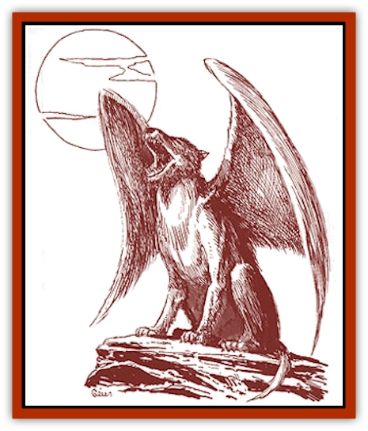

# Lupasus

| Statistic | **Lupasus** |
| --- | --- |
| **Activity Cycle:** | Any |
| **Alignment:** | Neutral |
| **Armor Class:** | 6 |
| **Climate/Terrain:** | Any steppes |
| **Damage/Attack:** | 2d6 |
| **Diet:** | Carnivore |
| **Frequency:** | Uncommon |
| **Hit Dice:** | 5+5 |
| **Intelligence:** | Low (5-7) |
| **Magic Resistance:** | Nil |
| **Morale:** | Elite (13-14) |
| **Movement:** | 18, Fl 36 (C, D mounted) |
| **No. Appearing:** | 4d4 |
| **No. of Attacks:** | 1 |
| **Organization:** | Pack |
| **Size:** | L (8' long, 16' wingspan) |
| **Special Attacks:** | Nil |
| **Special Defenses:** | Nil |
| **THAC0:** | 15 |
| **Treasure:** | Nil |
| **XP Value:** | 420 |

These huge winged [[Wolf|wolves]] are native to the Yazak steppes. Lupasi come in various colors and breeds, much like horses or dogs. The Lupasaner breed from the Louvine Royal Kennels are especially renowned for their distinctive pure gray color and their ability to perform highly complex precision maneuvers. Other noteworthy breeds include the strangely patterned Lupaquins, the two-colored Lupintos, and the stocky Appalupas.

An adult lupasus measures up to 8 feet in length, not including the tail, and may weigh up to 1,000 pounds. A typical lupasus is gray (with black patches above and white below), powerful teeth, a bushy tail, and round pupils.

**Combat:** Lupasi can fly while carrying a man-sized creature outfitted with light armor, a shield, and several weapons. Still, the total weight carried by the lupasus cannot exceed 200 pounds. Unencumbered lupasi must make a saving throw vs. paralyzation for each hour of flight. If the saving throw fails, they must rest a half hour for each 2 previous hours of flight. A lupasus with a rider drops one maneuverability class level and must make a saving throw every half hour.

Lupasus wings are covered with fine, soft fur (not feathers) and are no more or less vulnerable to fire than the rest of the body. Lupasi that have lost 50% or more of their hit points cannot fly, but they can glide until 75% or more hit points have been lost. Lupasi often prefer to attack from the ground, not using their wings at all, so being forced from the air is not a huge concern.

**Habitat/Society:** Wild lupasi are most often found roaming the steppes and the skies of Yazak, north of Renardy. Lupasi are equally at home on prairies, in forest lands, and on all but the highest mountains.

It is extremely difficult to tame or capture lupasi. Wild lupasi generally try to avoid humanoids, although they will occasionally associate with solitary [[Lupin|lupins]]. Lupin knights sometimes befriend lupasi, in which case they accompany the knights out of friendship, not servitude. To do this, a lupin knight must live with a pack of lupasi for 1 full year.

The den of a lupasus may be a cave, a thicket, or a hole in the ground. The breeding season is in the spring, and the female has a litter of three to nine cubs. The cubs normally stay with the parents until the following winter, when they start to fly. Parents and young constitute a basic pack, which establishes and defends a marked territory. Larger packs may also assemble, particularly in the winter. Packs will always have designated leaders.

**Ecology:** Wild lupasi usually prey on small animals and birds. When lupasi hunt more dangerous animals, they always hunt in packs, with a close degree of cooperation.

Lupasus pelts are thick and beautiful, often bringing high prices (in excess of 100 gold pieces in good condition) on the black market. Except in self-defense, killing a wild lupasus is against the law in Renardy, and possessing a lupasus pelt (however obtained) is a hanging offense.

---
## Discovery & Documentation

**Source Publication:** Monstrous Compendium Savage Coast Appendix (Online Exclusive) (1995)
**Campaign Setting:** Mystara
**Author(s):** Loren L Coleman, Ted James, Thomas Zuvich, Cindi M. Rice

### Other Creatures Found in This Source Book
   * [[Aranea_Savage_Coast|Aranea (Savage Coast)]]
   * [[Arashaeem|Arashaeem]]
   * [[Batracine|Batracine]]
   * [[Cat_Marine|Cat, Marine]]
   * [[Cinnavixen|Cinnavixen]]
   * [[Clockwork_Swordsman|Clockwork Swordsman]]
   * [[Critter_Temple|Critter, Temple]]
   * [[Cursed_One|Cursed One]]
   * [[Deathmare|Deathmare]]
   * [[Dragon_Savage_Coast_Crimson|Dragon (Savage Coast), Crimson]]
   * [[Dragon_Savage_Coast_Red_Hawk|Dragon (Savage Coast), Red Hawk]]
   * [[Echyan|Echyan]]
   * [[Ee'aar|Ee'aar]]
   * [[Enduk|Enduk]]
   * [[Fachan_Savage_Coast|Fachan (Savage Coast)]]
   * [[Feliquine|Feliquine]]
   * [[Fiend_Narvaezan|Fiend, Narvaezan]]
   * [[Frelôn|Frelôn]]
   * [[Ghriest|Ghriest]]
   * [[Glutton_Sea|Glutton, Sea]]
   * [[Goatman|Goatman]]
   * [[Golem_Naâruk|Golem, Naâruk]]
   * [[Golem_Savage_Coast|Golem (Savage Coast)]]
   * [[Grudgling|Grudgling]]
   * [[Heraldic_Servant_I|Heraldic Servant I]]
   * [[Heraldic_Servant_II|Heraldic Servant II]]
   * [[Heraldic_Servant_III|Heraldic Servant III]]
   * [[Heraldic_Servant_IV|Heraldic Servant IV]]
   * [[Heraldic_Servant_V|Heraldic Servant V]]
   * [[Heraldic_Servant_General_Information|Heraldic Servant, General Information]]
   * [[Hermit_Sea|Hermit, Sea]]
   * [[Jorri|Jorri]]
   * [[Juhrion|Juhrion]]
   * [[Kla'a-tah|Kla'a-tah]]
   * [[Leech_Legacy|Leech, Legacy]]
   * [[Lich_Inheritor|Lich, Inheritor]]
   * [[Lizard_Kin_Savage_Coast|Lizard Kin (Savage Coast)]]
   * [[Lupin|Lupin]]
   * [[Lyra_Bird_Saragón|Lyra Bird, Saragón]]
   * [[Malfera|Malfera]]
   * [[Manscorpion_Nimmurian|Manscorpion, Nimmurian]]
   * [[Mythuínn_Folk|Mythuínn Folk]]
   * [[Neshezu|Neshezu]]
   * [[Nikt'oo|Nikt'oo]]
   * [[Nosferatu|Nosferatu]]
   * [[Omm-wa|Omm-wa]]
   * [[Omshirim|Omshirim]]
   * [[Parasite_Savage_Coast|Parasite (Savage Coast)]]
   * [[Phanaton|Phanaton]]
   * [[Plant_Savage_Coast|Plant (Savage Coast)]]
   * [[Pudding_Vermilion|Pudding, Vermilion]]
   * [[Rakasta|Rakasta]]
   * [[Ray_Forest|Ray, Forest]]
   * [[Shedu_Greater_Savage_Coast|Shedu, Greater (Savage Coast)]]
   * [[Shimmerfish|Shimmerfish]]
   * [[Skinwing|Skinwing]]
   * [[Spawn_of_Nimmur|Spawn of Nimmur]]
   * [[Spider-spy|Spider-spy]]
   * [[Spirit_Heroic|Spirit, Heroic]]
   * [[Spirit_Walleran|Spirit, Walleran]]
   * [[Succulus|Succulus]]
   * [[Swampmare|Swampmare]]
   * [[Symbiont_Shadow|Symbiont, Shadow]]
   * [[Tortle|Tortle]]
   * [[Troll_Legacy|Troll, Legacy]]
   * [[Trosip|Trosip]]
   * [[Tyminid|Tyminid]]
   * [[Utukku|Utukku]]
   * [[Voat|Voat]]
   * [[Voat_Herathian|Voat, Herathian]]
   * [[Vulturehound|Vulturehound]]
   * [[Wallara|Wallara]]
   * [[Wurmling|Wurmling]]
   * [[Wynzet|Wynzet]]
   * [[Yeshom|Yeshom]]
   * [[Zombie_Red|Zombie, Red]]
