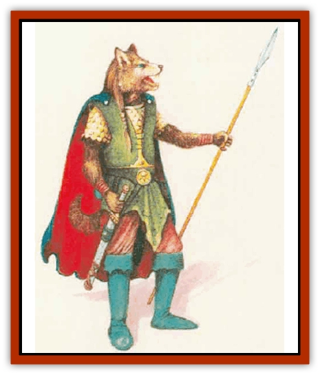

# Lupin

| Statistic | **Lupin** |
| --- | --- |
| **Activity Cycle:** | Any |
| **Alignment:** | Any (usually good) |
| **Armor Class:** | 10 |
| **Climate/Terrain:** | Any |
| **Damage/Attack:** | By weapon |
| **Diet:** | Carnivore |
| **Frequency:** | Common |
| **Hit Dice:** | 2 |
| **Intelligence:** | Average (8-10) |
| **Magic Resistance:** | Nil |
| **Morale:** | Average (8-10) |
| **Movement:** | 12 |
| **No. Appearing:** | 2d6 |
| **No. of Attacks:** | 1 |
| **Organization:** | Band |
| **Size:** | M (5-7' tall) |
| **Special Attacks:** | Nil |
| **Special Defenses:** | Detect invisibility |
| **THAC0:** | 19 |
| **Treasure:** | K |
| **XP Value:** | 65 or per level |

Lupins are canine humanoids. While a few sages believe the creatures descended from a cross between [[Gnoll|gnolls]] and humans, many others argue that they are an offshoot of true [[Lycanthrope_Werewolf|werewolves]] (although lupins abhor all types of lycanthropes). Once nomads in the Yazak Steppes, lupins have established a fairly advanced civilization in the kingdom of Renardy.

Lupins look like furred humans with canine heads. Their short fur ranges from tan to black, with rare instances of white. An individual lupin's fur is usually one color, perhaps with some small touches of another lighter color around the muzzle, hands, and feet, but a few individuals have spots. Like humans, lupins have comparatively long hair on their heads. This is often a shade darker than the lupin's body fur, though it turns gray or white with age. Lupins usually wear their hair long and straight, though braids are not unusual.

Lupins are built much like humans, and their eyes resemble human eyes, with irises of blue, brown, or green. They also have short tails, about 2 feet long. A lupin's limbs are human in appearance, though the hands are furred on the back and have dark, leathery palms, and the feet are furred on top and have leathery soles.

Lupin personalities range widely, but most tend to be loyal to friends and somewhat rude to strangers, testing their tolerance. They are usually of good alignment, though some are neutral, and a few are evil.

The lupins of Renardy have two native languages. Renardois is spoken by all but the lowest classes in Renardy. The lupin racial language, known as Lupin, consists of barks and howls. This language is spoken mostly by peasants in Renardy.

**Combat:** Like humans, lupins usually attack with weapons, also using the same range of arms as humans. A lupin often carries weapons made with silver or red steel in case it should run into a [[Lycanthrope_General_Information|lycanthrope]]. Wheellock pistols are common among lupin warriors.

 Warriors and priests are common in lupin society, but wizards and rogues are not unusual. A lupin ranger always chooses some kind of lycanthrope as its hated enemy, usually werewolves. Most of Renardy's nobles and knights are Beast Riders, who are all considered knights of the kingdom. Lupin Beast Riders have either dire wolf or lupasus mounts. A beast Riders almost never uses a wheellock, both because the noise from the weapon tends to startle its mount and because most consider such weapons dishonorable.

Lupins with pure white coats are often natural spellcasters. Those gifted in this way are nearly always adopted by mages or priests and taught the appropriate craft.

Lupins have infravision with a range of 60 feet. They also have excellent senses, giving them six special abilities: detecting lycanthropes, detecting invisible or ethereal beings, blind-fighting, tracking, odor recognition, and noise detection.

A lupin has a 99% chance to recognize a werewolf in any of its forms, and a 15% chance to recognize other lupins in unusual forms.When confronted with invisible creatures, a lupin receives a +4 bonus to any saving throws made for detection (as explained under "Invisibility" in Chapter 13 of the DMG). A lupin automatically gets a saving throw (with the bonus) when an invisible creature approaches within 10 feet, and for each round the invisible being remains that near. The lupin does not automatically know where the invisible creature is, just that it is nearby. Locating it requires other clues. A lupin can also use this ability to detect the presence of ethereal creatures, such as ghosts, phase spiders, or someone wearing plate mail of etherealness. The lupin recognizes the difference between ethereal and invisible creatures, but it gains no special attack or defense capabilities against ethereal beings.

Lupin characters automatically gain the blind-fighting proficiency without spending nonweapon proficiency slots. They also have the tracking ability, with a score equal to half their Wisdom (rounded up). A lupin character who spends slots to take the tracking proficiency gains the ability at full Wisdom rating, like rangers of other races. Lupin rangers have the ability at a rating equal to their Wisdom score with a +6 bonus.

Lupins can also recognize the smell of a person or creature they have encountered before. Recognition of a particular race is automatic, but the lupin must make a successful Intelligence check to recognize a particular individual by smell. Perfumes or strong odors in the area can give the lupin a -1 or -2 penalty to this ability, depending on the strength of the odors.

A normal lupin has a 35% chance to detect noise as thieves do. This chance increases by 2% per level after the first. Lupin thieves begin at 35% as well (which is the normal 15% of thieves, plus a 20% racial bonus), and gain their races' bonus of 2% per level; they can also improve upon this ability by adding percentage points from the 30 points per level that thieves receive.

Because of their acute senses, lupins receive a -2 penalty on all saving throws against attacks based on odor (such as those made by [[Ghoul|ghasts]] or *stinking cloud* spells) or sound (such as a [[Banshee|banshee]]'s wail or a [[Harpy|harpy]]'s song).

Lupins are repelled by wolfsbane. The substance is poisonous to them (even more so than it is to humans). Wolfsbane ingested by a lupin acts as Type J poison. (A failed saving throw vs. poison indicates death, while success indicates the loss of 20 hit points.) Fortunately, the keen senses of a lupin nearly always alert it in time to avoid ingesting the substance. If wolfsbane is somehow injected into a lupin's bloodstream, it acts as Type P poison. (A failed saving throw causes a 50% drop in all ability scores for 1d3 days.)

**Habitat/Society:** The lupins of Renardy have long imitated the humans of the Savage Baronies, mimicking their arts, nobility, hereditary laws, and philosophies. Like the humans of the Savage Coast, the lupins have a fair level of civilization and technology. The kingdom of Renardy is a merchant power with a large middle class and much diversity among its people. Most commoners are farmers and herders.

Though lupins once roamed the steppes and plains in nomadic bands, except for wandering adventurers, they are now a settled people. Some traditions still remain from nomadic days, however, such as Beast Riders, who are now considered part of the upper classes, if not actual nobility. The country has a strong feudal government, and it can raise an army for national defense within a matter of days. Renardy's borders are carefully patrolled for goblinoid incursions.

Towns in Renardy are typically wood or stone houses surrounding a central keep or castle. At one time, all towns were small enough that the people could flee to the castle in times of trouble, but this is no longer the case. Refugees from recent wars have clustered around the remaining keeps, which would now have a hard time defending all who now live nearby.

Lupin family life is similar to that of humans. Adults usually marry before having children, who are then cared for by both parents until they reach adulthood. Young lupins usually have some freedom in choosing their mates and professions, but the family can influence both choices. Nobles occasionally marry outside their class, but the middle class tends to reject marriages of nobles to peasants.

**Ecology:** Lupins are great producers of wine, grain, dairy products, cloth, wool, and works of art; they also extract amber and sapphires from their mines. A great deal of their exports channel through the Free City of Dunwick, a city of merchants located at the heart of the sacred tortle lands.

Lupins are on friendly terms with humans, [[Elf|elves]], and [[Dwarf|dwarves]]. They do have occasional territorial disputes with the [[Rakasta|rakastas]], but otherwise they bear them no animosity. They dislike [[Phanaton|phanatons]], whose screeching hurts their ears, and they view [[Lizard_Kin_Savage_Coast|caymas]], [[Lizard_Kin_Savage_Coast|shazaks]], [[Lizard_Kin_Savage_Coast|gurrash]], and [[Tortle|tortles]] as savages of varying degrees. Lupins dislike goblinoids and hate all evil canines, especially werewolves.

---
## Discovery & Documentation

**Source Publication:** Mystara Appendix (1994)
**Campaign Setting:** Mystara
**Author(s):** John Nephew, Teeuwynn Woodruff, John Terra, Skip Williams

### Other Creatures Found in This Source Book
   * [[Actaeon|Actaeon]]
   * [[Agarat|Agarat]]
   * [[Ash_Crawler|Ash Crawler]]
   * [[Baldandar|Baldandar]]
   * [[Bargda|Bargda]]
   * [[Bhut|Bhut]]
   * [[Bird_Mystara|Bird (Mystara)]]
   * [[Blackball|Blackball]]
   * [[Choker|Choker]]
   * [[Coltpixie|Coltpixie]]
   * [[Crone_of_Chaos|Crone of Chaos]]
   * [[Darkhood|Darkhood]]
   * [[Darkwing|Darkwing]]
   * [[Decapus|Decapus]]
   * [[Deep_Glaurant|Deep Glaurant]]
   * [[Diabolus|Diabolus]]
   * [[Dimensional_Warper|Dimensional Warper]]
   * [[Dragon_Mystara_Crystalline|Dragon (Mystara), Crystalline]]
   * [[Dragon_Mystara_Jade|Dragon (Mystara), Jade]]
   * [[Dragon_Mystara_Onyx|Dragon (Mystara), Onyx]]
   * [[Dragon_Mystara_Ruby|Dragon (Mystara), Ruby]]
   * [[Drake_Mystara|Drake (Mystara)]]
   * [[Dragonfly|Dragonfly]]
   * [[Dusanu|Dusanu]]
   * [[Elemental_of_Chaos_Air_Earth|Elemental of Chaos, Air/Earth]]
   * [[Elemental_of_Chaos_Fire_Water|Elemental of Chaos, Fire/Water]]
   * [[Elemental_of_Law_Air_Earth|Elemental of Law, Air/Earth]]
   * [[Elemental_of_Law_Fire_Water|Elemental of Law, Fire/Water]]
   * [[Familiar_Mystara|Familiar (Mystara)]]
   * [[Frost_Salamander|Frost Salamander]]
   * [[Fundamental_Air_Earth|Fundamental, Air/Earth]]
   * [[Fundamental_Fire_Water|Fundamental, Fire/Water]]
   * [[Gargantua_Mystara|Gargantua (Mystara)]]
   * [[Geonid|Geonid]]
   * [[Ghostly_Horde|Ghostly Horde]]
   * [[Giant_Athach|Giant, Athach]]
   * [[Giant_Hephaeston|Giant, Hephaeston]]
   * [[Golem_Drolem|Golem, Drolem]]
   * [[Golem_Mystara_I|Golem (Mystara) I]]
   * [[Golem_Mystara_II|Golem (Mystara) II]]
   * [[Golem_Mystara_III|Golem (Mystara) III]]
   * [[Gray_Philosopher|Gray Philosopher]]
   * [[Guardian_Warrior|Guardian Warrior]]
   * [[Gyerian|Gyerian]]
   * [[Herex|Herex]]
   * [[Hivebrood|Hivebrood]]
   * [[Horde|Horde]]
   * [[Hsiao|Hsiao]]
   * [[Huptzeen|Huptzeen]]
   * [[Hutaakan|Hutaakan]]
   * [[Imp_Mystara|Imp (Mystara)]]
   * [[Jellyfish_Giant_Mystara|Jellyfish, Giant (Mystara)]]
   * [[Kna|Kna]]
   * [[Kopru|Kopru]]
   * [[Lizard_Mystara|Lizard (Mystara)]]
   * [[Lizard-kin_Mystara|Lizard-kin (Mystara)]]
   * [[Lycanthrope_Werejaguar_Mystara|Lycanthrope, Werejaguar (Mystara)]]
   * [[Lycanthrope_Wereswine|Lycanthrope, Wereswine]]
   * [[Magen|Magen]]
   * [[Manikin|Manikin]]
   * [[Mek|Mek]]
   * [[Mujina|Mujina]]
   * [[Nagpa|Nagpa]]
   * [[Neh-thalggu|Neh-thalggu]]
   * [[Nightshade_Mystara|Nightshade (Mystara)]]
   * [[Nuckalavee|Nuckalavee]]
   * [[Pegataur|Pegataur]]
   * [[Phanaton|Phanaton]]
   * [[Plant_Dangerous_Mystara|Plant, Dangerous (Mystara)]]
   * [[Plasm|Plasm]]
   * [[Rakasta|Rakasta]]
   * [[Rock_Man|Rock Man]]
   * [[Sabreclaw|Sabreclaw]]
   * [[Sacrol|Sacrol]]
   * [[Scamille|Scamille]]
   * [[Shapeshifter|Shapeshifter]]
   * [[Shargugh|Shargugh]]
   * [[Shark-kin|Shark-kin]]
   * [[Sollux|Sollux]]
   * [[Spectral_Death|Spectral Death]]
   * [[Spectral_Hound|Spectral Hound]]
   * [[Spider-kin|Spider-kin]]
   * [[Spirit_Mystara|Spirit (Mystara)]]
   * [[Statue_Living|Statue, Living]]
   * [[Surtaki|Surtaki]]
   * [[Tabi|Tabi]]
   * [[Thoul|Thoul]]
   * [[Thunderhead|Thunderhead]]
   * [[Tiger_Ebon|Tiger, Ebon]]
   * [[Topi|Topi]]
   * [[Tortle|Tortle]]
   * [[Vampire_Velya|Vampire, Velya]]
   * [[White_Fang|White Fang]]
   * [[Worm_Mystara|Worm (Mystara)]]
   * [[Wyrd|Wyrd]]
   * [[Yowler|Yowler]]
   * [[Zombie_Lightning|Zombie, Lightning]]
