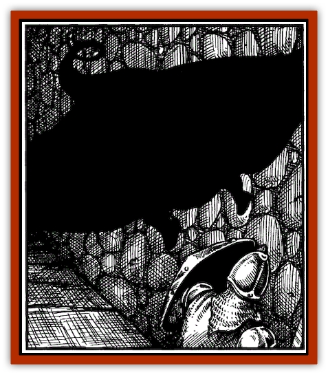

# Lurker - Shadow

| Statistic | **Lurker, Shadow** |
| --- | --- |
| **Activity Cycle:** | Night |
| **Alignment:** | Chaotic evil |
| **Armor Class:** | 4 |
| **Climate/Terrain:** | Subterranean |
| **Damage/Attack:** | 2d4 |
| **Diet:** | Special |
| **Frequency:** | Rare |
| **Hit Dice:** | 5+3 |
| **Intelligence:** | Low (5-7) |
| **Magic Resistance:** | Nil |
| **Morale:** | Champion (15) |
| **Movement:** | 3, F19 (B) |
| **No. Appearing:** | 1 |
| **No. of Attacks:** | 1 |
| **Organization:** | Solitary |
| **Size:** | H (20' square) |
| **Special Attacks:** | Strength drain |
| **Special Defenses:** | +1 or better weapon to hit |
| **THAC0:** | 15 |
| **Treasure:** | Nil |
| **XP Value:** | 1,400 |

Shadow lurkers appear similar in shape to normal [[Lurker|lurkers]], a large [[Ray|manta-ray]] that skulks along ceilings and walls, though it is less distinct or material - it is, as its name suggests, a dark shadow in the shape of a lurker. Though its silhouette would normally be quite effectively hidden in a shadowy dungeon, they can be detected easily since any shadows cast by light sources (including those of the PCs) are pulled toward the shadow lurker, pointing out its presence by directional movement. Where shadows move in the light of a flickering torch the only nonmoving shadow is likely to be this monster.

**Combat:** The shadow lurker is a slow creature that waits for its prey to come to it. When creatures are underneath or beside it, it can attack 1 to 3 man-sized opponents within 20 feet. During its initial attack, the area appears to be filled with a thick dark mist for 1 round. When it envelops its victims, their skin and clothing turn jet black; sages describe it like a thin coating of black ink. The shadow lurker is only paper-thin, and wraps tightly around its victims.

Those within its body take 2d4 points of damage from the numbing cold and also lose 1-2 points of Strength per round; victims are killed when either their Strength scores or hit point totals reach 0. Enwrapped victims can attack the shadow lurker from within if they had a weapon in hand and they can make a successful bend bars/lift gates roll to move against the monster's constricting attack. Any attacks against the shadow lurker from without have a chance of also damaging its engulfed victims. Weapons attacks do full damage to one victim on a 75% chance (roll at random if more than one character is enveloped) as the shadow lurker can pull its own prey into the area of attack. Area effect attacks do half damage (or quarter damage with successful saving throws) to all enveloped victims.

A shadow lurker moves very slowly, but in can manipulate its body to fit through any crevice. It flees by flying to the nearest crack (like a doorway or a crack in the stone), retreating in this manner if reduced to 30% or fewer hit points. Shadow lurkers store the Strength points absorbed from victim; when they absorb and store 50 or more Strength points, they split to become two creatures. As a solitary creature, the new shadow lurker immediately leaves the vicinity to find its own hunting grounds apart from its parent.

Shadow lurkers are immune to all *sleep*, *charm*, or *hold* spells. They are also immune to damage from cold-based attacks. While *faery fire* and *light* do not bother the shadow lurkcr beyond their normal effects, *continual light* spells paralyze shadow lurkcrs for a number of rounds equal to the spellcaster's level. *Color spray* does not affect this creature normally; it inflicts 2d6 points of damage to the shadow lurker with no effect on its trapped victims. Despite its name and abilities, the shadow lurker cannot be turned by clerics.

**Habitat/Society:** Aside from brief contact after creating another shadow lurker, these monsters shun all contact with others of their kind. They can detect the presence of other shadow lurkers from hundreds of yards away and will immediately leave if they wander into the area controlled by another of their kind. They also can sense the presence of [[Shadow|shadows]] as well, and the two hate each other fiercely, always attackmg if they are within 50 feet. They have no apparent goals or purpose other than to feed and multiply. It is mure how or even if they communicate. Given their solitary nature, it seems unlikely.

**Ecology:** Shadow lurkers gladly attack and slay any living creatures and even some undead (like shadows). However, their slow movement rate and the ease with which they are detected makes them a risk only to the unwary.

Shadow lurkers completely destroy the physical remains of their prey. Their victims dissolve into insubstantial shadows and are absorbed into the lurker's body. Only the victims themselves are absorbed; all possessions are left behind. Using a *wish* to restore a person's body after its absorption into a shadow lurker merely creates a shadow in the form of the departed person, and it immediately attacks.

Save for the fallen equipment of their latest victims, shadow lurkers gather no treasure. When an area becomes too filled with equipment from past victims, the monster leaves to find a new location lest the remains make new prey wary.

---
## Discovery & Documentation

**Source Publication:** Monstrous Compendium, 1995 Annual, Volume 2 (1995)
**Campaign Setting:** Advanced Dungeons & Dragons 2nd Edition
**Author(s):** Jon Pickens

### Other Creatures Found in This Source Book
   * [[Aboleth_Savant|Aboleth, Savant]]
   * [[Addazahr|Addazahr]]
   * [[Amiq_Rasol|Amiq Rasol]]
   * [[Arch-Shadow|Arch-Shadow]]
   * [[Automaton_Scaladar|Automaton, Scaladar]]
   * [[Automaton_Trobriand's|Automaton, Trobriand's]]
   * [[Bat_Sporebat|Bat, Sporebat]]
   * [[Beetle_Dragon|Beetle, Dragon]]
   * [[Bi-nou|Bi-nou]]
   * [[Boggle|Boggle]]
   * [[Brownie_Dobie|Brownie, Dobie]]
   * [[Brownie_Quickling|Brownie, Quickling]]
   * [[Cat_Crypt|Cat, Crypt]]
   * [[Cat_Great_Cath_Shee|Cat, Great, Cath Shee]]
   * [[Centaur-kin_Dorvesh|Centaur-kin, Dorvesh]]
   * [[Centaur-kin_Gnoat|Centaur-kin, Gnoat]]
   * [[Centaur-kin_Ha'pony|Centaur-kin, Ha'pony]]
   * [[Centaur-kin_Zebranaur|Centaur-kin, Zebranaur]]
   * [[Chronolily|Chronolily]]
   * [[Curst|Curst]]
   * [[Darktentacles|Darktentacles]]
   * [[Dinosaur_Aquatic|Dinosaur, Aquatic]]
   * [[Dinosaur_II|Dinosaur II]]
   * [[Dinosaur_III|Dinosaur III]]
   * [[Doppelganger_Greater|Doppelganger, Greater]]
   * [[Dragon_Brine|Dragon, Brine]]
   * [[Dragon_Half-|Dragon, Half-]]
   * [[Dragon-kin_Sea_Wyrm|Dragon-kin, Sea Wyrm]]
   * [[Dwarf_Wild|Dwarf, Wild]]
   * [[Ekimmu|Ekimmu]]
   * [[Elemental_Nature|Elemental, Nature]]
   * [[Elf_Winged|Elf, Winged]]
   * [[Fish_Great_Glacier|Fish (Great Glacier)]]
   * [[Fish_Subterranean|Fish, Subterranean]]
   * [[Fish_Toril|Fish (Toril)]]
   * [[Flareater|Flareater]]
   * [[Flumph|Flumph]]
   * [[Froghemoth|Froghemoth]]
   * [[Ghost_Casurua|Ghost, Casurua]]
   * [[Ghost_Ker|Ghost, Ker]]
   * [[Ghul|Ghul]]
   * [[Ghul-Kin|Ghul-Kin]]
   * [[Giant_Half-giant|Giant, Half-giant]]
   * [[Golem_Burning_Man|Golem, Burning Man]]
   * [[Golem_Phantom_Flyer|Golem, Phantom Flyer]]
   * [[Gulguthhydra|Gulguthhydra]]
   * [[Hakeashar|Hakeashar]]
   * [[Horse_Moon-|Horse, Moon-]]
   * [[Human_Dragonslayer|Human, Dragonslayer]]
   * [[Human_Vistana|Human, Vistana]]
   * [[Jellyfish_Giant|Jellyfish, Giant]]
   * [[Kalin|Kalin]]
   * [[Kholiathra|Kholiathra]]
   * [[Laerti|Laerti]]
   * [[Leucrotta_Greater|Leucrotta, Greater]]
   * [[Lich_Suel|Lich, Suel]]
   * [[Lycanthrope_Werepanther|Lycanthrope, Werepanther]]
   * [[Lycanthrope_Wereshark|Lycanthrope, Wereshark]]
   * [[Mammal_Herd_II|Mammal, Herd II]]
   * [[Marl|Marl]]
   * [[Meenlock|Meenlock]]
   * [[Mimic_Greater|Mimic, Greater]]
   * [[Mold_II|Mold II]]
   * [[Mummy_Creature|Mummy, Creature]]
   * [[Nyth|Nyth]]
   * [[Ooze_Slime_Jelly_Ghaunadan|Ooze/Slime/Jelly, Ghaunadan]]
   * [[Palimpsest|Palimpsest]]
   * [[Peltast|Peltast]]
   * [[Plant_Dangerous_II|Plant, Dangerous II]]
   * [[Pleistocene_Animal|Pleistocene Animal]]
   * [[Pudding_Subterranean|Pudding, Subterranean]]
   * [[Raggamoffyn|Raggamoffyn]]
   * [[Snake_Serpent|Snake, Serpent]]
   * [[Snake_Serpent_Vine|Snake, Serpent Vine]]
   * [[Sphinx_Draco-|Sphinx, Draco-]]
   * [[Sprite_Seelie_Faerie|Sprite, Seelie Faerie]]
   * [[Sprite_Unseelie_Faerie|Sprite, Unseelie Faerie]]
   * [[Squealer|Squealer]]
   * [[Turtle_Giant|Turtle, Giant]]
   * [[Umpleby|Umpleby]]
   * [[Vizier's_Turban|Vizier's Turban]]
   * [[Wall_Walker|Wall Walker]]
   * [[Webbird|Webbird]]
   * [[Yak-Man|Yak-Man]]
   * [[Zorbo|Zorbo]]
