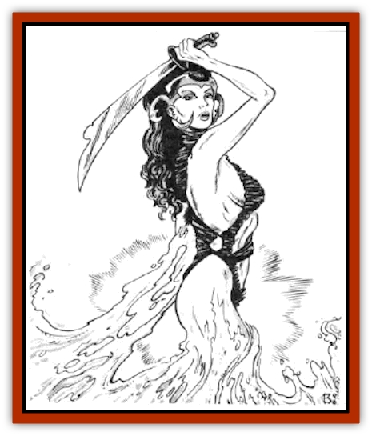

# Lutum

| Statistic | **Lutum** |
| --- | --- |
| **Activity Cycle:** | Any |
| **Alignment:** | Lawful evil |
| **Armor Class:** | 7 (base) |
| **Climate/Terrain:** | Any |
| **Damage/Attack:** | By weapon or 1-6/1-6/1-8 |
| **Diet:** | Special |
| **Frequency:** | Rare |
| **Hit Dice:** | 6 |
| **Intelligence:** | Exceptional (15-16) |
| **Magic Resistance:** | Nil |
| **Morale:** | Elite (14) |
| **Movement:** | 12, 18 (rolling) |
| **No. Appearing:** | 1 or 1-8 |
| **No. of Attacks:** | 1 or 3 |
| **Organization:** | Solitary or clan |
| **Size:** | M (5' tall) to L (7' tall) |
| **Special Attacks:** | Smothering, spells |
| **Special Defenses:** | See below |
| **THAC0:** | 15 |
| **Treasure:** | P,Q /individuals); D (in lair) |
| **XP Value:** | 2,000 |

In their true forms, the malicious lutums appear to be amorphous beings of tan, gelatinous clay that move by rolling. They fashion limbs for themselves as needed to aid in locomotion or combat. Lutums are able to sculpt themselves into bipedal and quadrupedal forms; with few exceptions they choose humanoid female shapes. Most lutums prefer these forms to their own.

Furthermore, because all lutums have an innate ability to cast *alter self* four times a day, with a duration of four hours for each spell, they can so closely resemble female humans, [[Elf_Half-|half-elves]], and [[Elf|elves]], including [[Elf_Drow|drow]], that others cannot tell their true nature. These women appear nearly perfect in form and have beautiful, striking features. The lutums have learned that imitating attractive women - rather than plain ones or males - helps them further their goals. Because of their other spell-like abilities, many pose as wizards or druids.

Some lutums prefer to take on the images of existing humans and demihumans. This enables them to be automatically accepted in cerrain circles, and their behavior usually causes much embarrassment for the people they mimic.

**Combat:** In humanoid form, lutums posing as spellcasters usually attack with their spell-like abilities and magical items first. If they are forced to melee, they prefer to attack with weapons, further adding to the ruse that they are humans or demihumans. However, if pressed or if their true forms are revealed, lutums attack with two clay-like arms and with their large maws. If a victim is struck with all three of these attacks, he is considered caught in the gelatinous clay mass and will smother in 1d4+1 rounds.

All lutums are able to cast the following spells: *alter self* four times a day, *ESP* twice a day, and *friends*, *stoneskin*, *passwall*, *stoneshape*, and *clairaudience* once a day.

A common combat tactic of a lutum is to lure a male victim close by using its feminine charms, cast *friends* to keep him off guard, and then attack with surprise in an attempt to smother him. If the lutum is planetside, it uses stoneshape to catch the victim, and then pummels him to death. Its *passwall* ability is usually held in the event it needs to escape. In addition, one out of ten lutums can study magic and rise to the status of a 4th-level wizard.

Lutums are immune to *transmute rock to mud*, *stone to flesh*, and both spells' reverse. They suffer full damage from blunt weapons, but only half damage from edged weapons. An *earthquake* spell instantly kills lutums, and a *move earth* spell incapacitates them for 1d6 turns.

**Habitat/Society:** Lutums prefer to act on their own. Their greed is so overpowering that they would rather not share anything with others of their kind. However, some lutums have learned that when they combine forces they can gain more power and wealth. In such lutum clans there is always a leader, usually the largest lutum.

Lutums desire to gather the most magic and wealth possible, and to do so by assimilating themselves into human and demihuman societies. Lutums especially love magic that enables them to retain their human and demihuman forms longer.

Lutums are also power-hungry. Some have been known to rise to important positions in human and demihuman governments by marrying the leaders, killing them, and then inheriting control, or simply by marrying the leaders and pulling their strings. In democratic societies, lutums prefer to rise to power on their own merits, campaigning for office and frequently winning because of their beauty, poise, and ruthlessness.

Lutums enjoy traveling from planet to planet, acquiring power and wealth. They usually find passage on ships by appearing as beautiful women in dire need of transportation. A few lutums who have used their charms on the crew have been taught how to operate the ships, and they have subsequently taken them over.

**Ecology:** The origin of lutums is a mystery. Some believe a mad wizard experimenting with [[Elemental_Air_Earth|earth elementals]] gave them life. Others think that they are a variety of [[Mimic|mimic]] from the plane of Ooze. Lutums must eat rocks, minerals, and a variety of clay compounds to gain nourishment.

Lutums are asexual. They reproduce by splitting in half, but only when they feel a need to increase the power of their race; this usually occurs when one or more lutums in a clan die. The new lutums are born as adults with full abilities.

---
## Discovery & Documentation

**Source Publication:** MC7 Spelljammer Appendix I (1990)
**Campaign Setting:** Advanced Dungeons & Dragons 2nd Edition
**Author(s):** various

### Other Creatures Found in This Source Book
   * [[Aartuk|Aartuk]]
   * [[Albari|Albari]]
   * [[Ancient_Mariner|Ancient Mariner]]
   * [[Argos|Argos]]
   * [[Beholder_Abomination_Astereater|Beholder (Abomination), Astereater]]
   * [[Blazozoid|Blazozoid]]
   * [[Chattur|Chattur]]
   * [[Chevall|Chevall]]
   * [[Clockwork_Horror|Clockwork Horror]]
   * [[Colossus|Colossus]]
   * [[Delphinid|Delphinid]]
   * [[Dizantar|Dizantar]]
   * [[Dog|Dog]]
   * [[Dog_Bog_Hound|Dog, Bog Hound]]
   * [[Esthetic|Esthetic]]
   * [[Focoid|Focoid]]
   * [[Fractine|Fractine]]
   * [[Giant_Spacesea|Giant, Spacesea]]
   * [[Golem_Furnace|Golem, Furnace]]
   * [[Golem_Radiant|Golem, Radiant]]
   * [[Gravislayer|Gravislayer]]
   * [[Grommam|Grommam]]
   * [[Hadozee|Hadozee]]
   * [[Hamster_Giant_Space|Hamster, Giant Space]]
   * [[Jammer_Leech|Jammer Leech]]
   * [[Lakshu|Lakshu]]
   * [[Lumineaux|Lumineaux]]
   * [[Mimic_Space|Mimic, Space]]
   * [[Misi|Misi]]
   * [[Moon_Rogue|Moon, Rogue]]
   * [[Mortiss|Mortiss]]
   * [[Murderoid|Murderoid]]
   * [[Nay-Churr|Nay-Churr]]
   * [[Phlog-Crawler|Phlog-Crawler]]
   * [[Plasman|Plasman]]
   * [[Plasmoid_DeGleash|Plasmoid, DeGleash]]
   * [[Plasmoid_DelNoric|Plasmoid, DelNoric]]
   * [[Plasmoid_General_Information|Plasmoid, General Information]]
   * [[Plasmoid_Ontalak|Plasmoid, Ontalak]]
   * [[Puffer|Puffer]]
   * [[Q'nidar|Q'nidar]]
   * [[Rastipede|Rastipede]]
   * [[Reigar|Reigar]]
   * [[Rock_Hopper|Rock Hopper]]
   * [[Slinker|Slinker]]
   * [[Spider_Asteroid|Spider, Asteroid]]
   * [[Spiritjam|Spiritjam]]
   * [[Survivor|Survivor]]
   * [[Syllix|Syllix]]
   * [[Symbiont_Power|Symbiont, Power]]
   * [[Vine_Infinity|Vine, Infinity]]
   * [[Wiggle|Wiggle]]
   * [[Wizshade|Wizshade]]
   * [[Wryback|Wryback]]
   * [[Zard|Zard]]
   * [[Zodar|Zodar]]
