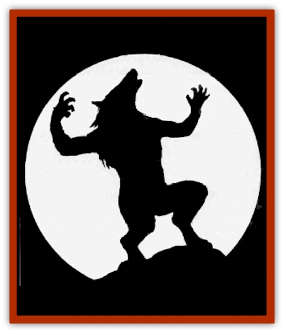

# Lycanthrope - General Information

Lycanthropes are humans who can transform themselves to resemble normal animals or monsters. The term "lycanthrope" is actually a misnomer, coming from the roots lycos (wolf), and anthropos (man). A more correct term is "therianthrope," from therios (animal) and anthropos. However, since [[Lycanthrope_Werewolf|werewolves]] are the most common therianthropes, the term lycanthrope has gained much more popularity, and more common usage.

To further confuse the issue, there are creatures like the [[Wolfwere|wolfwere]] and [[Jackalwere|jackalwere]], animals which can assume human form. These creatures ("antherions" for lack of a better term) pass on their condition genetically (that is, by having offspring), not by biting and infecting other creatures. Other differences between the two classes of creature include their vulnerabilities: antherions can be struck by cold iron, lycanthropes by silver. Antherions hate lycanthropes, and always attack their counterparts (wolfweres attack werewolves, etc.). Likewise, most lycanthropes feel enmity for antherions, and attack on sight as well.

In addition, there are many subspecies of some lycanthropes, beyond the differences in animal type. For instance, there are three distinct subspecies of werewolf, differing in their secondary form: one has fangs, a furred body, a tail, wolf-like legs, and lupine features (but without the snout); another has a very wolf-like face and body, with human hands, and is easily mistaken for a wolf when down on all fours; and the third secondary form is that of a huge wolf, as big as a bear.

The condition of being a lycanthrope, often referred to as a curse, is called lycanthropy. A distinction must be made between true lycanthropes and infected lycanthropes. True lycanthropes are those to whom lycanthropy is a genetic trait; they breed with other lycanthropes and produce baby lycanthropes. Only true lycanthropes can infect others with lycanthropy. Infected lycanthropes are those whose lycanthropy results from being wounded by a true lycanthrope.

There are also creatures known by some as "induced lycanthropes", whose shape changes are effected by magical items; these creatures cannot infect others with lycanthropy, though the magical items can be transferred to new owners. Some of the items are cursed, so that once they are worn, they cannot be removed without the application of a *remove curse* spell. Induced lycanthropes include [[Swanmay|swanmays]] and anyone using a *cloak of the manta ray*.

Finally, there are "cursed lycanthropes" created by a certain spell, *curse of lycanthropy*. True lycanthropes and induced lycanthropes seldom hate their "curse". They see themselves as being like any other creature, with the same right to survival. Those bitten and infected, or those affected by the *curse of lycanthropy* spell, are generally unhappy with their fate. These unfortunates seek cures and occasionally try to hunt down the lycanthrope who infected them (or the wizard who cursed them).

**Description: **Most lycanthropes have three forms; some have only two. See the individual descriptions for more details. The first form is always the natural humanoid form, which over time becomes more and more reminiscent of the lycanthrope's animal form. The second form is a hybrid, combining both animal and humanoid features; the size of this hybrid tends to lie between the humanoid size and the size of the creature replicated. The third form of the lycanthrope is externally identical to that of a normal creature of the replicated species; the only visual clue is that the eyes may glow in the dark. A slain lycanthrope always reverts to its natural humanoid form within one round of being killed.

**Contracting Lycanthropy: **Although the forms of attack vary with each species, all true lycanthropes can transmit their dreadful affliction. Any humanoid creature injured by a lycanthrope but not actually killed (and presumably eaten) has a chance to contract lycanthropy. This chance equals 1% per point of damage caused by the lycanthrope. Some lycanthropes transmit their affliction only through their bite, others through any natural attack, and some even through the weapons they use. For ease of bookkeeping, if a character suffers 24 points of damage (from all attacks) from a true werewolf, the character has a 24% chance to become an infected werewolf.

If the character eats belladonna within an hour of the attack, there is a 25% chance this will cure the affliction; it definitely incapacitates the character for 1d4 days. Note that only a sprig of belladonna need be eaten, and it must be reasonably fresh (picked within the last week). If too much is eaten, the character may still be cured, but is incapacitated for 2d4 days.

The only other way to lift the affliction is to cast a *remove curse* on the character, on the night of a full moon, or the night immediately preceding or following the full moon. After *remove curse* is cast, if the character makes a successful saving throw vs. polymorph, the curse is broken. Otherwise the changes take place and the spell has no effect. Cure disease and other healing spells and abilities have no effect against lycanthropy.

Only infected lycanthropes can be cured. To a true lycanthrope, lycanthropy is as natural as breathing, and the condition cannot be altered. True lycanthropes have complete control over their physical states; they are not affected by darkness, phases of the moon, or any of the other situations which traditionally affect infected lycanthropes.

**Combat:** In human form, the lycanthrope uses weapons to attack. They tend to use natural attack abilities in other forms.

In lycanthrope form, the monster can be struck only by silver or magical weapons. Wounds from any other weapon heal too quickly to cause actual damage. Damage from spells, acid, fire, and other special effects apply normally. Because of their vulnerability to silver, some lycanthropes have a psychological aversion to the metal and refuse to handle it; in some cases, the psychosomatic effect is so great that touching silver actually burns the lycanthrope.

**Habitat/Society:** True lycanthropes can change shape at will, regardless of the time of day or phase of the moon. Infected lycanthropes are usually humanoid during the day. When darkness falls on the night of a full moon, or on the night immediately preceding or immediately following a full moon, the infected lycanthrope unwillingly changes shape and is overcome by bloodlust. During this time, an infected PC is beyond the player's control; the DM takes over the character.

The character's Strength increases temporarily to 19. Armor Class, number of attacks, movement rate, and immunities, become identical to those of the type of lycanthrope that bit the character. The transformed character wants only to hunt and kill, and usually selects either personal friends or enemies as victims. The werecreature makes no distinction between friends and enemies; all that matters is the Strength of the emotion binding them.

When the character returns to normal form, 10% to 60% (1d6>010) of any wounds suffered while in animal form heal instantly. The character also has hazy, haunting memories of performing terrible acts.

Each type of lycanthrope has its own language as well as its humanoid language; some may be able to speak the languages used by the animals they imitate.

True lycanthropes tend to avoid human society unless attacking or on an errand. Lycanthropes travel alone or in packs. The packs are usually of similar lycanthropes, but may also include normal animals or monsters whom the lycanthropes resemble. Some lycanthropes have the ability to summon such creatures.

**Ecology:** Lycanthropes fit a variety of roles, depending on the type of creatures they become, scavengers act as scavengers, predators as predators. See individual descriptions for more details.

## Designing New Types of Lycanthrope

Described here is a process for creating variant lycanthropes, either as true lycanthropes, one-shot opponents, or for the results of a curse of lycanthropy.

**Animal Type: **Virtually any predator between the size of a small [[Dog|dog]] and a large [[Bear|bear]] can be the basis for a type of lycanthrope. Most (but not all) true lycanthropes are mammals; most (but not all) are carnivores. An animal type used by the DM to create a race of true lycanthropes should be a carnivorous mammal with animal Intelligence (1), or rarely, a reptile, bird, or even fish with animal Intelligence. There has never been a reliable report of a were-amphibian of any type.

Induced lycanthropes, by spell or item, can be created using a wide variety of animal types, and even monstrous creatures.

**Appearance: **In humanoid form, the lycanthrope has subtle indications of the curse, ranging from hair color like that of the animal, to general facial type, to voice and actions. In animal form, the lycanthrope resembles a large version of the normal animal (but not so large as to be immediately noticeable). On close inspection, the animal form's eyes show a faint spark of unnatural intelligence, and often glow red in the dark.

The lycanthrope may also have a third form, part human and part animal. This form is usually humanoid in general shape, and the body has the same covering as the animal (usually fur, sometimes scales or feathers). Facial features and body shape change somewhat, gaining more characteristics of the animal (fangs, whiskers, claws, animal leg structure, etc.).

**Statistics and Attributes: **To determine the new lycanthrope's statistics, extrapolate from those of the base animal and from existing lycanthrope types. If the base animal is more powerful than a wolf, the new lycanthrope should have more Hit Dice than a werewolf; if the base animal is similar to a [[Rat|giant rat]], the new werecreature should have about the same Hit Dice as a wererat. In almost every case, the new lycanthrope should have at least 1-2 Hit Dice more than the base animal.

The lycanthrope gets the same attack forms as the base animal type, such as claws, bite, tail slap, head butt, or whatever. The damage should be very similar to that caused by the base animal. Many lycanthropes associate with animals of their base type, and the werebeast should be able to dominate such a group.

Armor Class depends on the base animal's natural toughness, speed, and dexterity. The lycanthrope should have a slightly better AC than the base animal, perhaps by 1 or 2 places. Movement rate should be the same as that of the base animal, as should diet and habitat. Morale should be about one category better than that of the base animal.

The creature's alignment tends to be an extrapolated version of the base animal's alignment. Since most base animals are neutral, the DM must look at the animal's tendencies. If the animal is a vicious predator and a strong fighter, the lycanthropic version is probably evil; it tries to stay out of the way of other creatures, it may be good or neutral. If the animal is very independent, the lycanthrope should be chaotic; if the animal is very methodical and has regular habits, the lycanthrope is probably lawful.

True lycanthropes share a vulnerability to silver weapons, possibly because of the metal's mystical relationship with the moon, or the inherent qualities or powers of the metal itself. Extremely rare variants might have no such vulnerability, but instead may have developed a weakness for another precious metal (gold and copper being the most likely), or perhaps for bronze, obsidian, or even wood.

**Vulnerability: ****Special Abilities:** In addition to their abilities of shapeshifting, calling normal animals to their aid, and so forth, some lycanthropes have other special powers. These should not be rolled randomly for a new lycanthrope type, but chosen to fit with the attitude and style of the base animal. A few samples are listed below.

<ul><li>Thief skills, level 1-6</li><li>*Charm person* by gaze or voice</li><li>Regeneration (except for damage from silver weapons)</li><li>Wizard spells, casting level 1-6</li><li>*Cause fear*</li><li>Psionicist abilities, level 1-6</li><li>Cast *sleep*, once per day</li><li>Poison</li></ul>

---
## Discovery & Documentation

**Source Publication:** MC1 Volume I (w/binder #1) (1991)
**Campaign Setting:** Advanced Dungeons & Dragons 2nd Edition
**Author(s):** Jay Batista, Scott Bennie, Grant Boucher, William W. Connors, Steve Gilbert, Heike Kubasch, James Lowder, David Edward Martin, Bruce Nesmith, Jean Rabe, Rick Swan, John J. Terra, Gary L. Thomas

### Other Creatures Found in This Source Book
   * [[Bat|Bat]]
   * [[Bear|Bear]]
   * [[Behir|Behir]]
   * [[Boar|Boar]]
   * [[Bookworm|Bookworm]]
   * [[Brownie|Brownie]]
   * [[Bugbear|Bugbear]]
   * [[Carrion_Crawler|Carrion Crawler]]
   * [[Cat_Great|Cat, Great]]
   * [[Catoblepas|Catoblepas]]
   * [[Dragon_General_Information|Dragon, General Information]]
   * [[Dragonfish|Dragonfish]]
   * [[Elemental_Air_Kin_Aerial_Servant|Elemental, Air Kin, Aerial Servant]]
   * [[Elemental_Earth_Kin_Sandling|Elemental, Earth Kin, Sandling]]
   * [[Elephant|Elephant]]
   * [[Gnoll|Gnoll]]
   * [[Hobgoblin|Hobgoblin]]
   * [[Homunculus|Homunculus]]
   * [[Hornet_Giant|Hornet, Giant]]
   * [[Horse|Horse]]
   * [[Hyena|Hyena]]
   * [[Jackal|Jackal]]
   * [[Jackalwere|Jackalwere]]
   * [[Korred|Korred]]
   * [[Lich|Lich]]
   * [[Lizard|Lizard]]
   * [[Lizard_Man|Lizard Man]]
   * [[Lycanthrope_Seawolf|Lycanthrope, Seawolf]]
   * [[Lycanthrope_Werebear|Lycanthrope, Werebear]]
   * [[Lycanthrope_Weretiger|Lycanthrope, Weretiger]]
   * [[Lycanthrope_Werewolf|Lycanthrope, Werewolf]]
   * [[Manticore|Manticore]]
   * [[Medusa|Medusa]]
   * [[Mind_Flayer|Mind Flayer]]
   * [[Minotaur|Minotaur]]
   * [[Mudman|Mudman]]
   * [[Mummy|Mummy]]
   * [[Nixie|Nixie]]
   * [[Nymph|Nymph]]
   * [[Ogre|Ogre]]
   * [[Ooze_Slime_Jelly_I|Ooze/Slime/Jelly I]]
   * [[Ooze_Slime_Jelly_II|Ooze/Slime/Jelly II]]
   * [[Orc|Orc]]
   * [[Owl|Owl]]
   * [[Owlbear_I|Owlbear I]]
   * [[Pegasus|Pegasus]]
   * [[Piercer|Piercer]]
   * [[Pudding_Deadly|Pudding, Deadly]]
   * [[Rakshasa|Rakshasa]]
   * [[Rat|Rat]]
   * [[Ray|Ray]]
   * [[Remorhaz|Remorhaz]]
   * [[Satyr|Satyr]]
   * [[Scorpion|Scorpion]]
   * [[Selkie|Selkie]]
   * [[Shadow|Shadow]]
   * [[Skeleton|Skeleton]]
   * [[Skunk|Skunk]]
   * [[Snake|Snake]]
   * [[Spectre|Spectre]]
   * [[Spider|Spider]]
   * [[Sprite|Sprite]]
   * [[Toad_Giant|Toad, Giant]]
   * [[Treant|Treant]]
   * [[Troll|Troll]]
   * [[Umber_Hulk|Umber Hulk]]
   * [[Unicorn|Unicorn]]
   * [[Vampire|Vampire]]
   * [[Wight|Wight]]
   * [[Will_O'Wisp|Will O'Wisp]]
   * [[Wolf|Wolf]]
   * [[Wolfwere|Wolfwere]]
   * [[Wraith|Wraith]]
   * [[Wyvern|Wyvern]]
   * [[Yeti|Yeti]]
   * [[Yuan-ti|Yuan-ti]]
   * [[Zombie|Zombie]]
