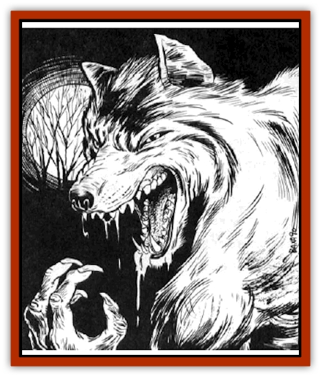

# Lycanthrope - Loup-garou

| Statistic | **Lowland** | **Mountain** |
| --- | --- | --- |
| **Activity Cycle:** | Night | Night |
| **Alignment:** | Chaotic evil | Chaotic evil |
| **Armor Class:** | 4 | 3 |
| **Climate/Terrain:** | Temperate forests &amp; hills | Temperate hills &amp; mountains |
| **Damage/Attack:** | 1d4/1d4/2d4 or 2d4 | 1d4/1d4/2d4 or 2d4 |
| **Diet:** | Carnivore | Carnivore |
| **Frequency:** | Very rare | Very rare |
| **Hit Dice:** | 5+4 | 7 |
| **Intelligence:** | High (13-14) | High (13-14) |
| **Magic Resistance:** | 20% | 40% |
| **Morale:** | Elite (13-14) | Elite (13-14) |
| **Movement:** | 12, 15, or 18 | 12, 15, or 18 |
| **No. Appearing:** | 2d6 | 1d10+2 |
| **No. of Attacks:** | 3 or 1 | 3 or 1 |
| **Organization:** | Pack | Pack |
| **Size:** | M (6-7' tall) | M (6-7' tall) |
| **Special Attacks:** | Surprise | Surprise |
| **Special Defenses:** | Hit only by +1 or silver | Hit only by +1 or gold, regeneration |
| **THAC0:** | 15 | 13 |
| **Treasure:** | K,M | R |
| **XP Value:** | 2,000 | 4,000 |

Loup-garous are powerful cousins of the common [[Lycanthrope_Werewolf|werewolf]]. Like most true werewolves in Ravenloft, they can assume three forms: human, man-wolf, and [[Wolf|wolf]]. The human form is completely normal.

The loup-garou always looks the same in its human form. just as it looks the same in its wolf or man-wolf form. In this shape, the beast has a movement rate of 12.

As a man-wolf, it stands about 7' tall and is extremely muscular. The body is fur-covered and has a short tail, canine legs, and a wolf's head. The creature walks erect and can manipulate things with its hands. In this form, the creature can talk, although its voice is low and raspy. The man-wolf shape is also faster than its human guise, having a movement rate of 15.

As a wolf, a lowland loup-garou looks just like a [[Wolf|worg wolf]] while its mountain cousins are larger. The creature is swiftest in this form, having a movement rate of 18, but cannot handle tools or weapons, and cannot talk.

**Combat:** The tactics and weapons that a loup-garou employs in combat depends wholly upon the shape that it employs. The creature needs a full round to change from one form to another.

The human can belong to any character class and may have any experience level, although most loup-garous tend to be warriors or thieves. The experience level never affects Hit Dice or hit points. Werewolves without a character class are treated as 1st level fighters. In this form, the creature depends upon weapons to defend itself.

In man-wolf form, the loup-garou can attack 3 times per round, once with each clawed hand and with a bite. It can use a weapon, but then only gets one attack per round. The creature has a Strength of 18/00 in this form, and gains the appropriate combat bonuses (+3 on attacks and +6 to damage).

In wolf form, a loup-garou can attack only once each round by biting. This form has the advantage of speed and surprise, however. Because of its keen senses, a loup-garou in wolf form imposes a -2 penalty on its enemies' surprise rolls. The wolf form is also less conspicuous than the man-wolf, appearing as a normal animal rather than a supernatural creature.

In any form, the lowland loup-garou has some natural resistance to magic. Its mental capacity remains the same regardless of shape.

The creature can be harmed only by silver or magical weapons. Silver weapons do normal damage, but magical weapons only do as much damage as their bonus. For example, a *sword +1* can inflict no more than 1 point of damage per successful hit, regardless of the damage roll. A character's Strength bonus does not apply. A blessed weapon (of other specialty weapon with a bonus) inflicts 1 point of damage per hit.

**Habitat/Society:** Lowland packs wander the Ravenloft domains in search of prey, preferably humans. In the wild, lowland packs often use a cave or ruined building as a den. They also have been known to travel as humans and stay in inns. They hate other lycanthropes and especially [[Wolfwere|wolfweres]].

**Ecology:** The werewolf's most fearsome aspect is the infection its bite can cause. Any infected human or humanoid can become a werewolf when the condition is triggered (frequently by the 3 days of a full moon). The infected werewolf can be controlled by the true werewolf that infected him. In animal form, the infected creature is a semi-intelligent (2-4), raging beast. It takes a full turn for an infected werewolf to change from man to wolf or vice versa.

**Mountain Loup-garou**

  This larger species is as big as a [[Wolf|dire wolf]] when in wolf form. It can only be hurt by gold or magical weapons. It is more magic resistant than many types of werewolves, and can regenerate 1 hit point per turn. Mountain loup-garous are more likely to hunt alone than other forms of werewolf.

---
## Discovery & Documentation

**Source Publication:** Ravenloft Campaign Setting, 1st Ed. ("Realm of Terror") (1994)
**Campaign Setting:** Ravenloft
**Author(s):** Bruce Nesmith and Andria Hayday

### Other Creatures Found in This Source Book
   * [[Geist|Geist]]
   * [[Gremishka|Gremishka]]
   * [[Odem|Odem]]
   * [[Strahd_Skeleton|Strahd Skeleton]]
   * [[Strahd_Zombie|Strahd Zombie]]
   * [[Vampire_Nosferatu|Vampire, Nosferatu]]
