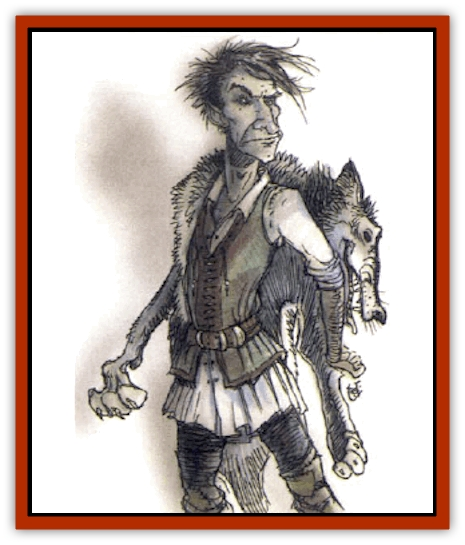

# Lycanthrope - Loup de Noir

| Statistic | **Lycanthrope, Loup de Noir** |
| --- | --- |
| **Activity Cycle:** | Any (night) |
| **Alignment:** | Chaotic evil |
| **Armor Class:** | 3 |
| **Climate/Terrain:** | Boreal forest or plains |
| **Damage/Attack:** | 2d6 or by weapon |
| **Diet:** | Carnivore |
| **Frequency:** | Very rare |
| **Hit Dice:** | 6+3 |
| **Intelligence:** | Average (8-10) |
| **Magic Resistance:** | Nil |
| **Morale:** | Elite (13-14) |
| **Movement:** | 15 |
| **No. Appearing:** | 1d6 |
| **No. of Attacks:** | 1 |
| **Organization:** | Pack |
| **Size:** | M (6' long) |
| **Special Attacks:** | Seize throat |
| **Special Defenses:** | See below |
| **THAC0:** | 13 |
| **Treasure:** | D |
| **XP Value:** | 1,400 |

The loup du noir, or *skinchanger*, is a [[Lycanthrope_General_Information|lycanthrope]] that transforms by donning the skin of a [[Wolf|wolf]]. In ancient times, some human hunters learned to assume the shape of a wolf to better stalk and kill their prey, and the practice eventually became a heritable trait. A few skinchangers still linger in the world today, people with a dark and sinister ability to assume the form of a savage, murderous beast.

Loup du noir have only two forms: human or wolf. In their human form they possess a normal character class and abilities. The wolf form is as large and foul-tempered as a [[Wolf|dire wolf]], and it possesses several special abilities.

A loup du noir must have a special pelt that it can use to perform its shapechanging transformation into wolf form. If the loup du noir cannot put on its wolf skin, it is unable to become a wolf.

**Combat:** In human form the loup du noir wears armor, uses spells, and attacks with weapons as a normal person. In wolf form the loup du noir attacks with a powerful bite for 2d6 points of damage. On a natural roll of 20, the loup du noir seizes its victim's throat and indices double normal damage.

The dark sorcery that allows the loup du noir to assume its bestial form also protects it from many forms of attack. The lycanthrope is immune to all *charm* and *hold* effects, and it receives a +4 bonus to saving throws vs. any other mind-affecting spell. It suffers damage from silver weapons or weapons that have had a *bless* spell cast upon them, but wounds from normal weapons heal too quickly to cause any damage. Magical weapons can harm the loup du noir, but unless they are made of silver or have had a *bless* spell cast upon them, they only cause half damage.

**Habitat/Society:** The loup du noir is a solitary creature, but it is possible for several people (for example, all the members of a family or a band of hunters) to have learned the magic necessary for the skinchange. In human form, the loup du noir is often a hunter or outdoorsman.

Loup du noir are unusual because they have brought their condition upon themselves. Whatever their motivation, they soon find themselves seduced by the power of their new shape. Once a character has tasted of the wolf's strength, the desire is strong to repeat the transformation. A character resisting the urge to transform must roll a saving throw vs. spell with a cumulative -1 penalty for each day that has passed since the last transformation. Failure indicates an irresistible urge to change.

In wolf form, a loup du noir retains full human intelligence. This makes it a cunning and dangerous opponent. However, its human judgment is clouded by an intense bloodlust that can turn it against any creature it encounters, even innocents or friends. If the loup du noir is driven to attack someone or something it might not want to, the creature may roll a saving throw vs. spell to attempt to resist. There is a cumulative -1 penalty to the roll for each day that the loup du noir has not killed something; eventually, the creature must give in to its murderous urges.

**Ecology:** The loup du noir is not a natural predator, and it kills indiscriminately despite its human intelligence. In wolf form the loup du noir can spread lycanthropy by wounding its victims; there is a 1% chance per point of damage that a character wounded by a loup du noir becomes infected. The loup du noir is not considered to be a master lycanthrope and cannot induce the transformations of its victims or control their actions, however.

The curse of a loup du noir is passed to its children. Offspring born in wolf form are [[Wolfwere|wolfweres]], while its human-born young have the potential to become loup du noir.

---
## Discovery & Documentation

**Source Publication:** Monstrous Compendium, 1994 Annual, Volume 1 (1995)
**Campaign Setting:** Advanced Dungeons & Dragons 2nd Edition
**Author(s):** David Wise

### Other Creatures Found in This Source Book
   * [[Abyss_Ant|Abyss Ant]]
   * [[Achaierai|Achaierai]]
   * [[Afanc|Afanc]]
   * [[Al-Jahar|Al-Jahar]]
   * [[Baelnorn|Baelnorn]]
   * [[Baneguard|Baneguard]]
   * [[Banelar|Banelar]]
   * [[Bird_Talking|Bird, Talking]]
   * [[Blazing_Bones|Blazing Bones]]
   * [[Campestri|Campestri]]
   * [[Caniquine|Caniquine]]
   * [[Cat_Winged|Cat, Winged]]
   * [[Crypt_Servant|Crypt Servant]]
   * [[Death's_Head_Tree|Death's Head Tree]]
   * [[Dog_Saluqi|Dog, Saluqi]]
   * [[Dragon_Electrum|Dragon, Electrum]]
   * [[Dragon_Fang|Dragon, Fang]]
   * [[Dragon_Linnorm_Corpse_Tearer|Dragon, Linnorm, Corpse Tearer]]
   * [[Dragon_Linnorm_Dread|Dragon, Linnorm, Dread]]
   * [[Dragon_Linnorm_Flame|Dragon, Linnorm, Flame]]
   * [[Dragon_Linnorm_Forest|Dragon, Linnorm, Forest]]
   * [[Dragon_Linnorm_Frost|Dragon, Linnorm, Frost]]
   * [[Dragon_Linnorm_Gray|Dragon, Linnorm, Gray]]
   * [[Dragon_Linnorm_Land|Dragon, Linnorm, Land]]
   * [[Dragon_Linnorm_Midgard|Dragon, Linnorm, Midgard]]
   * [[Dragon_Linnorm_Rain|Dragon, Linnorm, Rain]]
   * [[Dragon_Linnorm_Sea|Dragon, Linnorm, Sea]]
   * [[Dragon_Neutral_Jacinth|Dragon, Neutral, Jacinth]]
   * [[Dragon_Neutral_Jade|Dragon, Neutral, Jade]]
   * [[Dragon_Neutral_Pearl|Dragon, Neutral, Pearl]]
   * [[Dread|Dread]]
   * [[Dragon-kin|Dragon-kin]]
   * [[Elemental_Earth_Kin_Chrysmal|Elemental, Earth Kin, Chrysmal]]
   * [[Elemental_Earth_Kin_Earth_Weird|Elemental, Earth Kin, Earth Weird]]
   * [[Elemental_Fire_Kin_Azer|Elemental, Fire Kin, Azer]]
   * [[Elemental_Sandman|Elemental, Sandman]]
   * [[Elemental_Wind_Walker|Elemental, Wind Walker]]
   * [[Elemental_Vermin|Elemental Vermin]]
   * [[Feystag|Feystag]]
   * [[Flame_Skull|Flame Skull]]
   * [[Foulwing|Foulwing]]
   * [[Gambado|Gambado]]
   * [[Garbug|Garbug]]
   * [[Genie_Tasked_Administrator|Genie, Tasked, Administrator]]
   * [[Genie_Tasked_Deceiver|Genie, Tasked, Deceiver]]
   * [[Genie_Tasked_Harim_Servant|Genie, Tasked, Harim Servant]]
   * [[Genie_Tasked_Messenger|Genie, Tasked, Messenger]]
   * [[Genie_Tasked_Miner|Genie, Tasked, Miner]]
   * [[Genie_Tasked_Oathbinder|Genie, Tasked, Oathbinder]]
   * [[Gibbering_Mouther|Gibbering Mouther]]
   * [[Gnasher|Gnasher]]
   * [[Gnasher_Winged|Gnasher, Winged]]
   * [[Golem_Brain|Golem, Brain]]
   * [[Golem_Hammer|Golem, Hammer]]
   * [[Golem_Metagolem|Golem, Metagolem]]
   * [[Golem_Spiderstone|Golem, Spiderstone]]
   * [[Gorynych|Gorynych]]
   * [[Greelox|Greelox]]
   * [[Helmed_Horror|Helmed Horror]]
   * [[Jarbo|Jarbo]]
   * [[Laraken|Laraken]]
   * [[Lich_Psionic|Lich, Psionic]]
   * [[Living_Steel|Living Steel]]
   * [[Lock_Lurker|Lock Lurker]]
   * [[Loxo|Loxo]]
   * [[Lycanthrope_Werebadger|Lycanthrope, Werebadger]]
   * [[Lycanthrope_Werejaguar|Lycanthrope, Werejaguar]]
   * [[Lythlyx|Lythlyx]]
   * [[Magebane|Magebane]]
   * [[Marrashi|Marrashi]]
   * [[Metalmaster|Metalmaster]]
   * [[Mimic_House_Hunter|Mimic, House Hunter]]
   * [[Naga_Bone|Naga, Bone]]
   * [[Nautilus_Giant|Nautilus, Giant]]
   * [[Nightshade_Toril|Nightshade (Toril)]]
   * [[Nishruu|Nishruu]]
   * [[Noran|Noran]]
   * [[Opinicus|Opinicus]]
   * [[Ormyrr|Ormyrr]]
   * [[Parasite|Parasite]]
   * [[Pasari-Niml|Pasari-Niml]]
   * [[Plant_Vampire_Moss|Plant, Vampire Moss]]
   * [[Pteraman|Pteraman]]
   * [[Rautym|Rautym]]
   * [[Shadeling|Shadeling]]
   * [[Skum|Skum]]
   * [[Snake_Giant_Cobra|Snake, Giant Cobra]]
   * [[Snake_Stone|Snake, Stone]]
   * [[Spectral_Wizard|Spectral Wizard]]
   * [[Spell_Weaver|Spell Weaver]]
   * [[Spider_Brain|Spider, Brain]]
   * [[Suwyze|Suwyze]]
   * [[Tatalla|Tatalla]]
   * [[Tick_Heart|Tick, Heart]]
   * [[Tree_Dark|Tree, Dark]]
   * [[Tree_Singing|Tree, Singing]]
   * [[Tressym|Tressym]]
   * [[Troll_Snow|Troll, Snow]]
   * [[Tuyewera|Tuyewera]]
   * [[Ulitharid|Ulitharid]]
   * [[Undead_Dwarf|Undead Dwarf]]
   * [[Undead_Lake_Monster|Undead Lake Monster]]
   * [[Whipsting|Whipsting]]
   * [[Windghost|Windghost]]
   * [[Wolf_Dread|Wolf, Dread]]
   * [[Wolf_Stone|Wolf, Stone]]
   * [[Wolf_Vampiric|Wolf, Vampiric]]
   * [[Wraith_Shimmering|Wraith, Shimmering]]
   * [[Xantravar|Xantravar]]
   * [[Xaver|Xaver]]
