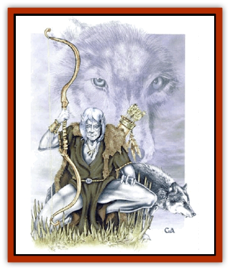

# Lycanthrope - Lythari

| Statistic | **Lycanthrope, Lythari** |
| --- | --- |
| **Activity Cycle:** | Nocturnal |
| **Alignment:** | Chaotic Good |
| **Armor Class:** | 6 |
| **Climate/Terrain:** | Forests (elven lands) |
| **Damage/Attack:** | 2-8 or by weapon |
| **Diet:** | Carnivore |
| **Frequency:** | Very rare |
| **Hit Dice:** | 4 |
| **Intelligence:** | Average-very (9-12) |
| **Magic Resistance:** | Nil |
| **Morale:** | Irregular (7) |
| **Movement:** | 18 |
| **No. Appearing:** | 1 or 2-12 |
| **No. of Attacks:** | 1 |
| **Organization:** | Solitary or pack |
| **Size:** | M (10' long) |
| **Special Attacks:** | None |
| **Special Defenses:** | Hit only by silver or enchanted weapons |
| **THAC0:** | 17 |
| **Treasure:** | B |
| **XP Value:** | 420 |

The reclusive lythari, known among the [[Elf|wood elves]] as *silver shadows*, are true [[Lycanthrope_General_Information|lycanthropes]]: good-aligned [[Elf|elves]] capable of changing into lupine form. The details are for [[Wolf|wolf]] form (no hybrid form).

In wolf form, lythari are beautiful, with pale gray or silver fur and intelligent, blue or brown eyes. Wolf form lythari leave no impression of danger or ferocity, but rather seem friendly and companionable. An adult is the size of a small pony and might carry a man-sized ally if the need is great.

In the rare times the assume elf form, the lythari are beautiful and otherworldly, even for elves. They dress in furs, hides, and other natural garb decorating themselves with feathers, bone jewelry, and similar objects in a fashion more ancient than the oldest wood elf tribes. Tall and pale skinned, they have light blue or green eyes and silver hair.

In wolf form, lythari communicate in the manner of wolves. In elf form, lythari speak elvish; some can speak Common, also.

**Combat:** Lythari, like elves, can pass through natural surroundings, wood or forest, silently and nearly invisibly (opponents have a -4 surprise modifier). Lythari are 75% likely to avoid contact with strangers under normal circumstances.

Lythari dislike combat and prefer to flee rather than fight. If they aid in warfare at all, they serve as scouts and messengers, for physical combat is abhorrent to them. If cornered or defending their kin, they will fight with great skill (their moreal becomes Elite, 13). In elven form, lythari fight with normal elven weapons. In wolf form, their preferred form for fighting, lythari attack by biting.

In the same manner as ordinary lycanthropes, lythari may be hit only by silver or weapons of at least +1 enchantment when in wolf form. Magic that affects lycanthropes also affects them. In both forms, lythari are 90% resistant to *sleep* and *charm* spells and are immune to [[Ghoul|ghoul]] paralyzation. Lythari have complete freedom over their ability to change form, the transformation taking about half a round. A lythari slain in wolf form revert to elf form in one round.

**Habitat/Society:** Unlike ordinary [[Lycanthrope_Werewolf|werewolves]], the lythari are a gentle, benevolent species and, although they hunt and kill in the same manner as ordinary wolves, they neither inflict wanton violence nor attack intelligent species.

The typical encounter with lythari is with a single hunter or pack. The larger tribal community might be as large as 30, with up to a dozen or so members too young to hunt. Most lythari live between worlds, not dwelling on the Prime Material plane, but living in forested places that can be reached only through special gates known only to themselves. They are a shy race, preferring to remain in the forest, far from civilization, and even from their own elven relatives. Their small bands are anarchic, communal societies, with no real leaders, and complete equality for all members.

The lythari do not produce metal objects of any sort. They build nothing more elaborate than brush shelters. Spellcasters are rare, mostly speciality priests of woodland deities. Lythari revere Rillifane Rallathil and other wilderness Seldarine deities, but worship Oberon and Titania of the Seelie Court with the most devotion.

Lythari are interfertile and reproduce among themselves. They may also create new lythari from among normal elves in a special ritual of bonding that leaves a permanent scar resembling a wolf bite. Lythari status may only be conferred upon another elf if both the lythari and the elf agree to the transformation.

If lythari run with normal wolves in wolf form, they are accepted as pack members and trated with deference, while remaining outside the normal wolf pack hierarchiy. Evil wolves and like creatures, such as [[Wolf|worgs]] and werewolves (and most antherions, such as [[Wolfwere|wolfweres]]) sense their difference and will try to drive them off or slay them.

**Ecology:** Small, independent bands of lythari live in the forests of Evermeet and a few still may linger in Faer�n. Most lythari, however, live in magical faerielands that touch only lightly upon the Prime Material plane.

In both their elven and lupine forms, lythari are hunters, but their relatively small numbers prevent them from having any real impact on prey populations. They prefer to hunt mammals such as deer, rabbit, and [[Boar|wild boar]]. They are as rarely seen by wood elves as wood elves are by humans. Only twice in the history of Faer�n have lythari taken part in greater events. The harper Arilyn Moonblade has a gift, a magical whistle, that can call the lythari Ganamede across vast distances.

---
## Discovery & Documentation

**Source Publication:** Monstrous Compendium, 1997 Annual, Volume 4 (1995)
**Campaign Setting:** Advanced Dungeons & Dragons 2nd Edition
**Author(s):** Jon Pickens

### Other Creatures Found in This Source Book
   * [[Anemone_Giant_Sea|Anemone, Giant Sea]]
   * [[Asperii|Asperii]]
   * [[Bainligor|Bainligor]]
   * [[Beast_of_Chaos|Beast of Chaos]]
   * [[Blindheim|Blindheim]]
   * [[Bloodsipper_Far_Realm|Bloodsipper (Far Realm)]]
   * [[Bulette_Gohlbrorn|Bulette, Gohlbrorn]]
   * [[Child_of_the_Sea|Child of the Sea]]
   * [[Clockwork_Horror|Clockwork Horror]]
   * [[Clockwork_Swordsman|Clockwork Swordsman]]
   * [[Coral|Coral]]
   * [[Darklore|Darklore]]
   * [[Dharculus|Dharculus]]
   * [[Dolphin_Athas|Dolphin (Athas)]]
   * [[Dragon_Neutral_Moonstone|Dragon, Neutral, Moonstone]]
   * [[Dragon_Prismatic|Dragon, Prismatic]]
   * [[Dream_Stalker|Dream Stalker]]
   * [[Dragon-kin_Albino_Wyrm|Dragon-kin, Albino Wyrm]]
   * [[Echyan|Echyan]]
   * [[Firestar|Firestar]]
   * [[Firetail|Firetail]]
   * [[Fish_Ascallion|Fish, Ascallion]]
   * [[Fish_Deep_Ocean|Fish, Deep Ocean]]
   * [[Fish_Tropical|Fish, Tropical]]
   * [[Fish_Vurgens|Fish, Vurgens]]
   * [[Fogwarden|Fogwarden]]
   * [[Fraal|Fraal]]
   * [[Giant_Crag|Giant, Crag]]
   * [[Gibberling_Brood|Gibberling, Brood]]
   * [[Glutton_Sea|Glutton, Sea]]
   * [[Golden_Ammonite|Golden Ammonite]]
   * [[Golem_Brass_Minotaur|Golem, Brass Minotaur]]
   * [[Golem_Gemstone|Golem, Gemstone]]
   * [[Golem_Maggot|Golem, Maggot]]
   * [[Groundling|Groundling]]
   * [[Hermit_Sea|Hermit, Sea]]
   * [[Hound_of_Law|Hound of Law]]
   * [[Human_Amazon|Human, Amazon]]
   * [[Human_Pygmy|Human, Pygmy]]
   * [[Inquisitor|Inquisitor]]
   * [[Kercpa|Kercpa]]
   * [[Kreel|Kreel]]
   * [[Mercurial|Mercurial]]
   * [[Mold_Chromatic|Mold, Chromatic]]
   * [[Mummy_Bog|Mummy, Bog]]
   * [[Neh-thalggu|Neh-thalggu]]
   * [[Nymph_Grain|Nymph, Grain]]
   * [[Nymph_Unseelie|Nymph, Unseelie]]
   * [[Octopus_Octo-Jelly|Octopus, Octo-Jelly]]
   * [[Puddingfish|Puddingfish]]
   * [[Sea_Demon|Sea Demon]]
   * [[Shade|Shade]]
   * [[Shadowrath|Shadowrath]]
   * [[Shark_Athas|Shark (Athas)]]
   * [[Siren_Ravenloft|Siren (Ravenloft)]]
   * [[Skeleton_Variant|Skeleton, Variant]]
   * [[Skyfish|Skyfish]]
   * [[Spectral_Scion|Spectral Scion]]
   * [[Spyder_Fiend|Spyder Fiend]]
   * [[Squid_Squark|Squid, Squark]]
   * [[Tanar'ri_Lesser_Uridezu|Tanar'ri, Lesser, Uridezu]]
   * [[Troll_Mutate|Troll Mutate]]
   * [[Vaati|Vaati]]
   * [[Vampire_Cerebral|Vampire, Cerebral]]
   * [[Varkha|Varkha]]
   * [[Wizshade|Wizshade]]
   * [[Worm_Lukhorn|Worm, Lukhorn]]
   * [[Wyste|Wyste]]
   * [[Yugoloth_Lesser_Gacholoth|Yugoloth, Lesser, Gacholoth]]
   * [[Zombie_Mud|Zombie, Mud]]
