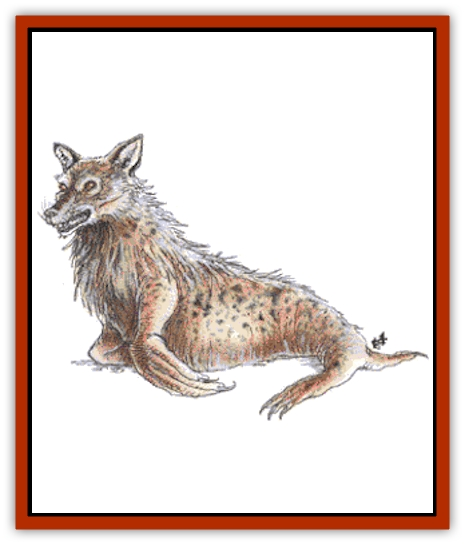

# Lycanthrope - Seawolf

| Statistic | **Greater** | **Lesser** |
| --- | --- | --- |
| **Activity Cycle:** | Any | Any |
| **Alignment:** | Chaotic evil | Neutral evil |
| **Armor Class:** | 5 | 6 (7) |
| **Climate/Terrain:** | Saltwater | Saltwater |
| **Damage/Attack:** | 3-12 or 1-2 and by weapon type | 2d4 (1-2/1-2/1-4) |
| **Diet:** | Carnivore | Carnivore |
| **Frequency:** | Very rare | Very rare |
| **Hit Dice:** | 9+2 | 2+2 |
| **Intelligence:** | Low to high (5-14) | Average (8-10) |
| **Magic Resistance:** | Nil | Nil |
| **Morale:** | Elite (13-14) | Steady (11-12) |
| **Movement:** | Sw 27, 9 | Sw 12, 30 |
| **No. Appearing:** | 4-16 | 3-18 |
| **No. of Attacks:** | 1 or 2 | 1 (3) |
| **Organization:** | Pack | Pack |
| **Size:** | L (12-15' long) or M | M (6-7') |
| **Special Attacks:** | Nil | Nil |
| **Special Defenses:** | Hit only by silver, cold iron, or +1 or better magical weapons | Nil |
| **THAC0:** | 11 | 19 |
| **Treasure:** | Nil | Nil |
| **XP Value:** | 1,400 | 120 |

The seawolves are humans who can assume a form combining aspects of a seal and a [[Wolf|wolf]]. Their packs roam the seas in search of ships to attack.

The monstrous form of the lesser seawolf has the 6 to 7 foot long body of a seal. The head and shoulders are those of a wolf. In human form the lesser seawolves stand 5 to 6 feet tall. All are thickly muscled and have tiny ears and long hair that covers their head and shoulders like a mane. The lesser seawolf has a hybrid form of a wolfman, a humanoid shape that retains the seawolf's teeth, claws, and fur; statistics for this form are given in parentheses above.

**Combat:** Lesser seawolves approach a ship in seawolf form, then change into the hybrid form and climb aboard. There they use their teeth and claws to kill their opponents. If the ship looks too heavily defended, the seawolves may gnaw holes in the hull in order to sink the ship.

Unlike most other [[Lycanthrope_General_Information|lycanthropes]], lesser seawolves have no special protection against normal weapons. Dead seawolves revert to their human form in a single round.

**Habitat/Society:** Most seawolves were formerly fishermen or sailors; as such, they also tend to be male and human. They travel in packs with those of their own kind. Their fierce hatred of their former coworkers drives them to seek to kill them or pass on the lycanthropic curse. Victims who acquire the disease become seawolves in 2-5 days. Once night falls, the new seawolf slips into the water and goes off in search of a pack.

Seawolves are nomads constantly roaming the cooler sections of the seas. They neither build lairs nor keep treasure. During the day, they sleep on beaches or in caves or appropriated houses. If surprised on a beach, they pretend to be shipwreck victims, then kill the intruders and take their clothing. If at sea, the seawolves are still able to sleep during the day by floating on their backs; in this case they may be mistaken for a cluster of drowning victims. If a ship moves close to investigate, the seawolves wait for the best opportunity to attack and take over the ship.

Seawolves breathe air. They can remain submerged for 17-24 (1d8+16) minutes. Failure to surface after that time causes them to suffer 1-6 points of damage each round until they drown.

Female seawolves give birth to single cubs. These may appear to be human infants during the day or baby seals at night. Seawolves lack parental feelings and abandon the cubs. Although the cubs are able to swim and hunt from birth, they have difficulty keeping up with adults and often drown during the day if they are at sea. Only 5% of cubs reach adulthood. The offspring of a seawolf and a human are good swimmers who feel mysteriously drawn to the sea, but few (25%) become seawolves upon reaching adolescence.

Seawolves may ally themselves with other evil aquatic lycanthropes. They hate [[Selkie|selkies]], whom they consider allies of the humanoids. Lesser seawolves attack selkies on sight.

Their diet includes a variety of foods, such as shellfish, fish, seabirds, sea mammals, and anyone they can sink their teeth into. Occasionally, packs may wander into a town and take over a tavern for a round of drinking and wenching.

Seawolf personalities are a twisted version of their original, human personalities. It is as if the seawolf persona is a savage, magnified version of all the original person's bad traits. Seawolves periodically return to their original home port. This may be a subconscious longing for their old life or a means to renew their hatred of those still humanoid. If a seawolf spots his old self's mate or child, he may attempt to make contact.

**Ecology:** Seawolves are the sworn enemies of any humanoid who makes his living in the sea. They live to destroy shipping, spread terror, and spread their curse further.

## Greater Seawolves

The monstrous form of the greater seawolf has a 12 to 15 foot long body, but is otherwise identical to the lesser seawolf. In human form, greater seawolves stand 6 to 7 feet tall.

**Combat:** Greater seawolves assume their human forms to get close to their opponents. The typical plan is to bite or strangle one or two deckhands, take their weapons, and begin a general assault. In seawolf form, greater seawolves can be harmed only by silver, cold iron, or magical weapons of +1 or better. Steel weapons have no effect. Dead seawolves revert to their human form in one round.

---
## Discovery & Documentation

**Source Publication:** MC1 Volume I (w/binder #1) (1991)
**Campaign Setting:** Advanced Dungeons & Dragons 2nd Edition
**Author(s):** Jay Batista, Scott Bennie, Grant Boucher, William W. Connors, Steve Gilbert, Heike Kubasch, James Lowder, David Edward Martin, Bruce Nesmith, Jean Rabe, Rick Swan, John J. Terra, Gary L. Thomas

### Other Creatures Found in This Source Book
   * [[Bat|Bat]]
   * [[Bear|Bear]]
   * [[Behir|Behir]]
   * [[Boar|Boar]]
   * [[Bookworm|Bookworm]]
   * [[Brownie|Brownie]]
   * [[Bugbear|Bugbear]]
   * [[Carrion_Crawler|Carrion Crawler]]
   * [[Cat_Great|Cat, Great]]
   * [[Catoblepas|Catoblepas]]
   * [[Dragon_General_Information|Dragon, General Information]]
   * [[Dragonfish|Dragonfish]]
   * [[Elemental_Air_Kin_Aerial_Servant|Elemental, Air Kin, Aerial Servant]]
   * [[Elemental_Earth_Kin_Sandling|Elemental, Earth Kin, Sandling]]
   * [[Elephant|Elephant]]
   * [[Gnoll|Gnoll]]
   * [[Hobgoblin|Hobgoblin]]
   * [[Homunculus|Homunculus]]
   * [[Hornet_Giant|Hornet, Giant]]
   * [[Horse|Horse]]
   * [[Hyena|Hyena]]
   * [[Jackal|Jackal]]
   * [[Jackalwere|Jackalwere]]
   * [[Korred|Korred]]
   * [[Lich|Lich]]
   * [[Lizard|Lizard]]
   * [[Lizard_Man|Lizard Man]]
   * [[Lycanthrope_General_Information|Lycanthrope, General Information]]
   * [[Lycanthrope_Werebear|Lycanthrope, Werebear]]
   * [[Lycanthrope_Weretiger|Lycanthrope, Weretiger]]
   * [[Lycanthrope_Werewolf|Lycanthrope, Werewolf]]
   * [[Manticore|Manticore]]
   * [[Medusa|Medusa]]
   * [[Mind_Flayer|Mind Flayer]]
   * [[Minotaur|Minotaur]]
   * [[Mudman|Mudman]]
   * [[Mummy|Mummy]]
   * [[Nixie|Nixie]]
   * [[Nymph|Nymph]]
   * [[Ogre|Ogre]]
   * [[Ooze_Slime_Jelly_I|Ooze/Slime/Jelly I]]
   * [[Ooze_Slime_Jelly_II|Ooze/Slime/Jelly II]]
   * [[Orc|Orc]]
   * [[Owl|Owl]]
   * [[Owlbear_I|Owlbear I]]
   * [[Pegasus|Pegasus]]
   * [[Piercer|Piercer]]
   * [[Pudding_Deadly|Pudding, Deadly]]
   * [[Rakshasa|Rakshasa]]
   * [[Rat|Rat]]
   * [[Ray|Ray]]
   * [[Remorhaz|Remorhaz]]
   * [[Satyr|Satyr]]
   * [[Scorpion|Scorpion]]
   * [[Selkie|Selkie]]
   * [[Shadow|Shadow]]
   * [[Skeleton|Skeleton]]
   * [[Skunk|Skunk]]
   * [[Snake|Snake]]
   * [[Spectre|Spectre]]
   * [[Spider|Spider]]
   * [[Sprite|Sprite]]
   * [[Toad_Giant|Toad, Giant]]
   * [[Treant|Treant]]
   * [[Troll|Troll]]
   * [[Umber_Hulk|Umber Hulk]]
   * [[Unicorn|Unicorn]]
   * [[Vampire|Vampire]]
   * [[Wight|Wight]]
   * [[Will_O'Wisp|Will O'Wisp]]
   * [[Wolf|Wolf]]
   * [[Wolfwere|Wolfwere]]
   * [[Wraith|Wraith]]
   * [[Wyvern|Wyvern]]
   * [[Yeti|Yeti]]
   * [[Yuan-ti|Yuan-ti]]
   * [[Zombie|Zombie]]
