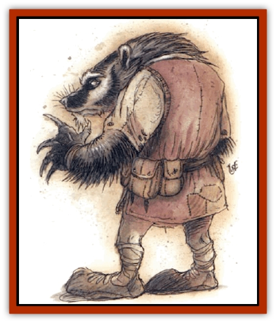

# Lycanthrope - Werebadger

| Statistic | **Lycanthrope, Werebadger** |
| --- | --- |
| **Activity Cycle:** | Any |
| **Alignment:** | Chaotic evil |
| **Armor Class:** | 4 |
| **Climate/Terrain:** | Temperate hills and underground |
| **Damage/Attack:** | 1d6/1d6/1d4 |
| **Diet:** | Carnivore |
| **Frequency:** | Very rare |
| **Hit Dice:** | 5 |
| **Intelligence:** | Average (8-10) |
| **Magic Resistance:** | Nil |
| **Morale:** | Elite (13) or Fearless (20) |
| **Movement:** | 6. Br 3 |
| **No. Appearing:** | 1 |
| **No. of Attacks:** | 3 |
| **Organization:** | Solitarv |
| **Size:** | S (4' tall) |
| **Special Attacks:** | Berserk frenzy |
| **Special Defenses:** | Silver or magical weapons required to hit |
| **THAC0:** | 15 |
| **Treasure:** | M,Q,V |
| **XP Value:** | 650 (975 magical weapon) |

Werebadgers are [[Dwarf|dwarves]] that can transform into [[Badger|giant badgers]] or dwarf-badger hybrids. In humanoid form, they appear to be normal dwarves with a silver stripe in their hair or beards (not an uncommon trait among dwarves). In hybrid form, they stand upright but have the features of a badger: thick fur, enormous claws, and a badger's head. In beast form, the werebadger simply appears to be a giant badger. Transforming into this shape rips apart any clothing the creature wears.

The werebadger's claws are so large that they "clack" together when not flexed or clenched.

**Combat:** This monster attacks with its foreclaws, followed by a bite. Unlike the giant badger, the claws are actually more fearsome than the bite, but only the bite can transmit the curse of lycanthropy.

Unlike most [[Lycanthrope_General_Information|lycanthropes]], the werebadger has no qualms about using weapons. Their natural weapons are so potent, however, that only a magical weapon is of notable improvement. They favor axes and war hammers, and there is a 75% chance the creature owns a weapon (25% chance that it is magical). In animal form werebadgers cannot use weapons. Werebadgers are harmed only by silver or magical weapons. The oil of the poppy seed is poisonous to them.

Each round of combat, the werebadger has a 25% chance to enter a berserk frenzy. Roll before each round of combat. When this occurs, the beast froths at the mouth, its claw attacks gain a +1 attack bonus, and its bite attack gains a +3 bonus. Once in a frenzy, it will not break off the attack until either it is dead or until all its opponents have fled or died. To make matters worse, during the frenzy, all bite attacks have double the normal chance to transmit lycanthropy.

**Habitat/Society:** Werebadgers tend to live on the fringes of society (when they choose to live among others at all). They choose professions that allow them to be alone or excuse bursts of violent anger. For example, many become scouts or skirmishers in dwarf armies. Werebadgers dislike physical labor as a rule. They typically do not work stone or metal.

Werebadgers dislike other forms of lycanthropes, but do not hate them. Those that avoid dwarf society tend to be loners, living in caves and tunnels, preying upon the unsuspecting. If one encounters another werebeast, the werebadger would fight only to defend its territory.

On rare occasions a werebadger will be found with a mate and young. Treat the young as common badgers with lycanthropic immunities. Any sign of hostility on the part of intruders will immediately throw both parents into a berserk frenzy (no die roll necessary).

**Ecology:** This lycanthropy affects dwarves more readily than other forms of humanoids. [[Gnome|Gnomes]], [[Goblin|goblins]], [[Orc|orcs]], and other underground dwellers are half as likely to be infected as dwarves. Humans, [[Elf|elves]], and other surface dwellers are only 25% as likely to be infected.

Werebadgers do not live as long as dwarves. If allowed to die of natural causes - a rarity for the species - they can live to be 80 or 90 years old. Dwarves or other long lived races that are infected with this form of lycanthropy have the remainder of their life spans halved. A prematurely old dwarf or gnome is sometimes suspected of being a lycanthrope.

---
## Discovery & Documentation

**Source Publication:** Monstrous Compendium, 1994 Annual, Volume 1 (1995)
**Campaign Setting:** Advanced Dungeons & Dragons 2nd Edition
**Author(s):** David Wise

### Other Creatures Found in This Source Book
   * [[Abyss_Ant|Abyss Ant]]
   * [[Achaierai|Achaierai]]
   * [[Afanc|Afanc]]
   * [[Al-Jahar|Al-Jahar]]
   * [[Baelnorn|Baelnorn]]
   * [[Baneguard|Baneguard]]
   * [[Banelar|Banelar]]
   * [[Bird_Talking|Bird, Talking]]
   * [[Blazing_Bones|Blazing Bones]]
   * [[Campestri|Campestri]]
   * [[Caniquine|Caniquine]]
   * [[Cat_Winged|Cat, Winged]]
   * [[Crypt_Servant|Crypt Servant]]
   * [[Death's_Head_Tree|Death's Head Tree]]
   * [[Dog_Saluqi|Dog, Saluqi]]
   * [[Dragon_Electrum|Dragon, Electrum]]
   * [[Dragon_Fang|Dragon, Fang]]
   * [[Dragon_Linnorm_Corpse_Tearer|Dragon, Linnorm, Corpse Tearer]]
   * [[Dragon_Linnorm_Dread|Dragon, Linnorm, Dread]]
   * [[Dragon_Linnorm_Flame|Dragon, Linnorm, Flame]]
   * [[Dragon_Linnorm_Forest|Dragon, Linnorm, Forest]]
   * [[Dragon_Linnorm_Frost|Dragon, Linnorm, Frost]]
   * [[Dragon_Linnorm_Gray|Dragon, Linnorm, Gray]]
   * [[Dragon_Linnorm_Land|Dragon, Linnorm, Land]]
   * [[Dragon_Linnorm_Midgard|Dragon, Linnorm, Midgard]]
   * [[Dragon_Linnorm_Rain|Dragon, Linnorm, Rain]]
   * [[Dragon_Linnorm_Sea|Dragon, Linnorm, Sea]]
   * [[Dragon_Neutral_Jacinth|Dragon, Neutral, Jacinth]]
   * [[Dragon_Neutral_Jade|Dragon, Neutral, Jade]]
   * [[Dragon_Neutral_Pearl|Dragon, Neutral, Pearl]]
   * [[Dread|Dread]]
   * [[Dragon-kin|Dragon-kin]]
   * [[Elemental_Earth_Kin_Chrysmal|Elemental, Earth Kin, Chrysmal]]
   * [[Elemental_Earth_Kin_Earth_Weird|Elemental, Earth Kin, Earth Weird]]
   * [[Elemental_Fire_Kin_Azer|Elemental, Fire Kin, Azer]]
   * [[Elemental_Sandman|Elemental, Sandman]]
   * [[Elemental_Wind_Walker|Elemental, Wind Walker]]
   * [[Elemental_Vermin|Elemental Vermin]]
   * [[Feystag|Feystag]]
   * [[Flame_Skull|Flame Skull]]
   * [[Foulwing|Foulwing]]
   * [[Gambado|Gambado]]
   * [[Garbug|Garbug]]
   * [[Genie_Tasked_Administrator|Genie, Tasked, Administrator]]
   * [[Genie_Tasked_Deceiver|Genie, Tasked, Deceiver]]
   * [[Genie_Tasked_Harim_Servant|Genie, Tasked, Harim Servant]]
   * [[Genie_Tasked_Messenger|Genie, Tasked, Messenger]]
   * [[Genie_Tasked_Miner|Genie, Tasked, Miner]]
   * [[Genie_Tasked_Oathbinder|Genie, Tasked, Oathbinder]]
   * [[Gibbering_Mouther|Gibbering Mouther]]
   * [[Gnasher|Gnasher]]
   * [[Gnasher_Winged|Gnasher, Winged]]
   * [[Golem_Brain|Golem, Brain]]
   * [[Golem_Hammer|Golem, Hammer]]
   * [[Golem_Metagolem|Golem, Metagolem]]
   * [[Golem_Spiderstone|Golem, Spiderstone]]
   * [[Gorynych|Gorynych]]
   * [[Greelox|Greelox]]
   * [[Helmed_Horror|Helmed Horror]]
   * [[Jarbo|Jarbo]]
   * [[Laraken|Laraken]]
   * [[Lich_Psionic|Lich, Psionic]]
   * [[Living_Steel|Living Steel]]
   * [[Lock_Lurker|Lock Lurker]]
   * [[Loxo|Loxo]]
   * [[Lycanthrope_Loup_de_Noir|Lycanthrope, Loup de Noir]]
   * [[Lycanthrope_Werejaguar|Lycanthrope, Werejaguar]]
   * [[Lythlyx|Lythlyx]]
   * [[Magebane|Magebane]]
   * [[Marrashi|Marrashi]]
   * [[Metalmaster|Metalmaster]]
   * [[Mimic_House_Hunter|Mimic, House Hunter]]
   * [[Naga_Bone|Naga, Bone]]
   * [[Nautilus_Giant|Nautilus, Giant]]
   * [[Nightshade_Toril|Nightshade (Toril)]]
   * [[Nishruu|Nishruu]]
   * [[Noran|Noran]]
   * [[Opinicus|Opinicus]]
   * [[Ormyrr|Ormyrr]]
   * [[Parasite|Parasite]]
   * [[Pasari-Niml|Pasari-Niml]]
   * [[Plant_Vampire_Moss|Plant, Vampire Moss]]
   * [[Pteraman|Pteraman]]
   * [[Rautym|Rautym]]
   * [[Shadeling|Shadeling]]
   * [[Skum|Skum]]
   * [[Snake_Giant_Cobra|Snake, Giant Cobra]]
   * [[Snake_Stone|Snake, Stone]]
   * [[Spectral_Wizard|Spectral Wizard]]
   * [[Spell_Weaver|Spell Weaver]]
   * [[Spider_Brain|Spider, Brain]]
   * [[Suwyze|Suwyze]]
   * [[Tatalla|Tatalla]]
   * [[Tick_Heart|Tick, Heart]]
   * [[Tree_Dark|Tree, Dark]]
   * [[Tree_Singing|Tree, Singing]]
   * [[Tressym|Tressym]]
   * [[Troll_Snow|Troll, Snow]]
   * [[Tuyewera|Tuyewera]]
   * [[Ulitharid|Ulitharid]]
   * [[Undead_Dwarf|Undead Dwarf]]
   * [[Undead_Lake_Monster|Undead Lake Monster]]
   * [[Whipsting|Whipsting]]
   * [[Windghost|Windghost]]
   * [[Wolf_Dread|Wolf, Dread]]
   * [[Wolf_Stone|Wolf, Stone]]
   * [[Wolf_Vampiric|Wolf, Vampiric]]
   * [[Wraith_Shimmering|Wraith, Shimmering]]
   * [[Xantravar|Xantravar]]
   * [[Xaver|Xaver]]
