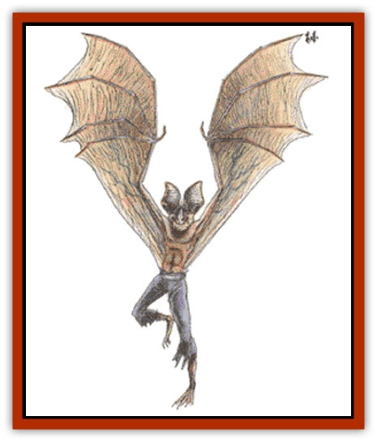

# Lycanthrope - Werebat

| Statistic | **Lycanthrope, Werebat** |
| --- | --- |
| **Activity Cycle:** | Night |
| **Alignment:** | Neutral evil |
| **Armor Class:** | 5 |
| **Climate/Terrain:** | Temperate woodlands |
| **Damage/Attack:** | 1d4/1d4 |
| **Diet:** | Blood |
| **Frequency:** | Rare |
| **Hit Dice:** | 4+2 |
| **Intelligence:** | Average (8-10) |
| **Magic Resistance:** | Nil |
| **Morale:** | Steady (11-12) |
| **Movement:** | 9, Fl 15 (D) |
| **No. Appearing:** | 1-4 |
| **No. of Attacks:** | 3 |
| **Organization:** | Flock |
| **Size:** | M (6' tall) |
| **Special Attacks:** | See below |
| **Special Defenses:** | See below |
| **THAC0:** | 17 |
| **Treasure:** | B |
| **XP Value:** | 420 |

Like the other species of [[Lycanthrope_General_Information|lycanthrope]] found in Ravenloft, two varieties of werebat exist - natural (or true) and infected. True werebats are those creatures who have been born to werebat parents. The parents may be either true or infected werebats themselves, but the offspring of any two werebats is a true werebat. In those rare cases when a child is born with one werebat and one human parent, there is a 50% chance that it will be a true werebat and a 25% chance that it will be an infected werebat.

True werebats have three forms: normal human, vampire [[Bat|bat]], or hybrid. In the first form, it is marked by bat-like features and traits (an aversion to bright lights, keen night vision, a taste for blood or raw meat, etc.). In its vampire bat form, it looks just like a common vampire bat. By far the most feared of its forms, however, is that of the hybrid. In this form, it retains its humanoid shape but takes on the added features of a bat. The arms extend to become willowy and leather wings form under them, the teeth sharpen into deadly fangs, and the snout protrudes from the face. The nails stretch into deadly claws and the eyes spawn an inner glow when light hits them.

Infected werebats have only two of the three forms listed above. Most (75%) have a human and hybrid form, while the rest have only a human and true bat form.

**Combat:** The type of attacks employed by a werebat depend upon its form. In human form, it will depend upon weapons to inflict damage, for its bare hands inflict but 1d2 points per attack. If at all possible, the creature will avoid combat in this form.

In bat form, they attack just as if they were bats. Each round, they may attack once and inflict but a single point of damage with any successful strike. The bitten victim, of course, stands a chance of contracting lycanthropy (see below), even from this meager wound. Opponents of a werebat in this form will find that it is unusually resilient, for it has its full human-form hit points.

In hybrid form, the werebat does not have the manual dexterity to employ weapons effectively. However, its deadly sharp claws and needle-like teeth make it far from helpless. In each round it may strike twice with its claws (inflicting 1d4 points of damage each). If both of these attacks hits, it may follow with a vicious bite that does 2d4 points of damage. Werebats can fly in their hybrid form and often use this ability to their advantage in combat.

Anyone who takes damage from a werebat's natural attacks stands a chance of contracting the disease of lycanthropy and becoming an infected werebat. Every point of damage done indicates a flat 2% chance per point that the victim will become infected. The procedures for curing an infected lycanthrope are given in Chapter 5 of the *Ravenloft Boxed Set*.

Werebats can be harmed only by silver or +1 or better magical weapons. Any wound inflicted by another type of weapon knits as quickly as it is inflicted, hinting at the creature's true nature.

**Habitat/Society:** Werebats favor caves in lightly wooded, temperate regions as their homes. From here, they can fly out and seek prey from which they can draw the blood necessary to satisfy their thirst.

Werebat caves are commonly home to only one family of werebats (two parents and 1-4 young). The young remain in true bat form until they reach 3 years of age. A this time, they mature into adults and, within a single year, become fully grown. This time of transformation brings out a great hunger in the creature, which forces it to spend most of its time hunting and feeding. Human villages near a werebat cave will certainly lose many citizens to the feasting of the ravenous creature at this time.

In addition to the werebat family, each cave will contain 20-200 (20d10) common bats and 1-10 giant bats. All of these lesser are under the command of the adult werebats and will act as their sentinels and companions.

**Ecology:** Although werebats favor humans and demihumans as prey, they have been known to feed on the blood of other mammals (like cattle and horses) when preferred prey is not available. Interestingly, such animals seem to be immune to the lycanthropy that these dark creatures spread.

While werebats do look upon humans and demihumans as animals to be devoured, they are not cruel or evil in their attacks. They simply regard such beings as having a lower place in the food chain. Werebats will, typically, refer to themselves as "predators of the night".

---
## Discovery & Documentation

**Source Publication:** MC10 Ravenloft Appendix I (1989)
**Campaign Setting:** Planescape
**Author(s):** William W. Connors

### Other Creatures Found in This Source Book
   * [[Bastellus|Bastellus]]
   * [[Bat_Ravenloft|Bat (Ravenloft)]]
   * [[Bowlyn|Bowlyn]]
   * [[Broken_One|Broken One]]
   * [[Bussengeist|Bussengeist]]
   * [[Darkling|Darkling]]
   * [[Doom_Guard|Doom Guard]]
   * [[Doppelganger_Plant|Doppelganger Plant]]
   * [[Elemental_Ravenloft|Elemental (Ravenloft)]]
   * [[Ermordenung|Ermordenung]]
   * [[Ghoul_Lord|Ghoul Lord]]
   * [[Goblyn|Goblyn]]
   * [[Golem_III|Golem III]]
   * [[Golem_IV|Golem IV]]
   * [[Golem_Ravenloft|Golem (Ravenloft)]]
   * [[Grim_Reaper|Grim Reaper]]
   * [[Human_Abber_Nomad|Human, Abber Nomad]]
   * [[Human_Ravenloft|Human (Ravenloft)]]
   * [[Imp_Assassin|Imp, Assassin]]
   * [[Impersonator|Impersonator]]
   * [[Lycanthrope_Wereraven|Lycanthrope, Wereraven]]
   * [[Mist_Horror|Mist Horror]]
   * [[Mummy_Greater|Mummy, Greater]]
   * [[Quevari|Quevari]]
   * [[Quickwood|Quickwood]]
   * [[Ravenkin|Ravenkin]]
   * [[Reaver|Reaver]]
   * [[Scarecrow_Ravenloft|Scarecrow (Ravenloft)]]
   * [[Shadow_Fiend|Shadow Fiend]]
   * [[Skeleton_Giant|Skeleton, Giant]]
   * [[Strahd's_Skeletal_Steed|Strahd's Skeletal Steed]]
   * [[Treant_Evil|Treant, Evil]]
   * [[Treant_Undead|Treant, Undead]]
   * [[Valpurgeist|Valpurgeist]]
   * [[Vampire_Dwarf|Vampire, Dwarf]]
   * [[Vampire_Elf|Vampire, Elf]]
   * [[Vampire_Gnome|Vampire, Gnome]]
   * [[Vampire_Halfling|Vampire, Halfling]]
   * [[Vampire_General_Information|Vampire, General Information]]
   * [[Vampire_Kender|Vampire, Kender]]
   * [[Vampyre|Vampyre]]
   * [[Widow_Red|Widow, Red]]
   * [[Wolfwere_Greater|Wolfwere, Greater]]
   * [[Zombie_Lord|Zombie Lord]]
