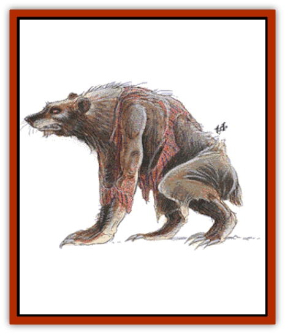

# Lycanthrope - Werebear

| Statistic | **Lycanthrope, Werebear** |
| --- | --- |
| **Activity Cycle:** | Nocturnal |
| **Alignment:** | Chaotic good |
| **Armor Class:** | 2 |
| **Climate/Terrain:** | Cold or temperate regions |
| **Damage/Attack:** | 1-3/1-3/2-8 |
| **Diet:** | Omnivore |
| **Frequency:** | Rare |
| **Hit Dice:** | 7+3 |
| **Intelligence:** | Exceptional (11-12) |
| **Magic Resistance:** | Nil |
| **Morale:** | Elite (13-14) |
| **Movement:** | 9 |
| **No. Appearing:** | 1-4 |
| **No. of Attacks:** | 3 |
| **Organization:** | Solitary |
| **Size:** | L (6-9') |
| **Special Attacks:** | Hug for 2-16 |
| **Special Defenses:** | Hit only by silver or +1 or better magical weapons |
| **THAC0:** | 13 |
| **Treasure:** | R,T,X |
| **XP Value:** | 1,400 |

Werebears are humans who can transform themselves into large [[Bear|brown bears]]. They are the best known good-aligned [[Lycanthrope_General_Information|lycanthropes]]. The ursine form most often resembles a brown bear. Some have blond, reddish, black, or ivory fur (the latter is common in frozen regions).

In human form they are large, stout, well-muscled, and hairy. Their brown hair is thick; males usually wear beards. Some have reddish, blond, ivory, or black hair; this matches the color of the ursine form. They dress in simple cloth and leather garments that are easily removed, repaired, or replaced.

**Combat:** In human form, the werebear uses available weapons, preferring axes, and knives, since these have practical applications suitable for woodland life. If attacked in daylight, the werebear usually remains human unless death is likely. The shapechange renders the werebear helpless for a round. In ursine form, the werebear attacks with two swiping claws and a bite. If both claws hit, during the next round the werebear can hug for an additional 2-16 points of damage. This subsequent damage continues automatically each round thereafter.

Like those of other lycanthropes, the werebear's defenses function only in the bear form. Weapons used against the werebear must be either silver or magical weapons of +1 or better. Werebears can summon 1-6 brown bears within 2-12 turns, provided such animals are within one mile. Werebears heal at three times the normal human rate and can cure disease in another creature in 1-4 weeks if they so desire.

If a werebear dies, he reverts to his human form in one round.

**Habitat/Society:** Werebears are normally solitary creatures. As humans, they build cabins far from settled areas, preferably in a deep forest near well-stocked waters. Werebears do not marry although they may have preferred mates they meet on a very irregular basis. Females bear 1-2 children in human form. Such children are very stout and grow quickly. Within eight years they gain adolescence and the ability to change into werebears. Shortly after, the mother drives the children out and seeks a mate to start the cycle anew. The newly independent young are discreetly guided and assisted by older werebears. Despite their apparent isolationism and rugged individualism, werebears have a sense of community. They never attack each other and aid any werebear threatened by another lycanthrope species.

Werebears are closest to forest-dwelling classes like rangers, druids, and wildlife-oriented priests. They rarely enter villages and never enter cities except in dire emergencies or to help other good-aligned people, especially those threatened by evil lycanthropes. Werebears hate [[Lycanthrope_Wererat|wererats]] and [[Lycanthrope_Werewolf|werewolves]].

The average werebear claims a territory 1 to 4 square miles in size. Fishing areas are open to all werebears. A werebear feels a close bond to its home region, acting as a game warden to protect its territory and the animals therein from the ravages of intruders.

Werebears do not travel a great deal. Only the rare individual (usually young) can be coaxed into joining a band of adventurers. Werebears may join an adventuring group as guides, provided the money is right and the job is agreeable.

Treasure is usually limited to small, valuable commodities like gold, platinum, gems, and jewelry. Werebears rarely carry any treasure and instead hide it near their homes. They also collect scrolls, potions, and other magical items, often as fees or rewards for past services. Werebears destroy any magical items that specifically affect lycanthropes or bears, since such items might be used against themselves.

**Ecology:** Werebears are omnivorous, preferring fish, small mammals, and a honey-rich mead. This mead is extremely intoxicating to normal humans. Werebears have few natural enemies. Their closest enemies are the werewolves who share their preferred wilderness regions.

---
## Discovery & Documentation

**Source Publication:** MC1 Volume I (w/binder #1) (1991)
**Campaign Setting:** Advanced Dungeons & Dragons 2nd Edition
**Author(s):** Jay Batista, Scott Bennie, Grant Boucher, William W. Connors, Steve Gilbert, Heike Kubasch, James Lowder, David Edward Martin, Bruce Nesmith, Jean Rabe, Rick Swan, John J. Terra, Gary L. Thomas

### Other Creatures Found in This Source Book
   * [[Bat|Bat]]
   * [[Bear|Bear]]
   * [[Behir|Behir]]
   * [[Boar|Boar]]
   * [[Bookworm|Bookworm]]
   * [[Brownie|Brownie]]
   * [[Bugbear|Bugbear]]
   * [[Carrion_Crawler|Carrion Crawler]]
   * [[Cat_Great|Cat, Great]]
   * [[Catoblepas|Catoblepas]]
   * [[Dragon_General_Information|Dragon, General Information]]
   * [[Dragonfish|Dragonfish]]
   * [[Elemental_Air_Kin_Aerial_Servant|Elemental, Air Kin, Aerial Servant]]
   * [[Elemental_Earth_Kin_Sandling|Elemental, Earth Kin, Sandling]]
   * [[Elephant|Elephant]]
   * [[Gnoll|Gnoll]]
   * [[Hobgoblin|Hobgoblin]]
   * [[Homunculus|Homunculus]]
   * [[Hornet_Giant|Hornet, Giant]]
   * [[Horse|Horse]]
   * [[Hyena|Hyena]]
   * [[Jackal|Jackal]]
   * [[Jackalwere|Jackalwere]]
   * [[Korred|Korred]]
   * [[Lich|Lich]]
   * [[Lizard|Lizard]]
   * [[Lizard_Man|Lizard Man]]
   * [[Lycanthrope_General_Information|Lycanthrope, General Information]]
   * [[Lycanthrope_Seawolf|Lycanthrope, Seawolf]]
   * [[Lycanthrope_Weretiger|Lycanthrope, Weretiger]]
   * [[Lycanthrope_Werewolf|Lycanthrope, Werewolf]]
   * [[Manticore|Manticore]]
   * [[Medusa|Medusa]]
   * [[Mind_Flayer|Mind Flayer]]
   * [[Minotaur|Minotaur]]
   * [[Mudman|Mudman]]
   * [[Mummy|Mummy]]
   * [[Nixie|Nixie]]
   * [[Nymph|Nymph]]
   * [[Ogre|Ogre]]
   * [[Ooze_Slime_Jelly_I|Ooze/Slime/Jelly I]]
   * [[Ooze_Slime_Jelly_II|Ooze/Slime/Jelly II]]
   * [[Orc|Orc]]
   * [[Owl|Owl]]
   * [[Owlbear_I|Owlbear I]]
   * [[Pegasus|Pegasus]]
   * [[Piercer|Piercer]]
   * [[Pudding_Deadly|Pudding, Deadly]]
   * [[Rakshasa|Rakshasa]]
   * [[Rat|Rat]]
   * [[Ray|Ray]]
   * [[Remorhaz|Remorhaz]]
   * [[Satyr|Satyr]]
   * [[Scorpion|Scorpion]]
   * [[Selkie|Selkie]]
   * [[Shadow|Shadow]]
   * [[Skeleton|Skeleton]]
   * [[Skunk|Skunk]]
   * [[Snake|Snake]]
   * [[Spectre|Spectre]]
   * [[Spider|Spider]]
   * [[Sprite|Sprite]]
   * [[Toad_Giant|Toad, Giant]]
   * [[Treant|Treant]]
   * [[Troll|Troll]]
   * [[Umber_Hulk|Umber Hulk]]
   * [[Unicorn|Unicorn]]
   * [[Vampire|Vampire]]
   * [[Wight|Wight]]
   * [[Will_O'Wisp|Will O'Wisp]]
   * [[Wolf|Wolf]]
   * [[Wolfwere|Wolfwere]]
   * [[Wraith|Wraith]]
   * [[Wyvern|Wyvern]]
   * [[Yeti|Yeti]]
   * [[Yuan-ti|Yuan-ti]]
   * [[Zombie|Zombie]]
