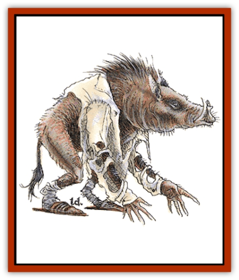

# Lycanthrope - Wereboar

| Statistic | **Lycanthrope, Wereboar** |
| --- | --- |
| **Activity Cycle:** | Any |
| **Alignment:** | Neutral |
| **Armor Class:** | 4 |
| **Climate/Terrain:** | Any dry land |
| **Damage/Attack:** | 2-12 or by weapon |
| **Diet:** | Omnivore |
| **Frequency:** | Rare |
| **Hit Dice:** | 5+2 |
| **Intelligence:** | Average (8-10) |
| **Magic Resistance:** | Nil |
| **Morale:** | Elite (13) |
| **Movement:** | 12 |
| **No. Appearing:** | 2-8 |
| **No. of Attacks:** | 1 |
| **Organization:** | Tribal |
| **Size:** | M (5-6' tall) |
| **Special Attacks:** | Nil |
| **Special Defenses:** | Silver or +1 or better to hit |
| **THAC0:** | 15 |
| **Treasure:** | B,S |
| **XP Value:** | 650 |

Wereboars are humans who are able to transform themselves into a form combining human and [[Boar|boar]] features. Their tempers are as ugly as their features.

In human form wereboars tend to be stocky, muscular people of average height. Their hair is short and stiff. They dress in simple garments that are easy to remove, repair, or replace.

The boar form stands slightly taller than the human form, but the hunchbacked posture thrusts the head forward. The head is identical to a boar's head, complete with short tusks. The torso's diameter is doubled, the neck shortened, and the feet become hoof-like. Stiff, black hair like wire bristles covers the skin.

**Combat:** The wereboar combines his hands and tusks for deadly effect. The wereboar seizes a target and pulls it toward his head. He stabs his tusks into the victim, then pulls his victim to one side while swinging his head in the other direction, which tears the wound further. He then tosses the victim aside and attacks someone else. A wereboar will gladly wade into the center of a group of opponents and then fight his way out.

In human form the wereboar attacks with whatever weapon he has. Wereboars prefer bludgeoning or chopping weapons, such as axes and maces, rather than stabbing or missile weapons such as swords, spears, or bows.

In either form the wereboar is immune to damage from nonmagical and nonsilver weapons. Such wounds are little more than scratches that quickly heal.

**Habitat/Society:** Wereboars are ill-tempered, easily angered, and almost as prone to attack their few friends as they are to attack an enemy. As humans they are rude, crude, and vulgar. However, they are invaluable allies in a fight. A wereboar does not give his friendship easily, but when he does it is a special bond he will not break. The problem is, due to the wereboar's peculiar personality, it is difficult to tell whether he is being friendly or hostile.

Wereboars prefer dense woodlands, ideally far from towns and cities. Like werebears, they live in caves or build cabins for their homes. Their homes tend to be ill-kept and slovenly. Wereboars don't repair things, they replace them.

Despite their personalities, wereboars have close-knit families. Females give birth to litters of 1d4+2 offspring. Newborns are very small by human standards but are strong and able to crawl hours after birth. The offspring mature quickly. When they reach adolescence at eight years, they gain the ability to become wereboars themselves. A wereboar father appears to be distant and aloof, but a staunch protector who will attack any foe who threatens his family, no matter how uneven the odds. Females are aggressive when defending their young (+2 bonus to attack roll). Neither males nor females check morale when defending their young.

The diet is a mixture of small game, vegetables, and fungi. Their favorite food is the subterranean fungus called truffles; even in human form they can detect the truffles growing several feet underground. Wereboars aren't very good gardeners. A typical garden is a cleared field strewn with a variety of seeds and bulbs in the hope that something edible will grow. Wereboar cuisine is equally haphazard; it can be summed up as burned meat and stews.

Wereboars avoid normal hogs and boars. They are suspicious of strangers. Wereboars assume everyone is hostile. In human form they may wait for the first attack, but when in boar form they usually (75% chance) chase the intruders away and attack any who defend themselves.

**Ecology:** Wereboars produce little of value, whether trade goods or services. Their main desire is simply to stay away from everyone else. In the wild, they defend their territories against any intruders. Wereboars fit into [[Orc|orcish]] society as well as they do into human society, and might sometimes assist or ally themselves with orcish forces. Wereboars can tolerate [[Orc|half-orcs]].

---
## Discovery & Documentation

**Source Publication:** MC2 Volume II (1993)
**Campaign Setting:** Advanced Dungeons & Dragons 2nd Edition
**Author(s):** Jay Batista, Scott Bennie, Grant Boucher, William W. Connors, Steve Gilbert, Heike Kubasch, James Lowder, David Edward Martin, Bruce Nesmith, Jean Rabe, Rick Swan, John J. Terra, Gary L. Thomas

### Other Creatures Found in This Source Book
   * [[Ant|Ant]]
   * [[Ant_Lion_Giant|Ant Lion, Giant]]
   * [[Ape_Carnivorous|Ape, Carnivorous]]
   * [[Baboon|Baboon]]
   * [[Badger|Badger]]
   * [[Barracuda|Barracuda]]
   * [[Beetle_Giant|Beetle, Giant]]
   * [[Bulette|Bulette]]
   * [[Bullywug|Bullywug]]
   * [[Dwarf_Duergar|Dwarf, Duergar]]
   * [[Dwarf_Gully|Dwarf, Gully]]
   * [[Eagle|Eagle]]
   * [[Eel|Eel]]
   * [[Elemental_Air_Kin|Elemental, Air Kin]]
   * [[Elemental_Water_Kin|Elemental, Water Kin]]
   * [[Elemental_Water_Kin_Water_Weird|Elemental, Water Kin, Water Weird]]
   * [[Firestar|Firestar]]
   * [[Firetail|Firetail]]
   * [[Fish_Giant|Fish, Giant]]
   * [[Frog|Frog]]
   * [[Gorgon|Gorgon]]
   * [[Hawk|Hawk]]
   * [[Heucuva|Heucuva]]
   * [[Hippocampus|Hippocampus]]
   * [[Hippogriff|Hippogriff]]
   * [[Kelpie|Kelpie]]
   * [[Kenku|Kenku]]
   * [[Killmoulis|Killmoulis]]
   * [[Kuo-Toa|Kuo-Toa]]
   * [[Lamia|Lamia]]
   * [[Lammasu|Lammasu]]
   * [[Lamprey|Lamprey]]
   * [[Leech|Leech]]
   * [[Leprechaun|Leprechaun]]
   * [[Leucrotta|Leucrotta]]
   * [[Locathah|Locathah]]
   * [[Lycanthrope_Werefox|Lycanthrope, Werefox]]
   * [[Mammal_Minimal|Mammal, Minimal]]
   * [[Mammal_Small|Mammal, Small]]
   * [[Mimic|Mimic]]
   * [[Morkoth|Morkoth]]
   * [[Muckdweller|Muckdweller]]
   * [[Myconid|Myconid]]
   * [[Naga|Naga]]
   * [[Obliviax|Obliviax]]
   * [[Octopus_Giant|Octopus, Giant]]
   * [[Otyugh|Otyugh]]
   * [[Piranha|Piranha]]
   * [[Plant_Dangerous_I|Plant, Dangerous I]]
   * [[Plant_Intelligent|Plant, Intelligent]]
   * [[Poltergeist|Poltergeist]]
   * [[Porcupine|Porcupine]]
   * [[Rat_Osquip|Rat, Osquip]]
   * [[Roc|Roc]]
   * [[Roper|Roper]]
   * [[Rot_Grub|Rot Grub]]
   * [[Rust_Monster|Rust Monster]]
   * [[Sahuagin|Sahuagin]]
   * [[Sea_Lion|Sea Lion]]
   * [[Sea_Horse_Giant|Sea Horse, Giant]]
   * [[Shambling_Mound|Shambling Mound]]
   * [[Shark|Shark]]
   * [[Sphinx|Sphinx]]
   * [[Squid_Giant|Squid, Giant]]
   * [[Stirge|Stirge]]
   * [[Swanmay|Swanmay]]
   * [[Tarrasque|Tarrasque]]
   * [[Tasloi|Tasloi]]
   * [[Triton|Triton]]
   * [[Troglodyte|Troglodyte]]
   * [[Urchin|Urchin]]
   * [[Urd|Urd]]
   * [[Weasel|Weasel]]
   * [[Wolverine|Wolverine]]
   * [[Yellow_Musk_Creeper|Yellow Musk Creeper]]
