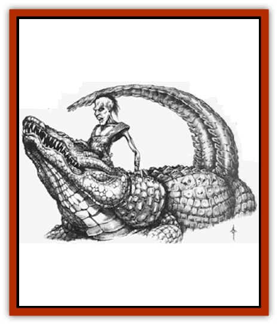
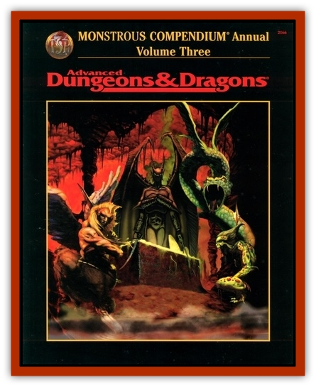

# Lycanthrope - Werecrocodile

| Statistic | **Lycanthrope, Werecrocodile** |
| --- | --- |
| **Activity Cycle:** | Day |
| **Alignment:** | Neutral evil |
| **Armor Class:** | 1 |
| **Climate/Terrain:** | Desert, swamp |
| **Damage/Attack:** | 2d6/1d8 |
| **Diet:** | Carnivore |
| **Frequency:** | Rare |
| **Hit Dice:** | 5+5 |
| **Intelligence:** | Average (8-10) |
| **Magic Resistance:** | Nil |
| **Morale:** | Elite (13-14) |
| **Movement:** | 3, sw 12 |
| **No. Appearing:** | 1-3 |
| **No. of Attacks:** | 2 |
| **Organization:** | Pack |
| **Size:** | M (6' human), L (8-12' crocodile) |
| **Special Attacks:** | Control 1d3 crocodiles, infection |
| **Special Defenses:** | Hit only by silver or magical weapons |
| **THAC0:** | 15 |
| **Treasure:** | Nil |
| **XP Value:** | 650 / Priest 1st-4th: 975 / Priest 5th: 1,400 |

In their human form, werecrocodiles are tall, thin creatures with sharp features, a long nose and chin, and a thin face with a noticeable overbite. In their [[Crocodile|crocodile]] form, they are very long, big, and powerful monsters. They speak the commou tongue and can speak with crocodiles at will. Those native to Toril speak Mulhorandi as well.

**Combat:** In combat, werecrocodiles prefer their human form. They try to trick their prey into assuming they are harmless. Werecrocodiles are infamous for playing on people's sympathy by pretending to be grieving. Once the prey is in close range, they changed to crocodile form and attack. They can bite with their huge jaws and sharp teeth for 2d6 points of damage, and lash out with their tails for 1d8 points of damage.

Werecrocodiles have the equivalent of an 18 Strength. They sometimes use this to grab their opponents, drag them deep underwater, change to crocodile form, and try to drown them.

The bite of a werecrocodile might infect an opponent with their lycanthropy. Every point of damage received from a werecrocodile bite equals a 1% chance of turning into a werecrocodile at the next full moon (a victim who takes 20 points of bite damage in an encounter with werecrocodiles has a 20% chance of contracting this strain of lycanthropy).

Werecrocodiles are able to summon 1d3 normal crocodiles, which arrive in 2-12 rounds and obey their every command.

**Habitat/Society:** Werecrocodiles live in small family groups. The mother is usually the leader of the family pack. Mating occurs with their own kind, and werecrocodiles are born live from the mother's womb. The young attain the ability to transform at the onset of puberty.

Werecmdes usually live in mud shacks by the edge of rivers or in swamps. They stay away from populated human settlements and do not collect treasure or possessions. They usually assume crocodile form to find prey, then assume human form at night to sleep. They are very territorial and attack any human, demihuman, or humanoid who enters their territory, though they will try to be as subtle as possible before springing thelr trap.

Werecrocodiles of Toril worship the god Sebek, who created them, and can become clerics or specialty priests of Sebek. Clerics are limited to 5th level, but specialty priests of Sebek have no limit. Werecrocodile priests of both types receive 1d4 extra hit points per level as priests of Sebek.

**Ecology:** Werecrocodiles are biologically identical to humans, except for their lycanthropy. They prey on both warm-blooded creatures and fish native to the swamps. They eat any [[Lycanthrope_Wererat|wererats]] native to the swamps. They do not particularly enjoy killing humans, but humans are too tasty to resist. No one preys on werecrocodiles except humans, so werecrocodiles try to have as little conflict with large bands of humans as possible.

Werecrocodiles are the creation of Sebek, a crocodile-headed minor deity in the Mulhorandi pantheon. Very few Sebek-spawn remain in Mulhorand, having been driven off by the servants of the god-kings five centuries ago, but werecrocodiles thrive in Chessenta's Adderswamp.

---
## Discovery & Documentation

**Source Publication:** Monstrous Compendium, 1996 Annual, Volume 3 (1995)
**Campaign Setting:** Advanced Dungeons & Dragons 2nd Edition
**Author(s):** Jon Pickens

### Other Creatures Found in This Source Book
   * [[Alaghi|Alaghi]]
   * [[Alhoon|Alhoon]]
   * [[Aranea_Savage_Coast|Aranea (Savage Coast)]]
   * [[Arcane_Head|Arcane Head]]
   * [[Banedead|Banedead]]
   * [[Banelich|Banelich]]
   * [[Bat_Bonebat|Bat, Bonebat]]
   * [[Beetle|Beetle]]
   * [[Belgoi|Belgoi]]
   * [[Bladeling|Bladeling]]
   * [[Braxat|Braxat]]
   * [[Bunyip|Bunyip]]
   * [[Burbur|Burbur]]
   * [[Bvanen|Bvanen]]
   * [[Cat_Great_Snow_Tiger|Cat, Great, Snow Tiger]]
   * [[Chosen_One|Chosen One]]
   * [[Chronovoid|Chronovoid]]
   * [[Cildabrin|Cildabrin]]
   * [[Coffer_Corpse|Coffer Corpse]]
   * [[Disenchanter|Disenchanter]]
   * [[Dog_Temporal|Dog, Temporal]]
   * [[Dragon_Cerilia|Dragon (Cerilia)]]
   * [[Dragon_Ghost|Dragon, Ghost]]
   * [[Dragon_Lesser_Undead|Dragon, Lesser Undead]]
   * [[Dragon_Neutral_Amber|Dragon, Neutral, Amber]]
   * [[Dread_Warrior|Dread Warrior]]
   * [[Dreamweaver|Dreamweaver]]
   * [[Dream_Spawn_Greater_Ennui|Dream Spawn, Greater, Ennui]]
   * [[Dream_Spawn_Lesser_Morph|Dream Spawn, Lesser, Morph]]
   * [[Dwarf_Arctic|Dwarf, Arctic]]
   * [[Dwarf_Urdunnir|Dwarf, Urdunnir]]
   * [[Eel_Giant_Moray|Eel, Giant Moray]]
   * [[Elemental_Fire_Kin_Tome_Guardian|Elemental, Fire Kin, Tome Guardian]]
   * [[Elf_Rockseer|Elf, Rockseer]]
   * [[Ethyk|Ethyk]]
   * [[Faerie_Faerie_Fiddler|Faerie, Faerie Fiddler]]
   * [[Faerie_Petty_Bramble|Faerie, Petty, Bramble]]
   * [[Faerie_Petty_Gorse|Faerie, Petty, Gorse]]
   * [[Faerie_Petty|Faerie, Petty]]
   * [[Firenewt|Firenewt]]
   * [[Formian|Formian]]
   * [[Gargoyle_II|Gargoyle II]]
   * [[Giant_Cerilia|Giant (Cerilia)]]
   * [[Goblin_Cerilia|Goblin (Cerilia)]]
   * [[Golem_Magic|Golem, Magic]]
   * [[Golem_Shaboath|Golem, Shaboath]]
   * [[Hag_Bheur|Hag, Bheur]]
   * [[Hamadryad|Hamadryad]]
   * [[Hound_of_Ill-Omen|Hound of Ill-Omen]]
   * [[Human_Cerilia|Human (Cerilia)]]
   * [[Hybsil|Hybsil]]
   * [[Ibrandlin|Ibrandlin]]
   * [[Imp_Chaos|Imp, Chaos]]
   * [[Ixitxachitl_Ixzan|Ixitxachitl, Ixzan]]
   * [[Jabberwock|Jabberwock]]
   * [[Kyton|Kyton]]
   * [[Kyuss_Son_of|Kyuss, Son of]]
   * [[Lillend|Lillend]]
   * [[Life-Shaped_Creation_Guardian|Life-Shaped Creation, Guardian]]
   * [[Life-Shaped_Creation_Transport|Life-Shaped Creation, Transport]]
   * [[Lycanthrope_Werespider|Lycanthrope, Werespider]]
   * [[Magedoom|Magedoom]]
   * [[Manotaur|Manotaur]]
   * [[Mastiff_Shadow|Mastiff, Shadow]]
   * [[Meazel|Meazel]]
   * [[Mist_Scarlet_Dancer|Mist, Scarlet Dancer]]
   * [[Needleman|Needleman]]
   * [[Orc_Neo-Orog|Orc, Neo-Orog]]
   * [[Orc_Ondonti|Orc, Ondonti]]
   * [[Owlbear_II|Owlbear II]]
   * [[Pegataur|Pegataur]]
   * [[Phaerimm|Phaerimm]]
   * [[Reggelid|Reggelid]]
   * [[Render|Render]]
   * [[Saurial|Saurial]]
   * [[Scalamagdrion|Scalamagdrion]]
   * [[Sharn|Sharn]]
   * [[Snake_Messenger|Snake, Messenger]]
   * [[Spirit_Forest_Uthraki|Spirit, Forest, Uthraki]]
   * [[Spirit_Forest_Wood_Man|Spirit, Forest, Wood Man]]
   * [[Spirit_Ice_Orglash|Spirit, Ice, Orglash]]
   * [[Spirit_Rock_Thomil|Spirit, Rock, Thomil]]
   * [[Strider_Giant|Strider, Giant]]
   * [[Tembo|Tembo]]
   * [[Temporal_Glider|Temporal Glider]]
   * [[Temporal_Stalker|Temporal Stalker]]
   * [[Tether_Beast|Tether Beast]]
   * [[Thessalmonster|Thessalmonster]]
   * [[Time_Dimensional|Time Dimensional]]
   * [[Tomb_Tapper|Tomb Tapper]]
   * [[Undead_Dragon_Slayer|Undead Dragon Slayer]]
   * [[Unicorn_Black_Toril|Unicorn, Black (Toril)]]
   * [[Vaath|Vaath]]
   * [[Vortex_Spider|Vortex Spider]]
   * [[Weredragon|Weredragon]]
   * [[Zhentarim_Spirit|Zhentarim Spirit]]
