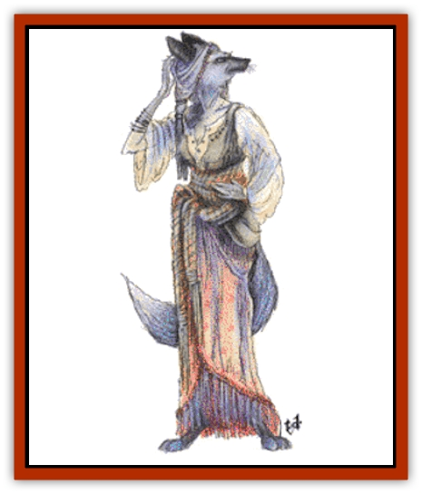

# Lycanthrope - Werefox

| Statistic | **Lycanthrope, Werefox** |
| --- | --- |
| **Activity Cycle:** | Nocturnal |
| **Alignment:** | Chaotic evil |
| **Armor Class:** | 2, 4, or 6 |
| **Climate/Terrain:** | Any |
| **Damage/Attack:** | 1-2, 2-12, or by weapon |
| **Diet:** | Carnivore |
| **Frequency:** | Very rare |
| **Hit Dice:** | 8+1 |
| **Intelligence:** | Average to Exceptional (8-16) |
| **Magic Resistance:** | Special (see below) |
| **Morale:** | Elite (13) |
| **Movement:** | 24, 18, or 12 |
| **No. Appearing:** | 1 (see below) |
| **No. of Attacks:** | 1 |
| **Organization:** | Solitary |
| **Size:** | M |
| **Special Attacks:** | Charms, spells |
| **Special Defenses:** | Silver or +1 weapons to hit |
| **THAC0:** | 13 |
| **Treasure:** | E,Q(&times;5),S |
| **XP Value:** | 2,000 |

A foxwoman is an [[Elf|elven]]-appearing woman who is able to transform herself into a silver [[Mammal_Small|fox]] form or a silver-furred humanoid (vixen) form with a fox's head. They are extremely self-centered.

The female elven form of the foxwoman is extremely beautiful. She has silver or silver-streaked hair, including a widow's peak. She dresses attractively in loose garments. A pouch holds valuables and spell components.

The vixen form is a hybrid of elven and fox-like features. The body and limbs are those of the elven form but covered with silvery fur. The head and tail are fox-like. The vixen may wear elven clothing. The vixen can run very quickly (18).

The silver fox form appears to be a normal, large fox. It moves extremely fast (24), can *pass without trace*, and is 90% undetectable in undergrowth if it passes out of view for a moment.

**Combat:** The silver fox's bite inflicts 1-2 points of damage but is otherwise harmless. The vixen's more savage bite causes 2d6 points of damage. Human or elven women who are bitten by a vixen for 50% or more of their hit points become foxwomen within three days unless both a *cure disease* and a *remove curse* spell are cast upon the victim by a priest of at least 12th level.

In elven form, the foxwoman relies on weapons. She gains a +1 bonus with bow or sword. Her best weapon is her incredible beauty. Any human, humanoid, or demihuman males whose Wisdoms are 13 or less are effectively caught by a *charm* spell. Those whose Wisdoms are 14 or greater are not *charmed* but still find the foxwoman extremely attractive. In elven form, the foxwoman has magic use as a wizard of level 1d4. She is 90% resistant to *sleep* and *charm* spells.

In any form, the foxwoman is able to see by infravision (60-foot range). They can only be harmed by silver or +1 or better magical weapons. Scars from nonfatal wounds vanish within a month.

**Habitat/Society:** Foxwomen dwell in lonely woodlands far from humanoid communities. Their homes may be hidden cottages or comfortably furnished cave complexes; in either case their homes are filled with typical human comforts. Foxwomen are solitary in regard to their own kind. They are self-serving, vain, and hedonistic. Foxwomen serve their vanity by enslaving humanoid males. Those males become servants and companions.

Werefoxes do not keep [[Dwarf|dwarves]], [[Gnome|gnomes]], or [[Halfling|halflings]]; such males are slain quietly as soon as the opportunity arises.

Each foxwoman is always accompanied by 1d4+1 *charmed* males. At least one of the males is a fighter (70%) or ranger (30%) of level 1d4+1. There is a 50% chance that any one of the other males is also a fighter of level 1d4. There is a 10% chance that one of the remaining males is a cleric (10%), druid (45%), mage (10%), thief (25%), or some other class (10%) of level 1d4. Of her elven or [[Elf_Half-|half-elven]] companions, 25% are multi-class characters. All males who do not fit into any of the above categories are 0-level fighters and elves or half-elves of 1 Hit Die. The males may use such magical items as they possessed prior to being *charmed* into the foxwoman's service.

Foxwomen are barren. They must kidnap or adopt their children. There is a 10% chance that a foxwoman has a "daughter". The foxwoman has stolen an elven girl, infected her with lycanthropy, and is raising her as a foxwoman. Such a child is be 1d8+5 years old. If she is 12-13, she is treated the same as a normal foxwoman; otherwise she is a noncombatant.

Non-elven women who are afflicted with lycanthropy undergo a slow transformation that alters their normal form. Over a period of one to two years, such women turn into elven women; only their faces and odd marks (tattoos, birthmarks) provide faint proof of their old identities.

**Ecology:** Foxwomen are unique among the lycanthropes. They have no major goals or desires aside from pampering themselves and feeding their vanity. They have little contact with other foxwomen (whom they see as rivals), real foxes (irrelevant beasts), or other [[Lycanthrope_General_Information|lycanthropes]] (crude, unattractive, and uncharmable).

---
## Discovery & Documentation

**Source Publication:** MC2 Volume II (1993)
**Campaign Setting:** Advanced Dungeons & Dragons 2nd Edition
**Author(s):** Jay Batista, Scott Bennie, Grant Boucher, William W. Connors, Steve Gilbert, Heike Kubasch, James Lowder, David Edward Martin, Bruce Nesmith, Jean Rabe, Rick Swan, John J. Terra, Gary L. Thomas

### Other Creatures Found in This Source Book
   * [[Ant|Ant]]
   * [[Ant_Lion_Giant|Ant Lion, Giant]]
   * [[Ape_Carnivorous|Ape, Carnivorous]]
   * [[Baboon|Baboon]]
   * [[Badger|Badger]]
   * [[Barracuda|Barracuda]]
   * [[Beetle_Giant|Beetle, Giant]]
   * [[Bulette|Bulette]]
   * [[Bullywug|Bullywug]]
   * [[Dwarf_Duergar|Dwarf, Duergar]]
   * [[Dwarf_Gully|Dwarf, Gully]]
   * [[Eagle|Eagle]]
   * [[Eel|Eel]]
   * [[Elemental_Air_Kin|Elemental, Air Kin]]
   * [[Elemental_Water_Kin|Elemental, Water Kin]]
   * [[Elemental_Water_Kin_Water_Weird|Elemental, Water Kin, Water Weird]]
   * [[Firestar|Firestar]]
   * [[Firetail|Firetail]]
   * [[Fish_Giant|Fish, Giant]]
   * [[Frog|Frog]]
   * [[Gorgon|Gorgon]]
   * [[Hawk|Hawk]]
   * [[Heucuva|Heucuva]]
   * [[Hippocampus|Hippocampus]]
   * [[Hippogriff|Hippogriff]]
   * [[Kelpie|Kelpie]]
   * [[Kenku|Kenku]]
   * [[Killmoulis|Killmoulis]]
   * [[Kuo-Toa|Kuo-Toa]]
   * [[Lamia|Lamia]]
   * [[Lammasu|Lammasu]]
   * [[Lamprey|Lamprey]]
   * [[Leech|Leech]]
   * [[Leprechaun|Leprechaun]]
   * [[Leucrotta|Leucrotta]]
   * [[Locathah|Locathah]]
   * [[Lycanthrope_Wereboar|Lycanthrope, Wereboar]]
   * [[Mammal_Minimal|Mammal, Minimal]]
   * [[Mammal_Small|Mammal, Small]]
   * [[Mimic|Mimic]]
   * [[Morkoth|Morkoth]]
   * [[Muckdweller|Muckdweller]]
   * [[Myconid|Myconid]]
   * [[Naga|Naga]]
   * [[Obliviax|Obliviax]]
   * [[Octopus_Giant|Octopus, Giant]]
   * [[Otyugh|Otyugh]]
   * [[Piranha|Piranha]]
   * [[Plant_Dangerous_I|Plant, Dangerous I]]
   * [[Plant_Intelligent|Plant, Intelligent]]
   * [[Poltergeist|Poltergeist]]
   * [[Porcupine|Porcupine]]
   * [[Rat_Osquip|Rat, Osquip]]
   * [[Roc|Roc]]
   * [[Roper|Roper]]
   * [[Rot_Grub|Rot Grub]]
   * [[Rust_Monster|Rust Monster]]
   * [[Sahuagin|Sahuagin]]
   * [[Sea_Lion|Sea Lion]]
   * [[Sea_Horse_Giant|Sea Horse, Giant]]
   * [[Shambling_Mound|Shambling Mound]]
   * [[Shark|Shark]]
   * [[Sphinx|Sphinx]]
   * [[Squid_Giant|Squid, Giant]]
   * [[Stirge|Stirge]]
   * [[Swanmay|Swanmay]]
   * [[Tarrasque|Tarrasque]]
   * [[Tasloi|Tasloi]]
   * [[Triton|Triton]]
   * [[Troglodyte|Troglodyte]]
   * [[Urchin|Urchin]]
   * [[Urd|Urd]]
   * [[Weasel|Weasel]]
   * [[Wolverine|Wolverine]]
   * [[Yellow_Musk_Creeper|Yellow Musk Creeper]]
