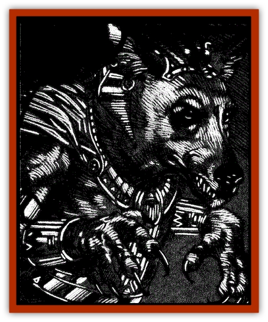

# Lycanthrope - Werejackal

| Statistic | **Lycanthrope, Werejackal** |
| --- | --- |
| **Activity Cycle:** | Night |
| **Alignment:** | Lawful evil |
| **Armor Class:** | 5 |
| **Climate/Terrain:** | Har'Akir |
| **Damage/Attack:** | 1d6/1d6/1d10 |
| **Diet:** | Carnivore |
| **Frequency:** | Rare |
| **Hit Dice:** | 6 |
| **Intelligence:** | Average to High (10-14) |
| **Magic Resistance:** | Nil |
| **Morale:** | Steady (12) |
| **Movement:** | 15 |
| **No. Appearing:** | 1 |
| **No. of Attacks:** | 3 |
| **Organization:** | Solitary |
| **Size:** | M |
| **Special Attacks:** | See below |
| **Special Defenses:** | Hit only by +1 or better weapons |
| **THAC0:** | 15 |
| **Treasure:** | K |
| **XP Value:** | True: 975 / Cursed: 420 |

Werejackals originated in the ancient land that gave birth to the island domain of Har'Akir. There, they were priests of a strange god called Anubis. Once in Ravenloft, the jackals sought out followers to worship their now-distant deity.

The werejackal resembles a tall, thin humanoid with a [[Dog|dog]]-like face locked in a perpetual sinister smile. Behind the evil grin is a row of sharp ebony teeth. Its hands and feet are long paws tipped with black nails capable of rending an unarmored man.

Werejackals have two forms. The first is that of a normal human while the second is a humanoid shape with the fur, head, and claws of the [[Jackal|jackal]]. When in human form, the creature generally seems surly and snarls at insulting comments. His nails are long and darker than usual. The creature's clothing remains unaffected by the change to either form.

Werejackals speak the language of Har'Akir, but are also said to know a secret tongue sacred to the god Anubis. The latter is said to sound much like the barking and howling of wild dogs, but this may be only rumor.

**Combat:** Werejackals rely on their minions and fearful spells more than their own natural weaponry. When pressed, the fiends can defend themselves with slashing claws and tearing teeth. The werejackal's claws cause 1d6 points of damage each. If either of these hits is successful, the lycanthrope has drawn close enough to attempt a bite with its black teeth, causing 1d10 points of damage if it hits.

True werejackals can cast priestly spells as if they were 6th level priests with a Wisdom of 18. During day to day activities, the priest tends to pick spells that will awe his followers and keep them happy, or terrify rebellious and as yet uninfected villagers into acquiescence. *Call lightning*, *cause disease*, *plant growth* (used on crops), *summon insects*, and *water walk* all fit this description. If the werejackal is aware of imminent confrontation and has time to prepare, his spells tend toward controlling poisonous snakes via *snake charm* or *slicks to snakes*, or any of the above that might still be appropriate.

As priests, werejackals can control undead as described under "Evil Priests and Undead" in the *Player's Handbook*. Strangely, werejackals don't tend to like taking advantage of this power. They prefer to let their armies of lesser werejackals and followers prove their devotion instead. Only in the direst circumstances or when undead are used against them will werejackals attempt to exercise this ability.

As is the case with all [[Lycanthrope_General_Information|lycanthropes]], werejackals can only be hit by +1 or better weapons. While most lycanthropes can be hit by silver weapons, these are no threat to the cursed priests of Har'Akir. Their weakness lies in a vulnerability to things made of bronze, for all weapons of that type can harm them.

Jackals have a natural cowardice that the Dark Powers have twisted into a dark curse on their lycanthropic namesakes. When confronted by an obviously superior force, the cowardly werejackal must make a Morale Check every round. Failure indicates that the creature must retreat for 5-20 (5d4) rounds. The werejackal will usually not return, but begin to plot some fiendish scheme of retribution instead.

**Habitat/Society:** A true werejackal tries to transform a small population of beings into cursed versions of itself. Once infected with lycanthropy, the new werejackal must make a saving throw vs. spell at -4 or become permanently enslaved to his creator's will. This link is not telepathic, so the priest will have to verbally command his lesser minions. Those that remain free-willed are still under the wefejackal's control whenever they assume their humanoid form. Troublesome resisters are usually slain after a single incident raises the priest's ire.

One of the first tasks the werejackal demands of his pack is the creation of a temple dedicated to Anubis, the god he serves. The minions practice the priest's religion routinely, gradually becoming enthralled by the werejackal's tales of the mysterious god's deeds and goals.

**Ecology:** Werejackals are cunning and cold. They seek to dominate all those around them by creating a state of fear and helplessness. Then the true savagery of the lycanthrope emerges as they cruelly taunt their foes through a long and agonizing death.

---
## Discovery & Documentation

**Source Publication:** Ravenloft Appendix III (1991)
**Campaign Setting:** Ravenloft
**Author(s):** Kirk Botulla

### Other Creatures Found in This Source Book
   * [[Akikage|Akikage]]
   * [[Animator_Common|Animator, Common]]
   * [[Animator_Greater|Animator, Greater]]
   * [[Animator_Minor|Animator, Minor]]
   * [[Animator_General_Information|Animator, General Information]]
   * [[Bakhna_Rakhna|Bakhna Rakhna]]
   * [[Baobhan_Sith|Baobhan Sith]]
   * [[Beetle_Scarab|Beetle, Scarab]]
   * [[Boneless|Boneless]]
   * [[Boowray|Boowray]]
   * [[Bruja|Bruja]]
   * [[Carrionette|Carrionette]]
   * [[Carrion_Stalker|Carrion Stalker]]
   * [[Cat_Midnight|Cat, Midnight]]
   * [[Cat_Skeletal|Cat, Skeletal]]
   * [[Cloaker_Resplendent|Cloaker, Resplendent]]
   * [[Cloaker_Shadow|Cloaker, Shadow]]
   * [[Cloaker_Undead|Cloaker, Undead]]
   * [[Corpse_Candle|Corpse Candle]]
   * [[Death's_Head_Tree|Death's Head Tree]]
   * [[Doppelganger_Ravenloft|Doppelganger (Ravenloft)]]
   * [[Familiar_Pseudo-|Familiar, Pseudo-]]
   * [[Familiar_Undead|Familiar, Undead]]
   * [[Feathered_Serpent|Feathered Serpent]]
   * [[Fenhound|Fenhound]]
   * [[Figurine_Ceramic|Figurine, Ceramic]]
   * [[Figurine_Crystal|Figurine, Crystal]]
   * [[Figurine_Ivory|Figurine, Ivory]]
   * [[Figurine_Obsidian|Figurine, Obsidian]]
   * [[Figurine_Porcelain|Figurine, Porcelain]]
   * [[Figurine_General_Information|Figurine, General Information]]
   * [[Fleas_of_Madness|Fleas of Madness]]
   * [[Furies|Furies]]
   * [[Geist|Geist]]
   * [[Ghost_Animal|Ghost, Animal]]
   * [[Golem_Flesh_Ravenloft|Golem, Flesh (Ravenloft)]]
   * [[Golem_Mist_Ravenloft|Golem, Mist (Ravenloft)]]
   * [[Golem_Wax_Ravenloft|Golem, Wax (Ravenloft)]]
   * [[Gremishka|Gremishka]]
   * [[Hag_Spectral|Hag, Spectral]]
   * [[Head_Hunter|Head Hunter]]
   * [[Hearth_Fiend|Hearth Fiend]]
   * [[Hebi-No-Onna|Hebi-No-Onna]]
   * [[Hound_Phantom|Hound, Phantom]]
   * [[Hound_Skeletal|Hound, Skeletal]]
   * [[Imp_Wishing|Imp, Wishing]]
   * [[Ivy_Crawling|Ivy, Crawling]]
   * [[Jack_Frost|Jack Frost]]
   * [[Jolly_Roger|Jolly Roger]]
   * [[Kizoku|Kizoku]]
   * [[Lashweed|Lashweed]]
   * [[Leech_Magical|Leech, Magical]]
   * [[Leech_Psionic|Leech, Psionic]]
   * [[Lich_Defiler|Lich, Defiler]]
   * [[Lich_Drow|Lich, Drow]]
   * [[Lich_Elemental|Lich, Elemental]]
   * [[Lich_Psionic|Lich, Psionic]]
   * [[Living_Tattoo|Living Tattoo]]
   * [[Lycanthrope_Loup-garou|Lycanthrope, Loup-garou]]
   * [[Lycanthrope_Werejaguar_Ravenloft|Lycanthrope, Werejaguar (Ravenloft)]]
   * [[Lycanthrope_Wereleopard|Lycanthrope, Wereleopard]]
   * [[Lycanthrope_Wereray|Lycanthrope, Wereray]]
   * [[Mist_Ferryman|Mist Ferryman]]
   * [[Moor_Man|Moor Man]]
   * [[Obedient|Obedient]]
   * [[Odem|Odem]]
   * [[Paka|Paka]]
   * [[Plant_Blood_Rose|Plant, Blood Rose]]
   * [[Plant_Fearweed|Plant, Fearweed]]
   * [[Radiant_Spirit|Radiant Spirit]]
   * [[Recluse|Recluse]]
   * [[Remnant_Aquatic|Remnant, Aquatic]]
   * [[Rushlight|Rushlight]]
   * [[Sea_Spawn_Master|Sea Spawn, Master]]
   * [[Sea_Spawn_Minion|Sea Spawn, Minion]]
   * [[Shadow_Asp|Shadow Asp]]
   * [[Shattered_Brethren|Shattered Brethren]]
   * [[Skeleton_Archer|Skeleton, Archer]]
   * [[Skeleton_Insectoid|Skeleton, Insectoid]]
   * [[Skin_Thief|Skin Thief]]
   * [[Spirit_Psionic|Spirit, Psionic]]
   * [[Strahd_Skeleton|Strahd Skeleton]]
   * [[Strahd_Zombie|Strahd Zombie]]
   * [[Unicorn_Shadow|Unicorn, Shadow]]
   * [[Vampire_Drow|Vampire, Drow]]
   * [[Vampire_Nosferatu|Vampire, Nosferatu]]
   * [[Vampire_Oriental|Vampire, Oriental]]
   * [[Virus_General_Information|Virus, General Information]]
   * [[Virus_I|Virus I]]
   * [[Virus_II|Virus II]]
   * [[Virus_III|Virus III]]
   * [[Vorlog|Vorlog]]
   * [[Will_O'Dawn|Will O'Dawn]]
   * [[Will_O'Deep|Will O'Deep]]
   * [[Will_O'Mist|Will O'Mist]]
   * [[Will_O'Sea|Will O'Sea]]
   * [[Zombie_Cannibal|Zombie, Cannibal]]
   * [[Zombie_Desert|Zombie, Desert]]
   * [[Zombie_Wolf|Zombie Wolf]]
   * [[Zombie_Fog|Zombie Fog]]
