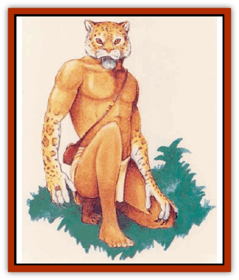

# Lycanthrope - Werejaguar - Mystara

| Statistic | **Lycanthrope, Werejaguar (Mystara)** |
| --- | --- |
| **Activity Cycle:** | Any |
| **Alignment:** | Chaotic evil |
| **Armor Class:** | 4 |
| **Climate/Terrain:** | Jungle |
| **Damage/Attack:** | 1d4 (claw)/1d4 (claw)/1d8 (bite) |
| **Diet:** | Carnivore |
| **Frequency:** | Very rare |
| **Hit Dice:** | 5+2 |
| **Intelligence:** | Low to very (5-12) |
| **Magic Resistance:** | Nil |
| **Morale:** | Elite (13) |
| **Movement:** | 18 |
| **No. Appearing:** | 1 |
| **No. of Attacks:** | 3 |
| **Organization:** | Solitary |
| **Size:** | M (6' tall in human form) |
| **Special Attacks:** | Rear claws (1d6 each), leaping |
| **Special Defenses:** | Hit only by silver or +1 or better weapons, surprise |
| **THAC0:** | 15 |
| **Treasure:** | U |
| **XP Value:** | 2,000 |

Mystarans know [[Lycanthrope_Werejaguar|werejaguars]] as the scourge of tropical rain forests: solitary, extremely effective hunters. The werejaguar has three forms: completely human, a human-jaguar hybrid, and a [[Cat_Great|jaguar]] with glowing red eyes.

In their human form, werejaguars are generally lithe, athletic folks, with long limbs and very sharp hearing. Their mood varies between quiet but alert contemplation of their surroundings to a harsh, controlled, predatory rage. In this form, werejaguars act impatient and short-tempered in cities.

In their hybrid form, werejaguars boast elongated and very muscular legs. Their torsos remain human, but also grow much more muscular. Hybrid forearms end not in human hands, but in prehensile claws. The feet feature claws, too (not shown here), enabling the creature to rake an enemy. In this catlike humanoid form, a werejaguar can walk upright or run on all fours. The hybrid has a jaguar's head - one still capable of human speech and facial expressions.

The pure jaguar form cannot speak, but does retain human mental faculties, plus the animal's bunting instincts. Only the glowing eyes indicate its lycanthropic nature.

**Combat:** Werejaguars do not simply rush headlong into attacks. Rather, these hunters stalk their prey in the wilderness and choose a moment of weakness to attack.

In their jaguar state, these lycantbropes can climb quite well; they scale trees and cliffs as thieves climb walls, with a 95% success rate. Because of their feline stealth and natural camouflage in rain forests, opponents suffer a -2 penalty to their surprise roll. A werejaguar also gains a +1 bonus on its initial attack roll when leaping from above onto prey.

In combat, the werejaguar can rake a victim with its two rear claws automatically for 1d6 hit points of damage if both front claws strike successfully that round. The creature can use this attack form in both its pure jaguar and hybrid states.

The creature can summon 1d2 normal jaguars that will arrive in 1d4 rounds. In some cases (25% likelihood), 1d4 jaguars will be with a [[Lycanthrope_General_Information|lycanthrope]] when a party encounters it. Like other werebeasts, werejaguars are hurt only by silver weapons.

**Habitat/Society:** Werejaguars have no interest in seeking out or working with their own kind. Each has its territory and almost always meets a fellow werejaguar in trouble with indifference.

True werejaguars (born to lycanthropy, not infected with it) myte only once. After producing a litter (1d8 kittens), the two split up again. The female spends a year caring for the young.

Contrary to popular lore, true werebeasts change form at will; unaffected by phases of the moon. Only infected lycanthropes unwillingly change shape during the full moon. True werejaguars cannot be "cured" of lycanthropy.

Some rain forest tribes fear werejaguars, revering them as minions of evil Immortals. Rumors tell of savage werejaguars able to cast clerical spells; these cats, witch doctors in hidden villagesm devour victims in service to their Immortals.

**Ecology:** Werejaguars hate [[Lycanthrope_Weretiger|weretigers]] with a passion, loath to share hunting ground with another feline lycanthrope. In the twilight, they enjoy hunting game, from animals to humans.

---
## Discovery & Documentation

**Source Publication:** Mystara Appendix (1994)
**Campaign Setting:** Mystara
**Author(s):** John Nephew, Teeuwynn Woodruff, John Terra, Skip Williams

### Other Creatures Found in This Source Book
   * [[Actaeon|Actaeon]]
   * [[Agarat|Agarat]]
   * [[Ash_Crawler|Ash Crawler]]
   * [[Baldandar|Baldandar]]
   * [[Bargda|Bargda]]
   * [[Bhut|Bhut]]
   * [[Bird_Mystara|Bird (Mystara)]]
   * [[Blackball|Blackball]]
   * [[Choker|Choker]]
   * [[Coltpixie|Coltpixie]]
   * [[Crone_of_Chaos|Crone of Chaos]]
   * [[Darkhood|Darkhood]]
   * [[Darkwing|Darkwing]]
   * [[Decapus|Decapus]]
   * [[Deep_Glaurant|Deep Glaurant]]
   * [[Diabolus|Diabolus]]
   * [[Dimensional_Warper|Dimensional Warper]]
   * [[Dragon_Mystara_Crystalline|Dragon (Mystara), Crystalline]]
   * [[Dragon_Mystara_Jade|Dragon (Mystara), Jade]]
   * [[Dragon_Mystara_Onyx|Dragon (Mystara), Onyx]]
   * [[Dragon_Mystara_Ruby|Dragon (Mystara), Ruby]]
   * [[Drake_Mystara|Drake (Mystara)]]
   * [[Dragonfly|Dragonfly]]
   * [[Dusanu|Dusanu]]
   * [[Elemental_of_Chaos_Air_Earth|Elemental of Chaos, Air/Earth]]
   * [[Elemental_of_Chaos_Fire_Water|Elemental of Chaos, Fire/Water]]
   * [[Elemental_of_Law_Air_Earth|Elemental of Law, Air/Earth]]
   * [[Elemental_of_Law_Fire_Water|Elemental of Law, Fire/Water]]
   * [[Familiar_Mystara|Familiar (Mystara)]]
   * [[Frost_Salamander|Frost Salamander]]
   * [[Fundamental_Air_Earth|Fundamental, Air/Earth]]
   * [[Fundamental_Fire_Water|Fundamental, Fire/Water]]
   * [[Gargantua_Mystara|Gargantua (Mystara)]]
   * [[Geonid|Geonid]]
   * [[Ghostly_Horde|Ghostly Horde]]
   * [[Giant_Athach|Giant, Athach]]
   * [[Giant_Hephaeston|Giant, Hephaeston]]
   * [[Golem_Drolem|Golem, Drolem]]
   * [[Golem_Mystara_I|Golem (Mystara) I]]
   * [[Golem_Mystara_II|Golem (Mystara) II]]
   * [[Golem_Mystara_III|Golem (Mystara) III]]
   * [[Gray_Philosopher|Gray Philosopher]]
   * [[Guardian_Warrior|Guardian Warrior]]
   * [[Gyerian|Gyerian]]
   * [[Herex|Herex]]
   * [[Hivebrood|Hivebrood]]
   * [[Horde|Horde]]
   * [[Hsiao|Hsiao]]
   * [[Huptzeen|Huptzeen]]
   * [[Hutaakan|Hutaakan]]
   * [[Imp_Mystara|Imp (Mystara)]]
   * [[Jellyfish_Giant_Mystara|Jellyfish, Giant (Mystara)]]
   * [[Kna|Kna]]
   * [[Kopru|Kopru]]
   * [[Lizard_Mystara|Lizard (Mystara)]]
   * [[Lizard-kin_Mystara|Lizard-kin (Mystara)]]
   * [[Lupin|Lupin]]
   * [[Lycanthrope_Wereswine|Lycanthrope, Wereswine]]
   * [[Magen|Magen]]
   * [[Manikin|Manikin]]
   * [[Mek|Mek]]
   * [[Mujina|Mujina]]
   * [[Nagpa|Nagpa]]
   * [[Neh-thalggu|Neh-thalggu]]
   * [[Nightshade_Mystara|Nightshade (Mystara)]]
   * [[Nuckalavee|Nuckalavee]]
   * [[Pegataur|Pegataur]]
   * [[Phanaton|Phanaton]]
   * [[Plant_Dangerous_Mystara|Plant, Dangerous (Mystara)]]
   * [[Plasm|Plasm]]
   * [[Rakasta|Rakasta]]
   * [[Rock_Man|Rock Man]]
   * [[Sabreclaw|Sabreclaw]]
   * [[Sacrol|Sacrol]]
   * [[Scamille|Scamille]]
   * [[Shapeshifter|Shapeshifter]]
   * [[Shargugh|Shargugh]]
   * [[Shark-kin|Shark-kin]]
   * [[Sollux|Sollux]]
   * [[Spectral_Death|Spectral Death]]
   * [[Spectral_Hound|Spectral Hound]]
   * [[Spider-kin|Spider-kin]]
   * [[Spirit_Mystara|Spirit (Mystara)]]
   * [[Statue_Living|Statue, Living]]
   * [[Surtaki|Surtaki]]
   * [[Tabi|Tabi]]
   * [[Thoul|Thoul]]
   * [[Thunderhead|Thunderhead]]
   * [[Tiger_Ebon|Tiger, Ebon]]
   * [[Topi|Topi]]
   * [[Tortle|Tortle]]
   * [[Vampire_Velya|Vampire, Velya]]
   * [[White_Fang|White Fang]]
   * [[Worm_Mystara|Worm (Mystara)]]
   * [[Wyrd|Wyrd]]
   * [[Yowler|Yowler]]
   * [[Zombie_Lightning|Zombie, Lightning]]
