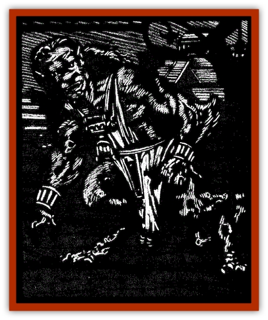

# Lycanthrope - Werejaguar - Ravenloft

| Statistic | **Lycanthrope, Werejaguar (Ravenloft)** |
| --- | --- |
| **Activity Cycle:** | Any |
| **Alignment:** | Lawful neutral |
| **Armor Class:** | 5 |
| **Climate/Terrain:** | Jungle |
| **Damage/Attack:** | 1d4/1d4/1d6 |
| **Diet:** | Carnivore |
| **Frequency:** | Rare |
| **Hit Dice:** | 5 |
| **Intelligence:** | Average to high (10-14) |
| **Magic Resistance:** | Nil |
| **Morale:** | Elite (14) |
| **Movement:** | 18 |
| **No. Appearing:** | 1, 3-18 (3d6) |
| **No. of Attacks:** | 3 |
| **Organization:** | Tribal |
| **Size:** | M |
| **Special Attacks:** | Nil |
| **Special Defenses:** | +1 or better weapon to hit |
| **THAC0:** | 15 |
| **Treasure:** | Nil (I) |
| **XP Value:** | True: 650 / Cursed: 420 |

[[Lycanthrope_Werejaguar|Werejaguars]] are lurking in the darkest hearts of jungles, usually living in and around old ruins long ago forgotten by locals. They venture from their secluded homes only to hunt and patrol their wilderness territories.

Werejaguars have but a single form, that of a hybrid humanoid/[[Cat_Great|jaguar]]. This allows the creature to walk upright like a man or on all fours for running. Their pelts are spotted like their namesake and fur covers all areas but the face and palms. Their clothing tends to be strange to most of Ravenloft's denizens, featuring brightly covered loincloths and wraps that cover a single shoulder and the chest area. Werejaguars often use tools of obsidian, but prefer their teeth and claws in combat.

In addition to the common tongue of men in their area, werejaguars speak a growling, hissing language of their own.

**Combat:** Werejaguars are silent, deadly hunters. They move through even the thickest of brush with hardly a sound and strike without warning. Because of their natural hunting prowess, anyone attacked by a werejaguar in a jungle or similar setting suffers a -3 penalty on his surprise check. Further, the creature's own keen senses of smell, hearing, and eyesight make it impossible to surprise without magical aid of some sort.

The fearsome claws of these deadly beasts are employed in a pair of slashing attacks that inflict 1d4 points of damage each. In addition, the creature can bite its enemies for 1d6 points of damage. Because they are not true cats, werejaguars have no raking attack.

As with other [[Lycanthrope_General_Information|lycanthropes]], werejaguars are immune to weapons of less than +1 enchantment. They are unafraid of silver, however, for their bane is the hard wood of the ebony tree. Weapons fashioned from this material are able to strike the creature even if they are not enchanted in any way.

Werejaguars are unusually vulnerable to fire, suffering 1 extra point of damage per die of any such attack. As such, they greatly fear flames used against them in combat. Werejaguars confronted with torches or similar flames must make a successful saving throw vs. paralysis to attack. Larger flames or multiple sources force the creatures to save with a -4 penalty. Failure prevents the creature from coming within 10 feet of the fire. If a werejaguar suffers damage from flames, it must make an immediate Morale Check with a -4 penalty or flee for 5-20 (5d4) rounds.

**Habitat/Society:** Werejaguars form tightly knit communities carefully hidden from the eyes of humanity. They do not normally hunt intelligent creatures, even those of an evil nature, but will kill those who threaten their pack without mercy.

When outsiders enter their lands, werejaguars will often hunt them for sport. A victim will be toyed with, catching only fleeting glimpses of the lightning quick cats as they dart to and fro in the jungle. This torment can continue for hours or days, depending upon how fearful the prey is. Only when the cats tire of their fun will they move in for the kill. When that happens, they strike quickly and without mercy.

Werejaguar groups of 10 or more always have a 6-Hit-Die leader. There is a 20% chance that the leader is lawful evil. If that is the case, the pack will tend to roam far outside of its territory, hunting down all sentient species it comes across.

**Ecology:** Werejaguars live on a diet of meat, usually taken from the dense jungles in which they live. In truth, many of the lycanthropes dislike the taste of sentient flesh. They say these creatures taste bitter and unhealthy.

As territorial as they are, werejaguars serve as the custodians of their jungle homes. Much as a druid or ranger character might oversee an expanse of forest of wilderness, they strike quickly against any force that might upset the balance of nature around them.

---
## Discovery & Documentation

**Source Publication:** Ravenloft Appendix III (1991)
**Campaign Setting:** Ravenloft
**Author(s):** Kirk Botulla

### Other Creatures Found in This Source Book
   * [[Akikage|Akikage]]
   * [[Animator_Common|Animator, Common]]
   * [[Animator_Greater|Animator, Greater]]
   * [[Animator_Minor|Animator, Minor]]
   * [[Animator_General_Information|Animator, General Information]]
   * [[Bakhna_Rakhna|Bakhna Rakhna]]
   * [[Baobhan_Sith|Baobhan Sith]]
   * [[Beetle_Scarab|Beetle, Scarab]]
   * [[Boneless|Boneless]]
   * [[Boowray|Boowray]]
   * [[Bruja|Bruja]]
   * [[Carrionette|Carrionette]]
   * [[Carrion_Stalker|Carrion Stalker]]
   * [[Cat_Midnight|Cat, Midnight]]
   * [[Cat_Skeletal|Cat, Skeletal]]
   * [[Cloaker_Resplendent|Cloaker, Resplendent]]
   * [[Cloaker_Shadow|Cloaker, Shadow]]
   * [[Cloaker_Undead|Cloaker, Undead]]
   * [[Corpse_Candle|Corpse Candle]]
   * [[Death's_Head_Tree|Death's Head Tree]]
   * [[Doppelganger_Ravenloft|Doppelganger (Ravenloft)]]
   * [[Familiar_Pseudo-|Familiar, Pseudo-]]
   * [[Familiar_Undead|Familiar, Undead]]
   * [[Feathered_Serpent|Feathered Serpent]]
   * [[Fenhound|Fenhound]]
   * [[Figurine_Ceramic|Figurine, Ceramic]]
   * [[Figurine_Crystal|Figurine, Crystal]]
   * [[Figurine_Ivory|Figurine, Ivory]]
   * [[Figurine_Obsidian|Figurine, Obsidian]]
   * [[Figurine_Porcelain|Figurine, Porcelain]]
   * [[Figurine_General_Information|Figurine, General Information]]
   * [[Fleas_of_Madness|Fleas of Madness]]
   * [[Furies|Furies]]
   * [[Geist|Geist]]
   * [[Ghost_Animal|Ghost, Animal]]
   * [[Golem_Flesh_Ravenloft|Golem, Flesh (Ravenloft)]]
   * [[Golem_Mist_Ravenloft|Golem, Mist (Ravenloft)]]
   * [[Golem_Wax_Ravenloft|Golem, Wax (Ravenloft)]]
   * [[Gremishka|Gremishka]]
   * [[Hag_Spectral|Hag, Spectral]]
   * [[Head_Hunter|Head Hunter]]
   * [[Hearth_Fiend|Hearth Fiend]]
   * [[Hebi-No-Onna|Hebi-No-Onna]]
   * [[Hound_Phantom|Hound, Phantom]]
   * [[Hound_Skeletal|Hound, Skeletal]]
   * [[Imp_Wishing|Imp, Wishing]]
   * [[Ivy_Crawling|Ivy, Crawling]]
   * [[Jack_Frost|Jack Frost]]
   * [[Jolly_Roger|Jolly Roger]]
   * [[Kizoku|Kizoku]]
   * [[Lashweed|Lashweed]]
   * [[Leech_Magical|Leech, Magical]]
   * [[Leech_Psionic|Leech, Psionic]]
   * [[Lich_Defiler|Lich, Defiler]]
   * [[Lich_Drow|Lich, Drow]]
   * [[Lich_Elemental|Lich, Elemental]]
   * [[Lich_Psionic|Lich, Psionic]]
   * [[Living_Tattoo|Living Tattoo]]
   * [[Lycanthrope_Loup-garou|Lycanthrope, Loup-garou]]
   * [[Lycanthrope_Werejackal|Lycanthrope, Werejackal]]
   * [[Lycanthrope_Wereleopard|Lycanthrope, Wereleopard]]
   * [[Lycanthrope_Wereray|Lycanthrope, Wereray]]
   * [[Mist_Ferryman|Mist Ferryman]]
   * [[Moor_Man|Moor Man]]
   * [[Obedient|Obedient]]
   * [[Odem|Odem]]
   * [[Paka|Paka]]
   * [[Plant_Blood_Rose|Plant, Blood Rose]]
   * [[Plant_Fearweed|Plant, Fearweed]]
   * [[Radiant_Spirit|Radiant Spirit]]
   * [[Recluse|Recluse]]
   * [[Remnant_Aquatic|Remnant, Aquatic]]
   * [[Rushlight|Rushlight]]
   * [[Sea_Spawn_Master|Sea Spawn, Master]]
   * [[Sea_Spawn_Minion|Sea Spawn, Minion]]
   * [[Shadow_Asp|Shadow Asp]]
   * [[Shattered_Brethren|Shattered Brethren]]
   * [[Skeleton_Archer|Skeleton, Archer]]
   * [[Skeleton_Insectoid|Skeleton, Insectoid]]
   * [[Skin_Thief|Skin Thief]]
   * [[Spirit_Psionic|Spirit, Psionic]]
   * [[Strahd_Skeleton|Strahd Skeleton]]
   * [[Strahd_Zombie|Strahd Zombie]]
   * [[Unicorn_Shadow|Unicorn, Shadow]]
   * [[Vampire_Drow|Vampire, Drow]]
   * [[Vampire_Nosferatu|Vampire, Nosferatu]]
   * [[Vampire_Oriental|Vampire, Oriental]]
   * [[Virus_General_Information|Virus, General Information]]
   * [[Virus_I|Virus I]]
   * [[Virus_II|Virus II]]
   * [[Virus_III|Virus III]]
   * [[Vorlog|Vorlog]]
   * [[Will_O'Dawn|Will O'Dawn]]
   * [[Will_O'Deep|Will O'Deep]]
   * [[Will_O'Mist|Will O'Mist]]
   * [[Will_O'Sea|Will O'Sea]]
   * [[Zombie_Cannibal|Zombie, Cannibal]]
   * [[Zombie_Desert|Zombie, Desert]]
   * [[Zombie_Wolf|Zombie Wolf]]
   * [[Zombie_Fog|Zombie Fog]]
