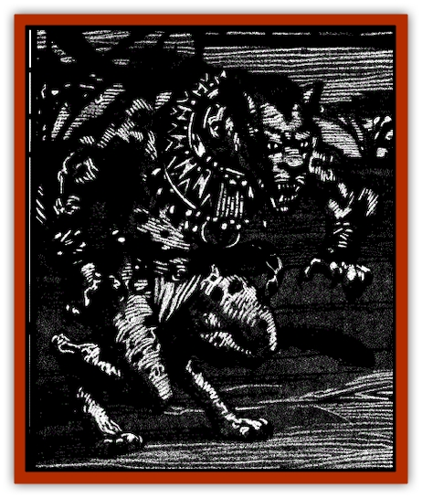

# Lycanthrope - Wereleopard

| Statistic | **Lycanthrope, Wereleopard** |
| --- | --- |
| **Activity Cycle:** | Any |
| **Alignment:** | Lawful neutral to evil |
| **Armor Class:** | 5 |
| **Climate/Terrain:** | Arid prairies and mountains |
| **Damage/Attack:** | 1d4/1d4/1d6 |
| **Diet:** | Carnivore |
| **Frequency:** | Uncommon |
| **Hit Dice:** | 5 |
| **Intelligence:** | Low to high (5-14) |
| **Magic Resistance:** | Nil |
| **Morale:** | Steady (12) |
| **Movement:** | 18 |
| **No. Appearing:** | 3-18 (3d6) |
| **No. of Attacks:** | 3 |
| **Organization:** | Tribal |
| **Size:** | M |
| **Special Attacks:** | Hamstring |
| **Special Defenses:** | Nil |
| **THAC0:** | 15 |
| **Treasure:** | K (I) |
| **XP Value:** | True: 650 / Cursed: 420 |

Wereleopards are a race of ferocious hunters. They tend to keep to tilemselves until led by the [[Paka|paka]], an intelligent race of humanoid cat people. Under the influence of that evil race, they are often involved in sinister arts against the folk of the realm.

Wereleopards have only one form, a feline and a human. The creature can almost a direct cross between fight from all fours or upright as it chooses. Either way, its terrible claws can rake foes while its powerful jaws lock in on the prey's throat. They dislike clothing, but have a thick spotted coat that protects them from the elements. Female leopards are almost exclusively black with slightly lighter spots throughout. Males have orange fur with black spots.

Wereleopards speak their own language, a growling tongue almost impossible for men to learn, as well as that of the paka. They disdain the languages of men and never learn to speak them.

**Combat:** Wereleopards are faster than other [[Lycanthrope_General_Information|lycanthropes]], and they use this speed to great advantage in combat. Their favored attack form is to race behind a fleeing foe and bite at the tendons in the back of the leg. When it strikes in this way, the creature receives a +4 bonus to its attack roll (in lieu of the normal +2 for a rear attack). Any modified roll of 18 of better which strikes the target indicates that the victim becomes painfully hobbled until healed. While so injured, the victim can move at only half its normal rate. Whether of not the victim was hobbled, the attack does its usual 1d6 points of damage.

Once the prey has been slowed, the wereleopards circle as a pack and try to herd them in one direction or another. As the targets become separated and confused, the creatures close in for a quick and violent kill. Only after the entire group of prey has been slaughtered will the pack allow itself to return for the least.

Wereleopards can only be hit by silver or magical weapons of +1 or better, or by magic, acid, fire, or other special attacks. If unable to employ its preferred method of attack, the wereleopard will tend to avoid combat. If that is not possible, the creature slashes with its claws, making two attacks for 1d4 points of damage each, and bites at its victim, inflicting 1d6 points of damage with a successful attack.

Their only real weakness is their fear of lightning. When confronted with natural or magical lightning, they must make an immediate Morale Check with a -4 penalty or flee for 5-20 (5d4) rounds. Loud noises that resemble thunderclaps also frighten them and require a Morale Check, although a +4 bonus is allowed in this case.

**Habitat/Society:** Wereleopards come from a hot, arid place where stark mountains rise majestically above vast plains. In Ravenloft, they usually settle in areas similar in appearance and temperature. On their world, the creatures were true leopards who were led into acts of evil by an unknown creature. When they made their way to the Demiplane of Dread, they were cursed with lycanthropy and their shapes forever twisted. Only 40% of wereleopards are true lycanthropes, and only they are capable of transmitting lycanthropy to their victims.

Cursed wereleopards, those who are not true lycanthropes, are often created by the pride to help defend against a particular local threat, such as settlements, adventurers, or even the evil creatures that sometimes threaten them. After the curse takes effect, the victim develops near-animal intelligence and strictly follows the orders and whims of the true lycanthropes that rule the community. Unfortunately for members of this worker class, when their usefulness is at an end, so is their life.

When the full moon rises across the plains, cursed wereleopards transform back into their human shape until the sun rises the next morn. After transformation. the victim is dazed and confused. He remembers both his wereleopard pride and human life and usually attempts to flee to sort the conflicting emotions of loyalty. The leaders of the pride exploit the moment of weakness and bring them down with savage delight. The transformed humans do not last long naked and unarmed against the ferocious felines. Not all of the transformed are eaten, but most are. Some may even be allowed to escape as the others know they'll come back when the sun rises and the transformation reverses itself.

**Ecology:** Wereleopards eat strictly meat, preferably freshly killed. Their catlike origins show in every aspect of their life. They lounge in the limbs of tall trees, lick their fur clean, and even roll in the grass with the innocence of kittens. When it's time to hunt, however, few can mistake their true natures.

---
## Discovery & Documentation

**Source Publication:** Ravenloft Appendix III (1991)
**Campaign Setting:** Ravenloft
**Author(s):** Kirk Botulla

### Other Creatures Found in This Source Book
   * [[Akikage|Akikage]]
   * [[Animator_Common|Animator, Common]]
   * [[Animator_Greater|Animator, Greater]]
   * [[Animator_Minor|Animator, Minor]]
   * [[Animator_General_Information|Animator, General Information]]
   * [[Bakhna_Rakhna|Bakhna Rakhna]]
   * [[Baobhan_Sith|Baobhan Sith]]
   * [[Beetle_Scarab|Beetle, Scarab]]
   * [[Boneless|Boneless]]
   * [[Boowray|Boowray]]
   * [[Bruja|Bruja]]
   * [[Carrionette|Carrionette]]
   * [[Carrion_Stalker|Carrion Stalker]]
   * [[Cat_Midnight|Cat, Midnight]]
   * [[Cat_Skeletal|Cat, Skeletal]]
   * [[Cloaker_Resplendent|Cloaker, Resplendent]]
   * [[Cloaker_Shadow|Cloaker, Shadow]]
   * [[Cloaker_Undead|Cloaker, Undead]]
   * [[Corpse_Candle|Corpse Candle]]
   * [[Death's_Head_Tree|Death's Head Tree]]
   * [[Doppelganger_Ravenloft|Doppelganger (Ravenloft)]]
   * [[Familiar_Pseudo-|Familiar, Pseudo-]]
   * [[Familiar_Undead|Familiar, Undead]]
   * [[Feathered_Serpent|Feathered Serpent]]
   * [[Fenhound|Fenhound]]
   * [[Figurine_Ceramic|Figurine, Ceramic]]
   * [[Figurine_Crystal|Figurine, Crystal]]
   * [[Figurine_Ivory|Figurine, Ivory]]
   * [[Figurine_Obsidian|Figurine, Obsidian]]
   * [[Figurine_Porcelain|Figurine, Porcelain]]
   * [[Figurine_General_Information|Figurine, General Information]]
   * [[Fleas_of_Madness|Fleas of Madness]]
   * [[Furies|Furies]]
   * [[Geist|Geist]]
   * [[Ghost_Animal|Ghost, Animal]]
   * [[Golem_Flesh_Ravenloft|Golem, Flesh (Ravenloft)]]
   * [[Golem_Mist_Ravenloft|Golem, Mist (Ravenloft)]]
   * [[Golem_Wax_Ravenloft|Golem, Wax (Ravenloft)]]
   * [[Gremishka|Gremishka]]
   * [[Hag_Spectral|Hag, Spectral]]
   * [[Head_Hunter|Head Hunter]]
   * [[Hearth_Fiend|Hearth Fiend]]
   * [[Hebi-No-Onna|Hebi-No-Onna]]
   * [[Hound_Phantom|Hound, Phantom]]
   * [[Hound_Skeletal|Hound, Skeletal]]
   * [[Imp_Wishing|Imp, Wishing]]
   * [[Ivy_Crawling|Ivy, Crawling]]
   * [[Jack_Frost|Jack Frost]]
   * [[Jolly_Roger|Jolly Roger]]
   * [[Kizoku|Kizoku]]
   * [[Lashweed|Lashweed]]
   * [[Leech_Magical|Leech, Magical]]
   * [[Leech_Psionic|Leech, Psionic]]
   * [[Lich_Defiler|Lich, Defiler]]
   * [[Lich_Drow|Lich, Drow]]
   * [[Lich_Elemental|Lich, Elemental]]
   * [[Lich_Psionic|Lich, Psionic]]
   * [[Living_Tattoo|Living Tattoo]]
   * [[Lycanthrope_Loup-garou|Lycanthrope, Loup-garou]]
   * [[Lycanthrope_Werejackal|Lycanthrope, Werejackal]]
   * [[Lycanthrope_Werejaguar_Ravenloft|Lycanthrope, Werejaguar (Ravenloft)]]
   * [[Lycanthrope_Wereray|Lycanthrope, Wereray]]
   * [[Mist_Ferryman|Mist Ferryman]]
   * [[Moor_Man|Moor Man]]
   * [[Obedient|Obedient]]
   * [[Odem|Odem]]
   * [[Paka|Paka]]
   * [[Plant_Blood_Rose|Plant, Blood Rose]]
   * [[Plant_Fearweed|Plant, Fearweed]]
   * [[Radiant_Spirit|Radiant Spirit]]
   * [[Recluse|Recluse]]
   * [[Remnant_Aquatic|Remnant, Aquatic]]
   * [[Rushlight|Rushlight]]
   * [[Sea_Spawn_Master|Sea Spawn, Master]]
   * [[Sea_Spawn_Minion|Sea Spawn, Minion]]
   * [[Shadow_Asp|Shadow Asp]]
   * [[Shattered_Brethren|Shattered Brethren]]
   * [[Skeleton_Archer|Skeleton, Archer]]
   * [[Skeleton_Insectoid|Skeleton, Insectoid]]
   * [[Skin_Thief|Skin Thief]]
   * [[Spirit_Psionic|Spirit, Psionic]]
   * [[Strahd_Skeleton|Strahd Skeleton]]
   * [[Strahd_Zombie|Strahd Zombie]]
   * [[Unicorn_Shadow|Unicorn, Shadow]]
   * [[Vampire_Drow|Vampire, Drow]]
   * [[Vampire_Nosferatu|Vampire, Nosferatu]]
   * [[Vampire_Oriental|Vampire, Oriental]]
   * [[Virus_General_Information|Virus, General Information]]
   * [[Virus_I|Virus I]]
   * [[Virus_II|Virus II]]
   * [[Virus_III|Virus III]]
   * [[Vorlog|Vorlog]]
   * [[Will_O'Dawn|Will O'Dawn]]
   * [[Will_O'Deep|Will O'Deep]]
   * [[Will_O'Mist|Will O'Mist]]
   * [[Will_O'Sea|Will O'Sea]]
   * [[Zombie_Cannibal|Zombie, Cannibal]]
   * [[Zombie_Desert|Zombie, Desert]]
   * [[Zombie_Wolf|Zombie Wolf]]
   * [[Zombie_Fog|Zombie Fog]]
