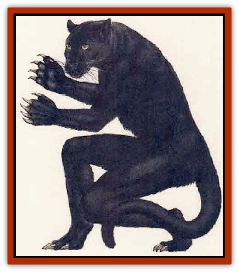

# Lycanthrope - Werepanther

| Statistic | **Lycanthrope, Werepanther** |
| --- | --- |
| **Activity Cycle:** | Any |
| **Alignment:** | Lawful evil |
| **Armor Class:** | 4 |
| **Climate/Terrain:** | Tropical hills and mountains |
| **Damage/Attack:** | By weapon (1d3/1d3/1d6 cat) |
| **Diet:** | Carnivore |
| **Frequency:** | Rare |
| **Hit Dice:** | 5+1 |
| **Intelligence:** | Very (11-12) |
| **Magic Resistance:** | Nil |
| **Morale:** | Elite (14) |
| **Movement:** | 12 (15 cat) |
| **No. Appearing:** | 1-2 (24, lair) |
| **No. of Attacks:** | 2 weapons (2 claw/l bite cat) |
| **Organization:** | Pride, tribe |
| **Size:** | M (5'4&rdquo; tall) |
| **Special Attacks:** | Scarring (rake 1d4/1d4 cat) |
| **Special Defenses:** | Silver or +1 weapons to hit |
| **THAC0:** | 15 |
| **Treasure:** | Nil (C) |
| **XP Value:** | 420 / Panther Lord: 3,000+ |

Werepanthers are a rare vanety of [[Lycanthrope_General_Information|lycanthrope]] found mainly in tropical mountains. The result of ancient juju rituals to marry the power and senses of a wild beast to a man, werepanthers serve their creator, the shaman panther lord.

Werepanthers hare a panther form, a human forni. and a humanoid form. The panther form is much like a [[Cat_Great|mountain lion]], only coal-black in color. The human form is dark-skinned and powerful, with exceptional strength and dexterity. The principal form is the humanoid form: the face is feline, the body is covered with black fur, the amber eyes are intelligent and piercing, and the fangs are sharp. This form is more massive than the human form, but lithe, and the humanoid werepanther moves with a slinking, predatory walk.

Werepathers in humanoid form can speak, but find the human tongue difficult; they tend to snarl. They can also communicate with each other and other [[Cat_Great|great cats]] in a fellne language of snarls, growls, roars and coughs.

**Combat:** In panther form. a werepanther attacks with two claws and a bite. If both claws hit, it makes two raking attacks with its rear claws. None of these attacks inflict lycanthropy.

In humanoid or human form, werepanthers typically carry cruel, black maces of jet, fashioned to resemble a clawrd panther's paw (1d8 damage), a wickedly curved hnife of the same material (1d4+1) and, if overseeing slaves, a short, barbed whip (scourge: 1d2). If a natural 20 is rolled with the scourge, the weapon strikes the opponrnt's face, with 70% chance of *scarring* (-1 to Charisma) and a 10% chance of blinding one eye. The humanoid form's strength adds +1 to weapon damage.

Werepanthers can be hurt only by silver weapons or magical weapons of at least -1 enchantment. Silver weapons inflict half damage, while magical weapons cause normal damage. At death a werepanther reverts to human form.

**Habitat/Society:** In panther form, werepanthers conform to the behavior of great cats. This form is taken for hunting and recreation. They rarely take human form, except when living among or near humans. The preferred form is the humanoid form, which they take when living in their own communities far from men. Werepanthers in all forms tend to be proud, arrogant, and somewhat unapproachable.

Werepanthers are deadly night hunters. They are catlike in their habits: aloof, mysterious, clean, clever, and cruel in playing with their prey. They are led by an individual of exceptional power, a true Ivcanthrope with the abilities of a shaman or witch doctor (see below).

Werepanthers live in isolated settlements of crude huts, surrounded by a wooden palisade if huge or gargantuan predators frequent the area. Werepanthers are slave-takers, and raid for captives to do menial labor. The typical settlement will have two to three times as many slaves as werepanthers. The werepanthers are cruel masters. They use their scourges freely to discipline and punish their slaves, rather than as weapons of war.

**Ecology:** Werepanthers are meat eaters, preferring their food uncooked and bloody. They prey upon human and humanoid tribes in their territory and claim werjaguars, weretihgers, and wemics as bitter enemies. Strong opponents taken back to the settlement to become werepanthers themselves.

---
## Discovery & Documentation

**Source Publication:** Monstrous Compendium, 1995 Annual, Volume 2 (1995)
**Campaign Setting:** Advanced Dungeons & Dragons 2nd Edition
**Author(s):** Jon Pickens

### Other Creatures Found in This Source Book
   * [[Aboleth_Savant|Aboleth, Savant]]
   * [[Addazahr|Addazahr]]
   * [[Amiq_Rasol|Amiq Rasol]]
   * [[Arch-Shadow|Arch-Shadow]]
   * [[Automaton_Scaladar|Automaton, Scaladar]]
   * [[Automaton_Trobriand's|Automaton, Trobriand's]]
   * [[Bat_Sporebat|Bat, Sporebat]]
   * [[Beetle_Dragon|Beetle, Dragon]]
   * [[Bi-nou|Bi-nou]]
   * [[Boggle|Boggle]]
   * [[Brownie_Dobie|Brownie, Dobie]]
   * [[Brownie_Quickling|Brownie, Quickling]]
   * [[Cat_Crypt|Cat, Crypt]]
   * [[Cat_Great_Cath_Shee|Cat, Great, Cath Shee]]
   * [[Centaur-kin_Dorvesh|Centaur-kin, Dorvesh]]
   * [[Centaur-kin_Gnoat|Centaur-kin, Gnoat]]
   * [[Centaur-kin_Ha'pony|Centaur-kin, Ha'pony]]
   * [[Centaur-kin_Zebranaur|Centaur-kin, Zebranaur]]
   * [[Chronolily|Chronolily]]
   * [[Curst|Curst]]
   * [[Darktentacles|Darktentacles]]
   * [[Dinosaur_Aquatic|Dinosaur, Aquatic]]
   * [[Dinosaur_II|Dinosaur II]]
   * [[Dinosaur_III|Dinosaur III]]
   * [[Doppelganger_Greater|Doppelganger, Greater]]
   * [[Dragon_Brine|Dragon, Brine]]
   * [[Dragon_Half-|Dragon, Half-]]
   * [[Dragon-kin_Sea_Wyrm|Dragon-kin, Sea Wyrm]]
   * [[Dwarf_Wild|Dwarf, Wild]]
   * [[Ekimmu|Ekimmu]]
   * [[Elemental_Nature|Elemental, Nature]]
   * [[Elf_Winged|Elf, Winged]]
   * [[Fish_Great_Glacier|Fish (Great Glacier)]]
   * [[Fish_Subterranean|Fish, Subterranean]]
   * [[Fish_Toril|Fish (Toril)]]
   * [[Flareater|Flareater]]
   * [[Flumph|Flumph]]
   * [[Froghemoth|Froghemoth]]
   * [[Ghost_Casurua|Ghost, Casurua]]
   * [[Ghost_Ker|Ghost, Ker]]
   * [[Ghul|Ghul]]
   * [[Ghul-Kin|Ghul-Kin]]
   * [[Giant_Half-giant|Giant, Half-giant]]
   * [[Golem_Burning_Man|Golem, Burning Man]]
   * [[Golem_Phantom_Flyer|Golem, Phantom Flyer]]
   * [[Gulguthhydra|Gulguthhydra]]
   * [[Hakeashar|Hakeashar]]
   * [[Horse_Moon-|Horse, Moon-]]
   * [[Human_Dragonslayer|Human, Dragonslayer]]
   * [[Human_Vistana|Human, Vistana]]
   * [[Jellyfish_Giant|Jellyfish, Giant]]
   * [[Kalin|Kalin]]
   * [[Kholiathra|Kholiathra]]
   * [[Laerti|Laerti]]
   * [[Leucrotta_Greater|Leucrotta, Greater]]
   * [[Lich_Suel|Lich, Suel]]
   * [[Lurker_Shadow|Lurker, Shadow]]
   * [[Lycanthrope_Wereshark|Lycanthrope, Wereshark]]
   * [[Mammal_Herd_II|Mammal, Herd II]]
   * [[Marl|Marl]]
   * [[Meenlock|Meenlock]]
   * [[Mimic_Greater|Mimic, Greater]]
   * [[Mold_II|Mold II]]
   * [[Mummy_Creature|Mummy, Creature]]
   * [[Nyth|Nyth]]
   * [[Ooze_Slime_Jelly_Ghaunadan|Ooze/Slime/Jelly, Ghaunadan]]
   * [[Palimpsest|Palimpsest]]
   * [[Peltast|Peltast]]
   * [[Plant_Dangerous_II|Plant, Dangerous II]]
   * [[Pleistocene_Animal|Pleistocene Animal]]
   * [[Pudding_Subterranean|Pudding, Subterranean]]
   * [[Raggamoffyn|Raggamoffyn]]
   * [[Snake_Serpent|Snake, Serpent]]
   * [[Snake_Serpent_Vine|Snake, Serpent Vine]]
   * [[Sphinx_Draco-|Sphinx, Draco-]]
   * [[Sprite_Seelie_Faerie|Sprite, Seelie Faerie]]
   * [[Sprite_Unseelie_Faerie|Sprite, Unseelie Faerie]]
   * [[Squealer|Squealer]]
   * [[Turtle_Giant|Turtle, Giant]]
   * [[Umpleby|Umpleby]]
   * [[Vizier's_Turban|Vizier's Turban]]
   * [[Wall_Walker|Wall Walker]]
   * [[Webbird|Webbird]]
   * [[Yak-Man|Yak-Man]]
   * [[Zorbo|Zorbo]]
