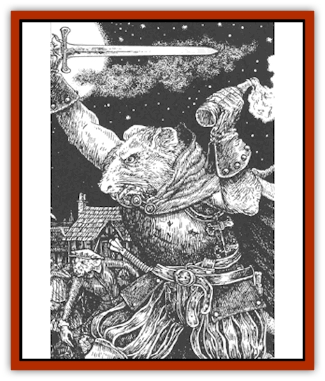
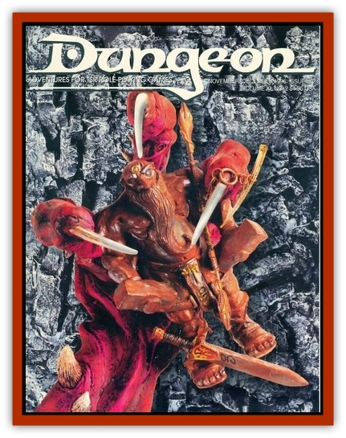

# Lycanthrope - Wererat Lord

| Statistic | **Lycanthrope, Wererat Lord** |
| --- | --- |
| **Activity Cycle:** | Night |
| **Alignment:** | Chaotic evil |
| **Armor Class:** | 6 or better |
| **Climate/Terrain:** | Any |
| **Damage/Attack:** | By weapon |
| **Diet:** | Scavenger |
| **Frequency:** | Very rare |
| **Hit Dice:** | 3+1 or better |
| **Intelligence:** | High to genius (13-18) |
| **Magic Resistance:** | Nil |
| **Morale:** | Elite (13-14) |
| **Movement:** | 12 |
| **No. Appearing:** | 4-24 |
| **No. of Attacks:** | 1 |
| **Organization:** | Pack |
| **Size:** | S-M (3-6') |
| **Special Attacks:** | Surprise |
| **Special Defenses:** | Hit only by silver or +1 or better weapons |
| **THAC0:** | Varies |
| **Treasure:** | C,I |
| **XP Value:** | Varies |

[[Lycanthrope_Wererat|Wererat]] lords are the aristocracy of their genotype and as such are capable of much more than ordinary lycanthropes. They generally live longer than others of their genotype who regard them as something near divine. Some wererat lords live as long as 200 years. Other lycanthrope lords are certain to exist, but their discovery has yet to be recorded. In appearance, the wererat lord is pretty indistinguishable from ordinary wererats.

**Combat:** Wererat lords differ from normal wererats in one major respect: they have no upper limit to class or Hit Dice level (except that normally dictated by race and/or class). Most wererat lords are thieves (75%) and on occasion mages (mage 10%, thief/mage 5%). Their Hit Dice and class level advance at the same rate, thus a 16th-level human wererat lord thief would attack as a 16th-level rogue in human form and as a 16 Hit Dice monster in man-rat form.
As with their mundane cousins, wererat lords prefer cold steel in combat to tooth and claw. Even better, they prefer to use missile weapons from a safe distance, or else set traps and ambushes.

Wererat lords infect their victims with the lycanthropic virus in the same way that ordinary wererats do. However infected victims of the lords are treated in the same way as ordinary lycanthropes; they cannot advance in level as the lords do. Wererat lords are born, not made, and must be sired by two wererat lords. The chance of being infected with the lycanthropic virus by a wererat lord is much higher than normal, being 2% chance per hp damage inflicted by the lord.

Wererat lords are usually lead by a clan leader who as head of his or her particular group is heir to several abilities. A clan leader can summon a pack of [[Rat|giant rats]] and can control all of the common wererats infected by him. This control is an ability to trigger the infected wererats transformation into their man-rat form, but they must be able to see him to achieve this.

**Habitat/Society:** Wererat lords live in closely knit packs trusting no one but their own immediate clan. Clan family members may conspire against each other, but they are always united against any outside enemies.

Wererat lords are attracted to cities where they can thieve and murder in comfort. They generally try to surround themselves with devoted followers such as ordinary wererats or infected victims. These followers are rarely selected for their intelligence, as they are merely expendable pawns to do the lords' dirty work. Once a city has yielded up its treasures, or becomes too hot to hold them, the wererat lords move on to the next town.

**Ecology:** Wererat lords are parasites on the parasites. Not only do they feed off humankind and steal their riches, they use their own common kind to do it. Like cuckoos, they will infest the lair of a clan of wererats or a thieves guild to provide themselves with a comfortable nest to live in. While initially beneficial, this usually spells doom for the hosts in question; the lords are only interested in themselves and think nothing of sacrificing their followers to protect their own miserable hides.

---
## Discovery & Documentation

**Source Publication:** Dungeon #62 (1997)
**Campaign Setting:** Dungeon Magazine
**Author(s):**
