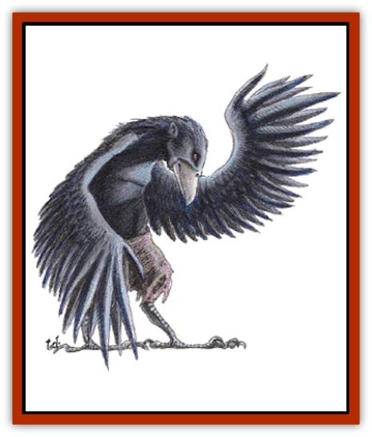

# Lycanthrope - Wereraven

| Statistic | **Lycanthrope, Wereraven** |
| --- | --- |
| **Activity Cycle:** | Day |
| **Alignment:** | Neutral good |
| **Armor Class:** | 6 |
| **Climate/Terrain:** | Temperate Woodlands |
| **Damage/Attack:** | 2-12 (2d6) |
| **Diet:** | Omnivore |
| **Frequency:** | Uncommon |
| **Hit Dice:** | 4+2 |
| **Intelligence:** | Genius (17-18) |
| **Magic Resistance:** | Nil |
| **Morale:** | Elite (13-14) |
| **Movement:** | 1, Fl 27 (C) |
| **No. Appearing:** | 2-8 (2d4) |
| **No. of Attacks:** | 1 |
| **Organization:** | Flock |
| **Size:** | M (5' tall) |
| **Special Attacks:** | See below |
| **Special Defenses:** | See below |
| **THAC0:** | 17 |
| **Treasure:** | Q&times;10 |
| **XP Value:** | 420 |

Wereravens are a race of wise and good-aligned shapechangers who seem to have migrated to Ravenloft from another realm (probably Greyhawk) centuries ago. While they are no longer found on their plane of origin, they have managed to survive in Ravenloft.

Natural wereravens have three forms, that of a normal human, a huge [[Raven_Crow|raven]], and a hybrid of the two. Infected wereravens can assume only two of the above forms. While all infected wereravens can take the human form, roughly half are able to turn into hybrids while the others can transform into huge ravens.

The hybrid form of these creatures looks much like that of a werebat. The arms grow long and thin, sprouting feathers and transforming into wings. The mouth hardens and projects into a straight, pecking beak, and the eyes turn jet black. A coat of feathers replaces the normal body hair of the human form.

**Combat:** Wereravens are deadly opponents in close combat, although they seldom engage in it. Because they can be hit only by silver weapons or those with a +2 or better magical bonus, these creatures do not fear most armed parties.

When in human form, a wereraven retains its natural immunities to certain weapons, but has no real attack of its own. If forced to fight unarmed, it inflicts a mere 1-2 points of damage. For this reason, wereravens in human form often employ weapons, doing damage appropriate to the arms they wield.

In raven form, the wereraven attacks as if it were a common example of that creature. Thus, it inflicts but 1-2 points of damage but has a 1 in 10 chance of scoring an eye peck with each successful attack. Any eye peck will cause the target to lose the use of one eye until a *heal* or *regeneration* spell can be cast on the victim. Half-blinded persons (those who have lost 1 eye) suffer a -2 on all attack rolls. A second eye peck results in total blindness until the above cure can be affected.

In hybrid form, the wereraven's arms have grown into wings, making them almost useless in combat. However, the muscles in their mouths/beaks strengthen, giving them a savage bite. Each attack made with the creature's beak inflicts 2d6 points of damage.

Anyone bitten or pecked by the wereraven has a 2% chance per point of damage inflicted of becoming an infected wereraven. Infected lycanthropes are discussed in the *Ravenloft Boxed Set*.

Wereravens are strong flyers and often use this ability to their advantage in combat.

**Habitat/Society:** A wereraven family will be found only at the heart of a dense forest. Here, they live in the hollowed out body of a great tree. Entrance to their lair is possible only from above (if one does not wish to cut or break through the trunk itself). Curiously, the wereravens are able to keep the tree in which they nest from dying even after they have hollowed it out, so it is difficult to distinguish from the normal trees around it.

Wereravens recognize that they are bastions of good in a land dominated by evil. They have managed to survive by avoiding large populations or overt acts of good that would draw the attention of the reigning lords to them. Thus, a wereraven flock will generally have no more than 2-8 adults in it. Of course, such groups have young with them (1-4 per 2 adults), but these are seldom encountered for they remain in a true raven state until they are old enough to fend for themselves. In addition, a typical wereraven lair will draw 10-100 (10d10) common ravens to nest in the trees about it. These wise birds will serve the wereravens, doing their bidding and striving to protect them from harm.

Wereravens are not opposed to helping out the cause of good in Ravenloft, but they do so reluctantly. This is not because they do not wish to do good, but because they fear the wrath of the Dark Powers. It is said that the wereravens have come to the aid of endangered [[Human_Vistana|Vistani]] clans on several occasions and that close ties exist between these two races, but neither will admit this openly.

**Ecology:** Wereravens are omnivores who prefer to maintain a vegetarian diet. They enjoy berries and nuts, but will eat carrion or kill for fresh meat from time to time in order to maintain good health.

---
## Discovery & Documentation

**Source Publication:** MC10 Ravenloft Appendix I (1989)
**Campaign Setting:** Planescape
**Author(s):** William W. Connors

### Other Creatures Found in This Source Book
   * [[Bastellus|Bastellus]]
   * [[Bat_Ravenloft|Bat (Ravenloft)]]
   * [[Bowlyn|Bowlyn]]
   * [[Broken_One|Broken One]]
   * [[Bussengeist|Bussengeist]]
   * [[Darkling|Darkling]]
   * [[Doom_Guard|Doom Guard]]
   * [[Doppelganger_Plant|Doppelganger Plant]]
   * [[Elemental_Ravenloft|Elemental (Ravenloft)]]
   * [[Ermordenung|Ermordenung]]
   * [[Ghoul_Lord|Ghoul Lord]]
   * [[Goblyn|Goblyn]]
   * [[Golem_III|Golem III]]
   * [[Golem_IV|Golem IV]]
   * [[Golem_Ravenloft|Golem (Ravenloft)]]
   * [[Grim_Reaper|Grim Reaper]]
   * [[Human_Abber_Nomad|Human, Abber Nomad]]
   * [[Human_Ravenloft|Human (Ravenloft)]]
   * [[Imp_Assassin|Imp, Assassin]]
   * [[Impersonator|Impersonator]]
   * [[Lycanthrope_Werebat|Lycanthrope, Werebat]]
   * [[Mist_Horror|Mist Horror]]
   * [[Mummy_Greater|Mummy, Greater]]
   * [[Quevari|Quevari]]
   * [[Quickwood|Quickwood]]
   * [[Ravenkin|Ravenkin]]
   * [[Reaver|Reaver]]
   * [[Scarecrow_Ravenloft|Scarecrow (Ravenloft)]]
   * [[Shadow_Fiend|Shadow Fiend]]
   * [[Skeleton_Giant|Skeleton, Giant]]
   * [[Strahd's_Skeletal_Steed|Strahd's Skeletal Steed]]
   * [[Treant_Evil|Treant, Evil]]
   * [[Treant_Undead|Treant, Undead]]
   * [[Valpurgeist|Valpurgeist]]
   * [[Vampire_Dwarf|Vampire, Dwarf]]
   * [[Vampire_Elf|Vampire, Elf]]
   * [[Vampire_Gnome|Vampire, Gnome]]
   * [[Vampire_Halfling|Vampire, Halfling]]
   * [[Vampire_General_Information|Vampire, General Information]]
   * [[Vampire_Kender|Vampire, Kender]]
   * [[Vampyre|Vampyre]]
   * [[Widow_Red|Widow, Red]]
   * [[Wolfwere_Greater|Wolfwere, Greater]]
   * [[Zombie_Lord|Zombie Lord]]
