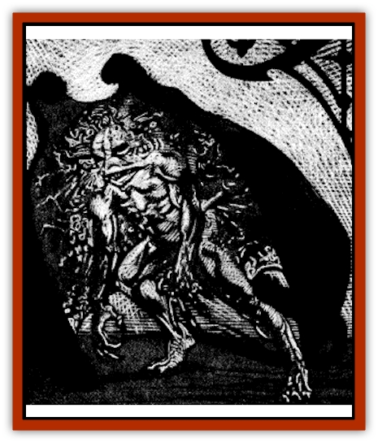

# Lycanthrope - Wereray

| Statistic | **Lycanthrope, Wereray** |
| --- | --- |
| **Activity Cycle:** | Any |
| **Alignment:** | Chaotic evil |
| **Armor Class:** | 5 |
| **Climate/Terrain:** | Sea of Sorrows |
| **Damage/Attack:** | 1d6/1d8 |
| **Diet:** | Carnivore |
| **Frequency:** | Uncommon |
| **Hit Dice:** | 5 |
| **Intelligence:** | Average (8-10) |
| **Magic Resistance:** | Nil |
| **Morale:** | Steady (11-12) |
| **Movement:** | Sw 12 |
| **No. Appearing:** | 3-18 (3d6) |
| **No. of Attacks:** | 2 |
| **Organization:** | School |
| **Size:** | M |
| **Special Attacks:** | Sting |
| **Special Defenses:** | +1 or better weqppn to hit |
| **THAC0:** | 15 |
| **Treasure:** | (D) |
| **XP Value:** | True: 650 / Cursed: 420 |

Wererays live in the warm and salty wafers of the Demiplane of Dread. They prey on fishermen and others who wander too close to the surf and sting them with their long, whiplike tails. The terrible creature then watches as its paralyzed victim drowns, feasting on the remains only after enjoying its agonizing death.

Wererays are one of the strangest [[Lycanthrope_General_Information|lycanthropes]]. From the top, they look much like giant [[Ray|manta rays]] with mammoth wings of rubbery gray skin. Underneath is the humanoid portion of the beast. The creature has arms and legs, but the legs are seemingly attached to the winged shell by tenuous membranes. The arms are free and can be used to manipulate tools or weapons. The head and the rest of the body are attached to the shell like the legs and cannot separate. The skin of the creature's head and belly is a sickly, glistening white, while the arms, legs, and sides are the same rubbery gray as the shell. The tail of the thing is long and gray, but ends in a jet black barb. Its eyes are similarly black with two dull slits of yellow for pupils.

Cursed wererays, those created by true lycanthropes, are only transformed when the moon is full. During other times, their skin takes on a slight grayness and seems rubbery and tight. The iris of the eye is always black after infection.

Wererays have no language of their own, but often speak one or more human tongues.

**Combat:** Wererays are one of the most malicious of all lycanthropes. They enjoy cursing others with their terrible condition, so only 40% of wererays encountered are true lycanthropes. The rest are stricken fishermen, unfortunate swimmers, or even unlucky sailors who happened to garner the attentions of these lurkers.

Wererays often lurk beneath a thin layer of sand, making them effectively *invisible* unless a careful search is made for the creature. When an unsuspecting victim disturbs the ray, it strikes with its whiplike, barbed tail. Anyone hit by this attack suffers 1d6 points of damage and must make a saving throw vs. poison. Failure indicates that the character has been injected with a deadly neurotoxin that not only paralysis the victim for 1d4 turns but also causes excruciating pain. A paralyzed victim will usually be left to drown. Only after it has enjoyed watching the poor creature die in this way will the wereray return to devour it.

The wereray can also deliver a dangerous bite that inflicts 1d4 points of damage. However, it seldom uses this form of attack, preferring to rely upon its deadly tail and stinger.

Like other lycanthropes, these creatures are immune to injury from weapons with less than a +1 enchantment. Arms fashioned from silver pose no special threat to them, but those made from coral or sea shells will harm them even if not enchanted in any way.

**Habitat/Society:** Wererays live in packs of 3d6 creatures in caves deep below the surface of the sea. These caverns are often filled with the bones and treasures of their prey.

They are less intelligent than most other lycanthropes, but their cunning more than makes up for it. From time to time, they construct artificial reefs and the like to wreck ships and bring them new victims.

**Ecology:** Wererays prefer to eat humanoid flesh, but fish and other sea creatures are their usual diet. Capturing prey from the surface usually consists of burying themselves beneath the sand in a shallow area and stinging anyone who ventures too close.

---
## Discovery & Documentation

**Source Publication:** Ravenloft Appendix III (1991)
**Campaign Setting:** Ravenloft
**Author(s):** Kirk Botulla

### Other Creatures Found in This Source Book
   * [[Akikage|Akikage]]
   * [[Animator_Common|Animator, Common]]
   * [[Animator_Greater|Animator, Greater]]
   * [[Animator_Minor|Animator, Minor]]
   * [[Animator_General_Information|Animator, General Information]]
   * [[Bakhna_Rakhna|Bakhna Rakhna]]
   * [[Baobhan_Sith|Baobhan Sith]]
   * [[Beetle_Scarab|Beetle, Scarab]]
   * [[Boneless|Boneless]]
   * [[Boowray|Boowray]]
   * [[Bruja|Bruja]]
   * [[Carrionette|Carrionette]]
   * [[Carrion_Stalker|Carrion Stalker]]
   * [[Cat_Midnight|Cat, Midnight]]
   * [[Cat_Skeletal|Cat, Skeletal]]
   * [[Cloaker_Resplendent|Cloaker, Resplendent]]
   * [[Cloaker_Shadow|Cloaker, Shadow]]
   * [[Cloaker_Undead|Cloaker, Undead]]
   * [[Corpse_Candle|Corpse Candle]]
   * [[Death's_Head_Tree|Death's Head Tree]]
   * [[Doppelganger_Ravenloft|Doppelganger (Ravenloft)]]
   * [[Familiar_Pseudo-|Familiar, Pseudo-]]
   * [[Familiar_Undead|Familiar, Undead]]
   * [[Feathered_Serpent|Feathered Serpent]]
   * [[Fenhound|Fenhound]]
   * [[Figurine_Ceramic|Figurine, Ceramic]]
   * [[Figurine_Crystal|Figurine, Crystal]]
   * [[Figurine_Ivory|Figurine, Ivory]]
   * [[Figurine_Obsidian|Figurine, Obsidian]]
   * [[Figurine_Porcelain|Figurine, Porcelain]]
   * [[Figurine_General_Information|Figurine, General Information]]
   * [[Fleas_of_Madness|Fleas of Madness]]
   * [[Furies|Furies]]
   * [[Geist|Geist]]
   * [[Ghost_Animal|Ghost, Animal]]
   * [[Golem_Flesh_Ravenloft|Golem, Flesh (Ravenloft)]]
   * [[Golem_Mist_Ravenloft|Golem, Mist (Ravenloft)]]
   * [[Golem_Wax_Ravenloft|Golem, Wax (Ravenloft)]]
   * [[Gremishka|Gremishka]]
   * [[Hag_Spectral|Hag, Spectral]]
   * [[Head_Hunter|Head Hunter]]
   * [[Hearth_Fiend|Hearth Fiend]]
   * [[Hebi-No-Onna|Hebi-No-Onna]]
   * [[Hound_Phantom|Hound, Phantom]]
   * [[Hound_Skeletal|Hound, Skeletal]]
   * [[Imp_Wishing|Imp, Wishing]]
   * [[Ivy_Crawling|Ivy, Crawling]]
   * [[Jack_Frost|Jack Frost]]
   * [[Jolly_Roger|Jolly Roger]]
   * [[Kizoku|Kizoku]]
   * [[Lashweed|Lashweed]]
   * [[Leech_Magical|Leech, Magical]]
   * [[Leech_Psionic|Leech, Psionic]]
   * [[Lich_Defiler|Lich, Defiler]]
   * [[Lich_Drow|Lich, Drow]]
   * [[Lich_Elemental|Lich, Elemental]]
   * [[Lich_Psionic|Lich, Psionic]]
   * [[Living_Tattoo|Living Tattoo]]
   * [[Lycanthrope_Loup-garou|Lycanthrope, Loup-garou]]
   * [[Lycanthrope_Werejackal|Lycanthrope, Werejackal]]
   * [[Lycanthrope_Werejaguar_Ravenloft|Lycanthrope, Werejaguar (Ravenloft)]]
   * [[Lycanthrope_Wereleopard|Lycanthrope, Wereleopard]]
   * [[Mist_Ferryman|Mist Ferryman]]
   * [[Moor_Man|Moor Man]]
   * [[Obedient|Obedient]]
   * [[Odem|Odem]]
   * [[Paka|Paka]]
   * [[Plant_Blood_Rose|Plant, Blood Rose]]
   * [[Plant_Fearweed|Plant, Fearweed]]
   * [[Radiant_Spirit|Radiant Spirit]]
   * [[Recluse|Recluse]]
   * [[Remnant_Aquatic|Remnant, Aquatic]]
   * [[Rushlight|Rushlight]]
   * [[Sea_Spawn_Master|Sea Spawn, Master]]
   * [[Sea_Spawn_Minion|Sea Spawn, Minion]]
   * [[Shadow_Asp|Shadow Asp]]
   * [[Shattered_Brethren|Shattered Brethren]]
   * [[Skeleton_Archer|Skeleton, Archer]]
   * [[Skeleton_Insectoid|Skeleton, Insectoid]]
   * [[Skin_Thief|Skin Thief]]
   * [[Spirit_Psionic|Spirit, Psionic]]
   * [[Strahd_Skeleton|Strahd Skeleton]]
   * [[Strahd_Zombie|Strahd Zombie]]
   * [[Unicorn_Shadow|Unicorn, Shadow]]
   * [[Vampire_Drow|Vampire, Drow]]
   * [[Vampire_Nosferatu|Vampire, Nosferatu]]
   * [[Vampire_Oriental|Vampire, Oriental]]
   * [[Virus_General_Information|Virus, General Information]]
   * [[Virus_I|Virus I]]
   * [[Virus_II|Virus II]]
   * [[Virus_III|Virus III]]
   * [[Vorlog|Vorlog]]
   * [[Will_O'Dawn|Will O'Dawn]]
   * [[Will_O'Deep|Will O'Deep]]
   * [[Will_O'Mist|Will O'Mist]]
   * [[Will_O'Sea|Will O'Sea]]
   * [[Zombie_Cannibal|Zombie, Cannibal]]
   * [[Zombie_Desert|Zombie, Desert]]
   * [[Zombie_Wolf|Zombie Wolf]]
   * [[Zombie_Fog|Zombie Fog]]
