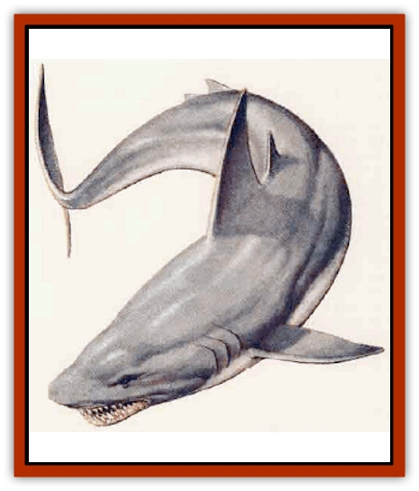

# Lycanthrope - Wereshark

| Statistic | **Lycanthrope, Wereshark** |
| --- | --- |
| **Activity Cycle:** | Any |
| **Alignment:** | Neutral evil |
| **Armor Class:** | 0 |
| **Climate/Terrain:** | Any ocean |
| **Damage/Attack:** | 5d4 |
| **Diet:** | Carnivore |
| **Frequency:** | Verv rare |
| **Hit Dice:** | 10+3 |
| **Intelligence:** | Low to Exceptional (5-16) |
| **Magic Resistance:** | Silver or +1 weapon to hit |
| **Morale:** | Steady (11) |
| **Movement:** | 12, sw 18 |
| **No. Appearing:** | 1 |
| **No. of Attacks:** | 1 bite |
| **Organization:** | Solitary |
| **Size:** | L (20' long) |
| **Special Attacks:** | Surprise, swallow |
| **Special Defenses:** | Nil |
| **THAC0:** | 9 |
| **Treasure:** | Nil (W; see below) |
| **XP Value:** | 4,000 |

The wereshark is an avaricious hybrid of man and [[Shark|shark]]. These huge predators destroy large caches of fish (and fishermen) and have been known to attack nearly any form of aquatic life, including the intelligent races such as [[Triton|tritons]], [[Elf_Aquatic|sea elves]], and [[Merman|mermen]].

The wereshark is a huge, muscular brute when in human form, and it takes the form of a great white shark when transformed. Cruel and arrogant in its human form, a wereshark is even more vicious in its shark form.

Weresharks can communicate with and command ordinary sharks (35% chance).

**Combat:** In human form, weresharks tend to use their inordinate strength (18 to 18/00) to savagely attack people hand-to-hand; with an attack roll of 20, weresharks can rip an arm off grappled opponents (those held for one round). If outnumbered by more than three to one or attacked with weapons, weresharks create distractions and quickly abandon the encounter, fleeing toward water and transforming to shark form for an easy getaway.

When entering combat in the water, a wereshark swims beneath its opponent to have a clear attack on its victim's legs. The wereshark knows its enemies will find this attack nearly impossible to predict or defend against (surprise rolls at 4). Wereshark bites cause 5d4 points of damage and result in a number of severe gashes. Weresharks do not lock their jaws on their prey, but either gnaw and bite at their leisure or swallow their prey whole.

If the attack is successful and exceeds the minimum roll to hit by 5 or more, the wereshark engulfs its victim in its jaws and swallows him or her whole; for example, a wereshark needs an attack roll 5 to hit a [[Selkie|selkie]] (AC 5) and can swallow it whole with an attack roll of of 10 or more. In its stomach, a swallowed creature suffers 15 points of damage per round; if armed with an edged weapon, the victim can attempt to cut himself or herself free (attacks at cumulative -1 penalties per round until free or dead) but the wereshark must lose more than 50% of its hit points before the victim is free.

A wereshark is affected only by silver or enchanted weapons. All others are either deflected off the skin or slice harmlessly through the outer skin, causing a flesh wound that heals immediately. Attacks from within (by swallowed victims) can be made with any edged weapons, but the difficulty of movement within the wereshark's stomach still make THAC0 rolls necessary against an Armor Class of 5.

In human form, weresharks can breathe underwater for on hour. If they do not get air after this time, they suffer 1d10 points of damage per round until they drown, breathe real air, or transform into their shark forms.

**Habitat/Society:** Human weresharks are primarily solitary creatures in either form. Occasionally, they might cooperate on a limited basis with each other, with [[Sahuagin|sahuagin]], or with priests of various evil sea gods, but these instances are quite rare. Weresharks are, first and foremost, individualists out for their own gain.

The wereshark typically has an entourage of several common sharks, which attack in concert with the wereshark. In heavily shark-infested waters, the scent of blood often brings swarms of sharks and whips them into a feeding frenzy. Weresharks, out of cruelty, often make passing attacks at victims simply to entice other sharks into attacking them while it waits to collect any treasures, such as magical weapons and items.

**Ecology:** Weresharks in human form tend to be maimed in some way (missing limb, eye, severe scars, or other disfigurement), though these marks are not evident when they are in shark form. Weresharks are fiercely territorial, staking claims on sunken ships or undersea caves and defending them to the death. They often plunder these areas so they can use the treasures found for their own gain above the waves.

There are also persistent rumors among the sea-dwellers of sahuagin weresharks that are treated as holy warriors and a larger than any known human weresharks (12 Hit Dice).

---
## Discovery & Documentation

**Source Publication:** City of Splendors (1994)
**Campaign Setting:** Forgotten Realms
**Author(s):** Ed Greenwood, Elain Cunningham

### Other Creatures Found in This Source Book
   * [[Curst|Curst]]
   * [[Doppelganger_Greater|Doppelganger, Greater]]
   * [[Duhlarkin|Duhlarkin]]
   * [[Gulguthhydra|Gulguthhydra]]
   * [[Hakeashar|Hakeashar]]
   * [[Leucrotta_Greater|Leucrotta, Greater]]
   * [[Nyth|Nyth]]
   * [[Ooze_Slime_Jelly_Ghaunadan|Ooze/Slime/Jelly, Ghaunadan]]
   * [[Palimpsest|Palimpsest]]
   * [[Peltast|Peltast]]
   * [[Raggamoffyn|Raggamoffyn]]
   * [[Shadowrath|Shadowrath]]
   * [[Snake_Sewerm|Snake, Sewerm]]
   * [[Watchspider|Watchspider]]
