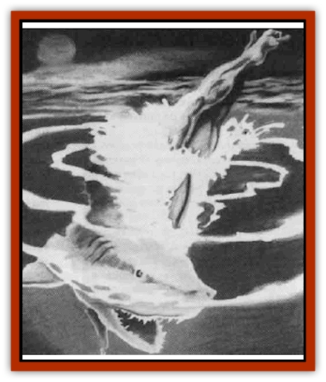
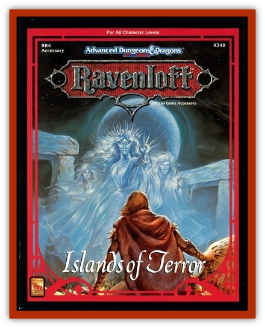

# Lycanthrope - Wereshark - Ravenloft

| Statistic | **Lycanthrope, Wereshark (Ravenloft)** |
| --- | --- |
| **Activity Cycle:** | Any |
| **Alignment:** | Neutral evil |
| **Armor Class:** | 0 |
| **Climate/Terrain:** | Any Ocean |
| **Damage/Attack:** | 5-20 or 6-24 |
| **Diet:** | Carnivore |
| **Frequency:** | Very rare |
| **Hit Dice:** | 10+3 or 12+3 |
| **Intelligence:** | Low to Exceptional (5-16) |
| **Magic Resistance:** | Nil |
| **Morale:** | Steady (11) |
| **Movement:** | 12, Sw 18 |
| **No. Appearing:** | 1 |
| **No. of Attacks:** | 1 |
| **Organization:** | Nil |
| **Size:** | L (20' long) |
| **Special Attacks:** | See following |
| **Special Defenses:** | +1 or silver weapon to hit |
| **THAC0:** | 10 or 8 |
| **Treasure:** | See following |
| **XP Value:** | 10 HD: 4,000 / 12 HD: 6,000 |

If all fishermen fear [[Shark|sharks]], they fear the [[Lycanthrope_Wereshark|wereshark]] even more so. It is an avaricious hybrid of man and shark or even worse, [[Sahuagin|sahuagin]] and shark. These huge predators destroy good catches of fish and even better men, devouring all that falls before them.

The wereshark is a huge, muscular brute in human form. It takes the form of a great white shark when transformed. Cruel in its humanoid forms, it is even more so when it assumes its shark form.

**Combat:** When entering combat, a wereshark attempts to swim beneath its opponents so it can have a clear attack on its enemies' legs. The wereshark knows its enemies will find it nearly impossible to defend themselves from its sneak attacks. If the wereshark's sneak attack is successful, it can attempt to swallow its victim. If the DM rolls more than 5 points higher than the number the wereshark needs to hit, the creature engulfs the victim in its huge jaws. In its stomach, the unfortunate enemy suffers 15 points of damage per round unless he can cut his way free. Only someone carrying a sharp-edged weapon may do so. The victim needs to reduce the wereshark to 50% of its hit points from the time it swallowed him. The victim attacks at a cumulative -1 penalty per round. For example, the victim would attack at -1 the first round, -2 the next, and so on until he is free or dead.

If the wereshark cannot engulf its enemies, it tries pass-by attacks. Since this exposes the creature to needless abuse, it tries to swallow its prey until this proves ineffective. If the swimmers take precautions against this variety of attack, it resorts to gnawing at them as it passes.

The wereshark typically has an entourage of several common sharks. These attack at the same time as the wereshark. In heavily shark-infested waters, the scent of blood may bring swarms of sharks and whip them into a frenzy.

A wereshark is affected only by silver or enchanted weapons. All others are either deflected from the skin or slice harmlessly through the outer layer of skin, which heals immediately.

**Habitat/Society:** Human weresharks are typically solitary creatures and as such do not organize themselves into societies. Occasionally, one can find them cooperating with each other or with the sahuagin, but this tends to be rare, since these creatures are mostly individualists out for their own gain.

Sahuagin weresharks, on the other hand, often work closely with their normal sahuagin contemporaries. To be a sahuagin wereshark is a great honor in sahuagin society.

All weresharks can communicate with and command, to some extent (35%), all ordinary sharks.

**Ecology:** It is extraordinarily rare to encounter a human wereshark, as very few humans actually have good relations with sharks in general. Those few who have managed to survive an attack by a wereshark tend to be maimed or crippled in their human forms, although their shark form does not reflect this. Human weresharks tend to be fiercely territorial, staking a claim on a sunken ship or cave and defending it to the death. They often plunder these areas so that they may use the treasure for their own personal gain.

In human form, weresharks can breathe underwater for one hour. If they do not get air after this time, they suffer 1d10 points of damage per round until they drown, breathe real air, or transform themselves into their shark forms.

Sahuagin weresharks are much more common. They are found as guards for the sahuagin nobles or commanding the sharks around a sahuagin city. Sahuagins that reach maturity may elect to take the tests to become weresharks. Roughly 10% survive these tests to become weresharks, and they are elevated above most normal sahuagin in their society.

Weresharks revert to their human or sahuagin forms within two rounds after death.

---
## Discovery & Documentation

**Source Publication:** RR4 Islands of Terror (1991)
**Campaign Setting:** Ravenloft
**Author(s):** Colin McComb and Scott Bennie

### Other Creatures Found in This Source Book
   * [[Marikith|Marikith]]
   * [[Mist_Ferryman|Mist Ferryman]]
   * [[Zombie_Sea|Zombie, Sea]]
