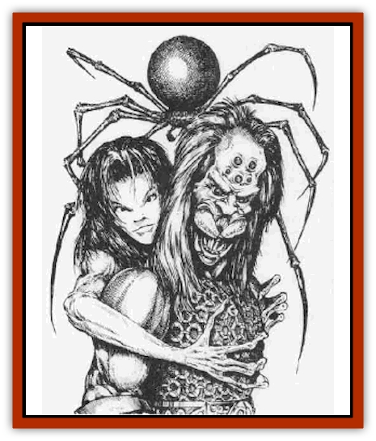

# Lycanthrope - Werespider

| Statistic | **Lycanthrope, Werespider** |
| --- | --- |
| **Activity Cycle:** | Any |
| **Alignment:** | Neutral evil |
| **Armor Class:** | 4 |
| **Climate/Terrain:** | Forest, urban |
| **Damage/Attack:** | 1d12 (1d4) |
| **Diet:** | Carnivore |
| **Frequency:** | Very rare |
| **Hit Dice:** | 5+5 |
| **Intelligence:** | Average (8-10) |
| **Magic Resistance:** | Nil |
| **Morale:** | Steady (11-12) |
| **Movement:** | 12, Wb 18 |
| **No. Appearing:** | 1 |
| **No. of Attacks:** | 1 |
| **Organization:** | Solitary |
| **Size:** | M (6' tall) or L (8' diameter) |
| **Special Attacks:** | Poison |
| **Special Defenses:** | Silver or magical weapons to hit |
| **THAC0:** | 14 |
| **Treasure:** | M, human form; (B) |
| **XP Value:** | 650 |

[[Lycanthrope_General_Information|Lycanthropic]] [[Spider|spiders]] are extremely rare; the curse of lycanthropy spell only invokes mammalian forms, not insects or arachnids. Regardless of their their origin, there exist humans who can assume the alternate form of a huge spider, and also a monstrous hybrid shape mixing both human and arachnid attributes.

In human form, there is often little to physically differentiate a werespider from his or her fellows, although some possess long spindly fingers good for grasping and climbing. When completely transformed, the werespider's body is suspended 6 feet above the ground by eight legs of sinister aspect. From 3 to 8 dull black eyes are clustered above a vicious mandibled maw designed for carnivorous eating. The bulk of its 8-foot-diameter dark body is a bloated sack covered with a coarse black fur. The hybrid form of the werespider can vary from manifestation to manifestation. A very few look normal but can manifest some spider-like abilities, but most who take on the hybrid form of these creatures grow three or more spidery eyes on their human heads while their mouths become a drooling set of mandibular monstrosities.

**Combat:** The type of attacks employed by a werespider depends upon its particular manifestation. In human form these lycanthropes utilize standard weapons to inflict damage. Often, these weapons have been pretreated with the werespider's own poison (either Type A or Type F).

In hybrid form, werespiders have a poisonous bite (Type A, save vs. poison or take 15 Points of damage within 15 minutes), can cling to walls and ceilings like a normal spider, and create webbing from spinneretes at a rate of 1 foot per round. Victims caught in the web require 1 round per point their strength is below 19 to break free (those with 19 Strength are unaffected). In hybrid form, the strength of the werespider is greatly enhanced, such that those fighting weaponless still inflict 1d4 hit points of damage from a blow or bite, and recieve a +2 bonus to hit and +4 damage bonus if using weapons.

When completely transformed into a spider, these creatures can move at a rate 18 on webs of their own manufacture. The webs a werespider spins in full spider form are stronger than the hybrid version; a successful bend bars/lift gates roll is required regardless of Strength to break free (monsters without Strength ratings use a saving throw vs paralysis if larger than man-sized, at -2, if man-sized or smaller). Their bites do 1d12 hit points of damage, and they secrete Type F poison (save vs. poison or die immediately). Those who are bitten and successfully save vs. poison from a werespider's bite (whether hybrid or spider form) are at risk of being injected with lycanthropic eggs (see Ecology).

Werespiders can be harmed only by silver or +1 or better magical weapons. Any wound inflicted by another type of weapon knits as quickly as it is inflicted with briefly visible web-like sutures.

**Habitat/Society:** Werespiders tend to live as solitary hunters of either woodlands or urbanscapes. In woodlands, their homes are often suspended high up in the boles of a large tree, securely lashed in place with sturdy web-lines. The werespider nightly checks a series of traps (huge spider webs) it has set in strategic places within the forest. For the most part, only woodland animals are caught in these traps. The occasional human caught within the sticky strands is kept or released according the wiles of the particular werespider. In cities, solitary weresuiders hunt in the same fashion as their woodland counterparts , however, they specifically prey on humans. Thos who penetrate these creatures' homes find bewebbed halls containing cocooned humans hung for "curing".

**Ecology:** Those who survive a werespider's poison stand a 30% chance to be injected with a very small egg from the werespider's egg glands, which are located in its mouth. These eggs are undetectable without a specific probe of the injury. If allowed a two-week gestation period, the egg hatches, bursting within the flesh of the victim. This releases a viscous ichor that quickly permeates the victim's blood: another werespider has just been born. Those so afflicted may not at first realize their condition, but stand a 1% cumulative chance per day thereafter to sponstanously transform. After this often traumatic experience, the werespider is able to control its transformation between human and spider form.

---
## Discovery & Documentation

**Source Publication:** Monstrous Compendium, 1996 Annual, Volume 3 (1995)
**Campaign Setting:** Advanced Dungeons & Dragons 2nd Edition
**Author(s):** Jon Pickens

### Other Creatures Found in This Source Book
   * [[Alaghi|Alaghi]]
   * [[Alhoon|Alhoon]]
   * [[Aranea_Savage_Coast|Aranea (Savage Coast)]]
   * [[Arcane_Head|Arcane Head]]
   * [[Banedead|Banedead]]
   * [[Banelich|Banelich]]
   * [[Bat_Bonebat|Bat, Bonebat]]
   * [[Beetle|Beetle]]
   * [[Belgoi|Belgoi]]
   * [[Bladeling|Bladeling]]
   * [[Braxat|Braxat]]
   * [[Bunyip|Bunyip]]
   * [[Burbur|Burbur]]
   * [[Bvanen|Bvanen]]
   * [[Cat_Great_Snow_Tiger|Cat, Great, Snow Tiger]]
   * [[Chosen_One|Chosen One]]
   * [[Chronovoid|Chronovoid]]
   * [[Cildabrin|Cildabrin]]
   * [[Coffer_Corpse|Coffer Corpse]]
   * [[Disenchanter|Disenchanter]]
   * [[Dog_Temporal|Dog, Temporal]]
   * [[Dragon_Cerilia|Dragon (Cerilia)]]
   * [[Dragon_Ghost|Dragon, Ghost]]
   * [[Dragon_Lesser_Undead|Dragon, Lesser Undead]]
   * [[Dragon_Neutral_Amber|Dragon, Neutral, Amber]]
   * [[Dread_Warrior|Dread Warrior]]
   * [[Dreamweaver|Dreamweaver]]
   * [[Dream_Spawn_Greater_Ennui|Dream Spawn, Greater, Ennui]]
   * [[Dream_Spawn_Lesser_Morph|Dream Spawn, Lesser, Morph]]
   * [[Dwarf_Arctic|Dwarf, Arctic]]
   * [[Dwarf_Urdunnir|Dwarf, Urdunnir]]
   * [[Eel_Giant_Moray|Eel, Giant Moray]]
   * [[Elemental_Fire_Kin_Tome_Guardian|Elemental, Fire Kin, Tome Guardian]]
   * [[Elf_Rockseer|Elf, Rockseer]]
   * [[Ethyk|Ethyk]]
   * [[Faerie_Faerie_Fiddler|Faerie, Faerie Fiddler]]
   * [[Faerie_Petty_Bramble|Faerie, Petty, Bramble]]
   * [[Faerie_Petty_Gorse|Faerie, Petty, Gorse]]
   * [[Faerie_Petty|Faerie, Petty]]
   * [[Firenewt|Firenewt]]
   * [[Formian|Formian]]
   * [[Gargoyle_II|Gargoyle II]]
   * [[Giant_Cerilia|Giant (Cerilia)]]
   * [[Goblin_Cerilia|Goblin (Cerilia)]]
   * [[Golem_Magic|Golem, Magic]]
   * [[Golem_Shaboath|Golem, Shaboath]]
   * [[Hag_Bheur|Hag, Bheur]]
   * [[Hamadryad|Hamadryad]]
   * [[Hound_of_Ill-Omen|Hound of Ill-Omen]]
   * [[Human_Cerilia|Human (Cerilia)]]
   * [[Hybsil|Hybsil]]
   * [[Ibrandlin|Ibrandlin]]
   * [[Imp_Chaos|Imp, Chaos]]
   * [[Ixitxachitl_Ixzan|Ixitxachitl, Ixzan]]
   * [[Jabberwock|Jabberwock]]
   * [[Kyton|Kyton]]
   * [[Kyuss_Son_of|Kyuss, Son of]]
   * [[Lillend|Lillend]]
   * [[Life-Shaped_Creation_Guardian|Life-Shaped Creation, Guardian]]
   * [[Life-Shaped_Creation_Transport|Life-Shaped Creation, Transport]]
   * [[Lycanthrope_Werecrocodile|Lycanthrope, Werecrocodile]]
   * [[Magedoom|Magedoom]]
   * [[Manotaur|Manotaur]]
   * [[Mastiff_Shadow|Mastiff, Shadow]]
   * [[Meazel|Meazel]]
   * [[Mist_Scarlet_Dancer|Mist, Scarlet Dancer]]
   * [[Needleman|Needleman]]
   * [[Orc_Neo-Orog|Orc, Neo-Orog]]
   * [[Orc_Ondonti|Orc, Ondonti]]
   * [[Owlbear_II|Owlbear II]]
   * [[Pegataur|Pegataur]]
   * [[Phaerimm|Phaerimm]]
   * [[Reggelid|Reggelid]]
   * [[Render|Render]]
   * [[Saurial|Saurial]]
   * [[Scalamagdrion|Scalamagdrion]]
   * [[Sharn|Sharn]]
   * [[Snake_Messenger|Snake, Messenger]]
   * [[Spirit_Forest_Uthraki|Spirit, Forest, Uthraki]]
   * [[Spirit_Forest_Wood_Man|Spirit, Forest, Wood Man]]
   * [[Spirit_Ice_Orglash|Spirit, Ice, Orglash]]
   * [[Spirit_Rock_Thomil|Spirit, Rock, Thomil]]
   * [[Strider_Giant|Strider, Giant]]
   * [[Tembo|Tembo]]
   * [[Temporal_Glider|Temporal Glider]]
   * [[Temporal_Stalker|Temporal Stalker]]
   * [[Tether_Beast|Tether Beast]]
   * [[Thessalmonster|Thessalmonster]]
   * [[Time_Dimensional|Time Dimensional]]
   * [[Tomb_Tapper|Tomb Tapper]]
   * [[Undead_Dragon_Slayer|Undead Dragon Slayer]]
   * [[Unicorn_Black_Toril|Unicorn, Black (Toril)]]
   * [[Vaath|Vaath]]
   * [[Vortex_Spider|Vortex Spider]]
   * [[Weredragon|Weredragon]]
   * [[Zhentarim_Spirit|Zhentarim Spirit]]
