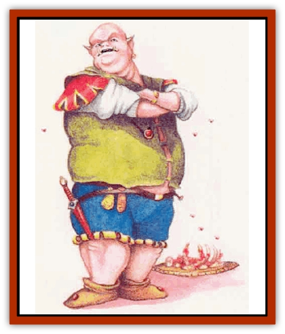

# Lycanthrope - Wereswine

| Statistic | **Lycanthrope, Wereswine** |
| --- | --- |
| **Activity Cycle:** | Any |
| **Alignment:** | Chaotic evil |
| **Armor Class:** | 3 |
| **Climate/Terrain:** | Any forest, swamp, or urban |
| **Damage/Attack:** | 1d6 (tusks) or by weapon |
| **Diet:** | Carnivore |
| **Frequency:** | Uncommon |
| **Hit Dice:** | 9 |
| **Intelligence:** | Very (11-12) |
| **Magic Resistance:** | Nil |
| **Morale:** | Champion (15) |
| **Movement:** | 18 |
| **No. Appearing:** | 1d8 |
| **No. of Attacks:** | 1 |
| **Organization:** | Herd |
| **Size:** | M (6' tall in human form) |
| **Special Attacks:** | Charm |
| **Special Defenses:** | Hit only by silver or +1 or better weapons |
| **THAC0:** | 11 |
| **Treasure:** | C |
| **XP Value:** | 2,000 |

Existing on the fringes of human settlements, wereswine appear either as huge hogs with tusks or as grossly fat humans. These [[Lycanthrope_General_Information|lycanthropes]] would seem almost ridiculous if not for their voracious hunger for human flesh and the homicidal ferocity they display in satisfying this appetite.

In their human form, wereswine are extremely fat by choice. Their appearance helps lull would-be victims into a state of incautious behaviour. In this form, the males have bald heads and no facial hair. At will, some wereswine can extend their ears and tusks to appear more piggish, as shown in the illustration above. (This parlor trick is about as commonplace as wiggling ears and rolling tongues among humans.)

In pig form, wereswine look like pink, smooth-skinned hogs of large girth. Only when victims get close enough to the mouth of such a beast do they realize it has fangs.

Wereswine take no hybrid form. Although they can shapechange freely during the night, unaffected by the moon cycle, they must keep one shape throughout the daylight hours - usually their human form.

**Combat:** Wereswine prefer indirect means of combat, relying on ambushes to throw their victims off balance. If a wereswine has gone without food for too long (two days); it casts aside all sense of tactics, rushing headlong at victims to sate its ravenous appetite.

Whether in pig or human form. all wereswine can cast a *charm person* spell three times a day. A saving throw vs. spell, though allowed, receives a -2 penalty. The creature usually resorts to this spell to snag prey quickly. As a rule, each wereswine controls 1d4-1 *charmed* humans at any given time.

In general, a wereswine in human form avoids combat, its bulk making it unsuited to fighting. In this form, a wereswine prefers to outwit its prey or even employ poisons. If pressed, however, a creature in its human form can fight with clubs, daggers, and other small weapons that do not require great force or skill to wield.

In pig form, wereswine use their large tusks to rend flesh. A favorite tactic makes good use of their low-slung profile: They lay low in dense underbrush and attack when prey walks by.

**Habitat/Society:** Wereswine fit the stereotypical role of the dirty, greedy, lazy pig. In their human form, they tend to be slow, unkempt, avaricious, and always hungry.

Many wereswine once lived as merchants or farmers, ambushed on the outskim of towns or attacked on their farms and infected with lycanthropy. Those who used to be merchants still can keep their businesses going, using their charmed victims as loyal lackeys and spies.

Wereswine feel obsessed with creature comforts such as rich food, plentiful wine, soft beds, nice furniture, and  the like. They make their lairs in comfortable cabins and manors a bit removed from the bustle of towns and cities, but close enough to civilization to keep them well fed.

The life of a wereswine is filled with decadence, and the creatures wallow in it. In fact, wereswine prefer to stay in their human state, changing into pigs only to attack or mate.

Wereswine must be in pig form to mate. The average litter consists of 2d4 piglets. The young can shapechange at six months, taking the form of fat human adolescents.

If a wereswine has been infected with lycanthropy (not born a were-creature), a special situation triggers its change into pig form. The creature must make an Intelligence check to resist. This trigger might be something like watching someone eat a large meal.

**Ecology:** Wereswine and [[Lycanthrope_Wereboar|wereboars]] are tenacious enemies; when in animal form they attack each other on sight. Each of the two porcine lycanthrope types can sense the other in human form and is likely to become belligerent. Wereswine and wereboars enjoy hunting each other for food.

---
## Discovery & Documentation

**Source Publication:** Mystara Appendix (1994)
**Campaign Setting:** Mystara
**Author(s):** John Nephew, Teeuwynn Woodruff, John Terra, Skip Williams

### Other Creatures Found in This Source Book
   * [[Actaeon|Actaeon]]
   * [[Agarat|Agarat]]
   * [[Ash_Crawler|Ash Crawler]]
   * [[Baldandar|Baldandar]]
   * [[Bargda|Bargda]]
   * [[Bhut|Bhut]]
   * [[Bird_Mystara|Bird (Mystara)]]
   * [[Blackball|Blackball]]
   * [[Choker|Choker]]
   * [[Coltpixie|Coltpixie]]
   * [[Crone_of_Chaos|Crone of Chaos]]
   * [[Darkhood|Darkhood]]
   * [[Darkwing|Darkwing]]
   * [[Decapus|Decapus]]
   * [[Deep_Glaurant|Deep Glaurant]]
   * [[Diabolus|Diabolus]]
   * [[Dimensional_Warper|Dimensional Warper]]
   * [[Dragon_Mystara_Crystalline|Dragon (Mystara), Crystalline]]
   * [[Dragon_Mystara_Jade|Dragon (Mystara), Jade]]
   * [[Dragon_Mystara_Onyx|Dragon (Mystara), Onyx]]
   * [[Dragon_Mystara_Ruby|Dragon (Mystara), Ruby]]
   * [[Drake_Mystara|Drake (Mystara)]]
   * [[Dragonfly|Dragonfly]]
   * [[Dusanu|Dusanu]]
   * [[Elemental_of_Chaos_Air_Earth|Elemental of Chaos, Air/Earth]]
   * [[Elemental_of_Chaos_Fire_Water|Elemental of Chaos, Fire/Water]]
   * [[Elemental_of_Law_Air_Earth|Elemental of Law, Air/Earth]]
   * [[Elemental_of_Law_Fire_Water|Elemental of Law, Fire/Water]]
   * [[Familiar_Mystara|Familiar (Mystara)]]
   * [[Frost_Salamander|Frost Salamander]]
   * [[Fundamental_Air_Earth|Fundamental, Air/Earth]]
   * [[Fundamental_Fire_Water|Fundamental, Fire/Water]]
   * [[Gargantua_Mystara|Gargantua (Mystara)]]
   * [[Geonid|Geonid]]
   * [[Ghostly_Horde|Ghostly Horde]]
   * [[Giant_Athach|Giant, Athach]]
   * [[Giant_Hephaeston|Giant, Hephaeston]]
   * [[Golem_Drolem|Golem, Drolem]]
   * [[Golem_Mystara_I|Golem (Mystara) I]]
   * [[Golem_Mystara_II|Golem (Mystara) II]]
   * [[Golem_Mystara_III|Golem (Mystara) III]]
   * [[Gray_Philosopher|Gray Philosopher]]
   * [[Guardian_Warrior|Guardian Warrior]]
   * [[Gyerian|Gyerian]]
   * [[Herex|Herex]]
   * [[Hivebrood|Hivebrood]]
   * [[Horde|Horde]]
   * [[Hsiao|Hsiao]]
   * [[Huptzeen|Huptzeen]]
   * [[Hutaakan|Hutaakan]]
   * [[Imp_Mystara|Imp (Mystara)]]
   * [[Jellyfish_Giant_Mystara|Jellyfish, Giant (Mystara)]]
   * [[Kna|Kna]]
   * [[Kopru|Kopru]]
   * [[Lizard_Mystara|Lizard (Mystara)]]
   * [[Lizard-kin_Mystara|Lizard-kin (Mystara)]]
   * [[Lupin|Lupin]]
   * [[Lycanthrope_Werejaguar_Mystara|Lycanthrope, Werejaguar (Mystara)]]
   * [[Magen|Magen]]
   * [[Manikin|Manikin]]
   * [[Mek|Mek]]
   * [[Mujina|Mujina]]
   * [[Nagpa|Nagpa]]
   * [[Neh-thalggu|Neh-thalggu]]
   * [[Nightshade_Mystara|Nightshade (Mystara)]]
   * [[Nuckalavee|Nuckalavee]]
   * [[Pegataur|Pegataur]]
   * [[Phanaton|Phanaton]]
   * [[Plant_Dangerous_Mystara|Plant, Dangerous (Mystara)]]
   * [[Plasm|Plasm]]
   * [[Rakasta|Rakasta]]
   * [[Rock_Man|Rock Man]]
   * [[Sabreclaw|Sabreclaw]]
   * [[Sacrol|Sacrol]]
   * [[Scamille|Scamille]]
   * [[Shapeshifter|Shapeshifter]]
   * [[Shargugh|Shargugh]]
   * [[Shark-kin|Shark-kin]]
   * [[Sollux|Sollux]]
   * [[Spectral_Death|Spectral Death]]
   * [[Spectral_Hound|Spectral Hound]]
   * [[Spider-kin|Spider-kin]]
   * [[Spirit_Mystara|Spirit (Mystara)]]
   * [[Statue_Living|Statue, Living]]
   * [[Surtaki|Surtaki]]
   * [[Tabi|Tabi]]
   * [[Thoul|Thoul]]
   * [[Thunderhead|Thunderhead]]
   * [[Tiger_Ebon|Tiger, Ebon]]
   * [[Topi|Topi]]
   * [[Tortle|Tortle]]
   * [[Vampire_Velya|Vampire, Velya]]
   * [[White_Fang|White Fang]]
   * [[Worm_Mystara|Worm (Mystara)]]
   * [[Wyrd|Wyrd]]
   * [[Yowler|Yowler]]
   * [[Zombie_Lightning|Zombie, Lightning]]
