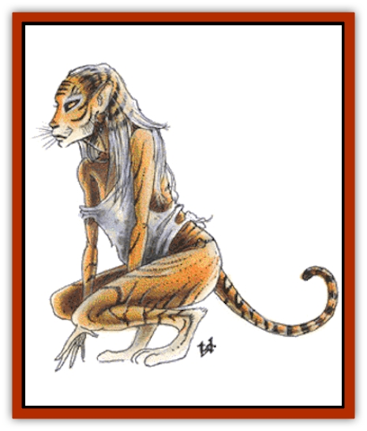

# Lycanthrope - Weretiger

| Statistic | **Lycanthrope, Weretiger** |
| --- | --- |
| **Activity Cycle:** | Nocturnal |
| **Alignment:** | Neutral |
| **Armor Class:** | 3 |
| **Climate/Terrain:** | Any wilderness |
| **Damage/Attack:** | 1-4/1-4/1-12 |
| **Diet:** | Carnivore |
| **Frequency:** | Very rare |
| **Hit Dice:** | 6+2 |
| **Intelligence:** | Average (8-10) |
| **Magic Resistance:** | Nil |
| **Morale:** | Elite (13-14) |
| **Movement:** | 12 |
| **No. Appearing:** | 1-6 |
| **No. of Attacks:** | 3 |
| **Organization:** | Solitary |
| **Size:** | M or L (6-9') |
| **Special Attacks:** | Rake for 2-5/2-5 |
| **Special Defenses:** | Hit only by silver or +1 or better magical weapon |
| **THAC0:** | 15 |
| **Treasure:** | D,Q(&times;5) |
| **XP Value:** | 975 |

Weretigers are humans, usually female, that have the ability to transform into tigerlike forms. They have a strong affinity for all felines.

The human form tends to be sleekly muscular, taller than average, and very agile. The voices of weretigers are husky and they tend to roll their r's.

The weretiger form is a hybrid between a human and a [[Cat_Great|tiger]]. It is about 25% larger than the human form, and is covered by tiger-striped hide. A 3-foot tail extends from the spine. The legs are more feline than human; this form walks on its toes. The head is also a mixture of features. The ears, nose, muzzle, and teeth are tigerlike, but the eyes and overall shape are human. If the human form's hair is long, it is still present. The fingernails grow into claws. Despite the changes, the hybrid form can pass for human at a distance if properly disguised.

The third form is that of a fully grown tiger without any trace of human features.

Weretigers speak the languages of all feline breeds, so normal felines, including the great cats, have a 75% chance of being friendly toward a weretiger. Even feline monsters have a 25% chance of being automatically friendly. However, weretigers are rarely found in the company of real tigers, being only 5% likely to be accompanied by them.

**Combat:** In either tiger form, the weretiger attacks with a variety of punches, raking claws, and bites. The weretiger's punches are so strong that they cause 1-4 points of damage. Otherwise the claws can be raked across an opponent, causing 2-5 points of damage. The teeth are the most dreadful weapon. They can tear a victim apart or crush a windpipe. Weretigers usually bite only in their full tiger form.

In human form, the weretiger uses a wide variety of weapons with which it is adept. A weretiger is also good at unarmed combat; it retains its deadly punch in this form, as well as an enhanced sense of smell and night vision.

**Habitat/Society:** For various reasons weretigresses outnumber weretigers five to one.

Weretigers travel alone or in small prides. They do not marry but have preferred mates, which may be either humans or tigers. Weretigers give birth to one or two cubs. The cubs are the hybrid form; they look like fuzzy human babies with tails. Cubs mature quickly. They can crawl within days, walk within a month, and hunt within a year. Their physical size matches that of a human child of three times the same age. At age six, they reach adolescence and gain the ability to transform into a fully human form. At age 12, they gain the ability to assume a full-tiger form; this is considered the mark of adulthood.

If a male weretiger mates with either a real tigress or human woman, the offspring initially has the same appearance as the mother. Lycanthropic transformations do not begin until the hybrid reaches adolescence.

Weretigers are omnivorous. In the wild they roam a territory of 7-10 (1d4+6) square miles. Their homes are usually near human settlements. These tend to be well kept cabins with small herb and vegetable gardens. The only livestock will be a variety of cats and some poultry.

Weretigers rarely live in confined settings such as cities or large towns because their lycanthropic nature would be hard to conceal. If found in such a setting, one or two weretigers in human form will be on an errand, such as a mission, a revel, or a simple shopping trip. In any form, weretigers are very confident and not prone to attack unless provoked.

Treasure varies widely, acquired as payment for past services, plunder from past adventures, or scavenged from the remains of past opponents. Weretigers have an affinity for gems and often keep a small cache hidden somewhere near their homes.

**Ecology:** Weretigers are the most adaptable of the [[Lycanthrope_General_Information|lycanthropes]]. They are equally at home in human, feline, or monster company.

---
## Discovery & Documentation

**Source Publication:** MC1 Volume I (w/binder #1) (1991)
**Campaign Setting:** Advanced Dungeons & Dragons 2nd Edition
**Author(s):** Jay Batista, Scott Bennie, Grant Boucher, William W. Connors, Steve Gilbert, Heike Kubasch, James Lowder, David Edward Martin, Bruce Nesmith, Jean Rabe, Rick Swan, John J. Terra, Gary L. Thomas

### Other Creatures Found in This Source Book
   * [[Bat|Bat]]
   * [[Bear|Bear]]
   * [[Behir|Behir]]
   * [[Boar|Boar]]
   * [[Bookworm|Bookworm]]
   * [[Brownie|Brownie]]
   * [[Bugbear|Bugbear]]
   * [[Carrion_Crawler|Carrion Crawler]]
   * [[Cat_Great|Cat, Great]]
   * [[Catoblepas|Catoblepas]]
   * [[Dragon_General_Information|Dragon, General Information]]
   * [[Dragonfish|Dragonfish]]
   * [[Elemental_Air_Kin_Aerial_Servant|Elemental, Air Kin, Aerial Servant]]
   * [[Elemental_Earth_Kin_Sandling|Elemental, Earth Kin, Sandling]]
   * [[Elephant|Elephant]]
   * [[Gnoll|Gnoll]]
   * [[Hobgoblin|Hobgoblin]]
   * [[Homunculus|Homunculus]]
   * [[Hornet_Giant|Hornet, Giant]]
   * [[Horse|Horse]]
   * [[Hyena|Hyena]]
   * [[Jackal|Jackal]]
   * [[Jackalwere|Jackalwere]]
   * [[Korred|Korred]]
   * [[Lich|Lich]]
   * [[Lizard|Lizard]]
   * [[Lizard_Man|Lizard Man]]
   * [[Lycanthrope_General_Information|Lycanthrope, General Information]]
   * [[Lycanthrope_Seawolf|Lycanthrope, Seawolf]]
   * [[Lycanthrope_Werebear|Lycanthrope, Werebear]]
   * [[Lycanthrope_Werewolf|Lycanthrope, Werewolf]]
   * [[Manticore|Manticore]]
   * [[Medusa|Medusa]]
   * [[Mind_Flayer|Mind Flayer]]
   * [[Minotaur|Minotaur]]
   * [[Mudman|Mudman]]
   * [[Mummy|Mummy]]
   * [[Nixie|Nixie]]
   * [[Nymph|Nymph]]
   * [[Ogre|Ogre]]
   * [[Ooze_Slime_Jelly_I|Ooze/Slime/Jelly I]]
   * [[Ooze_Slime_Jelly_II|Ooze/Slime/Jelly II]]
   * [[Orc|Orc]]
   * [[Owl|Owl]]
   * [[Owlbear_I|Owlbear I]]
   * [[Pegasus|Pegasus]]
   * [[Piercer|Piercer]]
   * [[Pudding_Deadly|Pudding, Deadly]]
   * [[Rakshasa|Rakshasa]]
   * [[Rat|Rat]]
   * [[Ray|Ray]]
   * [[Remorhaz|Remorhaz]]
   * [[Satyr|Satyr]]
   * [[Scorpion|Scorpion]]
   * [[Selkie|Selkie]]
   * [[Shadow|Shadow]]
   * [[Skeleton|Skeleton]]
   * [[Skunk|Skunk]]
   * [[Snake|Snake]]
   * [[Spectre|Spectre]]
   * [[Spider|Spider]]
   * [[Sprite|Sprite]]
   * [[Toad_Giant|Toad, Giant]]
   * [[Treant|Treant]]
   * [[Troll|Troll]]
   * [[Umber_Hulk|Umber Hulk]]
   * [[Unicorn|Unicorn]]
   * [[Vampire|Vampire]]
   * [[Wight|Wight]]
   * [[Will_O'Wisp|Will O'Wisp]]
   * [[Wolf|Wolf]]
   * [[Wolfwere|Wolfwere]]
   * [[Wraith|Wraith]]
   * [[Wyvern|Wyvern]]
   * [[Yeti|Yeti]]
   * [[Yuan-ti|Yuan-ti]]
   * [[Zombie|Zombie]]
