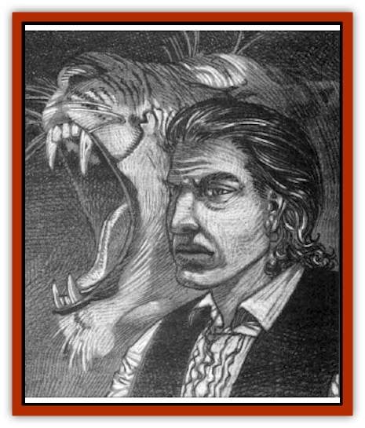

# Lycanthrope - Weretiger - Jahed

| Statistic | **Lycanthrope, Weretiger (Jahed)** |
| --- | --- |
| **Activity Cycle:** | Any (Commonly night) |
| **Alignment:** | Lawful evil |
| **Armor Class:** | 3 |
| **Climate/Terrain:** | Sri Raji |
| **Damage/Attack:** | 1-4(1d4)/1-4(1d4)/1-12(1d12) |
| **Diet:** | Carnivore |
| **Frequency:** | Very rare |
| **Hit Dice:** | 6+2 (42 hit points) |
| **Intelligence:** | Exceptional (15) |
| **Magic Resistance:** | Nil |
| **Morale:** | Fanatic (18) |
| **Movement:** | 12 |
| **No. Appearing:** | 1 |
| **No. of Attacks:** | 3 |
| **Organization:** | Pack |
| **Size:** | M (5'10&rdquo; tall) |
| **Special Attacks:** | 2-5(1d4+1)/2-5(1d4+1) |
| **Special Defenses:** | Hit only by silver or magical weapons |
| **THAC0:** | 15 |
| **Treasure:** | Q&times;5 (D) |
| **XP Value:** | 2,000 |

Jahed came into Sri Raji as a young adult. At that time, he was a specimen of physical fitness blessed with strong limbs, keen senses, and a quick mind. In the years that have passed since his arrival, the rigors of life in Ravenloft have left their mark on him. His once gentle and laughing features have hardened and become cruel. His green eyes smoulder with an anger that is constantly ready to erupt into acts of physical violence. The flowing mane of copper hair that he sported as a lad has been replaced with a savagely cropped crew cut.

Jahed prefers to wear dark clothes, for they enable him to move about in the shadows and alleys without being seen. He has spent some time in the lands of Kara-Tur, and his garb is based loosely on that of the ninjas that he met there. He carries no weapons, being well able to defend himself without them.

Jahed speaks the common tongues of the Forgotten Realms campaign setting, Kara-Tur, and Sri Raji, having learned the last since his arrival in the domain.

**Combat:** Jahed will almost always revert to his [[Lycanthrope_Weretiger|weretiger]] form before engaging in combat. In this shape, he strikes with his deadly front claws (1d4/1d4), bites with his keen fangs (1d12), and rakes with his rending rear claws (1d4+1/1d4+1). His combination of intelligence and brute force make him a deadly opponent indeed. Jahed himself is immune to attacks made with weapons that are not silver or at least bearing a +1 enchantment.

In those rare cases where Jahed is forced to engage in combat while in his human form, he will seek to disengage as quickly as possible, falling back to buy himself the time to transform into a tiger.

Jahed uses his shape-shifting ability as something of an attack in itself. When fighting untrained or easily spooked people (that is, the average peasant or green guardsman), he makes certain that his enemy sees him transform. In most cases, such people must make a morale check, if not a fear or horror check.

Jahed seldom travels anywhere without a pair of body guards. Like himself, these two will be deadly weretigers.

**Habitat/Society:** Jahed is a stranger in Sri Raji. He was born to a tribe of wanderers in the Dalelands of the Forgotten Realms. His parents were skilled entertainers and not a little bit larcenous at heart. Because he knows all the tricks and sleight of hand that they use to appear mystical and mysterious, Jahed places no stock in stories of Vistani power. On those few occasions when he meets this folk, he treats them with scorn and contempt.

Jahed's father, Mercurio, was a cruel and prying man. He delighted in the suffering of those whom they passed in their travels and, whenever it was convenient, took a hand in making such circumstances even worse. Jahed's mother, Antelucia, was timid and sickly, having been battered into submission by her abusive husband long before Jahed's birth.

When Jahed was still a teenager, he met and fell in love with a girl named Milissa. Because Milissa was an elegant young lady, Jahed was careful to avoid letting her know of his family's lowly status.

Mercurio, however, noticed his son's secret departures from their camp and decided to find out what the youngster was up to. He followed Jahed's path into the heart of a thick forest and there found the embracing lovers. Furious, he charged forward and struck Jahed with his heavy walking stick. The boy was sent spinning away from Milissa and fell to his knees.

With his son too dazed to interfere, Mercurio turned his attention to Milissa. At first he verbally abused her, questioning her virtue and demanding that she leave his son alone. He drifted into insults, calling her a tramp and a harlot, and then struck at her with his cane.

Much to his surprise, the girl nimbly avoided the blow and sprang at him. In mid-leap, she became a snarling tigress. Landing fully upon Mercurio, she snapped powerful jaws down on his windpipe and tore his abdomen open with her raking claws, killing him almost instantly.

Jahed, hearing his father's dying cry, recovered his senses enough to realize that some creature was attacking his father and rushed into the fray. Still somewhat dazed from his father's blow, he had no idea that the monster before him was actually his beloved. Drawing his slender dagger, Jahed stabbed at the tigress.

Instinctively, Milissa whirled about and ripped at him with her claws. Badly wounded, Jahed collapsed and lost consciousness. Hours later, he awoke to find himself lying beside a stream that trickled along under the stars of a cloudless autumn night, his wounds carefully tended. Nearby he found a note from Milissa explaining that she would never be able to see him again.

Jahed, whose life had been one of broken promises and harsh punishments, took the heartbreaking news well. The traumas of his life had been such that he assumed she had simply been using him for a brief fling.

In time, his wounds healed and he returned to the travelling life that he had always known. He thought no more of his lost love and devoted himself to caring for his mother. With Mercurio dead, Antelucia began to brighten and take an interest in the world around her. When she died nine months after her husband, Jahed buried her with a remorse he never felt for his father.

Three months after his mother died, on the anniversary of Mercurio's death, a strange transformation came over Jahed. He had become a weretiger. Once he overcame his surprise, over the course of the next several months Jahed fought to understand the strange legacy of his first love.

With time and effort, he found that he was able to control the metamorphosis and become a tiger whenever he wished. However, he also found that he would transform every year on the day of Mercurio's death and that nothing could cause him to resume his normal form save the taking of a human, demihuman, or humanoid life.

Over the years, Jahed's personality changed. The occasional harshness which he had inherited from his father took on a more calculating edge. Recognizing the wild and chaotic nature of Mercurio's life, he sought to give his own a sense of order. While he was unable to throw off the burden of cruelty and wickedness that was his legacy from years of mistreatment, he lifted himself above his father's brutality.

Years later, travelling through a region of thick jungles in search of an ancient treasure that was said to lie hidden there, Jahed came across a ruined temple and entered it. Inside, he found tiger mosaics, figurines, and other items that led him to believe that this place had once been sacred to others like himself.

He felt strangely awed by the ruins. Here, he felt, was a home such as he had never known in the lands of normal men. Jahed quickly made up his mind to make this place his den from that day forth. He swore to restore it to its former glory and spend the rest of his days in this tropical land.

The first night that Jahed spent in this temple, he had an unusual and terrifying dream. He found himself in the company of Ravana, the [[Rakshasa|rakshasa]] god to whom the temple had been sacred. The god charged him with the task of hunting down and destroying Arijani, the god's own son who had become a traitor to his people. The idea of serving another greater than himself had never occurred to Jahed before, but - impressed by the sheer power that seemed to engulf this ancient god - Jahed eagerly agreed and vowed not to die until the betrayer was repaid for his crimes.

He awoke to find himself in Ravenloft, in Arijani's own domain of Sri Raji. When he began to explore his new home, Jahed found himself hunted by the priestess of Kali, allies of Arijani who seek to destroy any visitor to the realm. Lucky to escape alive, he was forced to flee into the jungles as his temple was razed.

Jahed found survival difficult at first, even for someone with his great powers. Eventually, however, he learned to blend in with the natives of the domain and sought for ways to carry out his mission. For the past several years, he has devoted himself to the creation of The Stalkers, a secret society devoted to bringing down Arijani's reign. By spreading lycanthropy to a select few, he has built up a small but powerful group united by a common hatred of Kali's priestesses.

---
## Discovery & Documentation

**Source Publication:** Ravenloft Appendix II: Children of the Night (1991)
**Campaign Setting:** Ravenloft
**Author(s):** William W. Connors

### Other Creatures Found in This Source Book
   * [[Brain_Living|Brain, Living]]
   * [[Ermordenung_Nostalia_Romaine|Ermordenung, Nostalia Romaine]]
   * [[Ghoul_Ghast_Jugo_Hesketh|Ghoul, Ghast, Jugo Hesketh]]
   * [[Golem_Half-|Golem, Half-]]
   * [[Golem_Mechanical_Ahmi_Vanjuko|Golem, Mechanical, Ahmi Vanjuko]]
   * [[Human_Cursed_Jacqueline_Montarri|Human, Cursed (Jacqueline Montarri)]]
   * [[Human_Madman_The_Midnight_Slasher|Human, Madman (The Midnight Slasher)]]
   * [[Human_Voodan|Human, Voodan]]
   * [[Lich_Bardic|Lich, Bardic]]
   * [[Meazel_Salizarr|Meazel (Salizarr)]]
   * [[Medusa_Ravenloft|Medusa (Ravenloft)]]
   * [[Mummy_Greater_Senmet|Mummy, Greater, Senmet]]
   * [[Night_Hag_Styrix|Night Hag, Styrix]]
   * [[Spectre_Jezra_Wagner|Spectre, Jezra Wagner]]
   * [[Thrax_Pelik|Thrax (Pelik)]]
   * [[Treant_Evil_Blackroot|Treant, Evil (Blackroot)]]
   * [[Vampire_Eastern_Mayónaka|Vampire, Eastern (Mayónaka)]]
   * [[Vampire_Illithid_Athaekeetha|Vampire, Illithid (Athaekeetha)]]
   * [[Vampyre_Vladimir_Ludzig|Vampyre (Vladimir Ludzig)]]
