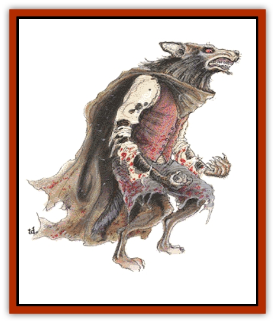

# Lycanthrope - Werewolf

| Statistic | **Lycanthrope, Werewolf** |
| --- | --- |
| **Activity Cycle:** | Nocturnal |
| **Alignment:** | Chaotic evil |
| **Armor Class:** | 5 |
| **Climate/Terrain:** | Any |
| **Damage/Attack:** | 2-8 |
| **Diet:** | Carnivore |
| **Frequency:** | Common |
| **Hit Dice:** | 4+3 |
| **Intelligence:** | Average (8-10) |
| **Magic Resistance:** | Nil |
| **Morale:** | Steady (12) |
| **Movement:** | 15 |
| **No. Appearing:** | 3-18 (3d6) |
| **No. of Attacks:** | 1 |
| **Organization:** | Pack |
| **Size:** | M (6' tall) |
| **Special Attacks:** | Nil |
| **Special Defenses:** | Hit only by silver or +1 or better magical weapon |
| **THAC0:** | 15 |
| **Treasure:** | B |
| **XP Value:** | 420 |

Werewolves are the most feared of the [[Lycanthrope_General_Information|lycanthropes]], men who can transform into wolflike beasts. They should not be confused with [[Wolfwere|wolfweres]] - [[Wolf|wolves]] who turn into men. Great enmity exists between werewolves and wolfweres.

The human forms of werewolves have no distinguishing traits. The werewolf form is equally varied. Many have a bipedal form that is a hybrid of human and lupine features. These creatures are about 1-foot taller and stronger than their human forms. The bodies are fur-covered and have short tails, wolflike legs, and heads that are combinations in varying degrees of human and lupine features.

A second form of hybrid is more wolflike, and may be mistaken for a large wolf when it runs on all four legs. This hybrid can also walk erect and has humanlike hands.

Another type of werewolf (about 20%) looks exactly like a large wolf about the size of a [[Bear|bear]]. This creature has no human features, although the eyes may glow red in the dark.

**Combat:** In their human forms, werewolves attack with a variety of weapons, generally those common to their human identity and class. In the werewolf or wolflike forms, the creature attacks with its fearsome teeth. If the form has hands, the werewolf may grab its prey for a better bite.

In the wolf form, the werewolf can be harmed only by silver or magical weapons of +1 or better. Wounds from other weapons heal too quickly to actually injure the werewolf.

Werewolves attack in packs; packs including females and young drive the adults to hit harder. If the female is attacked, the male fights at +2 to hit and does full damage with each blow. If the young are attacked, the female attacks at +3 to hit and does full damage. Cubs with 60% full growth are -4 to hit, cubs with 70% are -3 to hit, and so on. All cubs inflict 2-5 points of damage.

**Habitat/Society:** Werewolf packs roam the wilderness in search of human or other prey. True werewolves tend to be nomadic, although infected werewolves often continue to live the life to which they were accustomed. Werewolves retreat to their dens during the winter months or the years when the females are raising the helpless cubs. As humans, werewolves do not build homes, although they may take over existing dwellings, sometimes the home of past victims. Caves and burrows are the dens most commonly used in the wild. These sparsely furnished retreats are used mostly as a sleeping area and a place to store their human possessions. Many werewolf families roam the countryside in wagons, much like gypsies. In fact, this has caused many gypsies to be accused of being werewolves.

Werewolves live in packs, generally related by bloodlines. Werewolf packs of five to eight individuals are single family groups consisting of a male, female, and three to six cubs, six to nine years old. Cubs under six years old are kept in secluded dens and never encountered by hostile humans.

When pregnant, the female retreats with her mate and an older female who will act as midwife. In a very secluded area they prepare a special den that will be home for the mother and her cubs for the next six years. The female gives birth to a litter of 5-10 cubs. The cubs are born in the hybrid form; they resemble fuzzy human babies with wolflike faces. Infant mortality is high; 2-4 cubs of each litter never reach 60% growth. Cubs grow at the same rate as humans for their first five years. By the sixth year they attain 60% of their full growth. At this point they develop the ability to transform into their other forms. Each following year brings an increase of an additional 10% growth. Werewolves are considered mature at age 10.

If a werewolf mates with a woman, the offspring is completely human. The temperament reflects the father; such children are violent, combative, and prone to mental illness. There is a 10% chance each year from the onset of adolescence that such a child will spontaneously transform into a true werewolf.

**Ecology:** Werewolves are a peculiar hybrid of human and lupine personalities. They are savage killers, yet they are devoted to their close-knit families. Werewolves are hostile toward lycanthropes who oppose them, especially [[Lycanthrope_Werebear|werebears]].

---
## Discovery & Documentation

**Source Publication:** MC1 Volume I (w/binder #1) (1991)
**Campaign Setting:** Advanced Dungeons & Dragons 2nd Edition
**Author(s):** Jay Batista, Scott Bennie, Grant Boucher, William W. Connors, Steve Gilbert, Heike Kubasch, James Lowder, David Edward Martin, Bruce Nesmith, Jean Rabe, Rick Swan, John J. Terra, Gary L. Thomas

### Other Creatures Found in This Source Book
   * [[Bat|Bat]]
   * [[Bear|Bear]]
   * [[Behir|Behir]]
   * [[Boar|Boar]]
   * [[Bookworm|Bookworm]]
   * [[Brownie|Brownie]]
   * [[Bugbear|Bugbear]]
   * [[Carrion_Crawler|Carrion Crawler]]
   * [[Cat_Great|Cat, Great]]
   * [[Catoblepas|Catoblepas]]
   * [[Dragon_General_Information|Dragon, General Information]]
   * [[Dragonfish|Dragonfish]]
   * [[Elemental_Air_Kin_Aerial_Servant|Elemental, Air Kin, Aerial Servant]]
   * [[Elemental_Earth_Kin_Sandling|Elemental, Earth Kin, Sandling]]
   * [[Elephant|Elephant]]
   * [[Gnoll|Gnoll]]
   * [[Hobgoblin|Hobgoblin]]
   * [[Homunculus|Homunculus]]
   * [[Hornet_Giant|Hornet, Giant]]
   * [[Horse|Horse]]
   * [[Hyena|Hyena]]
   * [[Jackal|Jackal]]
   * [[Jackalwere|Jackalwere]]
   * [[Korred|Korred]]
   * [[Lich|Lich]]
   * [[Lizard|Lizard]]
   * [[Lizard_Man|Lizard Man]]
   * [[Lycanthrope_General_Information|Lycanthrope, General Information]]
   * [[Lycanthrope_Seawolf|Lycanthrope, Seawolf]]
   * [[Lycanthrope_Werebear|Lycanthrope, Werebear]]
   * [[Lycanthrope_Weretiger|Lycanthrope, Weretiger]]
   * [[Manticore|Manticore]]
   * [[Medusa|Medusa]]
   * [[Mind_Flayer|Mind Flayer]]
   * [[Minotaur|Minotaur]]
   * [[Mudman|Mudman]]
   * [[Mummy|Mummy]]
   * [[Nixie|Nixie]]
   * [[Nymph|Nymph]]
   * [[Ogre|Ogre]]
   * [[Ooze_Slime_Jelly_I|Ooze/Slime/Jelly I]]
   * [[Ooze_Slime_Jelly_II|Ooze/Slime/Jelly II]]
   * [[Orc|Orc]]
   * [[Owl|Owl]]
   * [[Owlbear_I|Owlbear I]]
   * [[Pegasus|Pegasus]]
   * [[Piercer|Piercer]]
   * [[Pudding_Deadly|Pudding, Deadly]]
   * [[Rakshasa|Rakshasa]]
   * [[Rat|Rat]]
   * [[Ray|Ray]]
   * [[Remorhaz|Remorhaz]]
   * [[Satyr|Satyr]]
   * [[Scorpion|Scorpion]]
   * [[Selkie|Selkie]]
   * [[Shadow|Shadow]]
   * [[Skeleton|Skeleton]]
   * [[Skunk|Skunk]]
   * [[Snake|Snake]]
   * [[Spectre|Spectre]]
   * [[Spider|Spider]]
   * [[Sprite|Sprite]]
   * [[Toad_Giant|Toad, Giant]]
   * [[Treant|Treant]]
   * [[Troll|Troll]]
   * [[Umber_Hulk|Umber Hulk]]
   * [[Unicorn|Unicorn]]
   * [[Vampire|Vampire]]
   * [[Wight|Wight]]
   * [[Will_O'Wisp|Will O'Wisp]]
   * [[Wolf|Wolf]]
   * [[Wolfwere|Wolfwere]]
   * [[Wraith|Wraith]]
   * [[Wyvern|Wyvern]]
   * [[Yeti|Yeti]]
   * [[Yuan-ti|Yuan-ti]]
   * [[Zombie|Zombie]]
