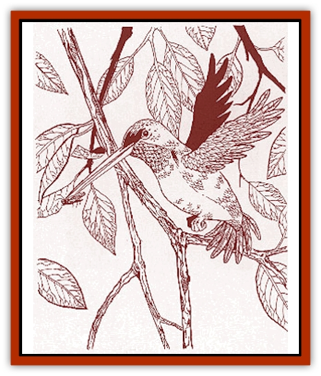

# Lyra Bird - Saragón

| Statistic | **Lyra Bird, Saragón** |
| --- | --- |
| **Activity Cycle:** | Day |
| **Alignment:** | Neutral |
| **Armor Class:** | 7 |
| **Climate/Terrain:** | Temperate or subtropical plains |
| **Damage/Attack:** | Nil |
| **Diet:** | Insectivore |
| **Frequency:** | Very rare |
| **Hit Dice:** | 1 hp |
| **Intelligence:** | Animal (1) |
| **Magic Resistance:** | Nil |
| **Morale:** | Unreliable (2-4) |
| **Movement:** | Fl 18 (A) |
| **No. Appearing:** | 1 |
| **No. of Attacks:** | 0 |
| **Organization:** | Solitary |
| **Size:** | T (4-5' long) |
| **Special Attacks:** | Spell-like abilities |
| **Special Defenses:** | Aura of protection |
| **THAC0:** | Nil |
| **Treasure:** | Nil |
| **XP Value:** | 65 |

The Saragón lyra [[Bird|bird]] is a tiny, colorful bird about the size of a hummingbird. It has a long, pointy beak which it uses to prey upon small insects, especially parasites like [[Parasite_Savage_Coast|cardinal ticks]] and [[Parasite_Savage_Coast|Inheritor lice]]. Mages of Saragón (possibly with the surreptitious aid of an Immortal) once created these beautiful birds to rid their land of parasites attracted to *cinnabryl*, Legacies, and *vermeil*. Their attempt was partially successful. The lyra bird reduces a host's parasitic infestation down to 5%, at a rate of 1% per day. The lyra bird then flies away and seeks creatures with a greater degree of infestation.

Lyra birds are brightly colored and iridescent, commonly metallic green or blue on top. The throat of the male lyra bird is often glittering red, blue, emerald-green, or greenish-bronze. The underbelly is usually white, although some lyra birds have a soft tan underbelly.

**Combat:** The lyra bird actively avoids confrontation and will flee from any threat, but it does have several defensive capabilities. As a magical creature, the lyra bird has a continual a*ura of protection from evil, 10' radius*. Three times per day, the lyra bird can also use the following spell-like abilities when it sings: *charm person*, *charm monster*, and *charm plant*. A creature that has been *charmed* by a lyra bird will defend the bird to the best of its abilities.

Unlike a normal creature encounter, no experience points are awarded for killing or "defeating" a lyra bird. Instead, people who have a significant encounter (such as hearing one sing or hosting one for a time) with a lyra bird should get the experience point award.

**Habitat/Society:** The Saragón lyra bird is usually found in the company of another creature. It is rare to see more than one lyra bird in an area, although occasionally a mated pair will share the same territory or symbiont. Mated pairs build beautiful, fragile egg-shaped nests, covered with lichens, [[Spider|spider]] webs, and small pieces of bark. Eggs are incubated only by the female. Males are slightly smaller than females, but in spite of their tiny size, they are fiercely territorial. They will do their best to chase other lyra birds out of their nesting area.

Legend states that "no man may strike another" if a lyra bird is singing within hearing distance. This is not true, but the power of belief is so strong that fights will often instantly stop if a lyra bird starts singing nearby. The lyra bird is often seen as a symbol of peace and hope.

**Ecology:** The marvelous song of the lyra bird often attracts parasite-infested creatures like [[Voat|voats]], [[Cinnavixen|cinnavixens]], [[Juhrion|juhrions]], or even sometimes a [[Voat_Herathian|Slagovich juggernaut]]. Once attracted, these creatures may develop a symbiotic relationship with the lyra bird, which relieves them of their parasitic afflictions by eating the parasites. The bird dies if deprived of its diet of parasites for a whole week.

It is thought that killing a lyra bird will bring a mild *curse* upon the culprits. Suitable *curses* include a -2 penalty to all combat rolls and saving throws or a -4 penalty to proficiency checks. The *curse* could be lifted if the victim performed an appropriate penance as directed by a high-level druid.

A lyra bird in captivity will quickly sicken and die. Killing a lyra bird in this fashion is rumored to bring a permanent, debilitating *curse* (such as the permanent and irrevocable acquisition of an Affliction).

---
## Discovery & Documentation

**Source Publication:** Monstrous Compendium Savage Coast Appendix (Online Exclusive) (1995)
**Campaign Setting:** Mystara
**Author(s):** Loren L Coleman, Ted James, Thomas Zuvich, Cindi M. Rice

### Other Creatures Found in This Source Book
   * [[Aranea_Savage_Coast|Aranea (Savage Coast)]]
   * [[Arashaeem|Arashaeem]]
   * [[Batracine|Batracine]]
   * [[Cat_Marine|Cat, Marine]]
   * [[Cinnavixen|Cinnavixen]]
   * [[Clockwork_Swordsman|Clockwork Swordsman]]
   * [[Critter_Temple|Critter, Temple]]
   * [[Cursed_One|Cursed One]]
   * [[Deathmare|Deathmare]]
   * [[Dragon_Savage_Coast_Crimson|Dragon (Savage Coast), Crimson]]
   * [[Dragon_Savage_Coast_Red_Hawk|Dragon (Savage Coast), Red Hawk]]
   * [[Echyan|Echyan]]
   * [[Ee'aar|Ee'aar]]
   * [[Enduk|Enduk]]
   * [[Fachan_Savage_Coast|Fachan (Savage Coast)]]
   * [[Feliquine|Feliquine]]
   * [[Fiend_Narvaezan|Fiend, Narvaezan]]
   * [[Frelôn|Frelôn]]
   * [[Ghriest|Ghriest]]
   * [[Glutton_Sea|Glutton, Sea]]
   * [[Goatman|Goatman]]
   * [[Golem_Naâruk|Golem, Naâruk]]
   * [[Golem_Savage_Coast|Golem (Savage Coast)]]
   * [[Grudgling|Grudgling]]
   * [[Heraldic_Servant_I|Heraldic Servant I]]
   * [[Heraldic_Servant_II|Heraldic Servant II]]
   * [[Heraldic_Servant_III|Heraldic Servant III]]
   * [[Heraldic_Servant_IV|Heraldic Servant IV]]
   * [[Heraldic_Servant_V|Heraldic Servant V]]
   * [[Heraldic_Servant_General_Information|Heraldic Servant, General Information]]
   * [[Hermit_Sea|Hermit, Sea]]
   * [[Jorri|Jorri]]
   * [[Juhrion|Juhrion]]
   * [[Kla'a-tah|Kla'a-tah]]
   * [[Leech_Legacy|Leech, Legacy]]
   * [[Lich_Inheritor|Lich, Inheritor]]
   * [[Lizard_Kin_Savage_Coast|Lizard Kin (Savage Coast)]]
   * [[Lupasus|Lupasus]]
   * [[Lupin|Lupin]]
   * [[Malfera|Malfera]]
   * [[Manscorpion_Nimmurian|Manscorpion, Nimmurian]]
   * [[Mythuínn_Folk|Mythuínn Folk]]
   * [[Neshezu|Neshezu]]
   * [[Nikt'oo|Nikt'oo]]
   * [[Nosferatu|Nosferatu]]
   * [[Omm-wa|Omm-wa]]
   * [[Omshirim|Omshirim]]
   * [[Parasite_Savage_Coast|Parasite (Savage Coast)]]
   * [[Phanaton|Phanaton]]
   * [[Plant_Savage_Coast|Plant (Savage Coast)]]
   * [[Pudding_Vermilion|Pudding, Vermilion]]
   * [[Rakasta|Rakasta]]
   * [[Ray_Forest|Ray, Forest]]
   * [[Shedu_Greater_Savage_Coast|Shedu, Greater (Savage Coast)]]
   * [[Shimmerfish|Shimmerfish]]
   * [[Skinwing|Skinwing]]
   * [[Spawn_of_Nimmur|Spawn of Nimmur]]
   * [[Spider-spy|Spider-spy]]
   * [[Spirit_Heroic|Spirit, Heroic]]
   * [[Spirit_Walleran|Spirit, Walleran]]
   * [[Succulus|Succulus]]
   * [[Swampmare|Swampmare]]
   * [[Symbiont_Shadow|Symbiont, Shadow]]
   * [[Tortle|Tortle]]
   * [[Troll_Legacy|Troll, Legacy]]
   * [[Trosip|Trosip]]
   * [[Tyminid|Tyminid]]
   * [[Utukku|Utukku]]
   * [[Voat|Voat]]
   * [[Voat_Herathian|Voat, Herathian]]
   * [[Vulturehound|Vulturehound]]
   * [[Wallara|Wallara]]
   * [[Wurmling|Wurmling]]
   * [[Wynzet|Wynzet]]
   * [[Yeshom|Yeshom]]
   * [[Zombie_Red|Zombie, Red]]
