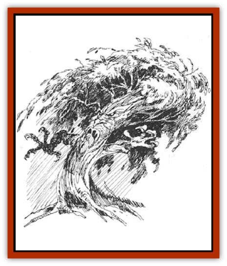

# Lyrannikin

| Statistic | **Lyrannikin** |
| --- | --- |
| **Activity Cycle:** | Any |
| **Alignment:** | Chaotic evil |
| **Armor Class:** | 0 |
| **Climate/Terrain:** | Any forest |
| **Damage/Attack:** | Variable |
| **Diet:** | Photosynthesis |
| **Frequency:** | Very rare |
| **Hit Dice:** | 7-12 |
| **Intelligence:** | Very (11-12) |
| **Magic Resistance:** | Nil |
| **Morale:** | H (13-18') |
| **Movement:** | 12 |
| **No. Appearing:** | 1 |
| **No. of Attacks:** | 2 |
| **Organization:** | Solitary |
| **Size:** | Champion (15-16) |
| **Special Attacks:** | See below |
| **Special Defenses:** | Never surprised |
| **THAC0:** | 13 (7-8 HD) / 11 (9-10 HD) / 9 (11-12 HD) |
| **Treasure:** | Q (&times;5) |
| **XP Value:** | 2,000 + 1,000 per HD above 7 HD |

Lyrannikin are [[Treant|treants]] that have become [[Treant_Evil|evil]]. This happens in a variety of ways: by magical change; the heart of a treant becoming rotted by blight; or in the case of very ancient treants, a festering hatred of those who destroy old forests, so that the treant becomes consumed by a desire for revenge that becomes indiscriminate. Lyrannikin may be physically indistinguishable from treants, but some 30% of them show obvious signs of severe blight and have rotting bark, decaying and hanging branches, and the like.

**Combat:** Lyrannikin attack with two gnarled, branchlike arms that are very powerful and inflict severe blows. Younger lyrannikin (10% of encounters) have 7-8 HD and inflict 2-16 points of damage per blow. Middle-aged lyrannikin (30% of encounters) have 9-10 HD and inflict 3-18 points of damage per blow. Elder lyrannikin (60% of encounters) have 11-12 HD and inflict 4-24 points of damage per blow. Blighted specimens inflict - 1 point of damage per die.

Like treants, lyrannikin have a low AC due to their very tough bark. Fire-based attacks against lyrannikin (e.g., a *flame blade*) are made at +4, with a + 1 damage bonus, and lyrannikin save versus tire-based spell attacks at -4. However, lyrannikin that are blighted (20% of younger, 30% of middle-aged, and 50% of elder) do not suffer these penalties against fire-based attacks, due to the wetness of their rotted tissue.

Unlike treants, lyrannikin cannot animate trees. Nonblighted lyrannikin can inflict structural damage as treants do.

**Habitat/Society:** Lyrannikin are solitary, vicious killers of intruders into their domains. They have lost their link with nature, and thus lost their ability to remain undetected in woodlands and forests also. Lyrannikin hate fire-using creatures and those who enter woodland with axe or saw. They have little treasure and have no notion of the value of gold, gems, and suchlike.

**Ecology:** All lyrannikin have some ability to photosynthesize as necessary to survive, but severely blighted specimens have sharply reduced photosynthetic ability and attempt to extract extra nutrition through their roots, often by drenching them in the blood of forest creatures. Lyrannikin sleep less than most treants, their anger and hatred driving them in a way quite alien to their good-aligned relatives. They do not reproduce.

Lyrannikin that are non-blighted have the same life span as treants; blighted specimens have shortened, but still considerable, lifespans (and are often old when they develop blight, anyway). Elder lyrannikin usually succumb to rot, blight, destruction by those who come to weed the evil presence out of the woods, or some similar cause. Treants will often try to subdue a lyrannikin or cure its blight, especially with very young or elder specimens.

It seems highly likely that the Scarlet Brotherhood has captured treants and is experimenting with the use of blights that will turn the treants to evil while not affecting their health or combat ability (no reductions to damage dice rolls). These specially-bred lyrannikin may well be being placed within the Menowood to attack the defenders of Sunndi who spy in the eastern margin of that wood; there have been several reports of young lyrannikin (an unusual occurrence) from that wood during the years of the Greyhawk Wars.

---
## Discovery & Documentation

**Source Publication:** From the Ashes (1992)
**Campaign Setting:** Greyhawk
**Author(s):** Carl Sargent

### Other Creatures Found in This Source Book
   * [[Animus|Animus]]
   * [[Dwarf_Derro|Dwarf, Derro]]
   * [[Losel|Losel]]
   * [[Thassaloss|Thassaloss]]
   * [[Varrangoin|Varrangoin]]
