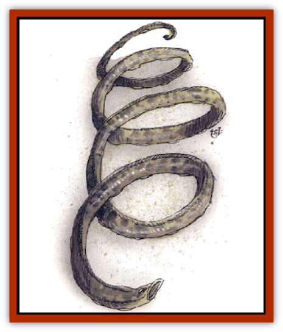

# Lythlyx

| Statistic | **Lythlyx** |
| --- | --- |
| **Activity Cycle:** | Any |
| **Alignment:** | Lawful neutral |
| **Armor Class:** | 1 |
| **Climate/Terrain:** | Any remote land or water |
| **Damage/Attack:** | See below |
| **Diet:** | Carnivore |
| **Frequency:** | Rare |
| **Hit Dice:** | 5+6 |
| **Intelligence:** | Average (8-10) |
| **Magic Resistance:** | Nil |
| **Morale:** | Elite (13-14) |
| **Movement:** | 6, Fl 12 (A), Sw 8 |
| **No. Appearing:** | 1 or 3d6 |
| **No. of Attacks:** | 1 |
| **Organization:** | Solitary or group |
| **Size:** | H (14-21' long) |
| **Special Attacks:** | See below |
| **Special Defenses:** | See below |
| **THAC0:** | 15 |
| **Treasure:** | Nil |
| **XP Value:** | 2,000 |

**Psionics Summary**

| Level | Dis/Sci/Dev | Attack/Defense | Score | PSPs |
| --- | --- | --- | --- | --- |
| 9 | 4/4/12 | PsC,II,MT,PB/M,IF,TW | 10 | 210 |

**Psychokinesis -** *Science:* create object; *Devotions:* animate object, control flames, control sound, create sound, molecular agitation.

**Psychometabolism -** *Sciences:* nil; *Devotions:* body equilibrium, suspend animation.

**Psychoportation -** *Sciences:* summon planar creature, teleport; *Devotion:* teleport trigger.

**Telepathy -** *Science:* psionic crush; *Devotions:* id insinuation, mind thrust, psionic blast, telepathic projection.

These strange, [[Eel|eel]]-like creatures are sometimes called "spirals" because of their appearance. They are almost always found in remote areas, dancing in midair or underwater. When moving they resemble spinning corkscrews, and they often dance in a particular place for year at a time. Lythlyx have long, wormlike bodies about as thick as a human thigh. Their skin is rubbery, oily, and flexible, and is a mottled green and black.

**Combat:** Lythlyx are aggressive, but attack apparently at whim, sometimes ignoring easy prey and going after stronger or more numerous creatures. They use their bodies as whips (2d6 flailing damage), or drop their coils about prey with lightning speed and constrict (3d6 damage per round), or drain blood (1d4 damage per round per mouth). A lythlyx may use only one of these attack modes in a round, although (size and situation permitting) it may use its chosen attack mode against several opponents. There are 20 sucker mouths along the body of a lythlyx. It reaches satiation when it has absorbed double its maximum hp-worth of blood, at which time it pulls away from a victim.

Blood taken in is converted to energy within two rounds, which is used to heal and regain lost hit points at the rate of 1 per 4-hp worth of blood ingested. A lythlyx that heals itself immediately feeds up to satiation level again. Lythlyx killed violently often explode, spraying blood about.

Lythlyx will flee more powerful foes if an opportunity exists, but will fight to the death if cornered. They use their psionics only if they lose over half their total hit points, or if psionics are used within 90 feet of them (note that their powers can whisk them away from most dangers). Lythlyx are immune to *charm*, *command*, *fear*, *hold monster*, and *sleep*.

Lythlyx are not found on the ground by choice, and they trash about if forced to earth. In the air they spin 50 or more times per round and can hover while spinning. They can also dive (fall) at twice their listed speed (MV 24), spinning to steer with great accuracy. If the spinning of a lythlyx is ever stopped, it falls helplessly to the ground. Air resistance turns and slows a frozen lythlyx so it suffers only 1 point of damage per 10 feet fallen when it hits the ground.

Lythlyx have no distinct head or eyes, but can see with 90 foot-range infravision through sensitive areas scattered over their body surface. They seem unaffected by pressure extremes.

**Habitat/Society:** Lythlyx cannot speak and seem to be bisexual, giving live birth to young who swarm with the parents, feeding voraciously until full grown, whereupon they usually go their own way. Lythlyx seem to live for hundreds of years.

Some sages believe that they are a stage in the life cycle of tentacled monsters such as [[Tentamort|tentamorts]], [[Roper|ropers]], or [[Gibbering_Mouther|gibbering mouthers]], and others believe them to be related to [[Couatl|couatl]], or to be part of the cyclical existence of certain [[Dragon_General_Information|dragons]].

**Ecology:** A lythlyx absorbs sunlight and moisture through its skin and is able to go without a blood meal for long periods of time. The oil distilled from its flesh is used in the manufacture of certain magical inks and oils. The taste and odor of lythlyx seem to make them a last-resort meal for most predators.

---
## Discovery & Documentation

**Source Publication:** Monstrous Compendium, 1994 Annual, Volume 1 (1995)
**Campaign Setting:** Advanced Dungeons & Dragons 2nd Edition
**Author(s):** David Wise

### Other Creatures Found in This Source Book
   * [[Abyss_Ant|Abyss Ant]]
   * [[Achaierai|Achaierai]]
   * [[Afanc|Afanc]]
   * [[Al-Jahar|Al-Jahar]]
   * [[Baelnorn|Baelnorn]]
   * [[Baneguard|Baneguard]]
   * [[Banelar|Banelar]]
   * [[Bird_Talking|Bird, Talking]]
   * [[Blazing_Bones|Blazing Bones]]
   * [[Campestri|Campestri]]
   * [[Caniquine|Caniquine]]
   * [[Cat_Winged|Cat, Winged]]
   * [[Crypt_Servant|Crypt Servant]]
   * [[Death's_Head_Tree|Death's Head Tree]]
   * [[Dog_Saluqi|Dog, Saluqi]]
   * [[Dragon_Electrum|Dragon, Electrum]]
   * [[Dragon_Fang|Dragon, Fang]]
   * [[Dragon_Linnorm_Corpse_Tearer|Dragon, Linnorm, Corpse Tearer]]
   * [[Dragon_Linnorm_Dread|Dragon, Linnorm, Dread]]
   * [[Dragon_Linnorm_Flame|Dragon, Linnorm, Flame]]
   * [[Dragon_Linnorm_Forest|Dragon, Linnorm, Forest]]
   * [[Dragon_Linnorm_Frost|Dragon, Linnorm, Frost]]
   * [[Dragon_Linnorm_Gray|Dragon, Linnorm, Gray]]
   * [[Dragon_Linnorm_Land|Dragon, Linnorm, Land]]
   * [[Dragon_Linnorm_Midgard|Dragon, Linnorm, Midgard]]
   * [[Dragon_Linnorm_Rain|Dragon, Linnorm, Rain]]
   * [[Dragon_Linnorm_Sea|Dragon, Linnorm, Sea]]
   * [[Dragon_Neutral_Jacinth|Dragon, Neutral, Jacinth]]
   * [[Dragon_Neutral_Jade|Dragon, Neutral, Jade]]
   * [[Dragon_Neutral_Pearl|Dragon, Neutral, Pearl]]
   * [[Dread|Dread]]
   * [[Dragon-kin|Dragon-kin]]
   * [[Elemental_Earth_Kin_Chrysmal|Elemental, Earth Kin, Chrysmal]]
   * [[Elemental_Earth_Kin_Earth_Weird|Elemental, Earth Kin, Earth Weird]]
   * [[Elemental_Fire_Kin_Azer|Elemental, Fire Kin, Azer]]
   * [[Elemental_Sandman|Elemental, Sandman]]
   * [[Elemental_Wind_Walker|Elemental, Wind Walker]]
   * [[Elemental_Vermin|Elemental Vermin]]
   * [[Feystag|Feystag]]
   * [[Flame_Skull|Flame Skull]]
   * [[Foulwing|Foulwing]]
   * [[Gambado|Gambado]]
   * [[Garbug|Garbug]]
   * [[Genie_Tasked_Administrator|Genie, Tasked, Administrator]]
   * [[Genie_Tasked_Deceiver|Genie, Tasked, Deceiver]]
   * [[Genie_Tasked_Harim_Servant|Genie, Tasked, Harim Servant]]
   * [[Genie_Tasked_Messenger|Genie, Tasked, Messenger]]
   * [[Genie_Tasked_Miner|Genie, Tasked, Miner]]
   * [[Genie_Tasked_Oathbinder|Genie, Tasked, Oathbinder]]
   * [[Gibbering_Mouther|Gibbering Mouther]]
   * [[Gnasher|Gnasher]]
   * [[Gnasher_Winged|Gnasher, Winged]]
   * [[Golem_Brain|Golem, Brain]]
   * [[Golem_Hammer|Golem, Hammer]]
   * [[Golem_Metagolem|Golem, Metagolem]]
   * [[Golem_Spiderstone|Golem, Spiderstone]]
   * [[Gorynych|Gorynych]]
   * [[Greelox|Greelox]]
   * [[Helmed_Horror|Helmed Horror]]
   * [[Jarbo|Jarbo]]
   * [[Laraken|Laraken]]
   * [[Lich_Psionic|Lich, Psionic]]
   * [[Living_Steel|Living Steel]]
   * [[Lock_Lurker|Lock Lurker]]
   * [[Loxo|Loxo]]
   * [[Lycanthrope_Loup_de_Noir|Lycanthrope, Loup de Noir]]
   * [[Lycanthrope_Werebadger|Lycanthrope, Werebadger]]
   * [[Lycanthrope_Werejaguar|Lycanthrope, Werejaguar]]
   * [[Magebane|Magebane]]
   * [[Marrashi|Marrashi]]
   * [[Metalmaster|Metalmaster]]
   * [[Mimic_House_Hunter|Mimic, House Hunter]]
   * [[Naga_Bone|Naga, Bone]]
   * [[Nautilus_Giant|Nautilus, Giant]]
   * [[Nightshade_Toril|Nightshade (Toril)]]
   * [[Nishruu|Nishruu]]
   * [[Noran|Noran]]
   * [[Opinicus|Opinicus]]
   * [[Ormyrr|Ormyrr]]
   * [[Parasite|Parasite]]
   * [[Pasari-Niml|Pasari-Niml]]
   * [[Plant_Vampire_Moss|Plant, Vampire Moss]]
   * [[Pteraman|Pteraman]]
   * [[Rautym|Rautym]]
   * [[Shadeling|Shadeling]]
   * [[Skum|Skum]]
   * [[Snake_Giant_Cobra|Snake, Giant Cobra]]
   * [[Snake_Stone|Snake, Stone]]
   * [[Spectral_Wizard|Spectral Wizard]]
   * [[Spell_Weaver|Spell Weaver]]
   * [[Spider_Brain|Spider, Brain]]
   * [[Suwyze|Suwyze]]
   * [[Tatalla|Tatalla]]
   * [[Tick_Heart|Tick, Heart]]
   * [[Tree_Dark|Tree, Dark]]
   * [[Tree_Singing|Tree, Singing]]
   * [[Tressym|Tressym]]
   * [[Troll_Snow|Troll, Snow]]
   * [[Tuyewera|Tuyewera]]
   * [[Ulitharid|Ulitharid]]
   * [[Undead_Dwarf|Undead Dwarf]]
   * [[Undead_Lake_Monster|Undead Lake Monster]]
   * [[Whipsting|Whipsting]]
   * [[Windghost|Windghost]]
   * [[Wolf_Dread|Wolf, Dread]]
   * [[Wolf_Stone|Wolf, Stone]]
   * [[Wolf_Vampiric|Wolf, Vampiric]]
   * [[Wraith_Shimmering|Wraith, Shimmering]]
   * [[Xantravar|Xantravar]]
   * [[Xaver|Xaver]]
