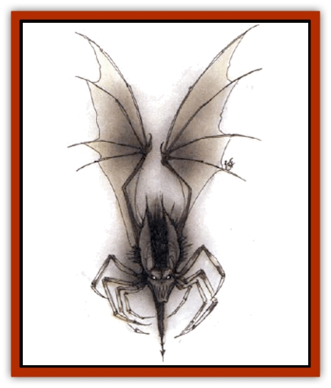

# Magebane

| Statistic | **Magebane** |
| --- | --- |
| **Activity Cycle:** | Any |
| **Alignment:** | Chaotic neutral |
| **Armor Class:** | See below |
| **Climate/Terrain:** | Tombs, ruins, subterranean |
| **Damage/Attack:** | 1d4+2 |
| **Diet:** | Magical energy |
| **Frequency:** | Rare |
| **Hit Dice:** | 2+4 |
| **Intelligence:** | Low (5-7) |
| **Magic Resistance:** | See below |
| **Morale:** | Elite (13-14) |
| **Movement:** | 6, Fl 12 (A) |
| **No. Appearing:** | 1 |
| **No. of Attacks:** | 1 |
| **Organization:** | Solitary |
| **Size:** | S (1½' long, 3' wingspan) |
| **Special Attacks:** | Tail whip |
| **Special Defenses:** | See below |
| **THAC0:** | 17 |
| **Treasure:** | Nil |
| **XP Value:** | 1,400 |

These mysterious creatures inhabit tombs, ruins, and caverns. They resemble large black [[Bat|bats]] with needlelike barbed tails and cold, blue, glowing eyes. Their bodies are amorphous, but always have 10 or more long, spidery black claws on the undersides. They feed on magic and attach themselves to powerful spellcasting individuals, to whom they soon become almighty nuisances.

A magebane is immune and invisible to psionics (which it in turn cannot detect), but it can see magical auras and cast spells up to 160 feet distant. A magebane is normally invisible to all beings except its chosen spellcaster.

A magebane shadows its chosen mage, flitting about nearby and usually behind him. Whenever the wizard casts a spell, there is a 60% chance the magebane will rob the spell of either all (1 or 2 on 1d6) or part (3-6 tm 1d6) of its energy. If all of the energy is drained, the spell is lost and has no effect (similar to the effect of a *rod of absorption*). When only part of the energy is drained, the spell takes effect with lessened force, having one or more of the following modifications: the spell has minimum duration; the spell inflicts minimum damage; targets of the spell gain a bonus of +2 or more on their saving throws; the spell affects a lesser area or volume of matter. Spells of 7th level and greater are largely immune to the feeding of most magebanes, being only partially drained with a roll of 1 on 1d6, and being otherwise unaffected.

Magebanes are silent and do not seek to reveal themselves to their chosen spcllcaster (as they are most easily seen and slain by that being), so their presence may be unknown to the chosen one and any companions for some time.

**Combat:** Magebanes never attack their chosen ones, instead taking an interest in their safety. A magebane may swoop down invisibly to rake anyone menacing its chosen one with its claws (its usual attack) or slash with its razor-sharp tail (for 2d4 damage). It fades momentarily into view as it's striking and then vanishes again.

The Armor Class of a magebane is 5 to the spellcaster and others who can see it (by means of a *true seeing* spell); to others, the unseen magebane is AC 1 (at the moment of its striking in combat). A magebane is 75% resistant to all magic cast at it, except by its chosen spellcaster - it is 100% resistant to the magic of its chosen being. A magebane seems unable to anticipate even obvious spell effects, read the intentions of a spellcaster, or recognize any spell by its casting process. It may be affected by a non-attack, area-effect magic launched by its chosen one (such as *darkness*), if it does not happen to absorb the spell.

**Habitat/Society:** A magebane may choose another spellcaster if it encounters a more powerful one than its present chosen being. Otherwise, it must be slain for a chosen spellcaster to be free of it. A magebane seldom moves from one member of an adventuring band to another, even if the ranks of a party include a far more powerful wizard than the one it's presently attached to, for they seem to shun the presence of former chosen ones.

Magebanes seem to absorb and require only moisture, light and heat, and magical energy. They live only to accompany or search for chosen ones. They reproduce seldom, when they encounter another magebane, whereupon both abandon their chosen ones to enter a month-long process that results in each bisexual parent bearing 1d3 live young four months later.

**Ecology:** Predators that eat bats also prey upon magebanes if they can detect or catch them. Alchemists and mages use magebane flesh in many magical and experimental processes, and will pay 400 gp or more for a largely intact carcass.

---
## Discovery & Documentation

**Source Publication:** Monstrous Compendium, 1994 Annual, Volume 1 (1995)
**Campaign Setting:** Advanced Dungeons & Dragons 2nd Edition
**Author(s):** David Wise

### Other Creatures Found in This Source Book
   * [[Abyss_Ant|Abyss Ant]]
   * [[Achaierai|Achaierai]]
   * [[Afanc|Afanc]]
   * [[Al-Jahar|Al-Jahar]]
   * [[Baelnorn|Baelnorn]]
   * [[Baneguard|Baneguard]]
   * [[Banelar|Banelar]]
   * [[Bird_Talking|Bird, Talking]]
   * [[Blazing_Bones|Blazing Bones]]
   * [[Campestri|Campestri]]
   * [[Caniquine|Caniquine]]
   * [[Cat_Winged|Cat, Winged]]
   * [[Crypt_Servant|Crypt Servant]]
   * [[Death's_Head_Tree|Death's Head Tree]]
   * [[Dog_Saluqi|Dog, Saluqi]]
   * [[Dragon_Electrum|Dragon, Electrum]]
   * [[Dragon_Fang|Dragon, Fang]]
   * [[Dragon_Linnorm_Corpse_Tearer|Dragon, Linnorm, Corpse Tearer]]
   * [[Dragon_Linnorm_Dread|Dragon, Linnorm, Dread]]
   * [[Dragon_Linnorm_Flame|Dragon, Linnorm, Flame]]
   * [[Dragon_Linnorm_Forest|Dragon, Linnorm, Forest]]
   * [[Dragon_Linnorm_Frost|Dragon, Linnorm, Frost]]
   * [[Dragon_Linnorm_Gray|Dragon, Linnorm, Gray]]
   * [[Dragon_Linnorm_Land|Dragon, Linnorm, Land]]
   * [[Dragon_Linnorm_Midgard|Dragon, Linnorm, Midgard]]
   * [[Dragon_Linnorm_Rain|Dragon, Linnorm, Rain]]
   * [[Dragon_Linnorm_Sea|Dragon, Linnorm, Sea]]
   * [[Dragon_Neutral_Jacinth|Dragon, Neutral, Jacinth]]
   * [[Dragon_Neutral_Jade|Dragon, Neutral, Jade]]
   * [[Dragon_Neutral_Pearl|Dragon, Neutral, Pearl]]
   * [[Dread|Dread]]
   * [[Dragon-kin|Dragon-kin]]
   * [[Elemental_Earth_Kin_Chrysmal|Elemental, Earth Kin, Chrysmal]]
   * [[Elemental_Earth_Kin_Earth_Weird|Elemental, Earth Kin, Earth Weird]]
   * [[Elemental_Fire_Kin_Azer|Elemental, Fire Kin, Azer]]
   * [[Elemental_Sandman|Elemental, Sandman]]
   * [[Elemental_Wind_Walker|Elemental, Wind Walker]]
   * [[Elemental_Vermin|Elemental Vermin]]
   * [[Feystag|Feystag]]
   * [[Flame_Skull|Flame Skull]]
   * [[Foulwing|Foulwing]]
   * [[Gambado|Gambado]]
   * [[Garbug|Garbug]]
   * [[Genie_Tasked_Administrator|Genie, Tasked, Administrator]]
   * [[Genie_Tasked_Deceiver|Genie, Tasked, Deceiver]]
   * [[Genie_Tasked_Harim_Servant|Genie, Tasked, Harim Servant]]
   * [[Genie_Tasked_Messenger|Genie, Tasked, Messenger]]
   * [[Genie_Tasked_Miner|Genie, Tasked, Miner]]
   * [[Genie_Tasked_Oathbinder|Genie, Tasked, Oathbinder]]
   * [[Gibbering_Mouther|Gibbering Mouther]]
   * [[Gnasher|Gnasher]]
   * [[Gnasher_Winged|Gnasher, Winged]]
   * [[Golem_Brain|Golem, Brain]]
   * [[Golem_Hammer|Golem, Hammer]]
   * [[Golem_Metagolem|Golem, Metagolem]]
   * [[Golem_Spiderstone|Golem, Spiderstone]]
   * [[Gorynych|Gorynych]]
   * [[Greelox|Greelox]]
   * [[Helmed_Horror|Helmed Horror]]
   * [[Jarbo|Jarbo]]
   * [[Laraken|Laraken]]
   * [[Lich_Psionic|Lich, Psionic]]
   * [[Living_Steel|Living Steel]]
   * [[Lock_Lurker|Lock Lurker]]
   * [[Loxo|Loxo]]
   * [[Lycanthrope_Loup_de_Noir|Lycanthrope, Loup de Noir]]
   * [[Lycanthrope_Werebadger|Lycanthrope, Werebadger]]
   * [[Lycanthrope_Werejaguar|Lycanthrope, Werejaguar]]
   * [[Lythlyx|Lythlyx]]
   * [[Marrashi|Marrashi]]
   * [[Metalmaster|Metalmaster]]
   * [[Mimic_House_Hunter|Mimic, House Hunter]]
   * [[Naga_Bone|Naga, Bone]]
   * [[Nautilus_Giant|Nautilus, Giant]]
   * [[Nightshade_Toril|Nightshade (Toril)]]
   * [[Nishruu|Nishruu]]
   * [[Noran|Noran]]
   * [[Opinicus|Opinicus]]
   * [[Ormyrr|Ormyrr]]
   * [[Parasite|Parasite]]
   * [[Pasari-Niml|Pasari-Niml]]
   * [[Plant_Vampire_Moss|Plant, Vampire Moss]]
   * [[Pteraman|Pteraman]]
   * [[Rautym|Rautym]]
   * [[Shadeling|Shadeling]]
   * [[Skum|Skum]]
   * [[Snake_Giant_Cobra|Snake, Giant Cobra]]
   * [[Snake_Stone|Snake, Stone]]
   * [[Spectral_Wizard|Spectral Wizard]]
   * [[Spell_Weaver|Spell Weaver]]
   * [[Spider_Brain|Spider, Brain]]
   * [[Suwyze|Suwyze]]
   * [[Tatalla|Tatalla]]
   * [[Tick_Heart|Tick, Heart]]
   * [[Tree_Dark|Tree, Dark]]
   * [[Tree_Singing|Tree, Singing]]
   * [[Tressym|Tressym]]
   * [[Troll_Snow|Troll, Snow]]
   * [[Tuyewera|Tuyewera]]
   * [[Ulitharid|Ulitharid]]
   * [[Undead_Dwarf|Undead Dwarf]]
   * [[Undead_Lake_Monster|Undead Lake Monster]]
   * [[Whipsting|Whipsting]]
   * [[Windghost|Windghost]]
   * [[Wolf_Dread|Wolf, Dread]]
   * [[Wolf_Stone|Wolf, Stone]]
   * [[Wolf_Vampiric|Wolf, Vampiric]]
   * [[Wraith_Shimmering|Wraith, Shimmering]]
   * [[Xantravar|Xantravar]]
   * [[Xaver|Xaver]]
