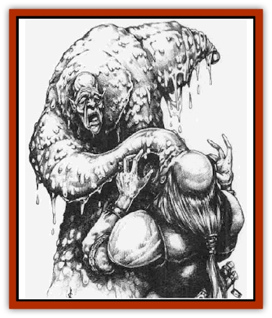

# Magedoom

| Statistic | **Magedoom** |
| --- | --- |
| **Activity Cycle:** | Any |
| **Alignment:** | Lawful evil |
| **Armor Class:** | -2 |
| **Climate/Terrain:** | Any |
| **Damage/Attack:** | 3d8/3d8 |
| **Diet:** | Magic |
| **Frequency:** | Very rare |
| **Hit Dice:** | 10 |
| **Intelligence:** | Average (8-10) |
| **Magic Resistance:** | 100% |
| **Morale:** | Fearless (19-20) |
| **Movement:** | 18, Fl 18 (C) |
| **No. Appearing:** | 1 |
| **No. of Attacks:** | 2 |
| **Organization:** | Solitary |
| **Size:** | L (8' tall) |
| **Special Attacks:** | Temporary spellcasting drain |
| **Special Defenses:** | 3-foot-radius <i>anti-magic shell</i> |
| **THAC0:** | 11 |
| **Treasure:** | Nil |
| **XP Value:** | 11,000 |

Non-Zhentish wizards are all viewed as a threat by Zhent wizards. And there are usually lots of wizards, Zhent and non-Zhent, in Zhentil Keep. In response to this, the most powerful wizards from the Keep banded together to insure their continued supremacy, and devised a horror that would seek out other mages and wizards and destroy them: the magedoom.

A magedoom exudes a distinctive tang of ozone, like that of a lightning strike during a rainstorm crossed with the essence of citric acid. ("It's like being assaulted by something that smells like rotten electric grapefruit," one ill-fated mage once commented.) It resembles a large, cone-shaped mound of yellow and brown sludge that glistens with moisture, crowned with a withered, eyeless human head. It sports two heavy appendages hanging from near the top of the mound.

**Combat:** Magedooms attack by swinging their heavy clublike appendages for 3d8 hit points of damage each. They always attack wizards first, then priests, then any others.

Their most insidious attacks can occur only against wizards. When a wizard spell is cast within 180 feet of a magedoom, it locks in on the source and begins tracking its prey. Once the magedoom reaches melee range, a slimy tentacle tipped with a bloodshot, withered eyeball erupts from within the creature's slimy body mound and touches the mage on the forehead (requiring a successful attack roll). If it hits, the effect is similar to a level drain, but only in regard to what spells a wizard can cast. Thus, an 11th-level wizard who was hit by the appendage would cast spells as a 10th-level wizard. Spells that are now too advanced for the wizard to cast flee the victim's mind. Wizards who survive this attack recover one level of spellcasting ability per hour, but must relearn the spells they lost. This drain does not effect wizards. saving throws, THAC0, or hit points.

Magedooms are blind, tracking targets by their unerring sensitivity to magic as well as by small sensory organs in the strands of slime that coat their bodies and attacking appendages. As a result, they are immune to illusions or to spells that require the victim to have sight.

Magedooms also radiate an anti-magic shell in a 3-foot radius. Thus, a fighter with magical armor and a flametongue sword winds up effectively fighting a magedoom with normal armor and a normal long sword. Once the items are taken out of the field, their magic returns.

When a magedoom is killed, all of the magical energy trapped within exits in an explosive magical wave of wild magic that behaves as if every being within a 15-foot radius were a wild mage who had evoked a wild surge (see the *Tome of Magic*). This effect lasts for five rounds; each round, roll on the Wild Surge Results table in the *Tome of Magic* for each being (except the magedoom), treating "the caster" in the results as the target being rolled for. Results that make no sense result in nothing unusual happening. (Or, the DM may treat every being in the 15-foot radius as the target of five successive discharges of a *wand of wonder*, one each round for five rounds.)

**Habitat/Society:** Magedooms are created from living wizards whose bodies and spirits have been transformed by a rare, forbidden spell. A magedoom is under the partial control of the archmage who cast the spell that created it. The archmage is able to order the creature to do certain tasks, and the magedoom has a wide breadth of discretion as to how it accomplishes them. If the archmage dies, the magedoom becomes a rogue, and no wizard is then safe.

Magedooms are solitary creatures. There are rumors that if two magedooms come within 10 feet of each other, they set up a resonating field that explodes in 1d4 rounds, creating a 40-foot-radius dead magic area that lasts for a month and annihilating the creatures. Some rumors further speculate that there is a tiny chance (1%) that, instead of a dead magic area, a *sphere of annihilation* is created.

**Ecology:** Magedooms were created for one reason alone: to kill non-Zhentish spellcasters. The goddess Mystra, the god Azuth, and their priesthoods loathe magedooms. High-level priests of Mystra or Azuth sometimes charge those who have acted against their faiths with a geas or a quest to destroy one of the creatures. High-level specialty priests of Azuth who serve him well are rumored to receive a special spell that allows them to destroy magedooms.

---
## Discovery & Documentation

**Source Publication:** Ruins of Zhentil Keep (1995)
**Campaign Setting:** Forgotten Realms
**Author(s):** John Terra and Kevin Melka

### Other Creatures Found in This Source Book
   * [[Banedead|Banedead]]
   * [[Banelich|Banelich]]
   * [[Burnbones|Burnbones]]
   * [[Elemental_Nature|Elemental, Nature]]
   * [[Gargoyle_Guardgoyle|Gargoyle, Guardgoyle]]
   * [[Golem_Magic|Golem, Magic]]
   * [[Golem_Vault_Guardian|Golem, Vault Guardian]]
   * [[Hybsil|Hybsil]]
   * [[Mist_Scarlet_Dancer|Mist, Scarlet Dancer]]
   * [[Orc_Ondonti|Orc, Ondonti]]
   * [[Rat_Zhentish_Sewer|Rat, Zhentish Sewer]]
   * [[Render|Render]]
   * [[Sacaanti|Sacaanti]]
   * [[Snake_Messenger|Snake, Messenger]]
   * [[Zhentarim_Spirit|Zhentarim Spirit]]
