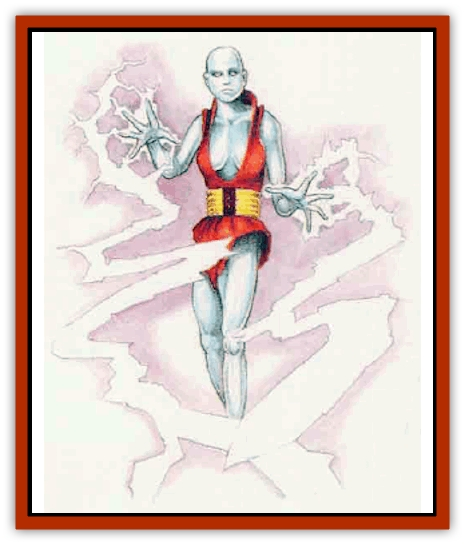

# Magen

| Statistic | **Caldron** | **Demos** | **Galvan** | **Hypnos** |
| --- | --- | --- | --- | --- |
| **Activity Cycle:** | Any | Any | Any | Any |
| **Alignment:** | Neutral | Neutral | Neutral | Neutral |
| **Armor Class:** | 5 | 7 or armor type | 3 | 7 |
| **Climate/Terrain:** | Any | Very rare | Any | Any |
| **Damage/Attack:** | By weapon | By weapon | By weapon | By weapon |
| **Diet:** | Nil | Nil | Nil | Nil |
| **Frequency:** | Very rare | Any | Very rare | Very rare |
| **Hit Dice:** | 4 | 3+2 | 5 | 2 |
| **Intelligence:** | Average (9) | Average (9) | Average (9) | Average (9) |
| **Magic Resistance:** | 40% | 30% | 50% | 20% |
| **Morale:** | Fearless (20) | Fearless (20) | Fearless (20) | Fearless (20) |
| **Movement:** | 12 | 12 | 12 | 12 |
| **No. Appearing:** | 1d4 | 2d6 | 1d3 | 1 |
| **No. of Attacks:** | 1 | 1 | 1 | 1 |
| **Organization:** | Solitary | Solitary | Solitary | Solitary |
| **Size:** | M (6' tall) | M (6' tall) | M (6' tall) | M (6' tall) |
| **Special Attacks:** | Entanglement, acid | Nil | Lightning bolt | Charm |
| **Special Defenses:** | Spell immunities | Spell immunities | Spell immunities | Spell immunities |
| **THAC0:** | 17 | 17 | 15 | 19 |
| **Treasure:** | V | C | C | U |
| **XP Value:** | 175 | 120 | 420 | 175 |

Magens (pronounced "MAY jens", originally gens magica, or "magical people") are constructs created by wizards of at least 12th level by means of complex conjurarions and strict and obscure alchemical formulas. The procedure for creating a magen varies depending on its type; some magens require extra work. In general, a wizard must anticipate a large expenditure of time and money.

Wizards construct magens out of a magically charged gelatin using shaped molds. Magens usually resemble perfectly formed humans, though some vain wizards fashion the magen faces to mirror their own. Wizards never shape them to resemble animals or monsters, but sometimes give them bestial features. The creatures typically look grayish white, unless they are painted or otherwise decorated. Their smooth bodies can gain texture or the semblance of hair through the work of a skilled artisan. Magens feel warm to touch, with a consistency similar to that of human flesh. While these creatures might look alive, sages do not consider them living beings; they do not sleep or eat, nor do they have emotions or free will.

When created, a magen automatically knows how to speak one language its creator knows and has chosen for it. It can learn one or two other languages later, if taught.

A magen follows its creator's commands without question, even to the death: it makes an ideal guard. Unlike most other constructs, these creatures can follow detailed commands and learn complex procedures to the same extent as a human of average intelligence. Magens even can be instructed in making simple decisions, if given criteria by which to judge events.

While the magens here represent all known types, experimentation continues - powerful wizards might create new types at any time.

**Combat:** Combat: A magen can be taught to use one or more weapons and employ them most frequently in attacks. Caldrons, galvans, and hypnos also have special attack forms.

Demos magens use armor and weapons to serve their masters. Their creators give them the skill to use one type of melee weapon and one type of missile weapon; they can be taught more types later. If they wear armor, they enjoy the benefit of the appropriate Armor Class, provided it exceeds their natural AC 7. No other type of magen uses armor.

Caldrons have the ability to stretch their arms and legs up to 20 feet. They do not attack with their legs, but can stretch them to reach otherwise inaccessible places. Caldrons attempt to wrap their arms around victims and can use both arms in the same round, attacking one or two opponents. After a successful  attack roll, the caldron holds the victim and secretes a powerful acid that causes 1d10 points of damage per round until the victim is freed. Breaking free requires a successful open doors roll or the death of the caldron. Note that the acid can destroy a victim's items unless saving throws are made for them.

Galvans have the ability to store static electricity, which they discharge as lighting bolts 60 feet long and 5 feet wide. Those in the area of effect suffer 3d6 points of damage, though a successful saving throw vs. breath weapon halves the damage. Galvans can discharge up to three bolts a day.

Hypnos, physically the weakest magen, possess a subtle power that makes them very useful, especially considering how hard it is to tell magen types apart. Hypnos can attempt to use *charm person* once per round; a victim who fails a saving throw vs. spells believes the hypnos to be a valued friend. One who makes a successful saving throw against the enchantment remains forever immune to the charm power of that particular magen. Once per round, the hypnos can contact a single *charmed* victim telepathically and use a *suggestion* spell; a target may attempt a saving throw vs. spell to avoid following the *suggestion*, but if the saving throw fails, the victim follows any reasonable course of action the magcn suggests. The hypnos bases its *suggestions* only on instructions from its creator.

All magens are immune to *charm* and *fear* spells, as well as to most other mind-affecting spells that affect emotions. The creatures can fall victim to *hold* and *sleep* spells.

When a magen reaches 0 hit points, its body dissolves suddenly in an acid burst of multicolored flame and smoke. One round later, no traces of the creature remain - even the odor has faded. It seems almost as if such a being was never there at all.

Should a magen's creator die, the construct almost always goes mad, launching itself on a rampage of senseless destruction until it is destroyed.

**Habitat/Society:** Magens have no society of their own. However, they are reasonably intelligent and can speak; some lonely wizards teach them to respond to conversation and to act in a polite manner, too. Since they have no will of their own, magens never truly become part of society, except perhaps as slaves. While the constructs have no emotions, they can be taught to emulate them in certain instances.

Demos are the most common type of magen. Their lack of special powers makes them good choices as aides in polite company; wizards generally use only this type as domestic servants and consider them excellent bodyguards as well.

One hardly ever sees caldrons used as messengers or domestic help, because of their slight acidic smell and their unsettling ability to stretch their limbs.

**Ecology:** The ageless magens exist purely through magic and do nor ned air, water, food, or sleep. As constructs that consume nothing, magens have little impact on their surroundings, except as potentially destructive forces.

Most scholars and sages agree that magens were developed by an impatient wizard or wizards who wanted to make a construct, but did not want to wait to gain the considerable power needed to create a [[Golem_General_Information|golem]]. Certainly, magens are not as powerful as golems, and it takes less effort, money, and experience to create them. Some believe wizards developed magens merely as practice before attempting to create golems. Magens have greater intelligence than golems, however, and sometimes can pass for human.

 Some speculate that the Immortals of Mystara handed down the knowledge of creating magens to early wizards, but this theory cannot be confirmed.

All magens are composed of the same basic material: a liquid suspension charged with magic - think of a magically charged gelatin. The liquid's actual composition varies, but all ingredients prove exotic and hard to come by, except in a large city with a well-stocked mage's guild, alchemical college, or components store.

The wizard creating a magen must have a fully stocked laboratory at his disposal, including 1,000 gold pieces worth of special tools and equipment needed to create magens. In addition, a mold must be fashioned of electrum; most wizards hire a metal-smith or sculptor to help with it. Building the mold takes at least six weeks (more for finer work) and materials and labor worth 15,000 gold pieces (or as low as 10,000 gold pieces if the wizard has the appropriate facilities and skills to help in the task),

To make a magen, the wizard also must purchase 3,000 gold pieces worth of chemicals and obscure components for the suspension. The liquid takes two weeds to prepare, and during that time the wizard concentrates so steadily on enchanting and mixing it, he can do nothing else save eat, sleep, and rest.

Once the wizard has prepared the suspension, he must add certain unique ingredients, depending on the type of magen desired. To prepare a demos, the wizard must add the melee and missile weapons he wants the completed magen to know how to use. To form a caldron, the creator adds a pair of tentacles from a [[Roper|roper]] or [[Choker|choker]]. Building a galvan requires a part of any creature that can generate electricity or lightning bolts. Finally, to create a hypnos, the wizard must liquify a scroll holding a *charm person* spell and pour it into the mixture.

The wizard transfers the prepared liquid to the mold and casts the following spells rapidly in this order: *lighting bolt*, *fabricate*, *transmute mud to rock*, *stone to flesh*, *domination* and *lightning bolt* again. The tremendous energy of the spells interacts with the gel; roll 1d20 and check the following table for the outcome.

| Roll | Result |
| --- | --- |
| 1 | Lightning bolt spell reflects back at the caster. Failed. |
| 2-3 | Mixture and mold explode, causing 4d6 points of damage to everyone in a 10-foot radius. Failed. |
| 4-6 | Nothing happens. Wizard must create a new gelatin. Failed. |
| 7-19 | A magen is born! Success! |
| 20 | A magen is born! What the wizard does not know, however, is that an evil intelligence from the Outer Planes possessed its body and eventually will turn the creature against the wizard. |

The equipment, tools, and mold can be reused after the first construction. If a wizard tries to use the mold to create a different type of magen than it previously produced, the attempt automatically fails. Each reuse of a mold requires a saving throw vs. lightning. Failure indicates the mold breaks during the final spellcasting. If breakage occurs, yet the 1d20 roll indicates success, there is a slight (5%) chance that the magen emerges perfectly formed - and fully self-aware, not subject to the wizard's command! But usually, a broken mold results in a misshapen magen that dissolves into nothing within a few minutes.

---
## Discovery & Documentation

**Source Publication:** Mystara Appendix (1994)
**Campaign Setting:** Mystara
**Author(s):** John Nephew, Teeuwynn Woodruff, John Terra, Skip Williams

### Other Creatures Found in This Source Book
   * [[Actaeon|Actaeon]]
   * [[Agarat|Agarat]]
   * [[Ash_Crawler|Ash Crawler]]
   * [[Baldandar|Baldandar]]
   * [[Bargda|Bargda]]
   * [[Bhut|Bhut]]
   * [[Bird_Mystara|Bird (Mystara)]]
   * [[Blackball|Blackball]]
   * [[Choker|Choker]]
   * [[Coltpixie|Coltpixie]]
   * [[Crone_of_Chaos|Crone of Chaos]]
   * [[Darkhood|Darkhood]]
   * [[Darkwing|Darkwing]]
   * [[Decapus|Decapus]]
   * [[Deep_Glaurant|Deep Glaurant]]
   * [[Diabolus|Diabolus]]
   * [[Dimensional_Warper|Dimensional Warper]]
   * [[Dragon_Mystara_Crystalline|Dragon (Mystara), Crystalline]]
   * [[Dragon_Mystara_Jade|Dragon (Mystara), Jade]]
   * [[Dragon_Mystara_Onyx|Dragon (Mystara), Onyx]]
   * [[Dragon_Mystara_Ruby|Dragon (Mystara), Ruby]]
   * [[Drake_Mystara|Drake (Mystara)]]
   * [[Dragonfly|Dragonfly]]
   * [[Dusanu|Dusanu]]
   * [[Elemental_of_Chaos_Air_Earth|Elemental of Chaos, Air/Earth]]
   * [[Elemental_of_Chaos_Fire_Water|Elemental of Chaos, Fire/Water]]
   * [[Elemental_of_Law_Air_Earth|Elemental of Law, Air/Earth]]
   * [[Elemental_of_Law_Fire_Water|Elemental of Law, Fire/Water]]
   * [[Familiar_Mystara|Familiar (Mystara)]]
   * [[Frost_Salamander|Frost Salamander]]
   * [[Fundamental_Air_Earth|Fundamental, Air/Earth]]
   * [[Fundamental_Fire_Water|Fundamental, Fire/Water]]
   * [[Gargantua_Mystara|Gargantua (Mystara)]]
   * [[Geonid|Geonid]]
   * [[Ghostly_Horde|Ghostly Horde]]
   * [[Giant_Athach|Giant, Athach]]
   * [[Giant_Hephaeston|Giant, Hephaeston]]
   * [[Golem_Drolem|Golem, Drolem]]
   * [[Golem_Mystara_I|Golem (Mystara) I]]
   * [[Golem_Mystara_II|Golem (Mystara) II]]
   * [[Golem_Mystara_III|Golem (Mystara) III]]
   * [[Gray_Philosopher|Gray Philosopher]]
   * [[Guardian_Warrior|Guardian Warrior]]
   * [[Gyerian|Gyerian]]
   * [[Herex|Herex]]
   * [[Hivebrood|Hivebrood]]
   * [[Horde|Horde]]
   * [[Hsiao|Hsiao]]
   * [[Huptzeen|Huptzeen]]
   * [[Hutaakan|Hutaakan]]
   * [[Imp_Mystara|Imp (Mystara)]]
   * [[Jellyfish_Giant_Mystara|Jellyfish, Giant (Mystara)]]
   * [[Kna|Kna]]
   * [[Kopru|Kopru]]
   * [[Lizard_Mystara|Lizard (Mystara)]]
   * [[Lizard-kin_Mystara|Lizard-kin (Mystara)]]
   * [[Lupin|Lupin]]
   * [[Lycanthrope_Werejaguar_Mystara|Lycanthrope, Werejaguar (Mystara)]]
   * [[Lycanthrope_Wereswine|Lycanthrope, Wereswine]]
   * [[Manikin|Manikin]]
   * [[Mek|Mek]]
   * [[Mujina|Mujina]]
   * [[Nagpa|Nagpa]]
   * [[Neh-thalggu|Neh-thalggu]]
   * [[Nightshade_Mystara|Nightshade (Mystara)]]
   * [[Nuckalavee|Nuckalavee]]
   * [[Pegataur|Pegataur]]
   * [[Phanaton|Phanaton]]
   * [[Plant_Dangerous_Mystara|Plant, Dangerous (Mystara)]]
   * [[Plasm|Plasm]]
   * [[Rakasta|Rakasta]]
   * [[Rock_Man|Rock Man]]
   * [[Sabreclaw|Sabreclaw]]
   * [[Sacrol|Sacrol]]
   * [[Scamille|Scamille]]
   * [[Shapeshifter|Shapeshifter]]
   * [[Shargugh|Shargugh]]
   * [[Shark-kin|Shark-kin]]
   * [[Sollux|Sollux]]
   * [[Spectral_Death|Spectral Death]]
   * [[Spectral_Hound|Spectral Hound]]
   * [[Spider-kin|Spider-kin]]
   * [[Spirit_Mystara|Spirit (Mystara)]]
   * [[Statue_Living|Statue, Living]]
   * [[Surtaki|Surtaki]]
   * [[Tabi|Tabi]]
   * [[Thoul|Thoul]]
   * [[Thunderhead|Thunderhead]]
   * [[Tiger_Ebon|Tiger, Ebon]]
   * [[Topi|Topi]]
   * [[Tortle|Tortle]]
   * [[Vampire_Velya|Vampire, Velya]]
   * [[White_Fang|White Fang]]
   * [[Worm_Mystara|Worm (Mystara)]]
   * [[Wyrd|Wyrd]]
   * [[Yowler|Yowler]]
   * [[Zombie_Lightning|Zombie, Lightning]]
