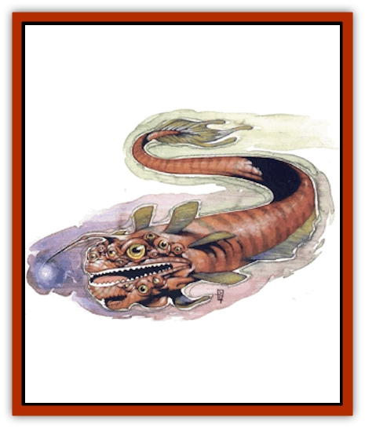

# Magran

| Statistic | **Magran** |
| --- | --- |
| **Activity Cycle:** | Any |
| **Alignment:** | Neutral |
| **Armor Class:** | 3 |
| **Climate/Terrain:** | Ethereal Plane |
| **Damage/Attack:** | 3d8 |
| **Diet:** | Carnivorous |
| **Frequency:** | Rare |
| **Hit Dice:** | 12 |
| **Intelligence:** | Low (5-7) |
| **Magic Resistance:** | Nil |
| **Morale:** | Average (8-10) |
| **Movement:** | 18 |
| **No. Appearing:** | 1d3 (or 3d6) |
| **No. of Attacks:** | 1 |
| **Organization:** | School |
| **Size:** | H (20' long) |
| **Special Attacks:** | Hypnosis, swallow whole |
| **Special Defenses:** | Invisibility |
| **THAC0:** | 9 |
| **Treasure:** | Special |
| **XP Value:** | 8,000 |

Magran are huge creatures that dwell on the Ethereal Plane. The common chant refers to them as fish, and their general appearance certainly is fishlike: multifinned sleek bodies with multiple eyes, large mouths, and a tendril ending with a little light that dangles in front of their faces. Any bark knows that appearances deceive, however, especially on the planes - the magran're actually large reptiles.

**Combat:** A magran hunts other creatures on the Ethereal using a special lure. A long tendril extends from between the magran's eyes, from which the creature dangles a glowing sphere that can be seen from 200 feet away or more. The magran hopes that the light will attract a creature's attention, bringing potential prey closer to it. The membranous organ pulses hypnotically, and any sod who gets within 30 feet of it falls into a trancelike state. While a creature is mesmerized, the magran moves in close and devours it with its mighty jaws (which inflict 3d8 points of damage per bite).

Essentially, the magran's pulsing light has the effect of a *hypnotic pattern* spell, able to affect up to 24 levels or Hit Dice of creatures at a time. Victims are affected only if they fail their saving throw versus spell, but they must make a new save each round while in the area of effect (anywhere within 30 feet of the creature). Such victims are held transfixed by the pulses until they are attacked by the magran or until they can no longer see the glowing sphere (perhaps due to comrades covering their eyes or removing them from the area of effect).

While its prey approaches the transfixing lure, the rest of the magran's body waits invisibly. The magran can become invisible at will, so it can be seen only right after it attacks - it disappears again immediately afterward. If the creature so wishes, even the pulsing organ can be made invisible, hiding the entire beast. Otherwise, potential victims see only the hypnotizing, glowing sphere. Between the victim's charmed state and the magran's own invisibility, the creature gains a +4 attack bonus. The poor sod it attacks receives no AC bonus from Dexterity.

Not only is the horrid maw of the monster filled with long, spiny teeth, but it's big enough to swallow foes whole (on an attack roll of 19 or 20). The magran's gullet, however, is small - a swallowed victim can't move around or try to free himself unless he is size S and has a size S weapon handy. If he is and does, the trapped sod can make attacks from the inside. (The magran's gullet has the same AC as its exterior.)

Regardless of whether swallowed barks can move or not, they suffer 1d12 points of damage per round from digestive acids, and, unless freed, suffocate and die in 2d4 rounds. Due to some strange aspect of its power of invisibility, living creatures swallowed by the magran remain visible inside the beast, so those outside can see them struggling for life within the otherwise unseen creature. When the swallowed sods die, they become invisible like the rest of the magran.

**Habitat/Society:** The magran can be found exclusively in the Deep Ethereal, never traveling to the Border and never venturing into another plane. Normally, a magran hunts alone, although in any particular area of the Deep Ethereal up to three may hunt in close proximity. However, at rare times the creatures gather together in large groups to spawn. These periods last 4d6 days, and, during this time, the entire group acts almost as a singular entity, much like a school of [[Fish|fish]]. Though they do not hunt during the spawning time, they are so peery of outside threats that they attack any creature that approaches the school. Since all members of the group attack together, this is a very dangerous situation for a planewalker to find himself in. Canny bloods avoid magran schools at all costs.

When the young hatch at the end of the spawning time, the adult magran leave them to their own fates. This usually means that the larger young feed on the smaller ones until they've reached a size where they can take on other prey. (Planewalking scavengers and hunters take note: Unlike those of some monsters, magran eggs are worth nothing - don't bother with them.)

**Ecology:** Magran aren't finicky about what creatures they feed upon. Anything attracted by their lure is fair game. Most often, a magran's prey consists of minor ethereal beasts, [[Nathri|nathri]], [[Thought_Eater|thought eaters]], and even [[Foo_Creature|foo creatures]], [[Terithran|terithran]], or [[Xill|xill]]. Planewalking travelers bobbed by the dangling lure are likely prey as well.

More than one canny basher's learned that the phosphorescent organ of the magran doesn't dim once the beast is dead. If carefully removed, the sphere (about 8 inches in diameter) can be used to generate a *hypnotic pasttern* spell, although DMs should keep the following guidelines in mind:

<ul><li>Everyone within 30 feet must make saving throws, regardless of who the wielder wishes to affect.</li><li>The power within the sphere lasts only 1d4 weeks after the magran's death.</li><li>The owner, although immune to the transfixing effects, is automatically so enchanted with the sphere that he'll never let it out of his possession (even after it's lost the hypnotizing glow) and within 1d6 months will give up all possessions in favor of the sphere. This effect lasts until a *remove curse* is cast upon the wielder. If such a spell is used, the sphere instantly loses all power.</li></ul>

---
## Discovery & Documentation

**Source Publication:** Planescape III (1996)
**Campaign Setting:** Planescape
**Author(s):** Monte Cook

### Other Creatures Found in This Source Book
   * [[Animental|Animental]]
   * [[Archomental_Evil|Archomental, Evil]]
   * [[Archomental_Good|Archomental, Good]]
   * [[Belker|Belker]]
   * [[Bzastra|Bzastra]]
   * [[Chososion|Chososion]]
   * [[Darklight|Darklight]]
   * [[Devete|Devete]]
   * [[Devourer_Planescape|Devourer (Planescape)]]
   * [[Dharum_Suhn|Dharum Suhn]]
   * [[Egarus|Egarus]]
   * [[Elemental_Athas_Lesser_Air_Earth|Elemental (Athas), Lesser, Air/Earth]]
   * [[Elemental_Athas_Lesser_Fire_Water|Elemental (Athas), Lesser, Fire/Water]]
   * [[Elemental_Fire_Kin_Salamander_II|Elemental, Fire Kin, Salamander II]]
   * [[Entrope|Entrope]]
   * [[Facet|Facet]]
   * [[Frost_Salamander|Frost Salamander]]
   * [[Fundamental_Air_Earth|Fundamental, Air/Earth]]
   * [[Fundamental_Fire_Water|Fundamental, Fire/Water]]
   * [[Fundamental_All_Elements|Fundamental, All Elements]]
   * [[Garmorm|Garmorm]]
   * [[Homunculus_Elemental|Homunculus, Elemental]]
   * [[Immoth|Immoth]]
   * [[Khargra|Khargra]]
   * [[Klyndes|Klyndes]]
   * [[Menglis|Menglis]]
   * [[Nathri|Nathri]]
   * [[Ooze_Sprite|Ooze Sprite]]
   * [[Paraelemental|Paraelemental]]
   * [[Phirblas|Phirblas]]
   * [[Psurlon|Psurlon]]
   * [[Quasielemental_Negative|Quasielemental, Negative]]
   * [[Quasielemental_Positive|Quasielemental, Positive]]
   * [[Rast|Rast]]
   * [[Ravid|Ravid]]
   * [[Ruvoka|Ruvoka]]
   * [[Scile|Scile]]
   * [[Shad|Shad]]
   * [[Shocker|Shocker]]
   * [[Sislan|Sislan]]
   * [[Suisseen|Suisseen]]
   * [[Terithran|Terithran]]
   * [[Thoqqua|Thoqqua]]
   * [[Trilloch|Trilloch]]
   * [[Tsnng|Tsnng]]
   * [[Ungulosin|Ungulosin]]
   * [[Vacuous|Vacuous]]
   * [[Wavefire|Wavefire]]
   * [[Xag-Ya_Xeg-Yi|Xag-Ya/Xeg-Yi]]
   * [[Xill|Xill]]
