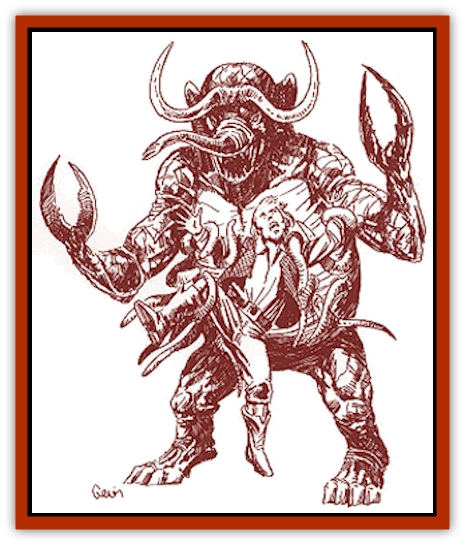

# Malfera

| Statistic | **Malfera** |
| --- | --- |
| **Activity Cycle:** | Any |
| **Alignment:** | Chaotic evil |
| **Armor Class:** | 3 |
| **Climate/Terrain:** | Any (prefers jungle) |
| **Damage/Attack:** | 1d10+8/1d10+8/1d6 |
| **Diet:** | Carnivore |
| **Frequency:** | Very rare |
| **Hit Dice:** | 9 |
| **Intelligence:** | Average (8-10) |
| **Magic Resistance:** | 30% |
| **Morale:** | Champion (15-16) |
| **Movement:** | 6 |
| **No. Appearing:** | 1 (1d2) |
| **No. of Attacks:** | 3 |
| **Organization:** | Solitary |
| **Size:** | L (12' tall) |
| **Special Attacks:** | Acid slime, poisonous breath |
| **Special Defenses:** | Hit only by magical or <i>red steel</i> weapons, immune to acid and poisonous gas |
| **THAC0:** | 11 (8 w/pincers) |
| **Treasure:** | E |
| **XP Value:** | 6,000 |

The malfera is a foul creature summoned from the Dimension of Nightmares, where many bad dreams are bred and released into the minds of sleeping people. A malfera appears only through acts of powerful mortal magic or through the will of an Immortal.

A malfera has a large, elephantlike face and a short prehensile trunk, flanked by large fangs. Its head is topped by large crescent-shaped ivory horns. The chest is a mass of slimy, short tentacles resembling tube worms, and its long, muscular arms end in large, jagged pincers. Its black skin is wrinkled and leathery, much like the skin of an [[Elephant|elephant]], and it has a prominent weblike network of red veins running all over its skin. Its eyes glow a deep crimson.

**Combat:** In combat, a malfera attacks with its pincers and fangs. The malfera has an effective Strength of 20 and gets appropriate strength bonuses with its pincers. If both pincers successfully hit a single target, the malfera drags the victim to its chest during the next round, automatically trapping it in the tentacles. The tentacles are coated with a thick, acidic slime which does 2d6 points of damage each round. The victim is entitled to a saving throw vs. poison each round; if successful, the victim takes no poison damage that round.

If the victim has a Strength of 15 or less, the victim can be freed only when the malfera is killed. With a Strength of 16 or greater, the victim can wrestle free with a successful bend bars check. A victim can attempt this only once.

In addition, the noxious, rancid breath of a malfera is equivalent to type J ingested poison with an onset time of 1d4 minutes. Each time the malfera succeeds with a bite attack, its victim must make a successful saving throw vs. poison with a +3 bonus or die. Even if the saving throw succeeds, the victim still takes 20 points of damage.

Malferas are immune to acid and poisonous gas and can be struck only by magical or *red steel* weapons.

Aside from its combat abilities, a malfera can *detect invisibility* at will, and it opens all doors as if it had a permanent *knock* spell.

**Habitat/Society:** While on the Prime Material, malferas are loners. They are also rapacious and wasteful carnivores. A malfera will often kill intelligent humanoids, eating only the heart and leaving the rest of the body to waste and rot. Malferas also take trophies from their victims.

**Ecology:** Malferas are not part of the natural world and exist on the Prime Material only at the whim of some powerful creature. Luckily, a malfera must return to its hideous home once it has accomplished its mission.

The malfera is a jungle nightmare, preferring to stalk in hot areas overgrown by jungle. These creatures are firmly entrenched in the myths of the inhabitants of the Orc's Head Peninsula, especially among the orcs of the Dark Jungle.

For some unknown reason, malferas will never attack [[Wallara|wallaras]]. This may be because malferas are nightmare creatures, and the wallaras are often protected by [[Spirit_Walleran|wallaran spirits]], powerful beings that dwell in the Dreamworld.

A malfera may be summoned to the Prime Material by an evil mage using a spell like to the 5th-level mage spell *conjure elemental*. An evil priest may also summon a malfera by using a variant of the 6th-level priest spell, *conjure fire elemental*.

---
## Discovery & Documentation

**Source Publication:** Monstrous Compendium Savage Coast Appendix (Online Exclusive) (1995)
**Campaign Setting:** Mystara
**Author(s):** Loren L Coleman, Ted James, Thomas Zuvich, Cindi M. Rice

### Other Creatures Found in This Source Book
   * [[Aranea_Savage_Coast|Aranea (Savage Coast)]]
   * [[Arashaeem|Arashaeem]]
   * [[Batracine|Batracine]]
   * [[Cat_Marine|Cat, Marine]]
   * [[Cinnavixen|Cinnavixen]]
   * [[Clockwork_Swordsman|Clockwork Swordsman]]
   * [[Critter_Temple|Critter, Temple]]
   * [[Cursed_One|Cursed One]]
   * [[Deathmare|Deathmare]]
   * [[Dragon_Savage_Coast_Crimson|Dragon (Savage Coast), Crimson]]
   * [[Dragon_Savage_Coast_Red_Hawk|Dragon (Savage Coast), Red Hawk]]
   * [[Echyan|Echyan]]
   * [[Ee'aar|Ee'aar]]
   * [[Enduk|Enduk]]
   * [[Fachan_Savage_Coast|Fachan (Savage Coast)]]
   * [[Feliquine|Feliquine]]
   * [[Fiend_Narvaezan|Fiend, Narvaezan]]
   * [[Frelôn|Frelôn]]
   * [[Ghriest|Ghriest]]
   * [[Glutton_Sea|Glutton, Sea]]
   * [[Goatman|Goatman]]
   * [[Golem_Naâruk|Golem, Naâruk]]
   * [[Golem_Savage_Coast|Golem (Savage Coast)]]
   * [[Grudgling|Grudgling]]
   * [[Heraldic_Servant_I|Heraldic Servant I]]
   * [[Heraldic_Servant_II|Heraldic Servant II]]
   * [[Heraldic_Servant_III|Heraldic Servant III]]
   * [[Heraldic_Servant_IV|Heraldic Servant IV]]
   * [[Heraldic_Servant_V|Heraldic Servant V]]
   * [[Heraldic_Servant_General_Information|Heraldic Servant, General Information]]
   * [[Hermit_Sea|Hermit, Sea]]
   * [[Jorri|Jorri]]
   * [[Juhrion|Juhrion]]
   * [[Kla'a-tah|Kla'a-tah]]
   * [[Leech_Legacy|Leech, Legacy]]
   * [[Lich_Inheritor|Lich, Inheritor]]
   * [[Lizard_Kin_Savage_Coast|Lizard Kin (Savage Coast)]]
   * [[Lupasus|Lupasus]]
   * [[Lupin|Lupin]]
   * [[Lyra_Bird_Saragón|Lyra Bird, Saragón]]
   * [[Manscorpion_Nimmurian|Manscorpion, Nimmurian]]
   * [[Mythuínn_Folk|Mythuínn Folk]]
   * [[Neshezu|Neshezu]]
   * [[Nikt'oo|Nikt'oo]]
   * [[Nosferatu|Nosferatu]]
   * [[Omm-wa|Omm-wa]]
   * [[Omshirim|Omshirim]]
   * [[Parasite_Savage_Coast|Parasite (Savage Coast)]]
   * [[Phanaton|Phanaton]]
   * [[Plant_Savage_Coast|Plant (Savage Coast)]]
   * [[Pudding_Vermilion|Pudding, Vermilion]]
   * [[Rakasta|Rakasta]]
   * [[Ray_Forest|Ray, Forest]]
   * [[Shedu_Greater_Savage_Coast|Shedu, Greater (Savage Coast)]]
   * [[Shimmerfish|Shimmerfish]]
   * [[Skinwing|Skinwing]]
   * [[Spawn_of_Nimmur|Spawn of Nimmur]]
   * [[Spider-spy|Spider-spy]]
   * [[Spirit_Heroic|Spirit, Heroic]]
   * [[Spirit_Walleran|Spirit, Walleran]]
   * [[Succulus|Succulus]]
   * [[Swampmare|Swampmare]]
   * [[Symbiont_Shadow|Symbiont, Shadow]]
   * [[Tortle|Tortle]]
   * [[Troll_Legacy|Troll, Legacy]]
   * [[Trosip|Trosip]]
   * [[Tyminid|Tyminid]]
   * [[Utukku|Utukku]]
   * [[Voat|Voat]]
   * [[Voat_Herathian|Voat, Herathian]]
   * [[Vulturehound|Vulturehound]]
   * [[Wallara|Wallara]]
   * [[Wurmling|Wurmling]]
   * [[Wynzet|Wynzet]]
   * [[Yeshom|Yeshom]]
   * [[Zombie_Red|Zombie, Red]]
