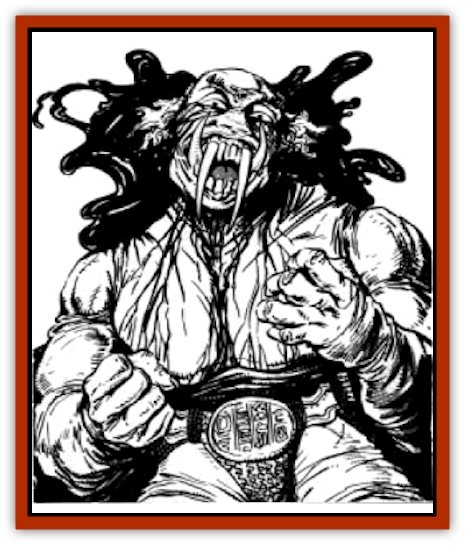

# Manggus

| Statistic | **Manggus** |
| --- | --- |
| **Activity Cycle:** | Any |
| **Alignment:** | Chaotic evil |
| **Armor Class:** | -1 |
| **Climate/Terrain:** | Steppe |
| **Damage/Attack:** | 3-18 and weapon +4 |
| **Diet:** | Carnivore |
| **Frequency:** | Very rare |
| **Hit Dice:** | 8+3 |
| **Intelligence:** | Very (11-12) |
| **Magic Resistance:** | Nil |
| **Morale:** | Elite (15) |
| **Movement:** | 15 |
| **No. Appearing:** | 1-3 |
| **No. of Attacks:** | 2 |
| **Organization:** | Solitary |
| **Size:** | L (8-10') |
| **Special Attacks:** | Shapechange |
| **Special Defenses:** | See below |
| **THAC0:** | 11 |
| **Treasure:** | Y,U (E) |
| **XP Value:** | 2,000 |

The manggus is a powerful evil spirit that lives in the lands of men. There it uses its powers to terrorize and exact sacrifices from the population.

In its natural form, the manggus is a fearsome-looking creature. It stands about the size of an [[Ogre|ogre]]. Skin hangs loose on its body in wrinkled folds. Its eyes are bloodshot, and when they water, drops of blood flow like tears. It has four long fangs, two extending upward almost to its eyes, and two extending down, well below its chin. Its true form is seldom seen, however, since the creature most often travels in different shape.

**Combat:** In the rare instances when encountered in its natural form, the manggus fights with its bite and a weapon. The most common weapon used is a large maul, capable of causing 2-12 points of damage, +4 for the great strength of the creature. It attacks with great ferocity in the initial rounds and will continue to do so as long as the fight goes its way. However, if outmatched, outnumbered, or unlucky, it will flee at the first opportunity. If it cannot flee, it will try to surrender. If these options fail, it continues to fight at the best of its ability.

However, the manggus is rarely battled in its natural form, since it has the formidable ability to change its shape. It can do this up to four times per day. The shapes available are limited to creatures known to the manggus. This prevents it from becoming a very rare or unique creature, or one from some far distant land. In general the manggus assumes the form of humans, animals, giants, [[Naga|nagas]], or other fearsome creatures found throughout its range. As per the spell, the *shapechanged* manggus has all the power and abilities of the form it has assumed. A manggus usually has a repertoire of preferred forms that it will use in a fight. Thus, one might favor a [[Giant_Stone|stone giant]] for combat, an [[Asperii|asperii]] for speed, and an [[Invisible_Stalker|invisible stalker]] to avoid detection. Being highly intelligent, the manggus will assume whatever form is best for its needs.

In addition to its shapechanging ability, the manggus has several innate magical powers. It can *cause disease* with its touch three times per day and can use *ESP* (60' range), *comprehend languages*, and *cause fear* at will. It can only be hit by weapons of +1 enchantment or greater. It is immune to all *charm* and *hold* spells. It is immune to cold and all cold-based spells. It is, however, vulnerable to fire. If struck by magical flame while *shapechanged*, it must revert to its natural form. In its natural form, it has a -1 on its saving throw against all fire-based attacks.

**Habitat/Society:** The manggus tends to be a solitary creature, living alone or in mated pairs. Such bonds are formed for life, and the male and female are quite devoted to each other. Beyond this, it shuns the company of its own kind, fearing competition and exposure should too many of its race gather in one place.

What the manggus competes for is humans, its favored food. Knowing that it is outnumbered and ultimately weaker than its prey, the manggus uses trickery and deceit to obtain its meals. Its favorite method is to use its powers and rule over a village or town in human form. There it uses it shapechanging ability to terrorize the humans into making offerings and sacrifices. If it cannot obtain its meals this way, it preys on lonely travelers or isolated farmhouses. Should things become too dangerous, the manggus has no hesitation about moving to a new town and beginning again.

**Ecology:** The manggus is strictly a predator of man. Should the human population of an area become too small to support it, or too well protected, it will change its hunting grounds. Although it can disguise itself perfectly as a human, the manggus prefers to avoid large cities, since the risk of discovery there is too great.

---
## Discovery & Documentation

**Source Publication:** The Horde (boxed set) (1990)
**Campaign Setting:** The Horde (Forgotten Realms)
**Author(s):** David Cook

### Other Creatures Found in This Source Book
   * [[Centaur_Nomadic|Centaur, Nomadic]]
   * [[Horse_Endless_Waste|Horse (Endless Waste)]]
   * [[Monkey_Greater_Spirit|Monkey (Greater Spirit)]]
   * [[Shatjan|Shatjan]]
   * [[Shimnus_Greater_Spirit|Shimnus, Greater Spirit]]
