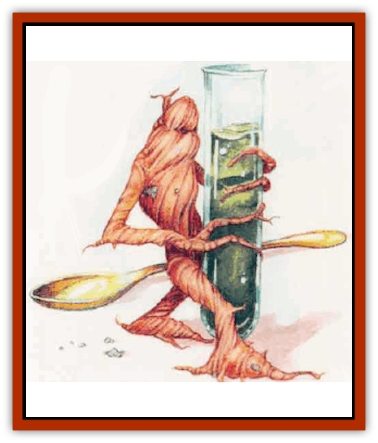

# Manikin

| Statistic | **Manikin** |
| --- | --- |
| **Activity Cycle:** | Any |
| **Alignment:** | Neutral |
| **Armor Class:** | 6 |
| **Climate/Terrain:** | Wizards' laboratories |
| **Damage/Attack:** | Nil |
| **Diet:** | Water and soil nutrients |
| **Frequency:** | Rare |
| **Hit Dice:** | 1-4 hp |
| **Intelligence:** | Animal (1) |
| **Magic Resistance:** | Nil |
| **Morale:** | Unsteady (6) |
| **Movement:** | 12 |
| **No. Appearing:** | 1 |
| **No. of Attacks:** | 0 |
| **Organization:** | Solitary |
| **Size:** | T (10&rdquo; tall) |
| **Special Attacks:** | Shriek |
| **Special Defenses:** | Melding, hide in shadows |
| **THAC0:** | Nil |
| **Treasure:** | Nil |
| **XP Value:** | 120 |

The manikin, a tiny humanoid with gray or brown rubbery skin, smells of freshly turned earth. It does not speak or write.

The creature comes from a rare plant called a mandragora. The plant's 10-inch-long root has a gnarled humanoid shape, with a few leaves growing at the top. Wizards familiar with the mandragora (such as those with the herbalism proficiency) can use arcane methods to turn the root into a manikin.

**Combat:** The manikin cannot fight effectively, so it avoids combat. The creature seems quite fast for its size. In addition, it can meld into wood and move within it at a rate of 10 feet per round. It also can meld with stone, though it moves through it at only 5 feet per round. In addition, the manikin can hide in shadows with a 65% chance of success.

The manikin wreaks vengeance on any who would slay it, emitting a horrible shriek when it dies. The individual who killed it must make a successful saving throw vs. death or fall dead, as if affected by a lethal poison.

When a manikin dies, its creator permanently loses a number of hit points equal to the creature's. A manikin expires instantly when its creator dies.

**Habitat/Society:** A wizard can enchant as many manikins as he wants, as long as he can find enough mandragora roots.

The manikin's creator can read the little creature's mind as clearly as if it were a book. The wizard mentally controls the manikin and often uses it as an assistant when working in his laboratory. When the wizard is performing a complex experiment, the creature automatically senses its master's needs and performs the necessaIy task, such as fetching tools or handling poisonous substances. Using manikins as help when making potions or other magical items increases the success chances by 3% per manikin used, to a maximum of 12%.

A wizard must designate a specific point of his laboratory as the manikin's spiritual tether (any unmovable item will suffice). This location can never change, and the manikin must remain within 100 feet of this point until either it or its creator dies. Often, the manikin's tether point is a large pot holding soil.

The manikin must spend at least an hour each day in soil, absorbing the nutrients and water it needs for survival. A manikin denied soil and water loses 1 hit point per day until it dies, at which time it releases its shriek to affect whoever prevented it from gaining the substances required for life.

**Ecology:** The manikin has no real effect on the environment, except as it helps its creator. A manikin's body can be used in the same ways as a mandragora root (see below).

**Mandragora Root**

  The rare mandragora roots grow only in temperate forests; one mandragora almost never grows within 20 miles of another. A successful herbalism proficiency check allows a person to recognize signs and determine if a mandragora root grows in a given forest (or section of a large forest). Finding the root requires hours of searching. Provided mandragora root grows in the area. a oerson with the herbalism nonweaoon proficiency has a 1-in-10 chance each hour of finding the root; someone without herbalism has a 1-in-20 chance each hour of locating it.

The mandragora root feels warm to the touch and sometimes twitches slightly. However, the root cannot travel by itself and has no combat abilities. Like the manikin, though, the mandragora has a spectacular defense: If pulled up, the root oozes a bloodlike sap and shrieks horribly. The creature uprooting it must make a successful saving throw vs. death or die in agony as the plant shrieks. Looping a rope around the plant and pulling it out does not spare one from the dire effects, nor does deafness. It seems as if the plant wants to avenge its death, and no defensive measure can stop it.

Mandragora continues to be harvested, nonetheless. Evil wizards have been known to tie the plant to a dog or other small animal; the animal dies in the process of uprooting it, but the wizard can then safely pick up the root. Most wizards find the unseen servant spell useful in harvesting this plant.

Eating raw mandragora root necessitates a saving throw vs. poison. Success means the taster falls ill for 1d6 hours and lies helpless with stomach spasms; failure results in death.

Knowledgeable alchemists can treat the mandragora root to produce various compounds, such as poisons, soporifics, anesthetics, aphrodisiacs, or medications that improve fertility. The root is also a major component of *philters of love* and *potions of invulnerability*, *heroism*, *treasure finding*, and *plant control*. Only one compound or potion can derive from each individual root. To create a manikin, a wizard enchants the mandragora root with a *monster summoning I* spell, followed by *permanency*.

---
## Discovery & Documentation

**Source Publication:** Mystara Appendix (1994)
**Campaign Setting:** Mystara
**Author(s):** John Nephew, Teeuwynn Woodruff, John Terra, Skip Williams

### Other Creatures Found in This Source Book
   * [[Actaeon|Actaeon]]
   * [[Agarat|Agarat]]
   * [[Ash_Crawler|Ash Crawler]]
   * [[Baldandar|Baldandar]]
   * [[Bargda|Bargda]]
   * [[Bhut|Bhut]]
   * [[Bird_Mystara|Bird (Mystara)]]
   * [[Blackball|Blackball]]
   * [[Choker|Choker]]
   * [[Coltpixie|Coltpixie]]
   * [[Crone_of_Chaos|Crone of Chaos]]
   * [[Darkhood|Darkhood]]
   * [[Darkwing|Darkwing]]
   * [[Decapus|Decapus]]
   * [[Deep_Glaurant|Deep Glaurant]]
   * [[Diabolus|Diabolus]]
   * [[Dimensional_Warper|Dimensional Warper]]
   * [[Dragon_Mystara_Crystalline|Dragon (Mystara), Crystalline]]
   * [[Dragon_Mystara_Jade|Dragon (Mystara), Jade]]
   * [[Dragon_Mystara_Onyx|Dragon (Mystara), Onyx]]
   * [[Dragon_Mystara_Ruby|Dragon (Mystara), Ruby]]
   * [[Drake_Mystara|Drake (Mystara)]]
   * [[Dragonfly|Dragonfly]]
   * [[Dusanu|Dusanu]]
   * [[Elemental_of_Chaos_Air_Earth|Elemental of Chaos, Air/Earth]]
   * [[Elemental_of_Chaos_Fire_Water|Elemental of Chaos, Fire/Water]]
   * [[Elemental_of_Law_Air_Earth|Elemental of Law, Air/Earth]]
   * [[Elemental_of_Law_Fire_Water|Elemental of Law, Fire/Water]]
   * [[Familiar_Mystara|Familiar (Mystara)]]
   * [[Frost_Salamander|Frost Salamander]]
   * [[Fundamental_Air_Earth|Fundamental, Air/Earth]]
   * [[Fundamental_Fire_Water|Fundamental, Fire/Water]]
   * [[Gargantua_Mystara|Gargantua (Mystara)]]
   * [[Geonid|Geonid]]
   * [[Ghostly_Horde|Ghostly Horde]]
   * [[Giant_Athach|Giant, Athach]]
   * [[Giant_Hephaeston|Giant, Hephaeston]]
   * [[Golem_Drolem|Golem, Drolem]]
   * [[Golem_Mystara_I|Golem (Mystara) I]]
   * [[Golem_Mystara_II|Golem (Mystara) II]]
   * [[Golem_Mystara_III|Golem (Mystara) III]]
   * [[Gray_Philosopher|Gray Philosopher]]
   * [[Guardian_Warrior|Guardian Warrior]]
   * [[Gyerian|Gyerian]]
   * [[Herex|Herex]]
   * [[Hivebrood|Hivebrood]]
   * [[Horde|Horde]]
   * [[Hsiao|Hsiao]]
   * [[Huptzeen|Huptzeen]]
   * [[Hutaakan|Hutaakan]]
   * [[Imp_Mystara|Imp (Mystara)]]
   * [[Jellyfish_Giant_Mystara|Jellyfish, Giant (Mystara)]]
   * [[Kna|Kna]]
   * [[Kopru|Kopru]]
   * [[Lizard_Mystara|Lizard (Mystara)]]
   * [[Lizard-kin_Mystara|Lizard-kin (Mystara)]]
   * [[Lupin|Lupin]]
   * [[Lycanthrope_Werejaguar_Mystara|Lycanthrope, Werejaguar (Mystara)]]
   * [[Lycanthrope_Wereswine|Lycanthrope, Wereswine]]
   * [[Magen|Magen]]
   * [[Mek|Mek]]
   * [[Mujina|Mujina]]
   * [[Nagpa|Nagpa]]
   * [[Neh-thalggu|Neh-thalggu]]
   * [[Nightshade_Mystara|Nightshade (Mystara)]]
   * [[Nuckalavee|Nuckalavee]]
   * [[Pegataur|Pegataur]]
   * [[Phanaton|Phanaton]]
   * [[Plant_Dangerous_Mystara|Plant, Dangerous (Mystara)]]
   * [[Plasm|Plasm]]
   * [[Rakasta|Rakasta]]
   * [[Rock_Man|Rock Man]]
   * [[Sabreclaw|Sabreclaw]]
   * [[Sacrol|Sacrol]]
   * [[Scamille|Scamille]]
   * [[Shapeshifter|Shapeshifter]]
   * [[Shargugh|Shargugh]]
   * [[Shark-kin|Shark-kin]]
   * [[Sollux|Sollux]]
   * [[Spectral_Death|Spectral Death]]
   * [[Spectral_Hound|Spectral Hound]]
   * [[Spider-kin|Spider-kin]]
   * [[Spirit_Mystara|Spirit (Mystara)]]
   * [[Statue_Living|Statue, Living]]
   * [[Surtaki|Surtaki]]
   * [[Tabi|Tabi]]
   * [[Thoul|Thoul]]
   * [[Thunderhead|Thunderhead]]
   * [[Tiger_Ebon|Tiger, Ebon]]
   * [[Topi|Topi]]
   * [[Tortle|Tortle]]
   * [[Vampire_Velya|Vampire, Velya]]
   * [[White_Fang|White Fang]]
   * [[Worm_Mystara|Worm (Mystara)]]
   * [[Wyrd|Wyrd]]
   * [[Yowler|Yowler]]
   * [[Zombie_Lightning|Zombie, Lightning]]
