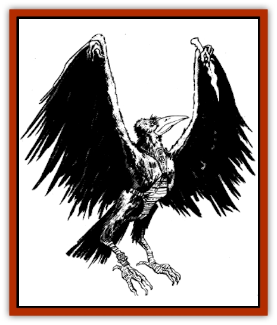

# Manni

| Statistic | **Manni** |
| --- | --- |
| **Activity Cycle:** | Dusk |
| **Alignment:** | Chaotic evil |
| **Armor Class:** | 5 |
| **Climate/Terrain:** | Temperate forest and steppe |
| **Damage/Attack:** | 1-6 and by weapon |
| **Diet:** | Scavenger |
| **Frequency:** | Rare |
| **Hit Dice:** | 3 |
| **Intelligence:** | Low (5-7) |
| **Magic Resistance:** | Nil |
| **Morale:** | Unsteady (5-7) |
| **Movement:** | 9, FL 18 |
| **No. Appearing:** | 1-6 |
| **No. of Attacks:** | 2 |
| **Organization:** | Flock |
| **Size:** | M (4-5') |
| **Special Attacks:** | Nil |
| **Special Defenses:** | Nil |
| **THAC0:** | 17 |
| **Treasure:** | P (Y&times;2,W) |
| **XP Value:** | 65 |

The manni, also known as kara or "black ones", are a pestiferous and evil race that haunt the bleak and wasted corners of the steppe. They are fond of decay and death and are often found near grave mounds and in ruins.

The manni looks like a humanoid, long-beaked crow or [[Raven_Crow|raven]]. It stands on two bandy [[Bird|bird]] legs. The body is completely covered by black feathers, hence its nickname. It has long wings instead of arms. The feathers hide three long fingers that allow the manni to grasp and use items. It does not speak any human tongue, but communicates in a series of clacks and whistles.

**Combat:** The manni is a furtive and cowardly creature, preferring to avoid combat when possible. However, since it must eat and it cannot always rely on the kills of others, the manni is sometimes forced to fight. When it must make a kill, the manni prefers to attack from ambush at times when it is certain to win uninjured. To this end, it will build snares along game trails, lurk on the edges of encampments, and attack with an entire flock, overwhelming by sheer numbers.

In combat, the manni fights with its sharp beak and a weapon. Most often this is a spear, the easiest item for the manni to use with its awkward wings. In some cases a club is favored. Swords are not used by the [[Aarakocra|bird men]], as these are too difficult for the creatures to manage.

In addition to its beak and weapons, the manni can also use its wings to buffet an opponent. Generally, this is a tactic of last resort, since it requires the creature to get very close to the enemy and places it at risk of being grappled. Buffeting causes little damage, only 1-2 points, but can disorient and confuse an opponent long enough for the manni to fly away. Creatures buffeted must make a saving throw vs. spells or be stunned for one round.

**Habitat/Society:** The manni are a fairly loathsome and disgusting race of creatures. Not noble, brave, or trustworthy, they live as scavengers on the steppe.

The manni form together in flocks of 10-30 individuals. Of these no more than one-fourth are males. The remainder are females and young. In combat there is no difference between the males and females, and the young are too helpless to fight. Any hatchling old enough to bear weapons is treated as an adult.

The flock lives in a poor imitation of a village. It is usually located in a sheltered stand of woods or hollow. Here the manni make their nests, simple domed huts of woven grass and branches. These are carefully camouflaged with branches, moss, grass, and dead leaves. The huts are not particularly weatherproof, but they do provide some protection from the elements.

As scavengers, manni are far from the cleanest of creatures. Their villages are rank with decay and pollution. In times of famine, the manni dig up burial mounds, tear apart wind burials, and have even been known to eat their own dead.

The manni have no liking for humans. They fear the "wingless ones", and because they fear, they hate the humans. The humans care no more for the manni, either, and nomads usually attempt to kill them on sight.

The manni speak their own tongue and no other. Although they can learn to understand human languages, it is impossible for their beaks to speak human words.

**Ecology:** As scavengers, the manni fill a clear-cut niche in the ecology of the plains. Their own weaknesses, cruelties, and cowardice keep them from dominant roles in the land and so they have been surpassed by others.

Manni feathers are used for decorations by some of the nomadic tribes. Merchants have also been known to buy the feathers for sale in exotic markets.

---
## Discovery & Documentation

**Source Publication:** MC11 Forgotten Realms Appendix II (1991)
**Campaign Setting:** Advanced Dungeons & Dragons 2nd Edition
**Author(s):** Tim Beach, Tim Brown, William W. Connors, Dale Donovan, Ed Greenwood, Jeff Grubb, Bruce Heard, Slade Henson, Rob King, Colin McComb, Roger E. Moore, Bruce Nesmith, Jon Pickens, Jean Rabe, Dori Watry, Skip Williams

### Other Creatures Found in This Source Book
   * [[Alaghi|Alaghi]]
   * [[Alguduir|Alguduir]]
   * [[Beguiler|Beguiler]]
   * [[Bird_Toril|Bird (Toril)]]
   * [[Cantobele|Cantobele]]
   * [[Carapace|Carapace]]
   * [[Cat_Toril|Cat (Toril)]]
   * [[Chitine|Chitine]]
   * [[Cildabrin|Cildabrin]]
   * [[Dimensional_Warper|Dimensional Warper]]
   * [[Dragon_Deep|Dragon, Deep]]
   * [[Fachan_Toril|Fachan (Toril)]]
   * [[Fael|Fael]]
   * [[Feyr|Feyr]]
   * [[Firetail|Firetail]]
   * [[Frost|Frost]]
   * [[Gaund|Gaund]]
   * [[Gloomwing|Gloomwing]]
   * [[Golden_Ammonite|Golden Ammonite]]
   * [[Golem_Lightning|Golem, Lightning]]
   * [[Hamadryad|Hamadryad]]
   * [[Harrier|Harrier]]
   * [[Harrla|Harrla]]
   * [[Haun|Haun]]
   * [[Haundar|Haundar]]
   * [[Hendar|Hendar]]
   * [[Inquisitor|Inquisitor]]
   * [[Lhiannan_Shee|Lhiannan Shee]]
   * [[Loxo|Loxo]]
   * [[Manscorpion|Manscorpion]]
   * [[Mara|Mara]]
   * [[Morin|Morin]]
   * [[Naga_Dark|Naga, Dark]]
   * [[Orpsu|Orpsu]]
   * [[Plant_Carnivorous_Black_Willow|Plant, Carnivorous, Black Willow]]
   * [[Plant_Carnivorous_Toril|Plant, Carnivorous (Toril)]]
   * [[Plant_Dangerous_I|Plant, Dangerous I]]
   * [[Ring-Worm|Ring-Worm]]
   * [[Rohch|Rohch]]
   * [[Sand_Cat|Sand Cat]]
   * [[Saurial|Saurial]]
   * [[Sha'az|Sha'az]]
   * [[Silver_Dog|Silver Dog]]
   * [[Simpathetic|Simpathetic]]
   * [[Skuz|Skuz]]
   * [[Spider_Monkey|Spider, Monkey]]
   * [[Tren|Tren]]
