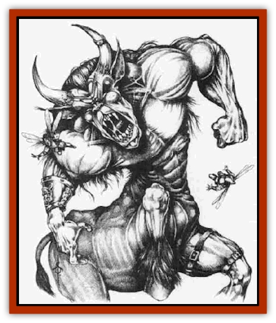

# Manotaur

| Statistic | **Manotaur** |
| --- | --- |
| **Activity Cycle:** | Day |
| **Alignment:** | Chaotic evil |
| **Armor Class:** | 4 |
| **Climate/Terrain:** | Desolate rocky forests |
| **Damage/Attack:** | 1d6/1d6/1d8 |
| **Diet:** | Carnivore |
| **Frequency:** | Very rare |
| **Hit Dice:** | 13 |
| **Intelligence:** | Average (8-10) |
| **Magic Resistance:** | Nil |
| **Morale:** | Champion (15-16) |
| **Movement:** | 24 |
| **No. Appearing:** | 1 |
| **No. of Attacks:** | 3 |
| **Organization:** | Solitary |
| **Size:** | L (8' tall, 12' long) |
| **Special Attacks:** | Charge |
| **Special Defenses:** | Nil |
| **THAC0:** | 7 |
| **Treasure:** | K,M (E) |
| **XP Value:** | 5,000 |

A manotaur somewhat resembles a [[Centaur|centaur]]. Unlike a [[Minotaur|minotaur]], which has the body of a man and the head of a bull, a manotaur has the body of a bull and the upper torso of a man. The head sports a pair of horns that a manotaur continually sharpens for use in combat. A great mane of hair runs down its neck, trailing across its shoulders. Coloration varies, but most manotaurs are brown, gray or black. Manotaurs measure seven to eight feet tall and ten to 12 feet in length. The human torso is broad and powerful. Manotaurs are strict carnivores; their mouths are wide and filled with sharpened teeth and short fangs. A manotaur usually speaks its own language, as well as minotaur, [[Ogre|ogre]], and [[Giant_Hill|hill giant]].

**Combat:** Because of its superior senses of smell and hearing, a manotaur is surprised only on a 1 in 10 chance. Since manotaurs run with absolute silence through their woodland lairs, opponent surprise rolls are at a -3 penalty. A manotaur will typically charge if it surprises an opponent.

A manotaur attacks using its two front hooves and its razor sharp horns. Anytime in combat that a manotaur can run 20 feet or more in a straight line, it can charge. When charging, a manotaur attacks only with its horns but the damage is tripled (3d8). In addition, man-sized or smaller targets are slammed back ten feet by the force of the charge and might he knocked down.

Manotaurs are intelligent opponents that rely upon brute force when battling smaller creatures and guile against wellarmed foes. A common ploy by manotaurs is to surprise the opponent, deliver a single charge attack, then disappear into the forest. A manotaur repeats this tactic time and time again, slowly wearing down the foe before closing for the kill.

**Habitat/Society:** Manotaurs are evil by nature, hating all good things. Their lairs are usually overgrown, desolate forests, in which they gallop to and fro, beating out a series of twisted interlocking paths with their hooves. These paths are known only to the manotaur who lives there. Any creature attempting to follow the paths in a manotaur forest is 75% likely to become disoriented and unable to find its way back out of the forest. Aperson trapped in a manotaur forest has only a 10% chance per day of finding his way out without magical aid. At seemingly random points, the forest's paths straighten out for as much as 30 feet at a time. This is where the manotaur will wait, timing his charge to hit just as the victim rounds the bend and steps onto the straightened path.

The personalities of manotaurs vary widely; some guard their forest jealously, killing all who dare enter. Others fill the woodland with wicked creatures, such as [[Spider|giant spiders]], [[Orc|orcs]], and even an occasional ogre or two. They use these creatures to spread terror though the forest and as spies in the outside world.

A manotaur colt is born with 2 Hit Dice. The colt remains with its father until it reaches 5 Hit Dice. At that point it is driven out of the forest. A manotaur colt that reenters its father's forest is immediately slain.

**Ecology:** Manotaurs hunt sylvan creatures ([[Brownie|brownies]], [[Sprite|sprites]], [[Elf|elves]], and the like). They hate [[Unicorn|unicorns]] and can sense them anywhere in their forests. The only time two manotaurs will cooperate is to track down and destroy a unicorn.

Manotaurs sometimes use treasure to lure creatures into their maze of paths, placing a gold piece here and a silver there. Humans and demihumam who carefully map may he able to pick up a quick silver piece or two, but even a short journey into the forest can lead to disaster. The bulk of a manotaur's treasure is hidden either beneath a great stone or in a tree hollow near the center of the forest.

The origins of the first manotaur are a mystery; possibly it was the offspring of a minotanr and a human female. Manotaurs live 300 years or more.

---
## Discovery & Documentation

**Source Publication:** Monstrous Compendium, 1996 Annual, Volume 3 (1995)
**Campaign Setting:** Advanced Dungeons & Dragons 2nd Edition
**Author(s):** Jon Pickens

### Other Creatures Found in This Source Book
   * [[Alaghi|Alaghi]]
   * [[Alhoon|Alhoon]]
   * [[Aranea_Savage_Coast|Aranea (Savage Coast)]]
   * [[Arcane_Head|Arcane Head]]
   * [[Banedead|Banedead]]
   * [[Banelich|Banelich]]
   * [[Bat_Bonebat|Bat, Bonebat]]
   * [[Beetle|Beetle]]
   * [[Belgoi|Belgoi]]
   * [[Bladeling|Bladeling]]
   * [[Braxat|Braxat]]
   * [[Bunyip|Bunyip]]
   * [[Burbur|Burbur]]
   * [[Bvanen|Bvanen]]
   * [[Cat_Great_Snow_Tiger|Cat, Great, Snow Tiger]]
   * [[Chosen_One|Chosen One]]
   * [[Chronovoid|Chronovoid]]
   * [[Cildabrin|Cildabrin]]
   * [[Coffer_Corpse|Coffer Corpse]]
   * [[Disenchanter|Disenchanter]]
   * [[Dog_Temporal|Dog, Temporal]]
   * [[Dragon_Cerilia|Dragon (Cerilia)]]
   * [[Dragon_Ghost|Dragon, Ghost]]
   * [[Dragon_Lesser_Undead|Dragon, Lesser Undead]]
   * [[Dragon_Neutral_Amber|Dragon, Neutral, Amber]]
   * [[Dread_Warrior|Dread Warrior]]
   * [[Dreamweaver|Dreamweaver]]
   * [[Dream_Spawn_Greater_Ennui|Dream Spawn, Greater, Ennui]]
   * [[Dream_Spawn_Lesser_Morph|Dream Spawn, Lesser, Morph]]
   * [[Dwarf_Arctic|Dwarf, Arctic]]
   * [[Dwarf_Urdunnir|Dwarf, Urdunnir]]
   * [[Eel_Giant_Moray|Eel, Giant Moray]]
   * [[Elemental_Fire_Kin_Tome_Guardian|Elemental, Fire Kin, Tome Guardian]]
   * [[Elf_Rockseer|Elf, Rockseer]]
   * [[Ethyk|Ethyk]]
   * [[Faerie_Faerie_Fiddler|Faerie, Faerie Fiddler]]
   * [[Faerie_Petty_Bramble|Faerie, Petty, Bramble]]
   * [[Faerie_Petty_Gorse|Faerie, Petty, Gorse]]
   * [[Faerie_Petty|Faerie, Petty]]
   * [[Firenewt|Firenewt]]
   * [[Formian|Formian]]
   * [[Gargoyle_II|Gargoyle II]]
   * [[Giant_Cerilia|Giant (Cerilia)]]
   * [[Goblin_Cerilia|Goblin (Cerilia)]]
   * [[Golem_Magic|Golem, Magic]]
   * [[Golem_Shaboath|Golem, Shaboath]]
   * [[Hag_Bheur|Hag, Bheur]]
   * [[Hamadryad|Hamadryad]]
   * [[Hound_of_Ill-Omen|Hound of Ill-Omen]]
   * [[Human_Cerilia|Human (Cerilia)]]
   * [[Hybsil|Hybsil]]
   * [[Ibrandlin|Ibrandlin]]
   * [[Imp_Chaos|Imp, Chaos]]
   * [[Ixitxachitl_Ixzan|Ixitxachitl, Ixzan]]
   * [[Jabberwock|Jabberwock]]
   * [[Kyton|Kyton]]
   * [[Kyuss_Son_of|Kyuss, Son of]]
   * [[Lillend|Lillend]]
   * [[Life-Shaped_Creation_Guardian|Life-Shaped Creation, Guardian]]
   * [[Life-Shaped_Creation_Transport|Life-Shaped Creation, Transport]]
   * [[Lycanthrope_Werecrocodile|Lycanthrope, Werecrocodile]]
   * [[Lycanthrope_Werespider|Lycanthrope, Werespider]]
   * [[Magedoom|Magedoom]]
   * [[Mastiff_Shadow|Mastiff, Shadow]]
   * [[Meazel|Meazel]]
   * [[Mist_Scarlet_Dancer|Mist, Scarlet Dancer]]
   * [[Needleman|Needleman]]
   * [[Orc_Neo-Orog|Orc, Neo-Orog]]
   * [[Orc_Ondonti|Orc, Ondonti]]
   * [[Owlbear_II|Owlbear II]]
   * [[Pegataur|Pegataur]]
   * [[Phaerimm|Phaerimm]]
   * [[Reggelid|Reggelid]]
   * [[Render|Render]]
   * [[Saurial|Saurial]]
   * [[Scalamagdrion|Scalamagdrion]]
   * [[Sharn|Sharn]]
   * [[Snake_Messenger|Snake, Messenger]]
   * [[Spirit_Forest_Uthraki|Spirit, Forest, Uthraki]]
   * [[Spirit_Forest_Wood_Man|Spirit, Forest, Wood Man]]
   * [[Spirit_Ice_Orglash|Spirit, Ice, Orglash]]
   * [[Spirit_Rock_Thomil|Spirit, Rock, Thomil]]
   * [[Strider_Giant|Strider, Giant]]
   * [[Tembo|Tembo]]
   * [[Temporal_Glider|Temporal Glider]]
   * [[Temporal_Stalker|Temporal Stalker]]
   * [[Tether_Beast|Tether Beast]]
   * [[Thessalmonster|Thessalmonster]]
   * [[Time_Dimensional|Time Dimensional]]
   * [[Tomb_Tapper|Tomb Tapper]]
   * [[Undead_Dragon_Slayer|Undead Dragon Slayer]]
   * [[Unicorn_Black_Toril|Unicorn, Black (Toril)]]
   * [[Vaath|Vaath]]
   * [[Vortex_Spider|Vortex Spider]]
   * [[Weredragon|Weredragon]]
   * [[Zhentarim_Spirit|Zhentarim Spirit]]
