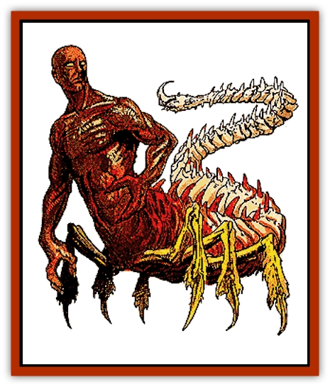

# Manscorpion

| Statistic | **Manscorpion** |
| --- | --- |
| **Activity Cycle:** | Any |
| **Alignment:** | Neutral evil |
| **Armor Class:** | 5 |
| **Climate/Terrain:** | Tropical or subtropical desert or caves |
| **Damage/Attack:** | 2-5/2-5/1-4 (claw/claw/tail), or by weapon and 2-5/1-4 |
| **Diet:** | Carnivore |
| **Frequency:** | Rare |
| **Hit Dice:** | 8-12 |
| **Intelligence:** | Low to genius (5-18) |
| **Magic Resistance:** | 20% |
| **Morale:** | Champion to fanatic (15-18) |
| **Movement:** | 12 |
| **No. Appearing:** | 8 or more |
| **No. of Attacks:** | 3 |
| **Organization:** | Squad, swarm, and city |
| **Size:** | L (6' tall, 4' long plus 10' tail) |
| **Special Attacks:** | Poison, possible spell use |
| **Special Defenses:** | Nil |
| **THAC0:** | 8 HD: 13 / 9-10 HD: 11 / 11-12 HD: 9 |
| **Treasure:** | J,K,M,Q (F,U&times;10) |
| **XP Value:** | 4,000 / 9 HD squad leader: 5,000 / 9 HD squad spellcaster: 6,000 / 10 HD swarm leader: 6,000 / 10 HD swarm spellcaster: 8,000 / 11 HD noble: 7,000 / 11 HD sorcerer: 9,000 / 12 HD king or queen: 8,000 / 12 HD high cleric: 10,000 |

These horrors, sometimes called tlincallis, are part human and part [[Scorpion|scorpion]]. A manscorpion has a dark-skinned human torso, its abdomen is protected by bony plates, and its ribs and backbone protrude from the body. Their hands have two thick fingers and a long thumb; the hands are often mistaken for scorpion-like claws. The creatures are hairless, and their faces are handsome and noble, except for the red, glowing eyes which have no pupils.

The creature's torso sits atop a 4-foot-long, bony-plated, arachnoid body which is supported by six legs. Bony plate completely covers the strong legs. The protruding spine continues along the abdomen and forms a tail 10 feet long. The lower body, legs, and tail are usually sand-colored, and blend easily with the desert. Observers rarely see anything but the muscular human torso until the manscorpions are close.

The origins of these creatures is thought to lie in an ancient curse placed on evil humans. They speak their own language, and 20% also speak some locally spoken tongue.

**Combat:** Most manscorpions have low to average intelligence; they patrol their territory in squads of six warriors. A squad leader and a spellcaster, each with 9 HD and greater intelligence, are also present. The spellcaster has the abilities of a 4th-level cleric or mage. Fully 50% of them carry obsidian-studded clubs (treat as a battle axe) and bolas or javelins. The rest use only their natural weapons.

When directed by the squad leader, manscorpions attack in an organized manner. They use long-range attacks before closing for melee. In close combat, they attack with weapon, claw, and tail, or with tail and two claws. The tail can strike anywhere nearby, including in front of the creature. When not being used for attack, the tail sweeps the area behind the manscorpion, checking for obstacles and assailants. Anyone struck by the tail's spur must make a successful saving throw vs. poison or die in 2d4 rounds. Victims suffer weakness for one round (-2 attack penalty), start to shake in the next round (-3 attack penalty and no Dexterity bonus to AC), then convulse (AC 10 and no attacks possible) until they die.

Common manscorpions lose organization and their morale is reduced without a leader. When morale is reduced to 1 or 2 hit points, common manscorpions go into a stinging frenzy, making two tail attacks per round, but no other attacks.

Patrols are more common near the manscorpion lair, which is guarded by a swarm consisting of three squads. A swarm leader and a spellcaster, each with 10 Hit Dice, accompany a swarm. The spellcaster is the equivalent of a 7th-level priest or wizard. These leaders stay out of combat, directing the action and casting spells. Swarms are sent on patrol in times of trouble.

For every two swarms, there is a noble and a sorcerer. They stay near the lair unless an army of manscorpions is marching, then they will lead two swarms. These leaders have 11 HD, and sorcerers cast spells at 9th-level ability.

Finally, every lair has a king or queen, or both, with 12 Hit Dice. A high cleric, also with 12 HD, aids these rulers with the abilities of an 11th-level priest. They always remain in the lair and will only fight if directly threatened.

**Habitat/Society:** Manscorpions live under the desert sands in burrows connected by tunnels, all situated above underground cities of 40-400 individuals. These often mirror great human cities, with pits instead of buildings, and great chasms like inverted pyramids.

Manscorpions often hold humans and [[Dwarf|dwarves]] as slaves, using them to mine and create weaponry. A manscorpion's fingers are not very dexterous, but they are fine sculptors with hammer and chisel, and many sculptures decorate their cities.

**Ecology:** Manscorpions eat practically any meat, including carrion. No normal creatures prey on them.

---
## Discovery & Documentation

**Source Publication:** MC11 Forgotten Realms Appendix II (1991)
**Campaign Setting:** Advanced Dungeons & Dragons 2nd Edition
**Author(s):** Tim Beach, Tim Brown, William W. Connors, Dale Donovan, Ed Greenwood, Jeff Grubb, Bruce Heard, Slade Henson, Rob King, Colin McComb, Roger E. Moore, Bruce Nesmith, Jon Pickens, Jean Rabe, Dori Watry, Skip Williams

### Other Creatures Found in This Source Book
   * [[Alaghi|Alaghi]]
   * [[Alguduir|Alguduir]]
   * [[Beguiler|Beguiler]]
   * [[Bird_Toril|Bird (Toril)]]
   * [[Cantobele|Cantobele]]
   * [[Carapace|Carapace]]
   * [[Cat_Toril|Cat (Toril)]]
   * [[Chitine|Chitine]]
   * [[Cildabrin|Cildabrin]]
   * [[Dimensional_Warper|Dimensional Warper]]
   * [[Dragon_Deep|Dragon, Deep]]
   * [[Fachan_Toril|Fachan (Toril)]]
   * [[Fael|Fael]]
   * [[Feyr|Feyr]]
   * [[Firetail|Firetail]]
   * [[Frost|Frost]]
   * [[Gaund|Gaund]]
   * [[Gloomwing|Gloomwing]]
   * [[Golden_Ammonite|Golden Ammonite]]
   * [[Golem_Lightning|Golem, Lightning]]
   * [[Hamadryad|Hamadryad]]
   * [[Harrier|Harrier]]
   * [[Harrla|Harrla]]
   * [[Haun|Haun]]
   * [[Haundar|Haundar]]
   * [[Hendar|Hendar]]
   * [[Inquisitor|Inquisitor]]
   * [[Lhiannan_Shee|Lhiannan Shee]]
   * [[Loxo|Loxo]]
   * [[Manni|Manni]]
   * [[Mara|Mara]]
   * [[Morin|Morin]]
   * [[Naga_Dark|Naga, Dark]]
   * [[Orpsu|Orpsu]]
   * [[Plant_Carnivorous_Black_Willow|Plant, Carnivorous, Black Willow]]
   * [[Plant_Carnivorous_Toril|Plant, Carnivorous (Toril)]]
   * [[Plant_Dangerous_I|Plant, Dangerous I]]
   * [[Ring-Worm|Ring-Worm]]
   * [[Rohch|Rohch]]
   * [[Sand_Cat|Sand Cat]]
   * [[Saurial|Saurial]]
   * [[Sha'az|Sha'az]]
   * [[Silver_Dog|Silver Dog]]
   * [[Simpathetic|Simpathetic]]
   * [[Skuz|Skuz]]
   * [[Spider_Monkey|Spider, Monkey]]
   * [[Tren|Tren]]
