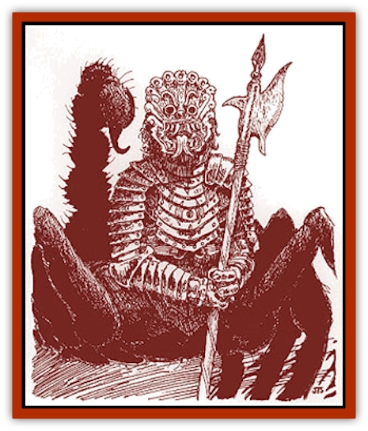

# Manscorpion - Nimmurian

| Statistic | **Manscorpion, Nimmurian** |
| --- | --- |
| **Activity Cycle:** | Any |
| **Alignment:** | Neutral evil |
| **Armor Class:** | 7 |
| **Climate/Terrain:** | Tropical or subtropical deserts or caves |
| **Damage/Attack:** | 1d4+1/1d4+1/1d4 (or by weapon) |
| **Diet:** | Carnivore |
| **Frequency:** | Rare |
| **Hit Dice:** | 6-12 |
| **Intelligence:** | Low to Genius (5-18) |
| **Magic Resistance:** | Nil |
| **Morale:** | Champion to Fanatic (15-18) |
| **Movement:** | 12 |
| **No. Appearing:** | 8 or more |
| **No. of Attacks:** | 3 (claw/claw/tail) |
| **Organization:** | Squad or city |
| **Size:** | L (6' tall, 4' long plus 10' tail) |
| **Special Attacks:** | Poison |
| **Special Defenses:** | Nil |
| **THAC0:** | 6 HD: 15 / 7-8 HD: 13 / 9-10 HD: 11 / 11-12 HD: 9 |
| **Treasure:** | J,K,M,Q (F,U&times;10) |
| **XP Value:** | 6 HD: 975 / 7 HD: 1,400 / 8 HD: 2,000 / +1,000/additional HD |

These part-human, part-[[Scorpion|scorpion]] creatures are sophisticated and civilized, while still cruel and self-serving. Welcomed by the original Nimmurians (winged [[Minotaur|minotaurs]] called [[Enduk|enduks]]), the [[Manscorpion|manscorpions]] betrayed their trust, drove them out, and assumed their cultural identity.

A manscorpion has a human torso and a bony-plated arachnoid body with eight legs and a long tail tipped with a wicked stinger. Its hands have two thick fingers and a thumb. Originally dark-skinned and hairless, the Nimmurian manscorpions were cursed by Idu (an Immortal) to burn in sunlight. Due to a long sojourn underground, they have become translucent, making their internal organs visible. They cover their bodies with make-up, both to cover the awful sight and to protect them from the sun's rays. When outside, all manscorpions wear masks with terrible grimaces. These cover their faces and provide protective dark lenses for their sensitive eyes.

**Combat:** A manscorpion claws at opponents in front and swings its tail, striking on any side. The poison of a 6-8 HD manscorpion causes those who fail their saving throws vs. poison to fall asleep for 2d8 rounds. Poison from a 9-10 HD manscorpion causes 3d8 points of damage on a failed saving throw vs. poison. Poison from an 11 HD or greater manscorpion is deadly, instantly killing any victim that fails a saving throw vs. poison with a -2 penalty.

Manscorpions have 60-foot infravision. Also, if a manscorpion wears armor of AC 7 or worse, its AC is improved by only 1 point. Manscorpions cannot swim; water dissolves their protective make-up in 1d4 rounds.

If caught in direct sunlight without make-up, a manscorpion suffers 1d6+2 points of damage per round until pulled underground or make-up is completely applied; its Dexterity and Morale also drop to 3, it moves at half speed, and it automatically loses initiative. After one turn of continuous exposure, it bursts into flames and dies. Reflected sunlight (moonlight or mirror reflections) inflicts 1d3 points of damage to any manscorpion not wearing make-up; Dexterity and Morale drop to half normal. A manscorpion with partial make-up (50%-99% of body covered) caught in direct sunlight suffers as if caught in reflected light.

**Habitat/Society:** Nimmurian manscorpions are organized and efficient. Most manscorpions, even those ostensibly living on the surface, have underground lairs to which they retreat.

Greedy, treacherous, and self-serving, the leaders of the various dominions constantly seek ways to weaken their rivals. They hate all other life and seek to dominate and subjugate other creatures. Enduks are particularly mistreated.

Nimmurian manscorpions have two Immortal patrons: Atzanteotl - the corrupter of civilizations, who seeks to destroy all surface life; and Nin-Hurabi (Nyx) - the lady of darkness, who wants undead to take over the world.

**Ecology:** Manscorpions eat practically any meat, including carrion. No normal creature preys on them.

---
## Discovery & Documentation

**Source Publication:** Monstrous Compendium Savage Coast Appendix (Online Exclusive) (1995)
**Campaign Setting:** Mystara
**Author(s):** Loren L Coleman, Ted James, Thomas Zuvich, Cindi M. Rice

### Other Creatures Found in This Source Book
   * [[Aranea_Savage_Coast|Aranea (Savage Coast)]]
   * [[Arashaeem|Arashaeem]]
   * [[Batracine|Batracine]]
   * [[Cat_Marine|Cat, Marine]]
   * [[Cinnavixen|Cinnavixen]]
   * [[Clockwork_Swordsman|Clockwork Swordsman]]
   * [[Critter_Temple|Critter, Temple]]
   * [[Cursed_One|Cursed One]]
   * [[Deathmare|Deathmare]]
   * [[Dragon_Savage_Coast_Crimson|Dragon (Savage Coast), Crimson]]
   * [[Dragon_Savage_Coast_Red_Hawk|Dragon (Savage Coast), Red Hawk]]
   * [[Echyan|Echyan]]
   * [[Ee'aar|Ee'aar]]
   * [[Enduk|Enduk]]
   * [[Fachan_Savage_Coast|Fachan (Savage Coast)]]
   * [[Feliquine|Feliquine]]
   * [[Fiend_Narvaezan|Fiend, Narvaezan]]
   * [[Frelôn|Frelôn]]
   * [[Ghriest|Ghriest]]
   * [[Glutton_Sea|Glutton, Sea]]
   * [[Goatman|Goatman]]
   * [[Golem_Naâruk|Golem, Naâruk]]
   * [[Golem_Savage_Coast|Golem (Savage Coast)]]
   * [[Grudgling|Grudgling]]
   * [[Heraldic_Servant_I|Heraldic Servant I]]
   * [[Heraldic_Servant_II|Heraldic Servant II]]
   * [[Heraldic_Servant_III|Heraldic Servant III]]
   * [[Heraldic_Servant_IV|Heraldic Servant IV]]
   * [[Heraldic_Servant_V|Heraldic Servant V]]
   * [[Heraldic_Servant_General_Information|Heraldic Servant, General Information]]
   * [[Hermit_Sea|Hermit, Sea]]
   * [[Jorri|Jorri]]
   * [[Juhrion|Juhrion]]
   * [[Kla'a-tah|Kla'a-tah]]
   * [[Leech_Legacy|Leech, Legacy]]
   * [[Lich_Inheritor|Lich, Inheritor]]
   * [[Lizard_Kin_Savage_Coast|Lizard Kin (Savage Coast)]]
   * [[Lupasus|Lupasus]]
   * [[Lupin|Lupin]]
   * [[Lyra_Bird_Saragón|Lyra Bird, Saragón]]
   * [[Malfera|Malfera]]
   * [[Mythuínn_Folk|Mythuínn Folk]]
   * [[Neshezu|Neshezu]]
   * [[Nikt'oo|Nikt'oo]]
   * [[Nosferatu|Nosferatu]]
   * [[Omm-wa|Omm-wa]]
   * [[Omshirim|Omshirim]]
   * [[Parasite_Savage_Coast|Parasite (Savage Coast)]]
   * [[Phanaton|Phanaton]]
   * [[Plant_Savage_Coast|Plant (Savage Coast)]]
   * [[Pudding_Vermilion|Pudding, Vermilion]]
   * [[Rakasta|Rakasta]]
   * [[Ray_Forest|Ray, Forest]]
   * [[Shedu_Greater_Savage_Coast|Shedu, Greater (Savage Coast)]]
   * [[Shimmerfish|Shimmerfish]]
   * [[Skinwing|Skinwing]]
   * [[Spawn_of_Nimmur|Spawn of Nimmur]]
   * [[Spider-spy|Spider-spy]]
   * [[Spirit_Heroic|Spirit, Heroic]]
   * [[Spirit_Walleran|Spirit, Walleran]]
   * [[Succulus|Succulus]]
   * [[Swampmare|Swampmare]]
   * [[Symbiont_Shadow|Symbiont, Shadow]]
   * [[Tortle|Tortle]]
   * [[Troll_Legacy|Troll, Legacy]]
   * [[Trosip|Trosip]]
   * [[Tyminid|Tyminid]]
   * [[Utukku|Utukku]]
   * [[Voat|Voat]]
   * [[Voat_Herathian|Voat, Herathian]]
   * [[Vulturehound|Vulturehound]]
   * [[Wallara|Wallara]]
   * [[Wurmling|Wurmling]]
   * [[Wynzet|Wynzet]]
   * [[Yeshom|Yeshom]]
   * [[Zombie_Red|Zombie, Red]]
