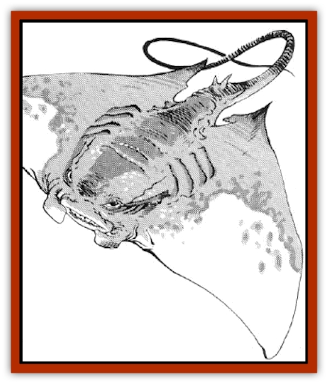

# Mantari

| Statistic | **Mantari** |
| --- | --- |
| **Activity Cycle:** | Night |
| **Alignment:** | Neutral |
| **Armor Class:** | 7 |
| **Climate/Terrain:** | Temperate and tropical/subterranean |
| **Damage/Attack:** | 1-4 and special |
| **Diet:** | Carnivore |
| **Frequency:** | Very rare |
| **Hit Dice:** | 1+1 |
| **Intelligence:** | Semi- (2-4) |
| **Magic Resistance:** | Nil |
| **Morale:** | Average (8-10) |
| **Movement:** | 1, Fl 18 (A) |
| **No. Appearing:** | 1-6 |
| **No. of Attacks:** | 1 |
| **Organization:** | Pack |
| **Size:** | S (4' wide) |
| **Special Attacks:** | Sting |
| **Special Defenses:** | Nil |
| **THAC0:** | 19 |
| **Treasure:** | Nil |
| **XP Value:** | 120 |

Mantari bear a close resemblance to marine [[Ray|rays]], and in fact may be related to them. Mantari have flat bodies about 3' long and 4' wide, and are generally black or dark gray in color. A long, whip-like tail tipped with a stinger trails from the ends of their bodies. Two eyes are located at the front of the head and a mouth on the underside of the body.

**Combat:** Mantari usually prey on [[Rat|giant rats]] and other vermin found in dungeons and caverns, but they are just as likely to attack larger prey if the opportunity arises. They attack by flying quickly over their victims and slashing with their tails.

Though slow-moving on the ground, these creatures can take off suddenly and reach maximum speed very quickly. Mantari have an innate, magical flight ability. They are very agile fliers and can change direction quite quickly, using their "wings" to maneuver. They usually maintain a flying height at which the tips of their tails can still strike, but the mantari themselves are difficult to hit.

The mantari's tail causes 1-4 points of damage per hit, and stings the victim. Unless the victim makes a succesful saving throw vs. poison, he/she loses two points of both Strength and Dexterity at each successful strike, with all combat scores adjusted appropriately. This loss is temporary, and if the victim lives, one point each of Strength and Dexterity will be recovered each turn, up to the victim's original total. If either Strength or Dexterity falls below three, the mantari's prey can no longer move. Once its prey is no longer moving, a mantari will land and begin to feed.

Mantari's mouths are ineffectual in combat, and are used primarily to suck up the remains of their prey. Feeding causes one hit point of damage per round.

**Habitat/Society:** Mantari enjoy damp, dirty places frequented by vermin. They usually live in dark places with stone floors, where they lie in wait, looking somewhat like a pool of brackish water. They do not make nests or lairs of any kind.

Mantari live in packs and hunt together. The strongest mantari (male or female) leads the pack.

Mantari have a mating season twice a year, during which the males compete in aerial maneuvers and race to impress the females. Generally, 2-5 young are born in the air about six weeks after mating. Young mantari cannot fight effectively, but mature rapidly, reaching adulthood in just under two months. Their parents keep close watch over them, becoming very aggressive towards all intruders.

**Ecology:** Mantari serve a necessary function in caverns and dungeons, keeping vermin populations under control. Their favorite food seems to be rats, but they also feed on [[Insect_Giant|giant insects]] and [[Spider|spiders]], as well as other creatures which happen to wander through their territories. They are great enemies of [[Bat|bats]], and are generally unwilling to share their airspace.

Mantari are often hunted by intelligent inhabitants of their caverns or dungeons, not for food, but in self-defense. The flesh of a mantari has a very earthy taste to it, and is somewhat poisonous. Any creature eating the flesh of a mantari must make a successful saving throw vs. poison or become nauseated and incapacitated for 2-5 rounds.

If captured within a week after its birth, a mantari can be trained as a loyal pet. If treated well by a patient and skilled animal trainer for a period of at least a month, a mantari can be taught to attack on command and to guard an area against intrusion by anyone but its master. A young mantari can bring as much as 200 gp on the open market, from someone who wants a loyal guard animal or pest killer.

There has been much speculation about the origins of the mantari. While some sages believe them to be a magically enhanced form of [[Ray|sting ray]], others believe them to be closely related to [[Cloaker|cloakers]], [[Lurker|trappers]], [[Lurker|miners]], and [[Lurker|lurkers above]].

**Great mantari**

  Rumors persist of a very large variety of mantari, just as fast and aggressive, but with a wingspan of nearly 10'. These giant mantari are said to be more clumsy in flight (maneuverability class C), but stronger (5+5 HD) and more dangerous (1-6 damage from each tail hit). These flying horrors are said to haunt the deepest portions of the Underdark in great numbers, frequenting the same areas as trappers and their kin.

---
## Discovery & Documentation

**Source Publication:** MC14 Fiend Folio Appendix (1992)
**Campaign Setting:** Fiends Folio
**Author(s):** Don Bingle, John Terra, Wes Nicholson, Tim Beach, Steve Hardinger, Kris Hardinger, Rob Nicholls, Greg Swedberg, Al Boyce, Vince Garcia, Norm Ritchie

### Other Creatures Found in This Source Book
   * [[Aballin|Aballin]]
   * [[Achaierai|Achaierai]]
   * [[Adherer|Adherer]]
   * [[Algoid|Algoid]]
   * [[Al-Mi'raj|Al-Mi'raj]]
   * [[Apparition|Apparition]]
   * [[Caterwaul|Caterwaul]]
   * [[Coffer_Corpse|Coffer Corpse]]
   * [[Crabman|Crabman]]
   * [[Dark_Creeper|Dark Creeper]]
   * [[Dark_Stalker|Dark Stalker]]
   * [[Darter|Darter]]
   * [[Denzelian|Denzelian]]
   * [[Dune_Stalker|Dune Stalker]]
   * [[Dwarf_Urdunnir|Dwarf, Urdunnir]]
   * [[Falcon_Fire|Falcon, Fire]]
   * [[Faux_Faerie|Faux Faerie]]
   * [[Flawder|Flawder]]
   * [[Fyrefly|Fyrefly]]
   * [[Gambado|Gambado]]
   * [[Garbug|Garbug]]
   * [[Giant_Fhoimorien|Giant, Fhoimorien]]
   * [[Gibberling|Gibberling]]
   * [[Gorbel|Gorbel]]
   * [[Grimlock|Grimlock]]
   * [[Hellcat|Hellcat]]
   * [[Ice_Lizard|Ice Lizard]]
   * [[Iron_Cobra|Iron Cobra]]
   * [[Khargra|Khargra]]
   * [[Penanggalan|Penanggalan]]
   * [[Pernicon|Pernicon]]
   * [[Phantom_Stalker|Phantom Stalker]]
   * [[Retriever|Retriever]]
   * [[Ruve|Ruve]]
   * [[Scathe|Scathe]]
   * [[Sheet_Ghoul_Sheet_Phantom|Sheet Ghoul/Sheet Phantom]]
   * [[Shocker|Shocker]]
   * [[Spanner|Spanner]]
   * [[Stwinger|Stwinger]]
   * [[Sussurus|Sussurus]]
   * [[Symbiotic_Jelly|Symbiotic Jelly]]
   * [[Terithran|Terithran]]
   * [[Thunder_Children|Thunder Children]]
   * [[Troll_Ice|Troll, Ice]]
   * [[Tween|Tween]]
   * [[Umpleby|Umpleby]]
   * [[Volt|Volt]]
   * [[Xill|Xill]]
   * [[Xvart|Xvart]]
   * [[Zygraat|Zygraat]]
