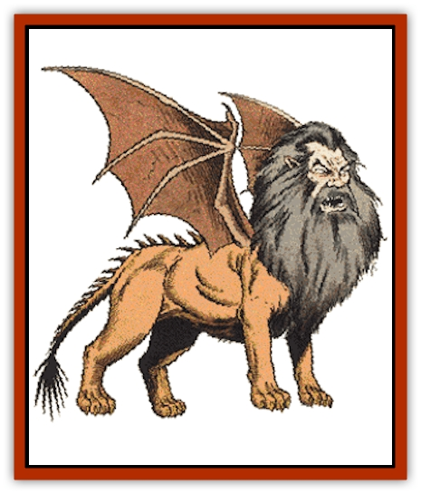

# Manticore

| Statistic | **Manticore** |
| --- | --- |
| **Activity Cycle:** | Any |
| **Alignment:** | Lawful evil |
| **Armor Class:** | 4 |
| **Climate/Terrain:** | Any |
| **Damage/Attack:** | 1-3/1-3/1-8 |
| **Diet:** | Carnivore |
| **Frequency:** | Uncommon |
| **Hit Dice:** | 6+3 |
| **Intelligence:** | Low (5-7) |
| **Magic Resistance:** | Nil |
| **Morale:** | Elite (13-14) |
| **Movement:** | 12, Fl 18 (E) |
| **No. Appearing:** | 1-4 |
| **No. of Attacks:** | 3 |
| **Organization:** | Solitary |
| **Size:** | H (15') |
| **Special Attacks:** | Tail spikes |
| **Special Defenses:** | Nil |
| **THAC0:** | 13 |
| **Treasure:** | E |
| **XP Value:** | 975 |

The manticore is a true monster, with a leonine torso and legs, [[Bat|bat]]like wings, a man's head, a tail tipped with iron spikes, and an appetite for human flesh.

The manticore stands 6 feet tall at the shoulder and measures 15 feet in length. It has a 25-foot wingspan. Each section of the manticore closely resembles the creature it imitates. The leonine torso has a tawny hide, the mane is a [[Cat_Great|lion]]'s brown-black color, and the batlike wings are a dark brown with sparse hair. All manticores have heads that resemble human males; the mane resembles a heavy beard and long hair.

**Combat:** The manticore first fires a volley of 1-6 tail spikes (180 yard range as a light crossbow). Each spike causes 1-6 points of damage. The manticore can fire four such volleys each day (the spikes regrow quickly). Next, the manticore closes with its prey and attacks with its front claws and sharp teeth. In an outdoor setting, the manticore tries to stay in the air to minimize its chance of being attacked. It is a clumsy flier, however, and cannot use its teeth in the air.

**Habitat/Society:** Manticores are found in any climate but prefer warm lands to cool ones. This reflects the wide climate range of their favorite food, humans. A manticore's territory may cover 20 or more square miles and includes at least one human settlement. Such territories usually overlap with those of other manticores and other man-eating predators like [[Dragon_General_Information|dragons]].

Manticores mate for life. The male remains with the female during gestation and hunts for her. Manticores bear one or two cubs which grow rapidly to adulthood in five years. Cubs are born with 1 Hit Die and gain an additional one each year. In their first year, cubs lack flying ability, but they are still small enough for an adult to grasp in its forelegs. There is a 20% chance a she-manticore's lair holds cubs under one year old. Cubs up to two years inflict one point of damage per front paw and 1-2 points with their bite. Cubs 3-4 years old inflict 1-2, 1-2, and 1-6 points of damage.

Manticore cubs can be caught and trained to assist evil humans. Such training is difficult and dangerous, especially since domesticated adults have an 80% chance of reverting to a wild state. Manticores will not allow themselves to be used as mounts. Wild adults may voluntarily ally themselves with evil humans, provided such allies can provide them with a steady, ample food supply.

Manticores normally eat their prey where they kill it. Males sometimes haul slain prey back to their mates or drag still-living prey to their lairs for the cubs to practice killing.

Manticores collect their victims' valuables for a variety of reasons, including curiosity, emulation of other monsters who collect treasure, the man-scent on the things, or because they know humans value the things and therefore might come looking for them. Their lack of real hands prevents most manticores from using what magical items fall into their possession. However, manticores that have allied with evil humans may possess magical items designed specifically for their use. Examples include magical collars or bracelets that are, in effect, oversized magical rings.

**Ecology:** Manticores are wide-ranging carnivores that have successfully survived in every region inhabited by humans, whether in the wilderness or underground. They are nightmarish opponents but invaluable allies if conditions are right. A manticore's pelt is a mark of the most powerful hunters and warriors. An intact, cured manticore hide complete with wings is worth 10,000 gp.

---
## Discovery & Documentation

**Source Publication:** MC1 Volume I (w/binder #1) (1991)
**Campaign Setting:** Advanced Dungeons & Dragons 2nd Edition
**Author(s):** Jay Batista, Scott Bennie, Grant Boucher, William W. Connors, Steve Gilbert, Heike Kubasch, James Lowder, David Edward Martin, Bruce Nesmith, Jean Rabe, Rick Swan, John J. Terra, Gary L. Thomas

### Other Creatures Found in This Source Book
   * [[Bat|Bat]]
   * [[Bear|Bear]]
   * [[Behir|Behir]]
   * [[Boar|Boar]]
   * [[Bookworm|Bookworm]]
   * [[Brownie|Brownie]]
   * [[Bugbear|Bugbear]]
   * [[Carrion_Crawler|Carrion Crawler]]
   * [[Cat_Great|Cat, Great]]
   * [[Catoblepas|Catoblepas]]
   * [[Dragon_General_Information|Dragon, General Information]]
   * [[Dragonfish|Dragonfish]]
   * [[Elemental_Air_Kin_Aerial_Servant|Elemental, Air Kin, Aerial Servant]]
   * [[Elemental_Earth_Kin_Sandling|Elemental, Earth Kin, Sandling]]
   * [[Elephant|Elephant]]
   * [[Gnoll|Gnoll]]
   * [[Hobgoblin|Hobgoblin]]
   * [[Homunculus|Homunculus]]
   * [[Hornet_Giant|Hornet, Giant]]
   * [[Horse|Horse]]
   * [[Hyena|Hyena]]
   * [[Jackal|Jackal]]
   * [[Jackalwere|Jackalwere]]
   * [[Korred|Korred]]
   * [[Lich|Lich]]
   * [[Lizard|Lizard]]
   * [[Lizard_Man|Lizard Man]]
   * [[Lycanthrope_General_Information|Lycanthrope, General Information]]
   * [[Lycanthrope_Seawolf|Lycanthrope, Seawolf]]
   * [[Lycanthrope_Werebear|Lycanthrope, Werebear]]
   * [[Lycanthrope_Weretiger|Lycanthrope, Weretiger]]
   * [[Lycanthrope_Werewolf|Lycanthrope, Werewolf]]
   * [[Medusa|Medusa]]
   * [[Mind_Flayer|Mind Flayer]]
   * [[Minotaur|Minotaur]]
   * [[Mudman|Mudman]]
   * [[Mummy|Mummy]]
   * [[Nixie|Nixie]]
   * [[Nymph|Nymph]]
   * [[Ogre|Ogre]]
   * [[Ooze_Slime_Jelly_I|Ooze/Slime/Jelly I]]
   * [[Ooze_Slime_Jelly_II|Ooze/Slime/Jelly II]]
   * [[Orc|Orc]]
   * [[Owl|Owl]]
   * [[Owlbear_I|Owlbear I]]
   * [[Pegasus|Pegasus]]
   * [[Piercer|Piercer]]
   * [[Pudding_Deadly|Pudding, Deadly]]
   * [[Rakshasa|Rakshasa]]
   * [[Rat|Rat]]
   * [[Ray|Ray]]
   * [[Remorhaz|Remorhaz]]
   * [[Satyr|Satyr]]
   * [[Scorpion|Scorpion]]
   * [[Selkie|Selkie]]
   * [[Shadow|Shadow]]
   * [[Skeleton|Skeleton]]
   * [[Skunk|Skunk]]
   * [[Snake|Snake]]
   * [[Spectre|Spectre]]
   * [[Spider|Spider]]
   * [[Sprite|Sprite]]
   * [[Toad_Giant|Toad, Giant]]
   * [[Treant|Treant]]
   * [[Troll|Troll]]
   * [[Umber_Hulk|Umber Hulk]]
   * [[Unicorn|Unicorn]]
   * [[Vampire|Vampire]]
   * [[Wight|Wight]]
   * [[Will_O'Wisp|Will O'Wisp]]
   * [[Wolf|Wolf]]
   * [[Wolfwere|Wolfwere]]
   * [[Wraith|Wraith]]
   * [[Wyvern|Wyvern]]
   * [[Yeti|Yeti]]
   * [[Yuan-ti|Yuan-ti]]
   * [[Zombie|Zombie]]
