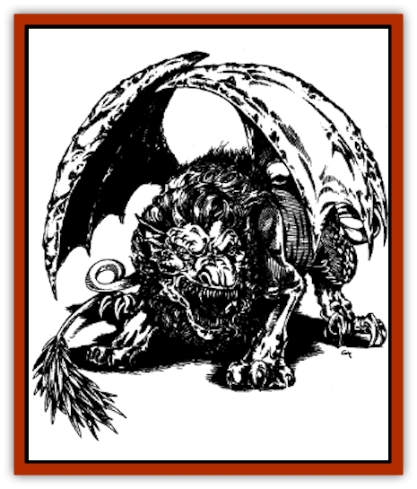

# Mantidrake

| Statistic | **Mantidrake** |
| --- | --- |
| **Activity Cycle:** | Any |
| **Alignment:** | Varies (see below) |
| **Armor Class:** | Varies (see below) |
| **Climate/Terrain:** | Any |
| **Damage/Attack:** | 1d3/1d3/1d10 (claw/claw/bite) |
| **Diet:** | Carnivore |
| **Frequency:** | Very rare |
| **Hit Dice:** | 6+3 |
| **Intelligence:** | Low (5-7) |
| **Magic Resistance:** | Nil |
| **Morale:** | Elite (13-14) |
| **Movement:** | 12, Fl 18 (E) |
| **No. Appearing:** | 1d2 |
| **No. of Attacks:** | 3 |
| **Organization:** | Solitary |
| **Size:** | H (25' long) |
| **Special Attacks:** | Breath weapon, tail spikes |
| **Special Defenses:** | Immune to breath weapon of dragon parent and like attacks (spells, etc.) |
| **THAC0:** | 13 |
| **Treasure:** | Nil (E) |
| **XP Value:** | Varies (see below) |

The mantidrake is the offspring of a [[Manticore|manticore]] and an evil [[Dragon_General_Information|dragon]]. It looks like a scaled manticore, with dragonlike wings and a dragon's head instead of a manlike one. When seen at a distance or by an inexperienced observer, it could well be mistaken for a normal manticore or for a Kara-Turan [[Dragon_Oriental_Earth_Li_Lung|li lung]] (earth dragon).

The mantidrake has the same [[Cat_Great|lion]]like mane around its head that a manticore has. Its coloration is a blend of the color of its dragon parent and the tan and brown of a normal manticore, with its head, wings, hindquarters, face, and belly scales generally reflecting the dragon parent's coloration and the remainder of the beast being shades of tan and brown, sometimes with stripes or spots of the dragon parent's color.

Wild mantidrakes speak the language of the parent that reared them (usually their mother), with some halting knowledge of the language of their other parent if that parent was involved in their upbringing. Those mantidrakes raised from birth by the Cult of the Dragon normally know common and the language of their dragon parent.

**Combat:** The mantidrake opens combat (preferably from ambush or from the air) with a volley of 1d6 tail spikes (180-yard range, as a light crossbow). Each of these spikes causes 1d6 points of damage. This attack can be used four times per day, since the spikes regrow quickly. Then the mantidrake closes for melee, using a claw/claw/bite routine.

Its breath weapon is the most potent attack form of all, but the mantidrake generally does not use it unless the need is vital, as it inherited enough sense from its draconic parent to know when not to waste its effects. Damage done by the mantidrake's breath weapon is equal to the beast's normal hit point total, and it can use its breath weapon up to four times a day. Breath weapon damage does not vary as the beast is wounded or healed over time, and magical effects that artificially boost hit points do not make the breath weapon more powerful.

The mantidrake is immune to attack forms that resemble its breath weapon. Finally, mantidrakes do not suffer any additional damage or effects from weapons or items specifically designed to kill dragons.

Because it is such a clumsy flier, the mantidrake avoids aerial combat if possible, or at least restricts itself to long-range attacks with its breath weapon and tail spikes.

| Dragon Parent | AL | AC | Breath Weapon | XP Value |
| --- | --- | --- | --- | --- |
| Black | CE | 1 | Jet of acid 5 feet wide, 60 feet long; victim takes half damage if successful save vs. breath weapon is made. | 3,000 |
| Blue | LE | 0 | Bolt of lightning 5 feet wide, 100 feet long; save for half. | 4,000 |
| Green | LE | 0 | Cloud of chlorine gas 50 feet long, 40 feet wide, and 30 feet high; half damage if save is made vs. breath weapon. | 4,000 |
| Red | CE | -3 | Cone of fire 5 feet at mouth, 90 feet long, 30 feet wide at cone's widest; half damage if save is made. | 4,000 |
| White | CE | 1 | Cone of frost 5 feet wide, 70 feet long, 25 feet wide at cone's widest; half damage if save is made vs. breath weapon. | 3,000 |
| Brown | NE | 2 | Jet of acid 5 feet wide, 60 feet long; victim takes half damage if successful save vs. breath weapon is made. | 3,000 |
| Yellow | CE | 0 | Blast of scorching air and sand 50 feet long, 40 feet wide, and 20 feet high; half damage if save is made vs. breath weapon. | 4,000 |

**Habitat/Society:** Like their manticore parents, mantidrakes can be found in any climatic region, though they prefer warm lands to cool ones. Among other things, this means that its dragon parent is likely to be a warm-weather-loving dragon, such as a blue, brown, or yellow dragon.

Those mantidrakes that have escaped the control of the Cult of the Dragon are solitary brutes in the wild, with each individual having a hunting territory of at least 25 square miles. Besides having a ravenous appetite, they also like to collect treasure, a habit inherited from their dragon parents. When more than one mantidrake is encountered in the wild, they are a mated pair. Mantidrakes, like manticores, mate for life.

Mantidrakes can be trained by Cult of the Dragon members only if taken from their parents shortly after birth. (The only relationship wild mantidrakes may develop with other creatures is a partnership, and even that lasts only if the partnership results in plenty of food and treasure for the mantidrake.) They often serve to protect the area of a Cult cell, hideout, or lair. They also prove to be a distraction for any curious people who venture too close to what the Cult is seeking to protect or hide.

**Ecology:** A wild mantidrake lives much as its manticore parent would. It favors human flesh above all others, though it will eat any living creature in order to survive. If a mantidrake has to live in an area smaller than 25 square miles, that region is soon devoid of large animal and human life, as those creatures not killed and eaten flee. Cult mantidrakes can be stabled for use as (clumsy) mounts. The curiously supple hide of a mantidrake is worth 5,000 gp.

---
## Discovery & Documentation

**Source Publication:** FOR11 Cult of the Dragon (1990)
**Campaign Setting:** Advanced Dungeons & Dragons 2nd Edition
**Author(s):** Dale Donovan

### Other Creatures Found in This Source Book
   * [[Dracimera|Dracimera]]
   * [[Dracohydra|Dracohydra]]
   * [[Dracolich|Dracolich]]
   * [[Dragon_Ghost|Dragon, Ghost]]
   * [[Dragon_Lesser_Undead|Dragon, Lesser Undead]]
   * [[Dragon-kin|Dragon-kin]]
   * [[Ur-Histachii|Ur-Histachii]]
   * [[Wyvern_Drake|Wyvern Drake]]
