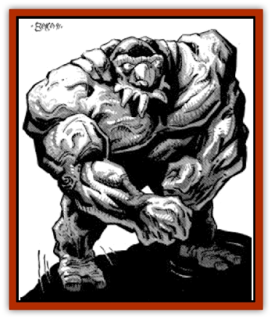

# Mara

| Statistic | **Mara** |
| --- | --- |
| **Activity Cycle:** | Nocturnal |
| **Alignment:** | Chaotic evil |
| **Armor Class:** | 5 |
| **Climate/Terrain:** | Variable |
| **Damage/Attack:** | 3-12/3-12/1-6 |
| **Diet:** | Special |
| **Frequency:** | Rare |
| **Hit Dice:** | 10 |
| **Intelligence:** | Semi (2-4) |
| **Magic Resistance:** | 25% |
| **Morale:** | Elite (13-14) |
| **Movement:** | 6 |
| **No. Appearing:** | 1-3 |
| **No. of Attacks:** | 3 |
| **Organization:** | Group |
| **Size:** | L (20' tall) |
| **Special Attacks:** | See below |
| **Special Defenses:** | See below |
| **THAC0:** | 11 |
| **Treasure:** | Nil |
| **XP Value:** | 5,000 |

Mara are chaotic evil spirits that inhabit great bodies of stone. In this form they walk the cold regions at night, slaying all who cross their path. At dawn they are gone, their inexorable passage marked by great swaths of uprooted trees, crushed undergrowth, and huge trails studded with deep imprints that lie fully nine feet apart.

Mara are reputed to be 20 feet tall or more, gray-green in color, like weathered stone, and of hulking humanoid shape. Their most dangerous features include two massive stony arms that end in rending claws, and a hooked beak that can crush and tear. It is reported that their eyes glow red when they are tracking a quarry.

Mara communicate among themselves with bird-like cries, whistling, and calls. They can understand, and may respond to, simple mental commands.

**Combat:** The mara stoops to attack with rending claws and hooked beak. If both claws hit the same target, the bite hits automatically, inflicting double damage. A mara can be affected by any weapon, but has a 25% resistance to magic.

Bright, direct sunlight immobilizes a mara's "body" and renders it unfit for the mara's spirit. This effectively defeats the creature, driving the spirit into painful exile on an outer plane. Many mara have been trapped by the sun, and their abandoned stone bodies form circles and groups of standing stones to this day.

Magical and man-made light, such as fire or lantern light, have no effect on the mara, nor does light from such creatures as [[Will_O'Wisp|will o'wisps]]. At night or in stormy, overcast, or foggy conditions, mara roam at will. They can sense the presence or coming of daylight, and instinctively move to a place of concealment where they can survive until the next night.

They can walk under or through water without harm, but if entangled or mired and then exposed to sunlight they are destroyed. If covered, or too deep for light to reach, mara are unaffected by sunlight, which makes deep ponds and other bodies of water possible lairs for mara.

Mara are unaffected by *charm*, *sleep*, *hold*, and similar mind-affecting magic, or by cold-based attacks. A *holy word* drives the spirit of a mara from its stone body, but if the body stands where light cannot reach, a mara spirit may later return.

**Habitat/Society:** Mara are huge fey creatures that roam cold regions, hunting all creatures in their paths. Dormant in shadowed lairs by day, the mara rouse themselves at night to stalk the countryside. They walk the countryside singly or in small groups, thus, their nickname "great walkers". Crashing through underbrush and forested areas, they shake the ground with their tread, and even deep snow does not hinder them. A mara plows a trail or swath up to six feet wide with its body. Mara-trails often afford the only passage through the snowfields of the frozen north.

A mara is very slow, but very strong and fearless. Its keen senses let it track its quarry by scent, with the same chance of success as a ranger. However, the creature has little or no mind. It cannot comprehend someone leaping a gap or from one tree to another. If the prey takes refuge in a structure or faces a mara in open battle, the mara is a deadly foe. It can effortlessly uproot trees and crush undergrowth, and the icy grip of its stone claws can crush armor, flesh, and bone alike.

**Ecology:** Mara are subservient to [[Tanar'ri_General_Information|tanar'ri]] and other powerful lower planar creatures of like alignment. Further, they can sense the presence of such creatures within a day's ride and move to aid or join them if possible. The creatures cannot *gate* mara in, however. If more than one chaotic evil lower planar creature is present, the mara obeys the most powerful. Typical simple commands that mara might receive from their master include orders to search here and there, to find and slay, or hold, a certain creature, and include a mental picture of the quarry or places to search for it.

The exact mechanism by which mara occupy their stony bodies, and the way in which their spirits make their way from the lower planes to the Prime Material Plane is unknown.

---
## Discovery & Documentation

**Source Publication:** MC11 Forgotten Realms Appendix II (1991)
**Campaign Setting:** Advanced Dungeons & Dragons 2nd Edition
**Author(s):** Tim Beach, Tim Brown, William W. Connors, Dale Donovan, Ed Greenwood, Jeff Grubb, Bruce Heard, Slade Henson, Rob King, Colin McComb, Roger E. Moore, Bruce Nesmith, Jon Pickens, Jean Rabe, Dori Watry, Skip Williams

### Other Creatures Found in This Source Book
   * [[Alaghi|Alaghi]]
   * [[Alguduir|Alguduir]]
   * [[Beguiler|Beguiler]]
   * [[Bird_Toril|Bird (Toril)]]
   * [[Cantobele|Cantobele]]
   * [[Carapace|Carapace]]
   * [[Cat_Toril|Cat (Toril)]]
   * [[Chitine|Chitine]]
   * [[Cildabrin|Cildabrin]]
   * [[Dimensional_Warper|Dimensional Warper]]
   * [[Dragon_Deep|Dragon, Deep]]
   * [[Fachan_Toril|Fachan (Toril)]]
   * [[Fael|Fael]]
   * [[Feyr|Feyr]]
   * [[Firetail|Firetail]]
   * [[Frost|Frost]]
   * [[Gaund|Gaund]]
   * [[Gloomwing|Gloomwing]]
   * [[Golden_Ammonite|Golden Ammonite]]
   * [[Golem_Lightning|Golem, Lightning]]
   * [[Hamadryad|Hamadryad]]
   * [[Harrier|Harrier]]
   * [[Harrla|Harrla]]
   * [[Haun|Haun]]
   * [[Haundar|Haundar]]
   * [[Hendar|Hendar]]
   * [[Inquisitor|Inquisitor]]
   * [[Lhiannan_Shee|Lhiannan Shee]]
   * [[Loxo|Loxo]]
   * [[Manni|Manni]]
   * [[Manscorpion|Manscorpion]]
   * [[Morin|Morin]]
   * [[Naga_Dark|Naga, Dark]]
   * [[Orpsu|Orpsu]]
   * [[Plant_Carnivorous_Black_Willow|Plant, Carnivorous, Black Willow]]
   * [[Plant_Carnivorous_Toril|Plant, Carnivorous (Toril)]]
   * [[Plant_Dangerous_I|Plant, Dangerous I]]
   * [[Ring-Worm|Ring-Worm]]
   * [[Rohch|Rohch]]
   * [[Sand_Cat|Sand Cat]]
   * [[Saurial|Saurial]]
   * [[Sha'az|Sha'az]]
   * [[Silver_Dog|Silver Dog]]
   * [[Simpathetic|Simpathetic]]
   * [[Skuz|Skuz]]
   * [[Spider_Monkey|Spider, Monkey]]
   * [[Tren|Tren]]
