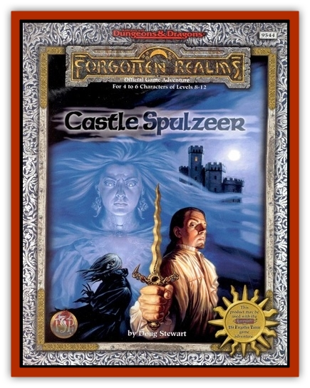

# Marble

| Statistic | **Marble** |
| --- | --- |
| **Activity Cycle:** | Triggered (see below) |
| **Alignment:** | LE |
| **Armor Class:** | -2/4 (see below) |
| **Climate/Terrain:** | Any |
| **Damage/Attack:** | 1d2 |
| **Diet:** | None |
| **Frequency:** | Unique |
| **Hit Dice:** | 9 (69 hp) |
| **Intelligence:** | Exceptional (15) |
| **Magic Resistance:** | 30% |
| **Morale:** | Champion (16) |
| **Movement:** | 9, Fl 30 (B) |
| **No. Appearing:** | 1 |
| **No. of Attacks:** | 1 |
| **Organization:** | Solitary |
| **Size:** | M (5' 8" tall) |
| **Special Attacks:** | Aging touch (1d4x15 years), keening (death range 30') |
| **Special Defenses:** | Hit only by +2/+1 or better weapons (see below) |
| **THAC0:** | 11 |
| **Treasure:** | Nil |
| **XP Value:** | 14,000 |

On that horrible night years ago, when Marble's life blood spewed onto Kartak's reconstructed corpse, she willed herself to avenge her murder. So strong was her hatred of the lich and her brother Chardath, so powerful was her will, that she actually recreated herself into a unique ghost of tremendous power.

Marble is a mutable ghost. Her consciousness can manifest structural firmness in selected limbs. In other words, she has substance on demand and can pick up objects, fight, and use touch abilities. She can also become incorporeal at will, gliding through walls and doors or simply vanishing before startled eyes.

Marble is anchored to the castle until her death is avenged - whether by herself or someone else. Afterward she will be free to leave or to find the peace of the grave. Unless the PCs interfere with her mission or anger her, she will not turn on them. Should the heroes do something to enrage her, however, they will have made a powerful enemy

Marble appears as she looked on the night of her betrayal. Her long white gown is stained with blood that flowed from the gash on her neck. The stain and the wound still look as if they have just been made.

**Trigger:** Though Marble's consciousness has permeated Castle Spulzeer since her death, she can materialize as a ghost only when Chardath and Kartak are both in the castle at the same time, for a period long enough to enable her to coalesce (approximately an hour). Such an event has never happenedóuntil the day the PCs arrive. Once materialized, however, she stays so until her death is avenged.

**Combat:** Marble has an Armor Class of either -2 or 4, depending upon the situation. She is AC -2 when ethereal and being attacked by nonethereal foes like the PCs; under these conditions, only +2 or better magical weapons can hit her. She is AC 4 when corporeal or if attacked by a foe who is also ethereal; in these circumstances, she can be hit by +1 or better magical weapons.

Marble attacks with her icy touch. Victims who fail a saving throw vs. spell age 1d4x15 years. Priests at or above 9th level are automatically succeed the saving throw. Other characters at or above 11th level receive a +2 bonus to their savings throws. Should she actually attempt to strike someone, her blow does a mere 1d2 points of damage.

The most formidable weapon in Marble's arsenal is her keening ability. Twice per day she can emit a horrendous, unearthly screech that causes feeblemindedness (like the spell), in all creatures within 30 feet who fail a saving throw vs. spell. Because of her passionate hatred for Kartak, this focused ability does affect the lich

She can become invisible at will, and is able to focus her energies to affect changes in physical objects and her surroundings. (This ability functions like a hybrid of the *polymorph object* and *illusion* spells. She needs only to think about the desired change: No components are required; duration lasts for as long as she is present.)

Marble is immune to all spells that affect biological creatures. She also has the ability to rejuvenate. That is, she can heal her own wounds instantly, but then must rest for 20 minutes before using any other ability except for becoming incorporeal again

**Vulnerabilities** One of the most effective weapons against Marble is holy water, which causes 1d6 points of damage per vial. An attack roll is required (always against AC 4).

Marble can be turned by priests, but with a -1 penalty to the cleric's 1d20 turning roll. If other undead are present, the roll to determine how many Hit Dice worth of undead creatures are affected also receives a -1 penalty.

Holy symbols are useless against her.

**Allergen:** *Aggarath*, the knife which took Marbleís life, still lies in the ceremonial room (area 41) of Kartakís lair beneath the old dungeon level of the castle. Marble cannot come within 10 feet of the dagger, which is missing its hilt-stone, a 12-sided blood-red ruby.

---
## Discovery & Documentation

**Source Publication:** Castle Spulzeer (1997)
**Campaign Setting:** Forgotten Realms
**Author(s):** Doug Stewart, Carrie A. Bebris, Dawn Murin, Paul Hanchette
