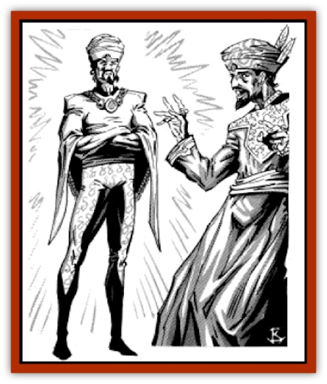

# Markeen

| Statistic | **Markeen** |
| --- | --- |
| **Activity Cycle:** | Day |
| **Alignment:** | Any |
| **Armor Class:** | 7 |
| **Climate/Terrain:** | Any |
| **Damage/Attack:** | 1-6 or by weapon type |
| **Diet:** | Omnivore |
| **Frequency:** | Very rare |
| **Hit Dice:** | 2 |
| **Intelligence:** | Low to Genius (5-18) |
| **Magic Resistance:** | Nil |
| **Morale:** | Elite (13-14) |
| **Movement:** | 12, Fl 18 (B) |
| **No. Appearing:** | 1 |
| **No. of Attacks:** | 1 |
| **Organization:** | Solitary |
| **Size:** | M |
| **Special Attacks:** | Spells |
| **Special Defenses:** | Nil |
| **THAC0:** | 19 |
| **Treasure:** | Nil |
| **XP Value:** | 120 |

A markeen, or genie double, is a lesser form of [[Genie|genie]] exiled from the majority of their kind. Each genie double is cursed at birth to be the spitting image of a human from Zakhara. The genie double is not magically linked to or even necessarily friendly toward that person; they don't share thoughts, memories, place of birth (though they are always born at the same instant), or any other traits besides their outward appearance. The confusion that results when the genie double of an important personage finds out who it resembles can be monumental.

A genie double superficially appears to be entirely human. They are born, live, and die in the same period of time that a normal human passes through life, and their apparent age always matches that of their human double (unless the human has somehow been magically altered to appear younger or older). A genie double may outlive its human double, but may also die before its human double does; the two are not spiritually linked in any way. Not everyone has a genie double. Generally only famous, wealthy, beautiful, gifted, holy, or utterly villainous individuals have genie doubles.

It is commonly believed that genie doubles are the result of a genie rebellion which ended in the losers being forced to live forever as humans, with only tiny traces of their former power.

**Combat:** Once per day, a genie double may use each of the following spell-like abilities: *flame blade*, *dust devil*, *invisibility*, and *gust of wind*.

Although they rarely use the ability near humans, genie doubles also retain geniekind's ability to fly, and they will escape from awkward situations this way. At other times, they will impersonate mages so as not to arouse suspicion. In all other respects, genie doubles fight with the tactics of humans. Their preferred weapons are scimitars, spears, and crossbows.

**Habitat/Society:** The markeen are merchants, tinkers, sailors, and horse traders, living by their wits in small communities that are isolated socially to prevent the discovery of their identities. Despite (or because of) the knowledge that they are genies and thus superior to those around them, the markeen are affable, friendly, and perfectly willing to live among humans without a trace of outward patronizing or haughty behavior.

Genie doubles form shadow societies within the human settlements of Zakhara with their own sets of beliefs, leaders, and rituals. Two of the most important rituals are "the search" and "the memory". The search is a traditional coming-of-age ritual in which each young genie double sets out on an extended quest to find his or her human counterpart. These trips last from a month to a year, but the young markeen are not really expected to find their double. The purpose of the ritual is simply to expose the adolescents to the world and broaden their horizons. Actually finding the double is seen as flouting established traditions, since decades often go by between successful searches. However, it is possible for a markeen to take the place of his or her double, once found. The only difficulty they may have is a lack of knowledge of their double's life and skills.

The ritual of memory is common among the older markeen. As genie doubles age, they tell younger markeen the stories of how they were cast out from the rest of geniekind and how they have tricked, befuddled, and swindled humans for generations. The story of exile is told, and other genies are always described in an unflattering light. The ritual of memory is always held in secrecy.

There is a subgroup of the genie doubles called the hayan, who are doubles of bards and poets. They inhabit distant lands, but if they can be found they can inspire their double to write immortal poetry.

**Ecology:** Markeen trade with humans constantly, though there is no knowledge of this on the part of most humans. Markeen avoid all other genies and distrust them at best.

Genie doubles will go to great lengths to silence anyone who uncovers the secret of one of their communities.

---
## Discovery & Documentation

**Source Publication:** MC13 Al-Qadim Appendix (1992)
**Campaign Setting:** Al-Qadim (Forgotten Realms)
**Author(s):** C. Terry Phillips

### Other Creatures Found in This Source Book
   * [[Ammut|Ammut]]
   * [[Ashira|Ashira]]
   * [[Asuras|Asuras]]
   * [[Black_Cloud_of_Vengeance|Black Cloud of Vengeance]]
   * [[Buraq|Buraq]]
   * [[Camel|Camel]]
   * [[Camel_of_the_Pearl|Camel of the Pearl]]
   * [[Centaur_Desert|Centaur, Desert]]
   * [[Copper_Automaton|Copper Automaton]]
   * [[Debbi|Debbi]]
   * [[Elephant_Bird|Elephant Bird]]
   * [[Gen|Gen]]
   * [[Genie_Noble_Dao|Genie, Noble Dao]]
   * [[Genie_Noble_Djinni|Genie, Noble Djinni]]
   * [[Genie_Noble_Efreeti|Genie, Noble Efreeti]]
   * [[Genie_Noble_Marid|Genie, Noble Marid]]
   * [[Genie_Tasked_Architect_Builder|Genie, Tasked, Architect/Builder]]
   * [[Genie_Tasked_Artist|Genie, Tasked, Artist]]
   * [[Genie_Tasked_Guardian|Genie, Tasked, Guardian]]
   * [[Genie_Tasked_Herdsman|Genie, Tasked, Herdsman]]
   * [[Genie_Tasked_Slayer|Genie, Tasked, Slayer]]
   * [[Genie_Tasked_Warmonger|Genie, Tasked, Warmonger]]
   * [[Genie_Tasked_Winemaker|Genie, Tasked, Winemaker]]
   * [[Ghost_Mount|Ghost Mount]]
   * [[Ghul|Ghul]]
   * [[Giant_Desert|Giant, Desert]]
   * [[Giant_Jungle|Giant, Jungle]]
   * [[Giant_Reef|Giant, Reef]]
   * [[Giant_Zakhara_General_Information|Giant (Zakhara), General Information]]
   * [[Hama|Hama]]
   * [[Heway|Heway]]
   * [[Living_Idol|Living Idol]]
   * [[Lycanthrope_Werehyena|Lycanthrope, Werehyena]]
   * [[Lycanthrope_Werelion|Lycanthrope, Werelion]]
   * [[Maskhi|Maskhi]]
   * [[Mason_Wasp_Giant|Mason Wasp, Giant]]
   * [[Nasnas|Nasnas]]
   * [[Pahari|Pahari]]
   * [[Rom|Rom]]
   * [[Sabu_Lord|Sabu Lord]]
   * [[Sakina|Sakina]]
   * [[Serpent_Lord|Serpent Lord]]
   * [[Serpent_Winged|Serpent, Winged]]
   * [[Silat|Silat]]
   * [[Simurgh|Simurgh]]
   * [[Stone_Maiden|Stone Maiden]]
   * [[Vishap|Vishap]]
   * [[Zaratan|Zaratan]]
   * [[Zin|Zin]]
